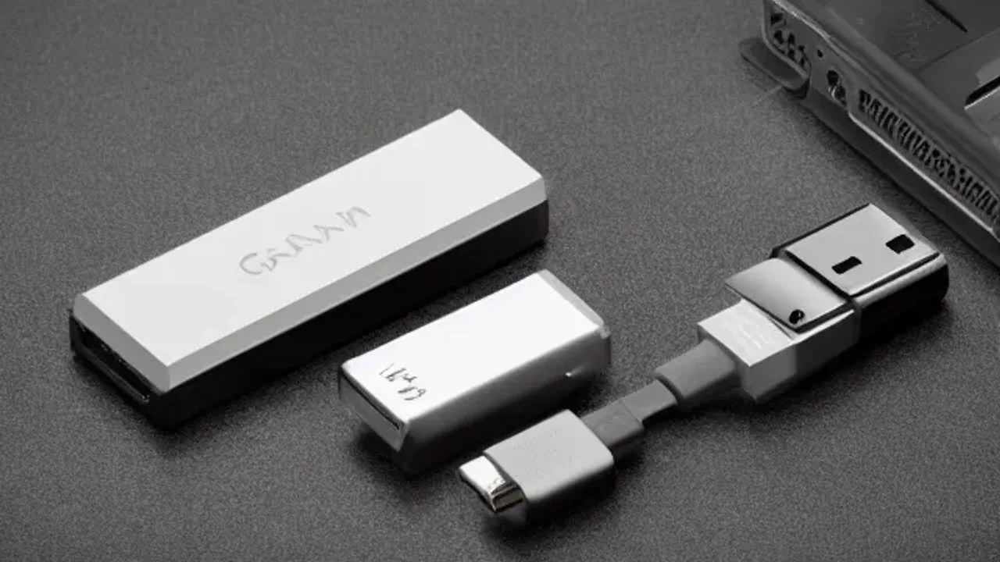
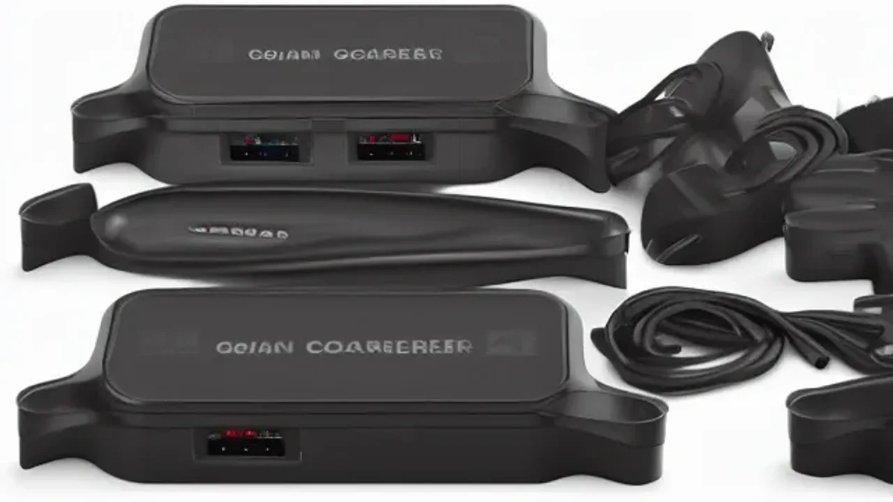

Markdown
최근 무거운 어댑터 때문에 출장이나 여행길이 부담스러웠다면 이제는 가방을 획기적으로 줄여야 합니다. 최신 반도체 기술을 적용한 **GaN 충전기**는 기존 실리콘 어댑터의 부피를 절반 이하로 줄이면서도 압도적인 출력을 제공하여 스마트한 테크 라이프의 필수품이 되었습니다. 노트북부터 스마트폰까지 단 하나의 초소형 장비로 해결하는 스마트한 충전 환경을 구축해 보시기 바랍니다.

## 무거운 벽돌 어댑터는 끝, 왜 지금 GaN 충전기인가?

### 맥북과 스마트폰을 동시에? 질화갈륨(GaN)이 바꾼 일상
기존 실리콘(Si) 기반 충전기는 고출력을 내기 위해 내부 부품 크기를 키워야만 했습니다. 반면 **질화갈륨(GaN) 반도체**는 신소재 특성상 전력 손실이 적고 열전도율이 뛰어납니다. 덕분에 회로 기판을 극단적으로 압축할 수 있어 맥북 프로를 감당하는 100W급 출력을 지녔으면서도 과거 스마트폰 번들 어댑터만 한 크기로 제작이 가능해졌습니다. 가방 속에서 커다란 충전기 서너 개가 엉키던 풍경이 사라지고, 손가락 두 마디 크기의 플러그 하나가 콘센트 주변을 말끔하게 정리합니다.

### 2026년 여름 휴가철, 초소형 충전기가 필수품이 된 이유
여름 휴가나 해외 출장을 앞두고 짐을 꾸릴 때 무게와 부피는 피로도와 직결됩니다. 노트북용 대형 어댑터, 태블릿용, 스마트폰용, 여기에 보조배터리 전원까지 따로 챙기다 보면 어댑터 무게만 1kg에 육박하는 경우가 흔합니다. 2026년 현재 가장 주목받는 여행용 가전 트렌드는 초소형 고출력 디바이스입니다. 우표 크기에 불과한 65W급 초소형 어댑터 하나만 챙기면 비행기 좌석이나 카페, 호텔에서 모바일 기기를 최대 속도로 동시에 충전할 수 있어 짐의 부피를 극적으로 줄여줍니다.

### 일반 충전기와 초고속 GaN 충전기의 결정적 크기 차이
실제 매장에서 두 제품을 나란히 비교해 보면 기술의 진보를 직관적으로 체감할 수 있습니다. 과거 애플의 정품 96W USB-C 전원 어댑터는 성인 남성 주먹만 한 크기에 무게가 약 300g에 달했습니다. 반면 최신 서드파티 GaN 기술이 적용된 100W 멀티 어댑터는 신용카드 절반 정도의 면적에 무게는 150g 안팎에 불과합니다. 부피 기준으로 60% 이상 축소된 수치이며, 플러그 부분이 접히는 폴딩 구조까지 채택되어 주머니에 넣어도 부담이 없는 수준까지 도달했습니다.

## 용량별 GaN 충전기 스펙 비교분석 및 단점 체크

### 가벼운 외출용 45W~65W 라인업의 무게와 휴대성
출퇴근이나 동네 카페로 가볍게 이동할 때는 45W에서 65W 사이의 용량이 최적의 밸런스를 보여줍니다. 65W 용량은 맥북 에어나 13인치급 울트라북을 최대 속도로 구동하면서 동시에 스마트폰까지 고속 충전할 수 있는 수치입니다. 이 체급의 제품들은 대부분 달걀 한 개 무게인 80g~100g 수준으로 제작되므로 셔츠 앞주머니나 미니 파우치에 상시 휴대하기에 무리가 없습니다. 대중적인 범용성을 원한다면 가장 먼저 고려해야 할 규격입니다.

### 고성능 노트북용 100W~140W 이상급의 충전 속도 비교
16인치 이상의 플래그십 노트북이나 고사양 게이밍 기기를 외부에서 데스크톱 대용으로 쓴다면 100W 이상, 초고속 USB-PD 3.1 규격을 지원하는 140W급 라인업을 선택해야 합니다. 맥북 프로 16인치 모델의 경우 140W 전용 포트에 연결하면 단 30분 만에 배터리의 50%를 채우는 압도적인 속도를 보여줍니다. 스마트폰, 태블릿, 카메라 배터리를 동시에 연결해도 각 포트마다 45W, 30W 등의 고출력을 안정적으로 배분하므로 움직이는 작업실을 구축하는 전문가들에게 알맞습니다.

### 초소형 제품이 가진 유일한 약점: 발열과 멀티포트 출력 분배
아무리 효율이 좋은 질화갈륨 소재라도 좁은 공간에 고전력이 흐르면 열이 발생합니다. 일부 초저가형 중국산 제품의 경우 풀 부하 상태에서 표면 온도가 60도 이상으로 치솟아 만졌을 때 불쾌감을 주거나 안전장치가 작동해 충전이 끊기기도 합니다. 또한, 3개 이상의 포트가 달린 멀티 충전기는 새로운 기기를 꽂을 때마다 내부 칩셋이 전력을 재배분하기 위해 약 1~2초간 충전이 잠깐 멈췄다가 다시 시작되는 특성이 있습니다. 이는 고장이 아니라 고출력 멀티 어댑터의 공통적인 작동 매커니즘입니다.

## 내 기기에 딱 맞는 GaN 충전기 진짜 고르는 법

### 접지형 플러그 유무가 기기 수명을 결정하는 이유
노트북이나 태블릿을 충전하면서 알루미늄 본체를 만질 때 찌릿한 정전기나 미세한 진동을 느낀 경험이 있을 것입니다. 이는 건물 콘센트로부터 흘러나오는 누설 전류가 기기 표면으로 흐르기 때문입니다. 이를 방지하려면 반드시 플러그 부분에 금속 단자가 노출된 **접지형(Earthed) 충전기**를 골야 합니다. 접지 설계가 빠진 제품을 장기간 사용하면 소중한 스마트 기기의 액정 터치 오류를 유발하거나 내부 메인보드 부품에 영구적인 데미지를 줄 위험이 존재합니다.

> **접지 확인 체크리스트**
> - 콘센트와 맞닿는 플러그 위아래에 은색 금속판(접지 단자)이 붙어 있는지 확인
> - 상세 스펙에 '누설 전류 차단' 또는 '접지 설계' 문구가 명시되어 있는지 확인
> - 비접지 제품보다 20~25g 더 무겁더라도 안전을 위해 접지형 선택 권장

### PD 3.1과 PPS 규격 확인으로 초고속 충전 완벽 호환시키기
단순히 출력(W)만 높다고 해서 모든 기기가 빠르게 충전되는 것은 아닙니다. 삼성 갤럭시 스마트폰 유저라면 45W 이상의 초고속 충전 2.0을 활성화하기 위해 **PPS(Programmable Power Supply)** 규격 지원 여부를 반드시 살펴야 합니다. 반면 최신 고성능 노트북 유저라면 단일 포트에서 100W의 한계를 넘어 최대 240W까지 송전할 수 있는 **USB-PD 3.1** 인증을 받았는지 대조해봐야 손해 없는 속도를 온전히 누립니다.

### 포트 개수와 케이블 허용 전류(W) 조합 맞추는 팁
충전기 본체 못지않게 중요한 요소가 바로 연결 케이블입니다. 아무리 100W짜리 GaN 어댑터를 사용하더라도 일반 번들 케이블을 연결하면 안전 제한으로 인해 최대 60W까지만 전력이 공급됩니다. 맥북이나 고사양 디바이스를 제대로 쓰려면 내부에 **E-Marker 칩셋**이 내장된 '100W/5A 지원 케이블'을 별도로 구비해야 마땅합니다. 포트는 무조건 많다고 좋은 것이 아니며, 본인의 주력 기기 개수에 맞춰 USB-C 포트 2개와 구형 장비용 USB-A 포트 1개 정도의 조합이 실용적입니다.

[관련 글 보기](/posts/it-devices/)

## 2026년 가성비와 성능을 모두 잡은 추천 제품 TOP 3

### 스마트폰·태블릿 유저를 위한 극단적 초소형 가성비 픽
출퇴근길이나 가벼운 미팅이 잦아 주머니에 쏙 들어가는 크기를 원한다면 45W~65W급 단일 혹은 듀얼 포트 모델이 훌륭한 선택지입니다. 안커(Anker)의 나노 시리즈처럼 플러그 폴딩 기능을 갖춘 제품들은 립밤 하나와 비슷한 부피를 자랑합니다. 스마트폰과 무선 이어폰을 동시에 충전하면서도 콘센트 주변의 다른 플러그를 간섭하지 않아 대중교통이나 좁은 공유 오피스 좌석에서 빛을 발합니다.

### 직장인 및 크리에이터를 위한 올인원 멀티 허브형 픽
맥북 프로, 아이패드, 스마트폰을 동시에 충전하며 데스크테리어를 깔끔하게 유지하고 싶다면 100W~120W급 3포트 접지형 모델이 정답입니다. 유그린(Ugreen)이나 아트뮤(Artmu)의 최신 GaN 라인업은 한국식 220V 두꺼운 플러그에 딱 맞게 접지 플러그가 일체형으로 디자인되어 콘센트에서 흔들거리거나 빠지는 고질적인 문제를 해결했습니다. 노트북에 65W를 안정적으로 밀어주면서도 남은 포트로 태블릿과 스마트폰을 동시에 고속 충전할 수 있는 검증된 구성을 보여줍니다.

### 해외 직구 vs 국내 정발, AS와 안전 인증 고려한 최종 선택 기준
해외 직구 제품들은 가격 경쟁력이 높지만 치명적인 요소가 있습니다. 유럽형(EU) 플러그는 외관상 한국형과 비슷해 보이지만 핀의 두께가 얇아서 국내 콘센트에 꽂으면 헐거워져 불꽃(스파크)이 튀거나 화재의 원인이 되기도 합니다. 반면 국내 정식 발매 제품은 한국형 플러그 규격을 정확히 준수하며 국립전파연구원의 **KC 안전 인증**을 통과했기 때문에 안심하고 쓸 수 있고, 문제가 생겼을 때 확실한 에프터서비스를 받을 수 있는 메리트가 있습니다.

#GaN충전기 #초고속충전기 #접지충전기 #노트북어댑터 #PD충전기 #C타입충전기 #멀티충전기 #여행용꿀템