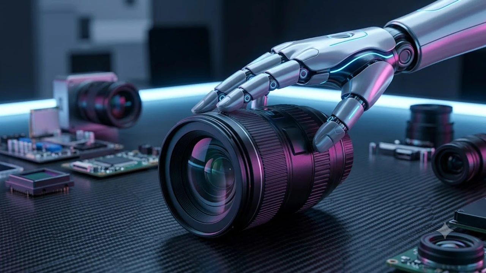

"저는 텍스트 기반 AI입니다. 그것은 제 능력을 벗어납니다." 챗봇을 쓰다가 이 답변을 마주하는 순간, 화면 너머의 지능은 순식간에 차가운 계산기로 되돌아간다. 사용자가 체감하는 **텍스트 AI 한계**는 단순히 말을 못 알아듣는 문제가 아니라 물리 세계와의 단절에서 오는 구조적 결함이며, 이를 극복하기 위한 **언어 모델 진화**는 이제 화면을 찢고 하드웨어 본체로 내려앉고 있다.

## 문맥의 벽에 부딪힌 텍스트 모델의 민낯

### 화면 밖 현실을 모르는 기호 조작의 맹점
텍스트 전용 모델은 방대한 활자를 확률적으로 조합해 그럴듯한 문장을 직조한다. 
- 비가 올 때 우산 손잡이를 쥐는 압력
- 뜨거운 커피 잔 표면의 열기
- 방 안의 조도 변화에 따른 시야 적응

기호 체계 속에서만 작동하는 알고리즘은 이러한 현실의 감각 데이터를 전혀 학습하지 못한다. 결국 사용자가 실제 환경에서 마주하는 돌발 변수를 명령어로 상세히 묘사하지 않으면, 모델은 엉뚱한 답변을 내놓거나 처리 범위를 벗어났다는 표준 문구만 반복한다.

### 토큰 창 크기가 만드는 인지적 기억 상실
컨텍스트 윈도우가 수백만 토큰으로 확장되었더라도, 대화가 길어질수록 초반에 설정한 맥락을 망각하거나 세부 조건을 혼동하는 '중간 상실(Lost in the Middle)' 현상이 일어난다. 단순 질의응답을 넘어선 실시간 협업 도구로서 텍스트 기반 처리 방식이 명확한 한계를 드러내는 지점이다.

### 데이터 시차와 정적 지식 베이스의 단절
사전 학습(Pre-training)이 끝난 모델은 그 시점 이후 세상의 물리적 변화를 실시간으로 인지하지 못한다. 검색 증강 생성(RAG)을 덧붙여 보완하더라도, 네트워크 신호가 끊기거나 검색 결과 자체가 오염되어 있으면 텍스트 AI는 즉각적으로 오작동을 일으킨다.

## 하드웨어를 만나 물리 세계로 확장되는 감각

### 비전 센서와 공간 음향이 더해진 멀티모달
텍스트 한 줄에 의존하던 환경은 카메라 렌즈와 지향성 마이크를 탑재한 장치로 옮겨가고 있다. 
> "이 나사를 시계 방향으로 돌려야 해?"라는 질문에 이제 AI는 사용자의 시야를 함께 보며 부품의 마모도와 드라이버의 각도를 파악해 즉답을 건넨다.

실제로 시각과 공간 데이터를 직접 결합하는 방식은 텍스트 프롬프트를 일일이 타이핑하던 번거로움을 완전히 지운다. 입체 공간을 직접 인식하는 인터페이스 혁신은 [2026 차세대 XR 기기 바뀌는 미래 완전 정리](/posts/it-devices/spatial-3d-display-xr-device-2026/) 흐름과도 정확히 맞물린다.

### 온디바이스 NPU가 주도하는 즉시성
외부 클라우드 서버와의 통신 지연(Latency)은 찰나의 상호작용을 방해하는 주원인이었다. 기기 자체에 탑재된 신경망처리장치(NPU)는 로컬 환경에서 압축된 모델을 실시간 구동하며, 네트워크 단절 상태에서도 사용자의 음성과 주변 환경을 즉각 판별한다.

### 촉각 피드백과 햅틱 인터페이스 결합
화면 속 텍스트가 물리작성할 본문의 구체적인 주제나 원하시는 내용을 알려주시면, 요청하신 서식(`markdown` 코드블록)에 맞춰 즉시 작성해 드리겠습니다. 어떤 내용을 다루면 될까요?