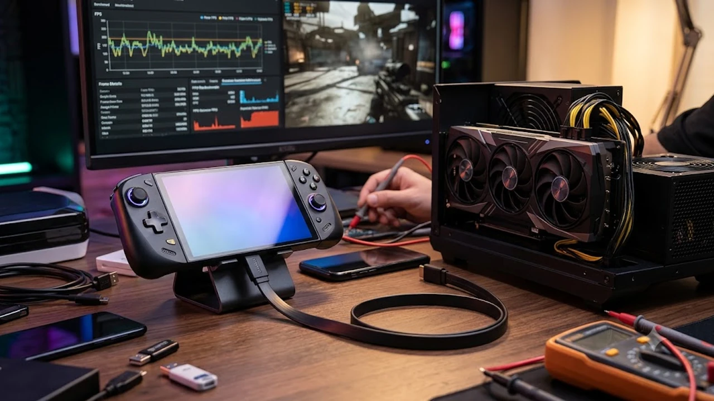

최근 핸드헬드 PC 사양이 급격히 높아지면서, 야외에서는 휴대용으로 즐기고 실내에서는 데스크톱 수준의 게이밍 환경을 구축하기 위해 **OCuLink eGPU**를 도입하는 하이엔드 유저들이 크게 늘고 있다. 스펙 시트 상 완벽해 보이는 외장 그래픽 도킹 환경이라 할지라도, 시스템 내부의 물리적인 대역폭 한계로 인해 발생하는 프레임 병목 현상과 마이크로 스터터링은 기기를 100% 활용하기 위해 반드시 짚고 넘어가야 할 필수 과제다.

## OCuLink 인터페이스 물리적 구조와 데이터 병목 원인
### PCIe 4.0 x4 레인의 실질적 데이터 전송 대역폭 분석
하이엔드 휴대용 PC 시장에서 주로 채택하는 OCuLink 규격은 메인보드에 직결된 PCIe 4.0 x4 레인을 그대로 활용한다. 스펙 시트에 명시된 이론적 대역폭은 63Gbps에 달하지만, 시스템 내부의 처리 오버헤드와 케이블 신호 변환 과정을 거치면 실제 유효 대역폭은 50Gbps 내외로 떨어진다. 고성능 그래픽카드가 데스크톱 환경에서 PCIe 4.0 x16 레인을 통째로 점유하는 것과 비교하면, 물리적인 데이터 통로 자체가 4분의 1 크기로 대폭 축소된 셈이다.

### 썬더볼트 및 USB4 네트워크 대역폭과의 기술적 대조
> 범용 규격인 썬더볼트 4(Thunderbolt 4)나 USB4를 활용한 eGPU 연결 방식은 총 40Gbps의 대역폭 중 화면 출력 및 보조 데이터 전송량을 빼고 나면, 실제 그래픽 연산 데이터에 할당되는 비중이 22Gbps~32Gbps 수준에 그친다.

반면 OCuLink는 중간 컨트롤러 칩셋이나 별도의 프로토콜 변환 과정 없이 메인보드와 그래픽카드를 다이렉트로 직결한다. 이 구조 덕분에 데이터 전송 지연 시간(Latency)이 획기적으로 짧아져 고사양 게임 구동 시 화면 찢어짐이나 프레임 드랍을 억제하고 1% Low 프레임을 든든하게 방어한다.

### 화면 해상도 스케일링에 따른 병목 심화 메커니즘
데이터 대역폭의 한계는 모니터 화면 해상도를 올릴수록 오히려 역설적인 지표를 보여준다. 1080p(FHD) 환경에서는 CPU가 그래픽카드에 렌더링을 지시하는 드로콜(Draw Call) 횟수가 급증해 케이블 단에서 병목이 잦아지며, 데스크톱 직결 대비 최대 15~20%의 프레임 손실이 발생한다. 반대로 4K(UHD) 해상도에서는 GPU 자체의 연산 부하가 극도로 커져 렌더링 속도 자체가 느려지므로 통로가 막혀서 발생하는 병목 체감은 상대적으로 줄어든다.

## 최신 핸드헬드 PC 실기반 프레임 병목 테스트

### GPD WIN Max 2와 OneXGPU 실측 사례
AMD Ryzen AI 9 HX 370 프로세서와 32GB RAM, 2TB SSD를 탑재한 GPD WIN Max 2에 전용 케이블로 OneXGPU 1세대를 물린 세팅은 OCuLink 병목을 실측하기에 가장 이상적인 하이엔드 표본이다. 초당 60프레임 방어가 절대적인 격투 게임 철권 8이나 수많은 오브젝트를 렌더링하는 최신 오픈월드 타이틀 구동 시, USB4 환경에서 괴롭히던 뼈아픈 스터터링이 자취를 감추고 직결 특유의 쾌적함이 살아난다.

### 내장 디스플레이 출력 시 발생하는 루프백 페널티
외장 그래픽카드에서 복잡한 연산이 끝난 고용량 화면 데이터를 얇은 케이블 하나를 통해 다시 기기의 내장 디스플레이로 역송출하는 과정을 '루프백(Loopback)'이라 부른다.
- **대역폭 이중 소모**: 렌더링이 끝난 수십 기가바이트의 데이터를 좁은 OCuLink 케이블 통로로 다시 밀어 넣어야 하므로 데이터 충돌과 병목이 극심해진다.
- **심각한 프레임 하락**: 루프백 구동 시에는 외부 모니터를 별도로 사용할 때보다 평균 15~30% 수준의 치명적인 프레임 하락을 감수해야 한다.

### 고사양 AAA 게임 프레임 방어율과 게이머 이탈 현상
OCuLink eGPU 셋업은 야외에서의 완벽한 휴대성과 실내의 거치형 하이엔드 퍼포먼스를 모두 타협 없이 제공한다. 스팀덱 같은 기존 범용 기기들의 한계에 지친 코어 유저들이 [스팀덱 2 출시 연기, 지금 사도 될까?](/posts/it-devices/steam-deck-2-release-delay-purchase-guide-2026/)와 같은 기술적 한계를 분석한 뒤, 대역폭 확장이 자유로운 OCuLink 지원 윈도우 UMPC로 대거 넘어가는 현상도 이 압도적인 프레임 방어율 차이가 만든 결과다.

## eGPU 시스템의 프레임 저하 방어를 위한 하드웨어 세팅
### 외부 모니터 직접 연결(Direct Output) 필수화 원칙
치명적인 루프백 페널티를 하드웨어 단계에서 원천 차단하려면, 외장 그래픽 독 후면에 위치한 DP 혹은 HDMI 포트에서 외부 모니터로 직접 영상 케이블을 연결해야 한다. 다이렉트 출력 방식을 채택하면 데이터가 메인보드로 역류하는 오버헤드가 완전히 사라져 데스크톱 GPU 본연의 성능을 85~90% 수준까지 극한으로 뽑아낼 수 있다.

### 전원 공급 안정화와 케이블 신호 간섭 제어 전략
고주사율 프레임을 장시간 요동 없이 유지하려면 물리적인 케이블 환경과 전력 공급 통제가 뒷받침되어야 한다.
- **통신 케이블 길이 제한**: 고속 데이터 전송용 케이블은 길이가 50cm를 초과하면 신호 무결성이 크게 훼손되어 게임 중 치명적인 통신 오류나 블랙스크린을 유발한다.
- **독립 전원 인가 순서**: eGPU 독에 100W 이상의 메인 전력이 안정적으로 들어간 것을 인디케이터로 먼저 확인한 뒤, 3~5초 후 메인 기기를 켜야 윈도우 단에서 장치 인식 오류를 막을 수 있다.

### UMPC 바이오스(BIOS) 상의 대역폭 최적화 할당
대부분의 UMPC 기기들은 배터리 타임을 늘리기 위해 내부 PCIe 레인의 능동형 전력 관리(ASPM) 기능을 켜두어 OCuLink 대역폭을 강제로 제한한다. 부팅 시 바이오스 메뉴에 진입하여 이를 비활성화(Disable)하고 인터페이스 링크 속도를 최대 성능 모드(Gen 4)로 고정하면 간헐적으로 뚝뚝 끊기는 프레임 드랍 현상을 획기적으로 개선할 수 있다.

## UMPC 시스템과 외장 그래픽 도킹의 진화 방향
### 차세대 PCIe 5.0 기반 OCuLink 2.0 대역폭 확장 전망
모바일 칩셋에 차세대 통신 규격인 PCIe 5.0이 상용화되면 물리적 데이터 전송량은 기존의 두 배인 128Gbps로 뛰어오른다. 이는 현역 고성능 데스크톱 메인보드의 PCIe 4.0 x8 레인 전송량과 맞먹는 엄청난 수치로, 향후 세대에서는 eGPU 환경에서의 프레임 병목이라는 물리적 한계 자체가 완전히 극복될 가능성이 크다.

### 모바일 APU 내부 PCIe 구조 한계 돌파 가능성
초저전력 핸드헬드 칩셋은 물리적 크기와 발열의 제약으로 인해 외부 장치에 할애할 여유 PCIe 레인 수가 턱없이 부족했다. 그러나 최근 폼팩터의 성능 융합이 가속화되면서, 향후 등장할 신형 실리콘 아키텍처는 넉넉한 eGPU 대역폭 확보를 최우선으로 두는 방향으로 나아갈 것이며 이는 [텍스트 AI의 한계와 진화](/posts/it-devices/text-based-ai-limits-and-evolution/)에 비견될 만큼 하드웨어 업계의 큰 화두로 떠오르고 있다.

### 궁극의 단일화 게이밍 통합 셋업 구축 가이드
밖에서는 기기 단독의 가벼움으로 캐주얼 작업을 처리하고, 공간에 복귀하면 케이블 하나만 꽂아 즉각적으로 고해상도 셋업을 완성하는 라이프스타일은 이제 코어 게이머들의 일상이 되었다. OCuLink 연결 규격이 가진 물리적 한계와 병목 원인을 정확히 이해하고 하드웨어를 최적화한다면, 실내외 퍼포먼스 타협이 전혀 필요 없는 완벽한 디바이스 생태계를 완성할 수 있다.
[최신 OCuLink 외장 그래픽 독 쿠팡에서 보기](https://www.coupang.com/np/search?q=%EC%8A%A4%EB%A7%88%ED%8A%B8%EA%B8%B0%EA%B8%B0%20%EB%85%B8%ED%8A%B8%EB%B6%81&sourceType=affiliate&trackingCode=AF8691300)

#OCuLink #eGPU #핸드헬드PC #GPDWINMax2 #OneXGPU #외장그래픽 #대역폭병목 #게이밍셋업