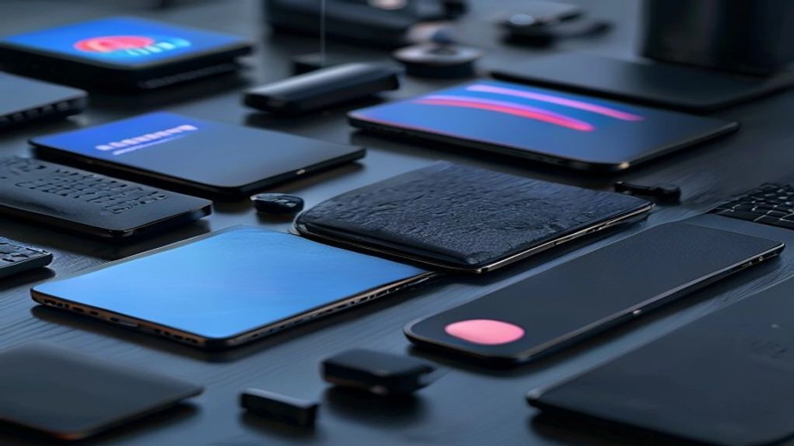
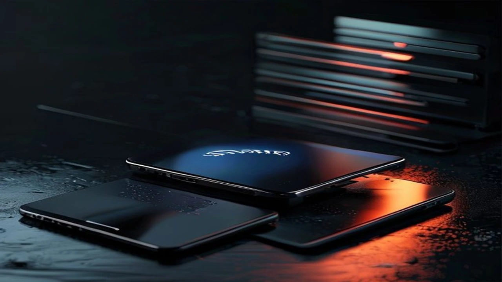

2026년 컴퓨텍스(Computex)를 기점으로 차세대 네트워크 규격인 **Wi-Fi 8 공유기**에 대한 전 세계 테크 진영의 전술적 움직임이 매섭습니다. 기존 Wi-Fi 7이 완전히 시장에 안착하기도 전에 등장한 이 새로운 기술은 대역폭 확장이라는 1차원적 접근을 넘어선 패러다임 전환을 선언했습니다. 무선 인프라 세대교체 시기마다 발생하는 중복 지출을 막기 위해, 이 신기술의 실체와 장비 선택의 정밀한 기준을 명확히 짚어내야 합니다.

## 컴퓨텍스 2026을 뒤흔든 Wi-Fi 8의 등장 배경

### 초저지연 네트워크가 지금 필요한 이유
로컬 디바이스와 클라우드 서버가 실시간으로 수억 개의 매개변수를 주고받는 온디바이스 AI 시대에는 데이터 전송 속도보다 **응답 속도(Latency)**가 장비의 본질적인 체급을 결정합니다. 초고화질 8K XR 헤드셋을 착용하고 공간 컴퓨터를 구동할 때 발생하는 미세한 화면 밀림은 장비 불량이 아닌 무선 전파의 지연이 원인입니다. 가상 세계와 현실의 물리적 시차를 없애려면 완전히 새로운 무선 인프라가 뒷받침되어야만 합니다.

### Wi-Fi 7이 나온 지 얼마 안 되었는데 왜 벌써?
현장에서는 "Wi-Fi 7 공유기를 교체한 지 반년도 안 되었는데 벌써 차세대 규격을 논하는가"라며 볼멘소리가 나옵니다. 그러나 IEEE(국제전기전자공학자협회)의 표준화 타임라인을 추적해 보면 2026년 여름은 Wi-Fi 8(802.11bn) 칩셋의 실물 프로토타입이 시장 전면에 나설 완벽한 타이밍입니다. 글로벌 반도체 제조사들이 일제히 양산형 실리콘을 쏟아내면서 프리미엄 네트워크 장비 시장의 주도권 싸움이 예상보다 빠르게 불붙었습니다.

### 802.11bn 규격이 지향하는 핵심 변화
공식 명칭 **IEEE 802.11bn**으로 확정된 Wi-Fi 8의 지향점은 무선 연결의 극단적인 안정성 확보에 있습니다. 이전 세대들이 최고 전송 속도의 숫자를 마케팅용으로 과시하는 데 급급했다면, 이번 단계는 '전파 간섭 제어'와 '주파수 효율성'에 사활을 걸었습니다. 아파트 가구별 무선 신호가 복잡하게 얽히는 밀집 주거 환경에서도 유선 광랜을 직접 꽂은 듯한 균일한 데이터 품질을 유지하는 것이 핵심 목표입니다.

## Wi-Fi 8 vs Wi-Fi 7 기술 스펙 및 성능 비교

### 단순 속도 경쟁을 넘어선 지연율의 혁신
Wi-Fi 7의 이론상 최대 속도인 46Gbps 대역폭 체계는 Wi-Fi 8에서도 그대로 유지됩니다. 진짜 혁신은 **밀리초(ms) 단위를 다투는 지연 시간의 극적인 단축**에서 발생합니다. 물리 계층(PHY) 구조를 전면 재설계하여, 전파 신호가 장벽을 만나거나 굴절될 때 생기는 패킷 누실을 원천 차단합니다. 0.001초의 반응 속도로 승패가 갈리는 실시간 온라인 게임이나 증권사 초단타 매매 환경에서 유선 랜선 수준의 신뢰도를 확보할 수 있습니다.

### 다중 기기 접속 환경에서의 대역폭 관리 차이
가정 내에 스마트폰, 태블릿을 넘어 AI 홈 허브, IoT 센서, 가전제품 등 수십 개의 기기가 전파를 나눠 쓰는 상황에서 두 규격의 격차가 벌어집니다. Wi-Fi 7이 다중 링크(MLO)로 채널을 단순히 쪼개어 썼다면, Wi-Fi 8은 공간 분할 메커니즘을 극한으로 끌어올렸습니다. 각 기기의 물리적 위치와 실시간 트래픽 요구량을 연동해 전파를 정밀하게 조준하는 빔포밍 기술이 들어가, 한쪽에서 대용량 파일 다운로드가 터져도 다른 기기의 먹통 현상을 방지합니다.

### 스마트 홈과 XR 기기를 위한 맞춤형 주파수 최적화
고주파수 직진성 때문에 장애물에 취약했던 6GHz 대역의 도달 거리가 비약적으로 상승합니다. 전파의 물리적 한계를 극복하기 위해 주변 환경을 실시간으로 스캔하고 주파수 출력을 동적으로 분배하는 하이브리드 할당 알고리즘을 도입했습니다. 거실에 설치된 라우터를 기점으로 문을 닫고 방으로 들어가더라도 4K 해상도의 VR 스트리밍 화면이 뭉개지거나 프레임 드랍이 생기지 않는 기틀이 마련되었습니다.

## 차세대 게이밍 공유기 도입의 장점과 단점

### 8K 스트리밍과 실시간 AI 연동에서 얻는 압도적 이점
> "초고속 무선 네트워크의 진화는 하드웨어의 로컬 스토리지 의존도를 낮추고, 모든 연산을 클라우드와 실시간으로 동기화하는 진정한 유비쿼터스 환경을 완성한다."

Wi-Fi 8 기반의 게이밍 라우터 체계를 구축하면 내부망을 통한 대용량 영상 편집 파일 전송이나 나스(NAS) 백업 속도가 획기적으로 쾌적해집니다. 기가비트급을 넘어서는 초고속 인터넷 회선의 잠재력을 무선으로 손실 없이 100% 인출할 수 있다는 뜻입니다. PC 본체 내부의 SSD에서 데이터를 읽어오는 것과 체감상 차이가 없는 속도로 클라우드 AI 모델을 실시간 구동하는 초연결 환경이 구현됩니다.

### 초기 도입 비용과 호환 디바이스 부족이라는 현실적 장벽
새로운 기술적 성취 뒤에는 가혹한 비용 청구서가 기다리고 있습니다. 컴퓨텍스에서 선공개된 글로벌 제조사들의 플래그십 게이밍 라우터 라인업은 얼리어답터 세세를 타겟으로 삼아 지갑에 상당한 부담을 주는 가격대로 포지셔닝되었습니다. 무엇보다 공유기 본체가 아무리 신호를 잘 뿌려주어도 수신할 스마트폰이나 노트북의 랜카드가 옛 세대라면 하위 호환 모드로 강제 고정되므로, 주변 에코시스템의 교체 주기까지 계산해야 합니다.

### 전력 소비 및 발열 제어 측면에서의 하드웨어 변화
연산 성능이 높은 전용 프로세서와 다중 안테나 제어 칩셋을 상시 가동하기에 전력 소모량의 증가는 피할 수 없는 물리적 결과입니다. 내부 발열을 효과적으로 억제하기 위해 신형 기기들은 대형 구리 방열판과 공기 흐름을 극대화한 거대한 하우징을 채택했습니다. 인테리어 요소를 고려해 공유기를 구석진 서랍이나 좁은 틈새에 숨겨두고 쓰던 사용자라면 기기 수명과 전파 효율을 위해 거치 공간을 전면 재배치해야 할 수도 있습니다.

[관련 글 보기](/posts/it-devices/)

## 나에게 맞는 네트워크 장비 구매 가이드 및 결론

### 내게 필요한 공유기 사양 자가 진단하기
가성비와 지출 효율성을 극대화하려면 무조건적인 스펙 맹신에서 벗어나 현재 본인의 통신 환경을 정밀하게 진단해야 합니다. 아래의 기준을 체크해 보시기 바랍니다.

- 가정용 인터넷 회선 속도가 100\~500Mbps 수준의 일반 광랜 상품이다.
- 웹서핑, 오티티(OTT) 플랫폼 시청, 모바일 캐주얼 게임 위주로 무선을 쓴다.
- 상시 연결된 스마트 기기의 총개수가 10대 미만이다.

위 항목에 모두 해당한다면 굳이 큰 비용을 지불하고 최상위 라우터로 무리하게 넘어갈 하등의 이유가 없습니다. 반면 1Gbps를 초과하는 고가 요금제를 가입했거나 집안에 수십 개의 가젯을 상시 가동하는 하이엔드 유저라면 지출 대비 만족도가 확실한 선택지입니다.

### 지금 Wi-Fi 7을 살까, Wi-Fi 8을 기다릴까?
현재 시장 가격 안정화 단계에 접어든 Wi-Fi 7 인증 공유기들은 성능과 지출의 합리적인 타협점을 제안합니다. 새로운 네트워크 규격이 완전히 대중화되고 보급형 칩셋이 풀리기까지 최소 1년 이상의 유예 기간이 소요된다는 점을 계산해야 합니다. 당장 네트워크 불통 스트레스로 기기 교체가 시급한 경우 검증된 세대의 하이엔드 모델을 선택하는 편이 이득입니다. 반면 최신 플래그십 스마트폰과의 완벽한 매칭을 노리는 얼리어답터라면 신형 라우터의 공식 출시를 기다리는 전략이 유효합니다.

### 향후 5년을 내다보는 하이엔드 유저의 스마트한 소비 전략
네트워크 인프라 장비는 한 번 들여놓으면 평균 5년 이상 장기적으로 가동하는 특성을 지닙니다. 그렇기에 당장은 다소 과해 보이는 스펙일지라도 미래 가치와 기기 수명을 고려해 선제적으로 투자하는 안목도 훌륭한 전략입니다. 본인이 거주하는 공간의 벽면 재질, 통신사 인입 회선 종류, 메인 디바이스들의 무선 스펙 호환성을 종합적으로 대조하여 영리한 교체 로드맵을 설계해 보시기 바랍니다.

#와이파이8 #WiFi8공유기 #차세대네트워크 #게이밍라우터 #인터넷공유기추천 #컴퓨텍스2026 #테크트렌드 #초저지연 #무선네트워크 #얼리어답터