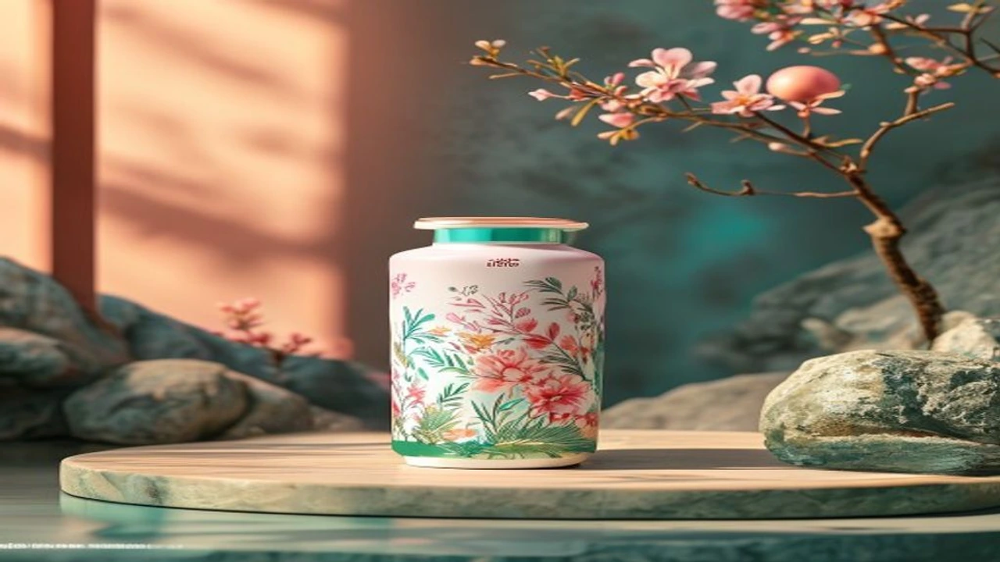

大相撲7月場所は、将来的にも語り継がれる歴史的な結末を迎えました。連日の熱戦の中で特に熱い視線を集めたのが、関脇から挑んだ安青錦の「安青錦 優勝 7月場所」を巡る壮絶な復帰劇。怪我による全休からわずか1場所での大関復帰という前代未聞の快挙を成し遂げ、大相撲ファンのみならずスポーツ界全体に大きな感動を与えています。

## 大相撲7月場所：安青錦が挑んだ前代未聞の「1場所での大関復帰」

### 怪我による全休から関脇転落までの苦難の道のり
安青錦が大関として確固たる地位を築きつつあった矢先、負傷による無念の全休を余儀なくされました。大相撲の厳格な番付制度において、全休は容赦なく関脇への転落を意味します。長期間の戦線離脱は筋力低下や実戦感覚の鈍化を招くため、元の地位に戻るまでに数場所、あるいは数年を費やすのがこれまでの常識でした。しかし、彼は絶望的な状況に屈することなく、リハビリと再起に向けた稽古に没頭したのです。

### 現行制度下で初となる快挙達成への条件と期待
現行の番付制度において、関脇に転落した元大関が「1場所で大関に特例復帰」するためには、10勝以上の勝ち越しが最低条件。さらに幕内優勝まで勝ち取るとなれば、過去に例を見ない異次元のパフォーマンスが求められます。単に星を重ねるだけでなく、役口としての品格と強さを証明しなければならないプレッシャーの中、7月場所の土俵に上がった彼の肩にはファンの絶大な期待が寄せられていました。

### 日韓の相撲・格闘技ファンが熱狂した決定戦のリアルタイムな反応
千秋楽における巴戦の展開は、まさに息をのむ熱戦となりました。日本国内のSNSでは関連ワードがトレンドを独占し、ライブ配信のコメント欄は歓喜の声で埋め尽くされる事態に。また隣国の韓国においても、シルム（韓国伝統相撲）ファンや格闘技愛好家の間で「ウクライナ出身力士が見せた驚異のメンタル」としてリアルタイムで大きな話題を呼びました。国境を越えて多くのスポーツファンが彼の勇姿に熱狂した瞬間です。

---

## なぜ安青錦はたった1場所で復活できたのか？圧勝の勝因3選

### 圧倒的な立ち合いの変化と徹底された取組対策
休場期間中に彼が断行した最大の改革は、立ち合いの角度と踏み込みの精査でした。対戦相手の得意形を徹底的に分析し、初動で主導権を握る組み立てを完成させたのです。
* **低く鋭い踏み込み**: 相手の胸元に素早く潜り込む技術のブラッシュアップ
* **柔軟な足腰の使い**: 組み止められても体勢を崩さない体幹の再構築
* **組み手のバリエーション拡充**: 左差し・右上手だけでなく、いなす動きの習得

### 休場期間中に強化されたフィジカルと精神的成長
土俵に上がれない時間を無駄にせず、下半身を中心とした筋力トレーニングと柔軟性の向上に集中投資。怪我を再発させない肉体作りと並行して、マインドフルネスを取り入れたメンタルトレーニングを実践しました。焦りや恐怖心を排除し、「一番一番に集中する」という強固な精神的基盤を作り上げたことが、今場所の圧倒的な安定感に直結しています。

### 千秋楽の巴戦で見せた冷静な心理戦と決断力
優勝決定戦（巴戦）という極限の緊張感の中で、彼は驚くべき冷静さを発揮しました。相手の圧力を巧みに利用し、勝負どころで見せた瞬時の判断力が勝敗を分けたポイントです。

> 「土俵に上がったら怪我の言い訳はできない。自分の相撲を信じて前に出るだけだった」

取組後のインタビューで語ったこの言葉通り、迷いのない踏み込みが歴史的勝利を手繰り寄せました。スポーツ観戦熱が高まる中、日韓のスポーツ交流や動向について関心がある方は、[2026年W杯日本代表の突破条件は？韓国の反応と最新勝敗まとめ](/posts/japan-trends/2026-worldcup-japan-vs-sweden-scenarios/) も合わせてチェックしてみてください。

---

## 異例のスピード復帰が相撲界とスポーツ界に与えた衝撃

### 過去の特例復帰データとの比較に見る安青錦の異次元さ
大相撲の歴史において、関脇転落後に1場所で大関へ再昇進した例は極めて限定的です。

| 項目 | 従来の特例復帰ケース | 今場所の安青錦 |
| :--- | :--- | :--- |
| **復帰に必要な勝ち星** | 10勝〜11勝でのクリアが目安 | **12勝以上を挙げ幕内優勝** |
| **復帰場所での優勝** | 過去達成例なし（現行制度） | **決定戦を制し優勝達成** |
| **場所中の安定度** | 中盤で苦戦するケース多数 | **序盤から連勝街道を維持** |

データが示す通り、単に復帰条件を満たすだけでなく「優勝」という最高の結果を添えて大関へ返り咲いた点は、相撲史に永く刻まれる大記録となります。

### ウクライナ出身力士としての歩みと日韓での注目の高まり
母国を離れて厳しい角界に入門し、幾多の障壁を乗り越えてきたストーリーは、国内外のメディアで大きく取り上げられました。特にアジア圏における関心は高く、韓国のスポーツメディアでも彼の粘り強い相撲スタイルと生い立ちが特集されています。文化や国境を越えて人々を惹きつけるアスリートとしてのカリスマ性が、今回の快挙で一段と際立ちました。

### 今後の横綱昇進へのシナリオと秋場所の見どころ
大関復帰を果たした今、次なる目標は最高位である「横綱昇進」に他なりません。秋場所で連続優勝、あるいはそれに準ずる好成績を残せば、一気に横綱昇進の機運が高まります。怪我を克服した現在の充実ぶりを見る限り、横綱昇進へのシナリオは現実味を帯びています。

---

## 観戦をより楽しむための最新配信情報とチェックポイント

### 見逃し配信・アーカイブ動画を効率よく視聴する方法
歴史的な7月場所の激闘を改めて振り返りたい場合、公式の動画配信サービスや各種見逃し配信の活用が効果的です。
* **NHKプラス**: リアルタイム配信および1週間の見逃し視聴が可能
* **日本相撲協会公式YouTubeチャンネル**: 注目取組のハイライトや舞台裏映像を公開
* **ABEMA**: 独自の解説陣による全取組のアーカイブ配信を実施

スマートフォンやタブレットを活用して、気になる取組をピンポイントで復習するスタイルが定着しています。

### SNSで話題の解説コメントや有名親方の評価まとめ
千秋楽以降、X（旧Twitter）やYouTubeでは親方衆や相撲解説者による分析動画が次々と投稿されています。「立ち合いの踏み込みが以前より低くなっている」「土俵際での残し方が完璧」といった専門的な解説を把握すると、取組の奥深さをより堪能できます。また、最新のライフスタイルやトレンド情報に興味がある方は、[日本トレンド全体を見る](/posts/japan-trends/) から他の話題も探せます。

### 次場所（秋場所）の番付予想と注目力士の動き
安青錦が大関に復帰することで、秋場所の番付編成は一気に混迷を極める展開となりました。新大関・新関脇の誕生や、若手力士の台頭など、土俵の勢力図は急速に変化しています。大関復帰を果たした彼が、追う立場から追われる立場へと変わる中でどのような相撲を見せるのか、9月の秋場所からも目が離せません。

#日本トレンド #2026 #安青錦 #大相撲 #7月場所 #大関復帰 #相撲 #スポーツニュース #ウクライナ #感動