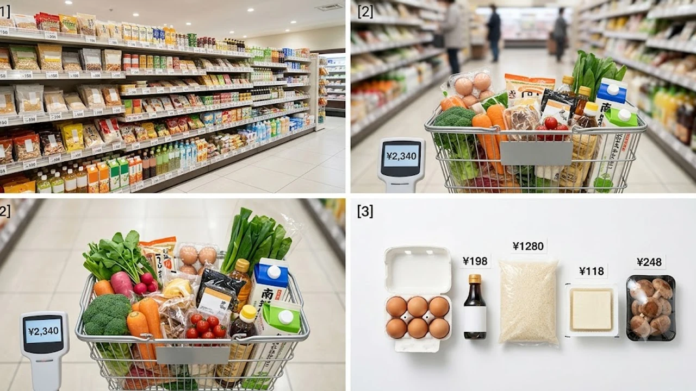

2026年8月1日より、大手食品メーカー195社による**8月 食品値上げ 2026**の波が一斉に押し寄せています。原材料高や円安の影響を受け、2,300品目を超える加工食品や調味料が大幅な価格改定を余儀なくされました。本記事では、今回の値上げラッシュの具体例から実用的な節約術、隣国・韓国の物価事情との比較までリアルな視点で解き明かします。

## 8月1日スタート！大手メーカー2,300品目超「値上げラッシュ」の全貌

### なぜ今？2026年8月に値上げが集中した背景と主な対象商品
帝国データバンクの最新調査によると、2026年8月1日に改定された食品・飲料は計2,311品目に上ります。
背景にあるのは、世界的な物流費・エネルギーコストの上昇、そして長期化する円安に伴う輸入原材料費の急騰です。
特に今回は、日々の食卓に欠かせない定番商品が直撃を受ける形となりました。

* **加工食品（ハム・ソーセージ等）：** 平均5%〜15%の大幅引き上げ
* **調味料・つゆ類：** 輸入大豆や油脂類の仕入れコスト高騰による改定
* **清涼飲料水・乳製品：** 包装資材および冷気を保つ物流費の改定

### シャウエッセンも対象！家庭の食卓を直撃する主要食品リスト
家庭の味として親しまれている日本ハムの「シャウエッセン」をはじめ、主要各社の看板商品が対象に名を連ねています。
単なる店頭価格の引き上げにとどまらず、価格を据え置いたまま内容量を減らす「実質値上げ（シュリンクフレーション）」も目立つ状況です。

> **主な改定例**
> * **日本ハム：** 食肉加工品・調理食品など約200品目を3〜12%値上げ
> * **大手調味料メーカー：** つゆ・ドレッシング類を平均7%引き上げ
> * **スナック菓子：** 内容量を約10%削減する実質値上げを適用

### 原材料高と円安の二重苦…今後の見通しとさらなる値上げの可能性
専門家の分析によると、今回の8月改定にとどまらず、秋口にかけて第2波の値上げが懸念されています。
輸入依存度の高い小麦や油脂類は下落の兆しが見えず、企業の努力だけでは吸収しきれない限界点に達しています。

---

## 値上げラッシュを乗り切る！今すぐ実践できる食費節約術

### プライベートブランド（PB）活用とスーパーの買い出しテクニック
有名メーカー品が値上がりする中、イオンの「トップバリュ」やセブン＆アイの「セブンプレミアム」といったプライベートブランド（PB）へ乗り換える動きが加速しています。
自社開発と大量仕入れのおかげで、同等品質のNB商品より15〜30%ほど安く手に入る点が強みです。

* **買い出しは週2回に限定：** 計画的なまとめ買いで余計なついで買いをシャットアウト
* **夕方以降のタイムセールを活用：** 割引シール品を買い、即座に冷凍保存
* **調味料からPB化：** 味の差が出にくい調味料や缶詰から優先して切り替え

### ポイ活＆フードシェアリングアプリを活用した賢い食費削減法
スマートフォンの普及により、単なる節約にとどまらないデジタル防衛術が定着しつつあります。
店舗ごとのポイント倍増日に買い物を集約させる工夫に加え、食品ロス削減アプリを使って近隣店舗の余剰食品を格安で引き取るスマートな消費者が増えてきました。

### まとめ買いvs都度買い！最新の食費防衛シミュレーション
4人世帯の場合、従来の買い出しスタイルを続けると月額で約4,000円〜6,000円の負担増になる計算です。
しかし、週1回の大型スーパーでのまとめ買いと、近所のディスカウントストアでの都度買いを組み合わせれば、値上げ分を十分に相殺できます。

---

## 日本だけじゃない？韓国の最新物価事情とリアルな暮らしの比較

### 韓国でも相次ぐ「シュリンクフレーション（実質値上げ）」の実態
物価高と実質値上げに悩まされているのは日本ばかりではありません。
韓国においても外食費や加工食品の急激な上昇が深刻な社会問題と化しています。
特にソウル近郊の外食費は高騰が続いており、キムチチゲや冷麺といった庶民派メニューの平均価格も前年比で大きく跳ね上がりました。

### 日韓の「外食費・食品価格」を徹底比較！旅行者への影響は？
日韓両国のリアルな生活コストを比較すると、以下の違いが見えてきます。

| 項目 | 日本（東京） | 韓国（ソウル） | 比較傾向 |
| :--- | :--- | :--- | :--- |
| **スーパーの生鮮食品** | 比較的安定 | 天候や物流で変動大 | 日本がやや割安なケース増加 |
| **一般的な外食（ランチ）** | 800円〜1,200円 | 10,000〜13,000ウォン | ほぼ同水準、カフェ代は韓国が高め |
| **加工食品・調味料** | 8月1日〜再値上げ | 順次引き上げ実施 | 両国ともに「実質値上げ」が活発 |

生活コストが増加する中、消費行動自体を極限までシンプルにする動きも見られます。
若者世代を中心に広がる新しいライフスタイルについては、[2026年最新！低消費コアが日韓の若者にウケる本当の理由](/posts/japan-trends/2026-low-spend-core-z-generation-trend-japan-korea/)で詳しく解説しています。

### 生活コストの上昇に対して日韓の若者が選ぶ新たな消費トレンド
日韓のZ世代の間では、見栄を張る消費から「無駄を削ぎ落す実利的な消費」へのシフトが鮮明です。
外食を控えて自炊の写真をSNSで共有し合ったり、安くて高品質な商品を宝探し感覚で楽しむ文化が根付いています。

---

## まとめ：物価高時代を乗り越えるために今日からできること

### 単なる節約を超えた「メリハリ消費」のすすめ
すべての支出を過剰に切り詰めるやり方は長続きしません。
「日常の食材はPBや割引品で賢く抑え、週末の娯楽や特別な食事にはしっかり使う」というメリハリのある予算配分こそが、ストレスのない食費防衛のカギを握ります。

### 今後の価格動向をチェックするための情報収集ポイント
2026年後半に向けても、為替レートや国際情勢に応じた価格改定が予想されます。
メーカーの公式発表や店舗のチラシアプリをこまめに確認し、値上げ前の適切なストック買いや代替品の見極めを早めに行っていきましょう。

その他の最新トピックや社会動向については、[日本トレンド全体を見る](/posts/japan-trends/)をあわせてチェックしてみてください。

#日本トレンド #2026年 #食品値上げ #物価高対策 #食費節約 #日韓比較 #生活防衛 #シュリンクフレーション #8月1日