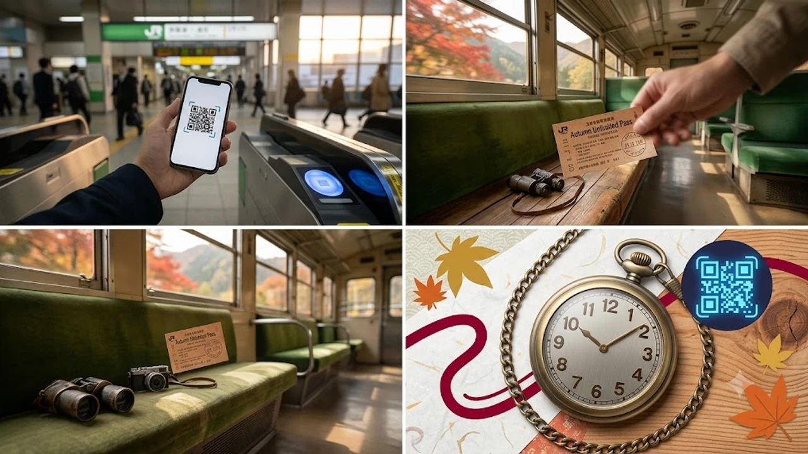

2026年9月、JRグループ各社から発表された「秋の乗り放題パス」の仕様変更は、全国の鉄道旅行ファンや訪日旅行者に大きな衝撃を与えました。従来の紙磁気券からQRコードや交通系IC連動のデジタル改札ゲート対応へと舵を切った今回のアップデートは、秋のローカル線旅のあり方を根底から塗り替える節目を迎えています。

## 2026年「秋の乗り放題パス」何が変わった？最新アップデートの全容
### 紙の磁気券からQR・タッチ対応へ進化した背景
全国のJR線で普通・快速列車の普通車自由席が連続する3日間乗り放題となる秋の定番企画乗車券ですが、2026年秋季からはスマートフォン上の専用画面やQRコード、一部主要駅での交通系IC連動による自動改札通過へと順次移行します。長年続いていた「有人改札口で駅員に日付スタンプを押してもらい、都度提示して通過する」という風情ある光景は、地方路線の無人駅拡大や主要ターミナル駅の人手不足を背景に、実務的なデジタル運用へと切り替えられました。

### 利用期間・発売期間と2026年最新の価格設定
2026年版の利用期間は10月3日（土）から10月25日（日）まで、発売期間は9月中旬から10月22日（木）までとなっています。大人運賃は7,850円、小児3,920円と前年水準を維持しつつも、システム刷新に伴いオンライン予約サイト「JRおでかけネット」や「えきねっと」経由での事前購入が基本軸に据えられました。券売機の長蛇の列に並ぶことなく、前夜にスマートフォンから決済を完了させて翌朝の始発から出発できる手軽さが確保されています。

### 有効期間「連続する3日間」のルールと注意点
青春18きっぷと異なり、「飛び石日程での利用不可」「1枚を複数人で同日に分割利用することは不可能」という原則は2026年も変わりません。金曜日に仕事を終えて出発し、土日を含めた3連休で長距離を移動する行程設計が最も投資対効果を高めます。途中下車は何度でも自由ですが、自動改札機の通信エラーやバッテリー切れが発生した場合、駅員窓口での照合に時間を要する可能性があるため、QR画面の事前スクリーンショット保管や予約番号控えの携帯が推奨されます。

## ここが変わった！従来の切符と比べた3つの大きなメリット・デメリット

### メリット1：有人改札の行列回避とスムーズな入出場
朝のラッシュ時や観光地の拠点駅では、有人通路に長蛇の列が生じて乗り継ぎ列車を逃すトラブルが日常茶飯事でした。自動改札機の読み取り部にスマートフォンをかざすだけで通過できるため、乗り換え時間がわずか3分しかない地方結節点駅でも、スムーズにホーム間を移動できる恩恵は計り知れません。

### メリット2：スマホ紛失時の再発行リスクと電波トラブル対策
従来の紙券は紛失すれば即座に旅が打ち切られ、再発行も一切認められませんでした。デジタル券化により、万が一端末を紛失・破損した場合でも、購入時のアカウントへ別端末からログインすることで権利を回復できるセーフティネットが整いました。ただし、山間部やトンネル内で通信が途絶した瞬間にアプリが再認証を要求して立ち往生する事故を防ぐため、各社アプリには「オフライン表示モード」が標準実装されています。

### メリット3：グループ旅行における個別端末必須化のハードル
複数人で旅行する際、従来の紙券であれば幹事がまとめて改札を通ることも可能でしたが、デジタルチケットへの移行によって「1人1台のスマートフォン所持」が原則求められるようになりました。修学旅行生やスマートフォンを持たない高齢者、子ども連れの家族旅行においては、事前の代理分配手続き（LINEやメール経由でのチケット送信）が必要になり、デジタル機器の操作に不慣れな層には導入初期の摩擦が生じています。移動費を極限まで削って旅を楽しむスタイルは、若年層の間で話題の[2026年最新！低消費コアが日韓の若者にウケる本当の理由](/posts/japan-trends/2026-low-spend-core-z-generation-trend-japan-korea/)とも深く共鳴しています。

## 日韓の鉄道パス比較！韓国「KORAIL Pass」との使い勝手の違い
### アプリ連動と座席指定：KORAIL Passの先進性から見るJRの課題
韓国の鉄道公社が発行する外国人向けフリーパス「KORAIL Pass（コレールパス）」は、完全アプリ完結型でKTXを含む高速列車の座席指定まで追加料金なしで1日2回まで画面上で即時予約できます。改札機自体が存在しない韓国の「信用乗車方式」と比較すると、日本は依然として駅ごとの物理改札に依存しており、チケットレスの快適さにおいては韓国側に一日の長があるのが現実です。

> **日韓フリー切符の設計思想の違い**
> - **韓国・KORAIL Pass:** 高速鉄道（KTX）の高速移動を前提とし、アプリ内で座席指定まで瞬時に完結するスピード重視型。
> - **日本・秋の乗り放題パス:** 普通列車のみでじっくり地域を巡る鈍行旅に特化し、新幹線・特急利用には原則として特急券＋乗車券が別途必要となる地域密着・低コスト型。

### 訪日外国人（インバウンド）と日本人旅行者の利便性格差
訪日韓国人旅行者の間では「日本の鈍行ローカル線旅」の情緒が根強い人気を誇る一方で、これまでの日本語窓口でのみどりの窓口引き換えは大きな障壁となっていました。今回の多言語（韓国語・英語・繁体字・簡体字）対応ウェブ販売への拡張は、地方路線のインバウンド誘致に直結します。手持ちのスマートフォン1つで地方私鉄との連絡駅をまたげる体験は、旅のハードルを一段階引き下げました。

### コスパ検証：韓国のKTX無制限パスvs日本の普通列車縛りパス
KTXパスは短時間でソウルから釜山、光州など全国の主要都市を縦横無尽に移動できる反面、価格帯は2日券で1万円台半ばを超えます。対照的に日本の秋の乗り放題パスは7,850円で3日間乗り続けられるため、1日あたり約2,610円という圧倒的な割安感を誇ります。東京から西へ普通列車を乗り継いで岡山・広島方面を目指すような「長距離・低予算の寄り道旅」を楽しむ観点では、時間対効果を超える唯一無二の体験価値を提供し続けています。

## 2026年秋の鉄道旅を最大化する購入手順とおすすめモデルルート
### モバイル・指定席券売機での最新購入ステップ
出発日当日に慌てないための購入フローは極めてシンプルに整理されています。
- 各社予約サイト（えきねっと・e5489など）に会員登録後、専用ページで「秋の乗り放題パス（デジタル版）」を選択。
- クレジットカード決済を完了させ、発行されたQRコード乗車用リンクを取得。
- 利用開始日当日は、改札機上部の光学リーダーにQR画面をかざす、または登録済みICカードをタッチして入場。
- 予備として、QRコード表示画面のスクリーンショットをローカルフォルダへ保存。

### 東海道・山陽本線の混雑を避けるローカル乗り継ぎ術
普通列車旅のボトルネックとなる熱海〜浜松間や姫路〜相生間は、通勤ラッシュ帯を避けた時間帯配置が鉄則です。特に静岡エリアを抜ける際は、混雑するロングシート車両を避け、途中の三島や沼津から沼津始発の列車を狙うことで着席確率を跳ね上げられます。また、関西圏から西を目指す場合は、新快速の有料座席「Aシート」をネット予約で併用すると、格安旅の枠組みを保ったまま快適な移動環境を確保できます。

### 3連休に合わせた紅葉スポット直撃の周遊プラン実例
東京発着であれば、初日に中央本線で甲府・松本を抜け、大糸線沿線の紅葉を眺めながら糸魚川へと抜ける日本海縦断ルートが圧巻の景観を誇ります。2日目はえちごトキめき鉄道（一部別運賃区間あり）や信州エリアのローカル線を経由して信州蕎麦を堪能し、3日目に小海線最高地点の野辺山高原を越えて首都圏へ戻る周遊コースは、鈍行列車ならではの移り変わる日本の秋を全身で体感できる王道ルートです。長旅の途中でスマートフォンをナビや切符としてフル活用するためには、高出力なモバイルバッテリーの携行が欠かせません。[秋の鉄道旅に最適な大容量モバイルバッテリーをチェックする](https://www.coupang.com/np/search?q=%EC%9D%BC%EB%B3%B8%20%EC%9D%B8%EA%B8%B0%EC%83%81%ED%92%88&sourceType=affiliate&trackingCode=AF8691300)

#日本トレンド #2026 #秋の乗り放題パス #JR #鉄道旅 #韓国比較 #KORAIL #インバウンド #旅行ハック