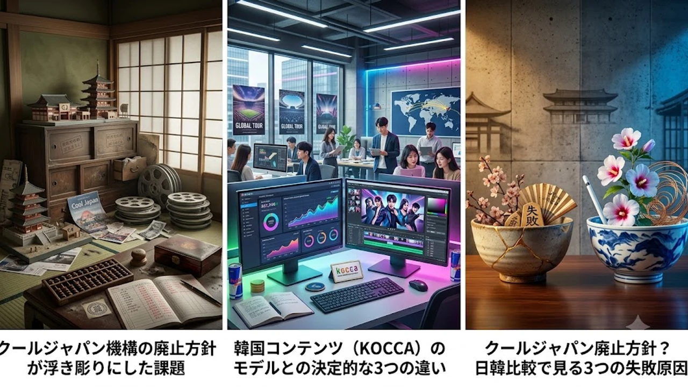

2026年8月、官民ファンド「海外需要開拓支援機構（クールジャパン機構）」について、経済産業省が来年度予算案における財政支援の見送りを固め、事実上の**クールジャパン 廃止**に向けた整理・統合に踏み切る方針が報じられました。世界屈指のアニメ・食文化といった強力なIP資産を抱えながら、300億円超の累積赤字を抱えて立ち往生した背景には、構造的な欠陥が横たわっています。世界規模のプラットフォームを席巻する韓国のコンテンツ振興モデルと照らし合わせ、その敗因と現場が取るべき活路を深掘りします。

## クールジャパン機構の廃止方針が浮き彫りにした課題

### 累積赤字と来年度予算見送りの背景
2013年の発足当時、官民一体で日本のソフトパワーを外貨獲得の柱に育てる旗印として華々しくスタートした同機構。しかし、蓋を開けてみれば出資案件の焦げ付きが常態化し、巨額の損失を垂れ流し続けました。経産省による追加資金拠出の断念は、市場原理を度外視した官製投資の限界を如実に物語る結果となりました。

### なぜ民間の海外展開を後押しできなかったのか
投資判断を下す上層部と、現場のリアルな商慣習・クリエイティブ感覚との乖離が最大の要因です。マレーシアでの百貨店プロジェクトをはじめとする巨額の「箱モノ・インフラ出資」に固執し、肝心のクリエイターや中小IPホルダーへ直接資金を届ける回路を築けませんでした。海外現地の消費トレンドを読み違えた机上のプランが、損失拡大に拍車をかけた格好です。

### ネットや経済界が受けた衝撃とリアルな反応
ニュースが駆け巡るや否や、クリエイティブ界隈や投資家層からは手厳しい本音が噴出しました。
> 「アニメーターの待遇改善や制作スタジオの設備投資には届かず、看板倒れの仲介企業ばかりが潤っていた構造こそ見直すべきだ」

実体を伴わない看板政策への失望感が露わになる中、若者の消費心理を鋭く捉えた[2026年最新！低消費コアが日韓の若者にウケる本当の理由](/posts/japan-trends/2026-low-spend-core-z-generation-trend-japan-korea/)が示す通り、真の顧客インサイトを掴めない事業は淘汰される運命にありました。

## 韓国コンテンツ（KOCCA）モデルとの決定的な3つの違い

### 官主導の投資 vs 民間主導のエコシステム育成
韓国コンテンツ振興院（KOCCA）と日本のファンドの間には、明確な設計思想の断絶が存在します。
- **日本**: 官庁が主導して出資案件を選定し、直接的な配当利益を追い求めた「投資会社型」
- **韓国**: 翻訳支援、著作権保護、見本市出展など、民間が戦うための「インフラ整備と環境設計」に徹したバックアップ型

韓国は直接のビジネス判断をCJ ENMやHYBEといった民間プレイヤーに完全委託し、政府は法整備や補助金によるリスク軽減に専念しました。この明確な役割分担が、民間企業の野心的なグローバル展開を力強く支え続けています。

### 国内市場への依存体質とグローバル前提の企画力
約1億2000万人の国内市場に安住し、「国内で回収できれば及第点」という内向き思考を引きずった日本に対し、人口約5000万人の韓国は最初から海外市場でのヒットを逆算して制作に着手します。脚本段階からの多言語展開の想定や、SNSでのファンによる二次創作を後押しする柔軟なライセンス設計など、企画の根幹から世界基準を徹底しています。

### デジタル配信・プラットフォーム戦略のスピード感
NetflixをはじめとするOTTや縦スクロール漫画（Webtoon）の台頭局面において、韓国企業は電光石火のスピードでグローバル流通網を掌握しました。独自配信プラットフォームの立ち上げに固執して資金を散逸させた日本側と比べ、オープンな国際提携を結んで世界同時配信を仕掛けた韓国勢のスピード感が勝敗を決定づけました。

## 日本のアニメ・カルチャーの現場が直面するメリットとデメリット

### 官民ファンド縮小で生じる現場への影響と自立の好機
官製ファンドの整理統合は、業界再編のトリガーとして二面性を持ち合わせています。

* **短期的デメリット**: 政府系ファンドの補助に依存していた一部のイベント事業や仲介エージェンシーは淘汰の波に晒され、事業縮小を強いられます。
* **長期的メリット**: 歪な資金循環が断ち切られ、実力派のアニメスタジオやゲーム開発会社が海外の独立系VCや配信大手と直接対等に交渉する健全な環境が整います。

### インバウンド頼みから脱却するための次なる一手
これまでの施策は、訪日観光客による「日本国内での消費」に寄りかかりすぎていました。旅先での一時的な消費に甘んじることなく、現地の消費者が母国にいながら日本の漫画やプロダクトを日常的に買い支えるクロスボーダーコマース網の再構築が求められます。作り手の思い込みに頼るのではなく、データに基づいた現地直販ルートの確立が不可欠です。

## 2026年以降の日本発コンテンツが世界で勝つための実践ロードマップ

### 海外ファンを直接惹きつけるD2C・コミュニティ戦略
中間業者を介さず、スタジオや作家がDiscordやPatreonなどのプラットフォームを通じて世界中のファンコミュニティと直結するD2C型ビジネスへの移行が加速しています。限定エディションのデジタルアイテムや制作裏話の配信を通じて濃密な熱量を育む手法は、既に一部のインディー制作集団で確かな収益を生み出しつつあります。

### 日韓共同プロデュースや越境コラボレーションの可能性
日本が誇る重厚なストーリーテリング・原画クオリティと、韓国が得意とするWebtoon形式のプロデュース力やグローバルプロモーションを掛け合わせた協業モデルが台頭しています。アジア発のIPとして欧米や中南米の巨大市場を共に攻略するアライアンスは、今後の有力な勝ち筋となります。

### クリエイター還元を最大化する持続可能なビジネスモデル構築
制作現場のクリエイターへ正当なロイヤリティが還元される契約体系を整えなければ、産業自体の寿命が尽きてしまいます。製作委員会方式の硬直化を打破し、IPの二次利用益が原画マンや脚本家へ直接還元される透明性の高いエコシステムを築くことこそが、次世代の才能を引き留める絶対条件です。

[日本発の海外人気アイテムを今すぐチェック](https://www.coupang.com/np/search?q=%EC%9D%BC%EB%B3%B8%20%EC%9D%B8%EA%B8%B0%EC%83%81%ED%92%88&sourceType=affiliate&trackingCode=AF8691300)

#クールジャパン #クールジャパン機構 #コンテンツ産業 #日本アニメ #韓国コンテンツ #KOCCA #カルチャービジネス #2026年最新