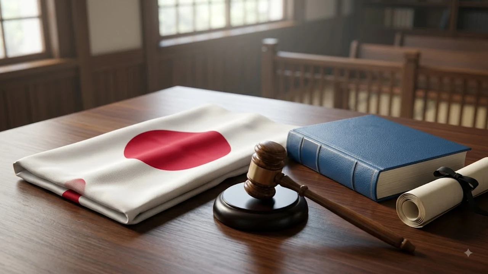

2026年8月13日、日本国内で長年議論が続けられてきた「国旗の損壊等の処罰に関する法律（通称：国旗損壊罪）」が施行の日を迎えました。**国旗損壊罪 施行 2026**というワードがSNSやニュースで急上昇する中、表現の自由への懸念や外国国旗損壊罪와의 整合性をめぐり熱い議論が巻き起こっています。今回の法改正が意味する実務上の変更点と、先行する韓国の法制度との決定的な違いを具体的事例とともに紐解きます。

## 2026年8月13日施行！「国旗損壊罪」の概要と新設の背景

### どのような行為が処罰対象になるのか？（刑罰・要件の整理）

新たに施行された法律のもとでは、日本国（日の丸）を侮辱する目的で、公然と国旗を損壊・除去・汚損した者に対し、**2年以下の拘禁刑または20万円以下の罰金**が科せられます。

* **侮辱の目的:** 単なる過失や傷んだ国旗の処分ではなく、明確な意図があるかが問われます。
* **公然性:** 不特定多数の人が認識できる状況で行われた行為に限定されます。
* **対象物:** 公的な場に掲揚されている国旗や、公然と提示された日の丸が該当します。

### なぜ今施行されたのか？法改正に至る日本国内の議論

従来の刑法第92条（外国不可侵に対する罪）は外国国旗の損壊のみを罰対象としており、自国国旗である日の丸を傷つける行為を直接取り締まる法的根拠が存在しませんでした。

この「法制度のねじれ」を正すべく、国会審議を経て2026年7月17日に法案が成立し、1ヶ月の周知期間を経て8月13日の正式施行に至りました。

### 表現の自由を守る懸念の声と弁護士会の反応

日本弁護士連合会や憲法学者からは、表現の自由（日本国憲法第21条）が萎縮しかねないとの強い警鐘が鳴らされています。

> 「政治的な抗議パフォーマンスや芸術表現までが捜査対象となりかねず、現場での運用の肥大化を防ぐ枠組みが欠かせない」

政府側は適用対象を厳格に限定する姿勢を示していますが、現場での具体的な摘発基準をめぐる警戒感は拭えていません。

## 誤解しがちな「国旗損壊罪」の真実と注意点

### 「外国の国旗」と「日の丸」で適用される法律はどう違う？

外国国旗損壊罪（刑法92条）と今回の新法は、保護する法的利益の性質が明確に異なります。

* **外国国旗:** 外交関係の維持や国家間の信義を主たる保護対象とし、外国政府からの要請を考慮する親告罪的な側面を持ちます。
* **日の丸（自国国旗）:** 国家の尊厳や象徴に対する保護を目的とした独立した特別法として成立しています。

### SNS上の画像や動画での「仮想的な損壊」は対象になるのか？

「ネット上で国旗の画像やイラストを加工・破棄した場合も摘発されるのか」という疑問が広がっていますが、本法が原則として想定しているのは**物理的な「物」としての国旗に対する行為**です。

ただし、現実の国旗を燃やす・破るといった映像を撮影しSNSで共有する行為は、公然性の条件を満たすため処罰対象となるリスクを極めて強く追うことになります。

### 一般市民の日常生活や抗議デモへの具体的な影響

祝祭日での掲揚や古くなった個人所有の国旗を通常の方法で廃棄する行為が問われることはありません。

焦点となるのは、デモ行進や街頭演説の場で、主張の強調として不特定多数の前で日の丸を引き裂くといった過激なパフォーマンス行為です。

## 韓国の「国旗損壊罪」との徹底比較

### 韓国刑法第109条（外国国旗・国章の冒涜）との違いとは？

隣国の韓国では、日本よりも早い段階から国家象徴を保護する厳格な法的枠組みが構築されてきました。

* **韓国の自国国旗冒涜（刑法105条）:** 大韓民国を侮辱する目的での国旗・国章の損壊に対し、**5年以下の懲役もしくは禁錮、または700万ウォン以下の罰金**を設定。
* **韓国の外国国旗冒涜（刑法109条）:** 外国を侮辱する目的の損壊行為に対し、**2年以下の懲役もしくは禁錮、または300万ウォン以下の罰金**を規定。

日本の新法（最大2年以下の拘禁刑）と比較すると、韓国の自国国旗損壊に対する法定刑（最大5年）は遥かに重く定められています。

### 韓国における自国国旗・外国国旗損壊の実際の処罰事例

韓国では過去、大規模集会中に太極旗（韓国国旗）を燃やした参加者が刑法105条違反で実刑判決を受けた例が複数存在します。

大使館周辺での外国国旗に対する毀損行為についても、外交トラブルの未然防止を理由に警察による迅速な身柄拘束や立件が行われてきた経緯があります。

### 法制度から見る日韓の「国家象徴」に対する認識の違い

韓国における国家象徴の強い法的保護は、歴史的背景やナショナリズムの形成過程と密接に結びついています。

対照的に日本は、戦後一貫して表現の自由や個人の権利保護を最優先に据えてきたため、2026年の今に至るまで自国国旗の法的保護に慎重な姿勢を保ってきました。こうした価値観の対比は[2026年最新！低消費コアが日韓の若者にウケる本当の理由](/posts/japan-trends/2026-low-spend-core-z-generation-trend-japan-korea/)で描かれている日韓の若者気質の差とも根底で通じ合っています。

## 今後の展望と私たちが知っておくべきポイント

### 実際に適用・摘発されるケースの具体的シミュレーション

初適用事例がどのような状況で発生するのか、法曹界でもシミュレーションが進められています。

1. **ケースA:** 街頭デモ中に日の丸を蹴る・破るなどして動画が拡散（構成要件を満たす可能性が極めて高い）
2. **ケースB:** 自宅で傷んだ国旗を切り刻んで可燃ごみに出す（侮辱の目的が存在せず非該当）
3. **ケースC:** 演劇や現代アートの文脈で国旗を意図的に変形（表現の目的と態様により個別に厳格判断）

### 海外メディア・近隣諸国からの法施行に対する反応

今回の施行を受け、欧米メディアは表現の自由への潜在的影響に懸念を示しつつも、主要国における同様の法制との比較報道を展開しています。

法運用の実態と透明性がどのように保たれるか、内外からの監視が続いています。お盆時期の様々なトレンドや国際情勢については[日本トレンド全体を見る](/posts/japan-trends/)に詳しくまとめています。

### 知らずに法に触れないために押さえておくべき3つのルール

* **ルール1:** 公の場やSNS上で、侮辱意図を持って国旗を傷つける行為には関与しない。
* **ルール2:** 不要になった国旗は公衆の目につかない場所で適正かつ静かに処分する。
* **ルール3:** 抗議活動の撮影時、違法な損壊行為を扇動・拡散させないよう留意する。

#日本トレンド #2026年 #国旗損壊罪 #法律改正 #日韓比較 #表現の自由 #時事ニュース