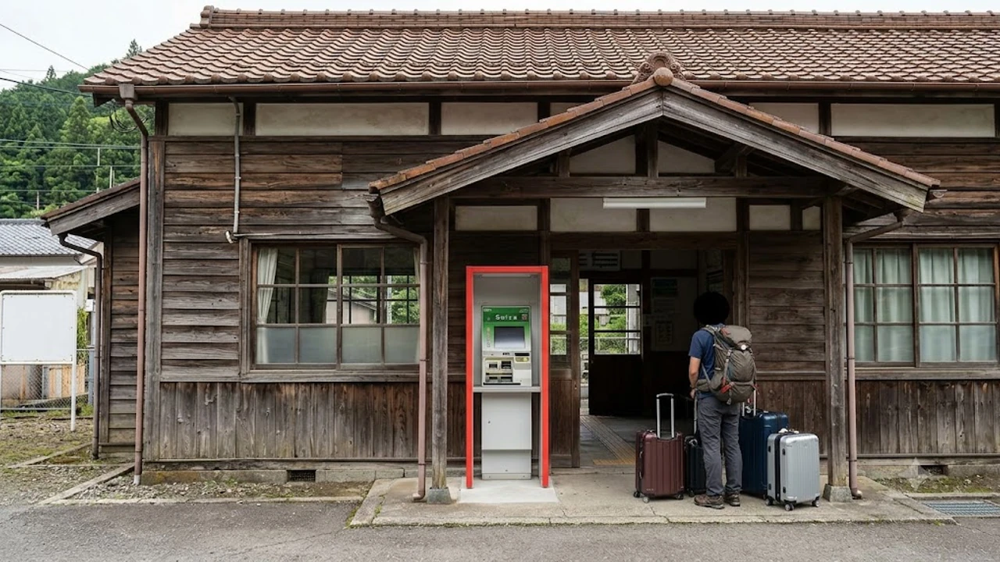

JR東日本が管轄エリア内の全駅で交通系ICカード決済を可能にする「新・どこでも改札」構想を打ち出し、鉄道界隈だけでなく旅行業界全体に大きな衝撃を与えています。これまでSuicaの導入が技術面や採算性から見送られてきたローカル線の無人駅や簡易委託駅にまでデジタル乗車インフラが張り巡らされることになり、長年続いてきた「地方路線での現金精算トラブル」が根本から解消へ向かいます。都市部の通勤利便性を支えてきた決済網が隅々まで広がることで、国内旅行やインバウンドの移動スタイルそのものが劇的に塗り替えられようとしています。

## JR東日本が発表した「新・どこでも改札」とは？2026年秋の最新発表まとめ

### 9月発表の全駅Suica化ロードマップと導入スケジュール
JR東日本が明かした整備計画によると、従来の重厚な自動改札機を設置できない小規模駅や閑散路線を対象に、2030年代初頭までに順次Suica対応エリアを拡大する方針が示されました。これまで新潟や仙台などの一部周辺にとどまっていた地方エリアの境界線を取り払い、東日本全域をシームレスなICネットワークで結ぶ巨大プロジェクトです。

### 地方無人駅・簡易委託駅に導入される超小型改札機の仕組み
今回の技術革新をもたらした主役は、クラウド処理を前提にした超小型・低コストの新型簡易改札機です。従来の駅舎設備のように高額な専用サーバーや複雑な配線工事を必要とせず、小型のポール型リーダーをホームや待合所に据え付けるだけで運用が可能になりました。

- **低消費電力設計**: 小規模な電源設備でも安定稼働する省エネ構造
- **無線通信直結**: 4G・5G通信網や地域無線メッシュを活用し、駅舎側の専用通信回線工事を大幅削減
- **メンテナンス簡素化**: モジュール交換方式を採用し、万が一の故障時にも現地での即時対応が可能

### 切符購入トラブルとチャージ難民を解消する狙い
ワンマン列車における「整理券を取って車内前方の運賃箱で小銭を支払う」という運用は、両替機の詰まりや乗務員の負担増など、運行遅延の引き金になっていました。無人駅でのタッチ乗降が標準化されれば、車内精算による停車時間のロスが激減し、定時運行率の引き上げにも直結します。

## 利用者とインバウンド観光客への影響！地方路線の移動はどう変わるか

### 訪日韓国人旅行者・国内周遊客が直面していた「地方IC非対応」の壁
大都市圏の地下鉄やJRをSuicaやモバイル端末で快適に移動してきた訪日観光客が、地方路線へ足を踏み入れた途端にICカードが使えず、窓口で長蛇の列を作ったり現金不足に陥ったりする光景は日常茶飯事でした。

> 「東京から新幹線で地方都市へ降り立ち、乗り換えたローカル線の無人駅でICカードが反応せず、車掌に現金を請求されて手持ちの日本円が尽きかけた」

こうしたインバウンド旅行者の悲鳴は、今回の全駅対応によって一掃されます。旅程の途中で切符を買い直す手間が消え去るだけで、地方の隠れた名所へのアクセスハードルは格段に下がります。

### 週末パスや青春18きっぷとの棲み分け・併用ポイント
フリーパス愛好家にとっても、Suica全駅対応は行動範囲を広げる契機となります。乗り放題切符のフリー区間外へ少し足を伸ばす際も、下車駅でそのままICタッチ精算が可能になり、乗り越し精算の煩雑さが消滅します。こうした効率的な移動スタイルの変化は、無駄な出費を徹底して削ぎ落とす[2026年最新！低消費コアが日韓の若者にウケる本当の理由](/posts/japan-trends/2026-low-spend-core-z-generation-trend-japan-korea/)で注目を集めるスマートなトラベル志向とも深く共鳴しています。

### スマホ1つで完結するチケットレス化がもたらす時短メリット
モバイルSuicaの利用が全駅で解禁されれば、チャージ残高の確認から残額補充、改札通過までがスマートフォンの画面上で完結します。駅の券売機に立ち寄る時間すら不要になり、乗り継ぎ時間の短いローカル線の移動でも列車を乗り逃すリスクを減らせます。

## 韓国の交通カード「T-money」全国共通化モデルとの比較

### 韓国全土で地下鉄・バス・タクシーまで使えるT-moneyの先進事例
隣国の韓国では、早くから全国互換IC規格が整備され、ソウル首都圏のみならず江原道や全羅道の片田舎に至るまで、同一の交通カード（T-moneyやCashbeeなど）で市内バス・農漁村バス・タクシーに至るまで乗車できる体制を確立しています。地方の停留所で現金を用意する必要が一切ない環境が定着しており、旅行者の移動ストレスフリー度において長らく日本の一歩先を走っていました。

### 日韓の交通決済インフラにおける互換性と今後の課題
日本の鉄道はJRグループ各社や私鉄各社による独立採算制を基本としているため、会社境界を越える際運賃計算やシステム連携に特有の障壁が存在してきました。JR東日本の全駅Suica化は、この縦割りの壁を崩す決定的な一手となりますが、JR他社との連絡改札や直通運転時のシームレスな残高処理には、なおシステムの標準化が求められます。

### クレジットカードのタッチ決済（EMV Contactless）との共存シナリオ
地方私鉄やバス路線を中心に導入が急加速するクレジットカードのタッチ決済（Visa・Mastercardなどのオープンループ）とSuicaの競合関係にも注目が集まります。専用ICカード不要で海外カードをそのままかざせる利便性と、Suicaの圧倒的な処理速度・普及率がどのように融合するのか、交通決済の覇権争いは新たな局面を迎えています。

## 地方路線でSuicaを賢く使いこなすための実践ガイド

### モバイルSuicaと地域連携ICカードの事前設定手順
地方路線を活用する前には、あらかじめスマートフォンのウォレット機能にSuicaをセットアップし、オートチャージの設定や一定額以上の残高確保を済ませておくのが鉄則です。東北エリアなどで発行されている「地域連携ICカード（totraやiGUCAなど）」との併用ルールも事前に把握しておくと、地域バスとの乗り継ぎも滞りなくこなせます。

### エリアまたぎ乗車時の注意点と正しい精算ルール
Suica利用時の最大の落とし穴となるのが、異なるICエリアを跨いだ長距離移動です。首都圏エリアと仙台エリア、あるいは新潟エリアをまたがってICカード1枚でそのまま在来線を通し乗車することは原則としてできません。エリア境界駅をまたぐ行程を組む際は、あらかじめ新幹線eチケット等のチケットレス特急券と組み合わせるか、境界駅での分割処理を考慮したルート選定が不可欠です。

### オフライン環境や電波微弱な無人駅でトラブルを防ぐチェックリスト
山間部や沿岸部の無人駅では、天候や地形によって通信環境が不安定になるケースが想定されます。トラブルを避けるために以下の対策を頭に入れておく必要があります。

- **乗車前のチャージ完了**: 現地でのアプリ通信不調に備え、出発前の都市部ターミナル駅で十分な残高をチャージしておく
- **入場タッチの画面表示確認**: 改札機通過時の音とディスプレイ表示を見届け、タッチ未完了エラーを見落とさない
- **簡易改札機の位置確認**: ホーム上の乗車口付近や待合所の出入口など、設置位置を素早く見つけて確実にタッチする

[日本旅行向け便利グッズをクーパンでチェック](https://www.coupang.com/np/search?q=%EC%9D%BC%EB%B3%B8%20%EC%9D%B8%EA%B8%B0%EC%83%81%ED%92%88&sourceType=affiliate&trackingCode=AF8691300)

#日本トレンド #JR東日本 #Suica #どこでも改札 #地方鉄道 #無人駅 #韓国旅行 #交通ICカード #キャッシュレス