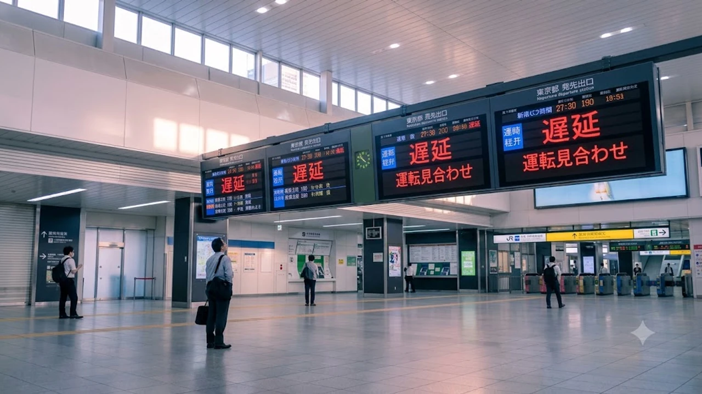

2026年8月23日未明、茨城県南部を震源とするマグニチュード5.8の地震が発生し、東京都心を含む首都圏各地で強い揺れを観測しました。夏休みの旅行シーズン真っ只中ということもあり、滞在中の訪日客や在住者の間では**地震 関東 防災アプリ**の導入やリアルタイム運行情報の確認が急務となっています。異国の地で不意の揺れに直面した際、パニックを防ぎ的確に身を守るための実践的な知識をまとめました。

## 関東でM5.8の地震発生！首都圏の交通・インフラへの影響まとめ

### 2026年8月23日未明の地震概要と揺れの規模
気象庁の観測データによると、2026年8月23日午前3時42分頃、茨城県南部（深さ約50km）を震源とする地震が発生しました。地震の規模はマグニチュード5.8と推定され、茨城県南部や栃木県南部で震度5弱、東京都23区や千葉県北西部、埼玉県南部でも震度4の明確な横揺れを記録しています。早朝の静寂を破って一斉にスマートフォンから鳴り響いた警報音に、多くの宿泊客や住民が緊迫した初動を強いられました。

### JR・私鉄各線および空港アクセスの運行・遅延状況
揺れを検知した直後、JR東日本は山手線、中央・総武線、京浜東北線など首都圏主要路線で安全確認のための徐行運転や一時運転見合わせを実施しました。成田空港へアクセスする京成スカイライナーやJR成田エクスプレスでも始発便を中心に最大30分前後の遅れが生じ、早朝便に搭乗予定だった旅行客の足元に影響が広がりました。午前7時台には全線でほぼ平常運転へ復帰したものの、各ターミナル駅では運行状況をスマートフォンで確認する外国人旅行者の姿が目立ちました。

### 余震リスクと気象庁が呼びかける警戒ポイント
気象庁の地震火山業務課は会見を開き、揺れの強かった地域では発生から1週間程度、同規模の余震（最大震度5弱程度）に警戒を怠らないよう呼びかけています。特に深夜・早朝の就寝時における避難ルートの確保や、客室内の高い場所に割れ物を置かない配慮が欠かせません。現地の最新事情やトレンドに関心のある方は、日韓の若者カルチャーの今を分析した[2026年最新！低消費コアが日韓の若者にウケる本当の理由](/posts/japan-trends/2026-low-spend-core-z-generation-trend-japan-korea/)も併せてチェックしてみてください。

## 訪日旅行者・在住者が今すぐ入れるべき必須防災アプリ3選

### 多言語対応で安心の観光庁監修「Safety Tips」
観光庁が公式に提供する外国人旅行者向けの情報配信アプリです。英語、韓国語、中国語など14言語を網羅しており、緊急地震速報や津波警報をプッシュ通知で瞬時に受信できます。

> **Safety Tipsの主な強み**
> - 現在地の状況に応じた初動フローチャートを多言語で案内
> - 外国語対応が可能な全国の医療機関をGPS連動で即時検索
> - 駅や商業施設で駅員・係員に見せて意思疎通を図る「コミュニケーションカード」

### リアルタイムの揺れ通知が最速の「特務機関NERV防災」
国内屈指の情報伝達スピードと視認性を誇る特化型アプリです。気象業務支援センター直結の専用回線を活用し、震源地・各地の震度・津波の有無を数秒単位でマップ上に描画します。日本語が読めない旅行者でも、色分けされたグラフィックによって直感的に危険レベルを識別できる完成度の高さが支持を集めています。

### 地図連動でオフライン避難所が見つかる「NHK ニュース・防災」
NHKが配信する総合情報インフラです。災害発生時の特別報道をアプリ内でリアルタイム同時配信するほか、最寄りの指定緊急避難場所をマップ上で案内してくれます。通信回線が不安定になった局面でも、キャッシュされた地図データによって徒歩での避難ルート確認を力強くサポートします。

## 日本と韓国の地震アラート・防災対応の違いとは？

### 緊急速報メール（エリアメール vs 災難文字）の発令基準
日韓両国ではスマートフォンの警報システムに明確な思想の違いが存在します。日本の「緊急地震速報（エリアメール）」は、最大予測震度が5弱以上の場合に震度4以上の強い揺れが見込まれるエリアへ極めて厳格に強制配信されます。一方、韓国の「災難文字（ジェナンムンジャ）」は気象警報のみならず行政連絡や行方不明者情報など幅広い目的で日常的に発令されるため、韓国からの旅行者は日本のけたたましい専用警報音に強いショックを受けやすい傾向があります。

### 建築基準と耐震設計に対する日韓の受け止め方の差異
日本は1981年の新耐震基準導入、そして2000年の建築基準法改正を経て、震度6強〜7クラスの揺れでも倒壊を防ぐ耐震・免震構造が一般住宅から超高層ビルまで徹底されています。韓国でも慶州地震（2016年）や浦項地震（2017年）以降に法整備が進んだものの、歴史的背景の違いから建築物の強度に対する信頼感に両国間で温度差があります。日本では「大半の建物は頑丈に造られているため、パニックになって外へ飛び出さない」ことが生存率を高める鉄則です。

### 韓国人観光客が戸惑いやすい「地震発生直後の避難行動」
韓国の一般的な防災教育では「揺れを感じたら速やかに屋外（広場やグラウンド）へ避難する」意識が強く根付いています。しかし、ビルの密集する日本の都市部で同様に飛び出すと、外壁タイルや看板、窓ガラスの破片が頭上に降り注ぐ重大な二次災害を招きます。日本のマニュアルでは「**まず頭部を守り、揺れが完全に収まるまで屋内の安全なスペースに留まる**」ことが最優先とされています。

## ホテルや街中で揺れを感じたら？旅行者のための初動アクション

### 屋内・ホテル滞在時に身を守る具体的ステップ
宿泊施設で地震に遭遇した際は、まずベッドの枕や厚手のクッションで頭を覆い、転倒のおそれがある大型家具から離れます。
- **揺れが激しい間:** 無理に移動せず、低い姿勢を維持して揺れの収束を待つ
- **揺れが収まった直後:** 客室のドアを少し開けて変形による閉じ込めを防ぎ、脱出ルートを確保する
- **避難を開始する際:** エレベーターは停電や自動停止で閉じ込められる危険があるため、必ず非常階段を使用する

### 電車内や駅ホームで揺れに遭遇した際のNG行動
走行中の車内では急ブレーキが作動するため、吊り革や手すりを両手でしっかりホールドして転倒を防ぎます。駅ホームにいた場合は中央の太い柱付近にかがみ込み、線路への転落や電光掲示板の落下に警戒を払います。乗務員や駅員の指示を待たず勝手に非常用ドアコックを操作して線路へ降りる行為は、隣接線を走行する別車両との接触事故につながるため絶対に避けてください。

### 家族・友人との安否確認に役立つ災害用伝言ダイヤルの使い方
大規模災害時は通話回線の輻輳（ふくそう）が起きるため、NTTの「災害用伝言ダイヤル（171）」や「災害用伝言板（web171）」を活用します。また、慣れない土地での万が一に備え、モバイルバッテリーや非常時の備えを整えておくことが旅の安心につながります。

[防災グッズ・ポータブル電源をクーパンで確認する](https://www.coupang.com/np/search?q=%EC%9D%BC%EB%B3%B8%20%EC%9D%B8%EA%B8%B0%EC%83%81%ED%92%88&sourceType=affiliate&trackingCode=AF8691300)

#日本トレンド #2026年 #地震 #関東地震 #防災アプリ #日本旅行 #SafetyTips #特務機関NERV #日韓比較