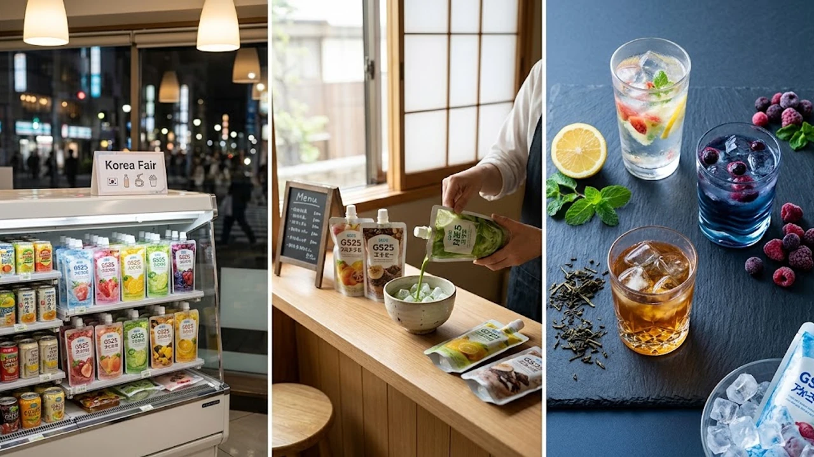

韓国旅行の醍醐味として日本のZ世代にも親しまれている韓国コンビニGS25の「氷パウチ飲料」が、2026年8月に日本国内へ本格展開される運びとなりました。専用の氷カップに豪快に注ぎ込むあの爽快なスタイルは、猛暑が続く日本市場でも大きな反響を呼んでいます。注目の販売ルートや現地流の楽しみ方、日韓のカフェカルチャーの違いまで余すところなくお届けします。

## 韓国コンビニGS25の「氷パウチ飲料」が日本上陸した背景

### 韓国旅行の定番体験が日本国内で楽しめる理由
韓国の街角でコンビニの冷凍ショーケースから氷カップを取り出し、パウチパックのコーヒーを一気に注ぎ入れるシーンは、SNSのショート動画でも定番の風景です。渡韓経験のある若年層を中心に「あの手軽なアイスドリンクを日本でも味わいたい」という熱い声が寄せられていました。今回の展開により、パスポートなしで本場のストリートカルチャーをそのまま体験できる環境が整いました。

### 2026年8月に発表された異業種コラボレーションの狙い
今回の日本展開は、国内の外食チェーン「おめで鯛焼き本舗」とのコラボレーション企画として始動しました。たい焼きなどの定番スイーツに加えて、韓国直輸入の本格ドリンクを店頭に並べることで、若年層やインバウンド層の集客を一段と引き上げる狙いがあります。日韓の食文化が交差するユニークな店頭体験として、業界内でも高い注目を集めています。

### 猛暑が続く日本の夏に刺さる大容量＆手軽さの魅力
体温を超えるような酷暑が続く日本の8月において、キンキンに冷えた氷カップへ一気に流し込むパウチドリンクは、即効性のあるクールダウンとして抜群の相性を誇ります。氷が溶けても味がぼやけない濃厚な原液設計と、片手でサッと持てるパウチの手軽さが、街歩きやフェスの強い味方となっています。

## どこで買える？販売店舗とメニューラインナップ完全ガイド

### 取り扱い対象店舗と販売開始スケジュールの詳細
日本国内の展開店舗および基本仕様は以下の通り整理されています。

- **販売拠点**: 全国の「おめで鯛焼き本舗」対象店舗（一部店舗を除く）
- **提供形式**: 専用氷カップ＋輸入パウチドリンク（セット提供）
- **展開時期**: 2026年8月中旬より順次展開開始

店舗ごとに仕入れ状況や在庫数が変動するため、来店前に近隣店舗の公式SNSなどを確認しておくとスムーズです。

### 日本展開される注目のフレーバーと価格設定
韓国GS25のプライベートブランド「YOU US（ユアス）」でも圧倒的な支持を集める王道ラインナップが揃っています。

- **アイスアメリカーノ（スイート／ブラック）**: 深煎り豆のキレと香ばしさが際立つ王道テイスト
- **ヘーゼルナッツコーヒー**: 韓国コンビニならではの甘く芳醇なナッツフレーバー
- **青ぶどうエイド / ブルーレモンエイド**: 鮮やかな発色と爽快な酸味が特徴のフルーツ系

価格帯は氷カップ付きで200円〜300円台前後に設定されており、カフェチェーンのテイクアウトと比較しても手に取りやすい設定です。

### 売り切れ前にチェックしたい購入時の注意点
> 店頭での注文時は、パウチ単体だけでなく必ず「氷カップ付き」でオーダーするのが韓国流の基本です。

氷の入ったカップを受け取ったら、パウチの切り口を丁寧に開き、氷の隙間に沿わせるようにゆっくり注ぎ入れると中身がこぼれません。週末や午後のピークタイムには人気フレーバーが品薄になる傾向があるため、早い時間帯の来店が推奨されます。

## 韓国現地で大バズり！氷パウチを120%楽しむ3つのアレンジ術

### 定番のアイスアメリカーノ＆ヘーゼルナッツの再現方法
ソウルのオフィス街で働く会社員たちの間では、ブラックアメリカーノに少量のヘーゼルナッツパウチをブレンドするカスタムが親しまれています。甘さを控えめにしつつ、ナッツの上品な風味をプラスできる実用的な飲み方です。また、市販の牛乳を少し足して即席の「ヘーゼルナッツラテ」に仕立てる裏ワザも定着しています。

### エイド系パウチ×炭酸水・お酒のミックス裏ワザ
フルーツエイド系のパウチは原液の味がしっかりしているため、割材としてのポテンシャルも非常に優秀です。

- **無糖炭酸水割り**: パウチを半分注ぎ、残りを炭酸水で満たすことで極上のスパークリングエイドが完成
- **ソジュ（韓国焼酎）カクテル**: ブルーレモンエイドに韓国焼酎を適量ブレンドし、爽やかなナイトドリンクに昇華

甘酸っぱさと炭酸の刺激が合わさり、夏のバーベキューや家飲みでも活躍します。

### SNS映えを狙う韓国Z世代流の持ち歩きスタイル
韓国のSNSでは、透明なパウチのパッケージを氷カップの横に添えて撮影するショットが定番となっています。カラフルなドリンクの色味と氷の透明感を強調した構図は、ストリートスナップとの親和性も抜群です。以前話題となった[ヨアジョン日本上陸！人気理由3選](/posts/japan-trends/2026-japan-yoajung-greek-yogurt-ice-trend/)の事例と同様に、韓国現地のリアルな飲食スタイルをそのまま楽しむ消費行動が定着しつつあります。

## 日韓コンビニ・カフェ文化の最新トレンド比較

### 日本のチルドカップ文化と韓国のパウチ氷文化の違い
日本のコンビニでは密閉されたチルドカップ飲料やドリップマシンによる淹れたてコーヒーが主流を占めてきました。一方の韓国では、パウチと氷カップを分離して販売するシステムが独自に進化を遂げました。

- **日本スタイル**: ドリップ抽出の風味や、チルド容器による品質保持を最優先
- **韓国スタイル**: 大容量かつ低コスト、氷の即効性を重視したクイックスタイル

この違いは、日韓の街歩き文化や夏の気候特性が反映された結果と言えます。

### 「安くて大容量」を求める日韓の若者消費トレンド
物価高が続く近年の社会情勢において、日韓共通で「コストパフォーマンス」と「タイムパフォーマンス」を両立した商品への需要が急速に高まっています。この背景には、[2026年最新！低消費コアが日韓の若者にウケる本当の理由](/posts/japan-trends/2026-low-spend-core-z-generation-trend-japan-korea/)でも触れられている通り、無駄な出費を抑えつつ日常に小さなトレンドを取り入れる合理的な価値観が存在します。手頃な価格でたっぷり飲める氷パウチ飲料は、まさにこのニーズを捉えたプロダクトです。

### 今後日本でも定着するか？今後の展開予測とまとめ
今回のコラボレーションを皮切りに、今後は日本の大手コンビニエンスストアやスーパーの店頭でも類似のパウチ飲料システムが採用される可能性を秘めています。単なる一時的なブームにとどまらず、猛暑期の定番リフレッシュアイテムとして日本の日常風景に溶け込んでいくか、今後の動向から目が離せません。

#日本トレンド #2026 #韓国コンビニ #GS25 #パウチドリンク #韓国トレンド #新商品 #Z世代