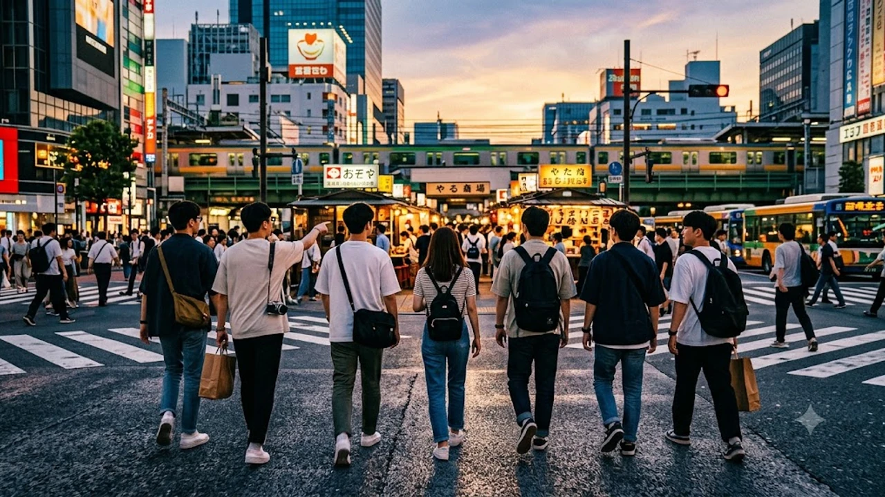

2026年秋を迎え、日本の観光地や商業施設では**訪日韓国人 トレンド**の質的な変化がより鮮明に現れています。リピーター層の増加に伴い、定番の東京・大阪・京都を巡るルートから一歩踏み込み、ローカルな体験や独自の価値を求める動きが加速しました。

## モノ消費からコト消費へシフトする韓国人旅行者の実態

かつて定番とされたドラッグストアでの大量買いや有名免税店でのブランド巡りは、旅行形態の変化に伴って落ち着きを見せ始めました。円安基調の定着や個人の嗜好の細分化を背景に、旅の目的そのものが「体験の共有」へと大きく舵を切っています。

### 地域限定カルチャーとニッチな体験型アクティビティへの没入

SNSプラットフォームでリアルタイムに共有される情報は、ガイドブックに載らない路地裏の喫茶店や職人の工房体験へと旅行者を導きます。
- 伝統工芸のワークショップや陶芸体験への直接予約
- 地方酒蔵のテイスティングツアーや酒粕スイーツ巡り
- 昭和レトロな純喫茶での限定メニュー開拓

> 「誰もが知る名所を巡る旅よりも、自分だけの日常を切り取れる空間を見つけることこそが、真の贅沢と感じられる」

写真1枚の独自性が旅の価値を決定づける時代となり、個人の感性に響くローカルスポットが選ばれています。

### 地方都市直行便の拡充がもたらす広域周遊の広がり

地方空港と韓国主要都市を結ぶLCC直行便の増便は、旅の行動範囲を飛躍的に広げました。九州や東北、四国などの地方都市に降り立ち、鉄道やレンタカーを活用して複数の街を巡る旅行スタイルが一般化しています。

交通網をスマートに活用する動きも活発で、旅の計画段階から広域パスの活用法が熱心にリサーチされています。詳しい鉄道周遊の情報は、こちらの[JR규슈 무제한 패스 총정리](/posts/japan-trends/jr-kyushu-unlimited-pass-2026/)でも確認できます。

## デジタル決済と免税手続きの完全オンライン化が変えた購買行動

旅先での決済や免税の手続きも、かつての煩雑な手続きから解放されつつあります。スマートフォン1台で完結する利便性が、現地での購買意欲を自然に後押ししています。

### モバイルウォレット連携によるキャッシュレスの日常化

韓国国内で広く普及しているコード決済やモバイルウォレットが日本の主要決済ネットワークと直接連携したことで、両替の必要性が大幅に減少しました。
- コンビニや駅ナカ店舗でのワンタップ決済
- 個人商店や屋台でのコード読み取り対応
- 為替手数料をリアルタイムで把握できる明朗な請求管理

現金を持たずに街を歩く気軽さが、小規模店舗でのちょっとした買い食いや買い物を誘発しています。

### ペーパーレス免税とスマートパスの浸透

空港での出国手続きや店舗での免税処理において、デジタルパスポート連携とQRコード認証が定着しました。レシートを何重にも貼り付けたパスポートを持ち歩く光景は過去のものとなり、カウンターでの待ち時間も劇的に短縮されています。この円滑な手続きが、帰国直前までの消費行動をストレスフリーなものに変えました。

## Z世代が牽引する日本の食・ポップカルチャー再発見

20代から30代前半の若年層は、独自の視点で日本のカルチャーを再編集し、新たなブームを生み出しています。

### 居酒屋文化の深掘りとクラフトビールの台頭

大衆酒場や立ち飲みスタイルの居酒屋に足を運び、現地の会社員に混ざって乾杯する体験が大きな人気を集めています。
- 地域限定のクラフトビールや地ウィスキーの飲み比べ
- 目の前で調理される鉄板焼きや焼き鳥の臨場感
- 日本酒のスパークリングなど新感覚のペアリング提案

気取らないローカルな空気感をそのまま味わうことが、旅のハイライトとして位置づけられています。

### アニメ・キャラクター聖地巡礼の進化系

作品の舞台となった実際の街並みを訪れる聖地巡礼は、単なる見学にとどまらず、地域全体を巻き込んだイベントへと発展しました。AR技術を活用したロケ地撮影や、コラボカフェでの限定メニュー体験など、作品世界に深く没入するコンテンツが若い世代を惹きつけています。

## 2026年後半のインバウンド消費を見据えた展望

旅のスタイルが成熟した今、訪日客が求める水準は「親切さ」から「本物の体験価値」へと移り変わっています。

### 混雑回避とサステナブルな滞在型ツーリズム

オーバーツーリズムへの配慮から、早朝や夜間の時間帯を活用した観光や、同一エリアに連泊して暮らすように過ごす滞在スタイルが支持を集めています。混雑するピークを避け、静かな朝の寺社仏閣を訪れる贅沢さを選ぶ旅行者が着実に増えてきました。

### 独自の文脈を持つセレクトショップと限定アイテムの価値

どこでも手に入る量産品ではなく、その土地、その季節、そのショップでしか手に入らない限定品への関心が高まっています。日常使いできる良質な生活雑貨や文房具、現地限定のフレーバーティーなど、暮らしに溶け込むアイテムが旅の思い出として持ち帰られています。

旅の準備や現地での快適な移動には、機能的なトラベルギアの選定も欠かせません。[관련상품 쿠팡에서 보기](https://www.coupang.com/np/search?q=%EC%9D%BC%EB%B3%B8%20%EC%9D%B8%EA%B8%B0%EC%83%81%ED%92%88&sourceType=affiliate&trackingCode=AF8691300)で旅をスマートにサポートする人気アイテムをチェックしてみるのも一案です。

#日本トレンド #訪日観光 #韓国トレンド #インバウンド2026 #キャッシュレス旅 #コト消費 #地方周遊