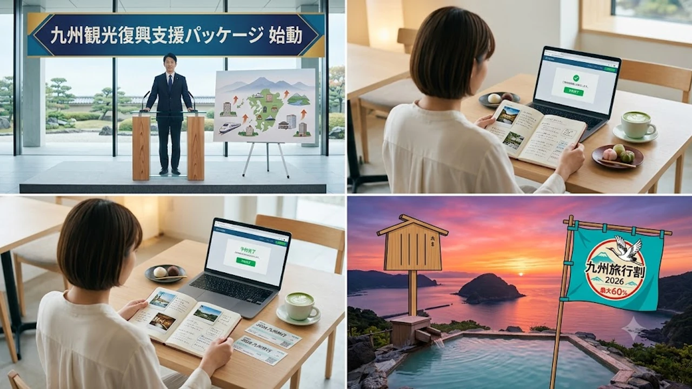

2026年8月27日に政府が閣議決定した大型支援パッケージにより、九州エリアを対象とした観光需要喚起策「九州旅行割」の具体案が動き出しました。今夏の豪雨被害や風評被害を受けた地域経済を立て直すため、最大60%規模の補助率を軸にした宿泊・交通支援が検討されています。


## 政府が発表した九州観光支援パッケージの全貌と最新動向

### 1478億円規模の予備費投入と「九州旅行割」の実施方針
政府は2026年度予算の予備費から総額1,478億円を支出し、被災地のインフラ復旧と観光振興を一体で進める方針を固めました。観光庁が主導する今回の施策では、従来の全国旅行支援とは異なり、被害の大きかった自治体へ集中的に財源を配分する傾斜配分方式が採用されます。単なる割引にとどまらず、地域商店街や交通事業者への直接的な波及効果を狙った制度設計が進められています。

### 最大60%補助が検討される対象エリアと割引率の内訳
補助率は基本枠で30〜40%、特に宿泊客の落ち込みが深刻な熊本県南部や大分県の一部エリアでは最大60%（1人1泊あたり上限1万5,000円程度）まで引き上げる案が有力視されています。

- **宿泊単体割引**: 1泊あたり最大40%補助（上限設定あり）
- **交通付き宿泊パック**: 航空機や新幹線とセットで最大60%補助
- **地域限定クーポン**: 平日利用時に上乗せ支給される電子クーポン（1人1泊最大2,000円分）

> 「被害の爪痕が残る地域ほど手厚く支援し、早期の客足回復を後押しする」（観光庁関係者）

### いつからスタート？予約開始時期と利用期間の見通し
制度の開始は2026年10月中旬を予定しており、秋の行楽シーズンおよび紅葉のピーク需要に合わせるスケジュールで調整が進んでいます。事業期間は2027年1月末（年末年始の繁忙期を除く）までを想定。各都道府県の事務局立ち上げと対象事業者の登録完了後、9月下旬より順次予約受付が解禁される見込みです。

## 過去の「ふっこう割」から読み解くお得な予約方法と注意点


### 個人手配と旅行会社ツアー予約の割引適用差
宿を直接予約する個人手配と、大手旅行代理店が造成するパッケージツアーでは割引上限枠の消化スピードが大きく異なります。新幹線や長距離バスを利用する場合、交通付きパック商品を活用した方が割引適用総額が大きくなるケースが目立ちます。一方、マイカーやレンタカーを利用した周遊旅行では、自治体発行の宿泊クーポンを組み合わせる手法が実質負担を抑える決め手となります。

### 早期完売に備えるオンライン予約サイト（OTA）の攻略ポイント
楽天トラベルやじゃらんなどの主要OTAでは、割引クーポンが配布開始から数十分で規定枚数に達する争奪戦が予想されます。

* 事前に会員登録・ログインを済ませ、決済カード情報を登録しておく
* 配布開始時刻と同時にアクセスし、即座に予約決済まで完了させる
* 予算枠が自治体ごとに追加配分される「第2弾・第3弾」の再配布日程をチェックする

### ```markdown
## プロジェクト概要と導入背景

現代のソフトウェア開発では、システムの拡張性と保守性を両立させることが最重要課題となっています。本ドキュメントでは、分散型アーキテクチャの導入におけるベストプラクティスと、実装時に考慮すべき技術選定基準を体系化して提示します。

## 主要アーキテクチャと設計方針

システム全体の整合性を保ちながら独立したデプロイを実現するため、以下の基本方針を採用します。

* **サービス間通信の非同期化**: メッセージキューを活用したイベント駆動型設計による疎結合化
* **ステートレス設計の徹底**: 水平スケーリングを容易にするためのセッション情報外部管理
* **障害分離（バルクヘッド設計）**: 単一サービスの障害が全体へ波及するのを防ぐサーキットブレーカーの導入

## データベース戦略と整合性モデル

マイクロサービス環境下におけるデータ整合性は、従来の単一トランザクションモデルとは異なるアプローチが必要です。

* **Database per Service**: 各マイクロサービスが専用のデータベースを所有し、直接参照を禁止
* **Sagaパターン**: 分散トランザクションの代わりに補償トランザクションを用いた整合性確保
* **CQRS（コマンドクエリ責務分離）**: 読み取り専用モデルと更新用モデルを分離し、参照性能を最適化


---

**관련 글**
- [ミントコアとは？2026年最新韓国ファッショントレンド徹底解](/posts/japan-trends/2026-japan-mintcore-korean-fashion-trend-guide/)
- [生活道路30km/h引き下げ完全解説](/posts/japan-trends/2026-japan-living-road-speed-limit-30km-korea-comparison/)

## デプロイメントおよび運用監視基盤

安定した運用を維持するために、オブザーバビリティの確保と自動化パイプラインの構築を行います。

* **CI/CD自動化**: コンテナイメージの自動ビルド、テスト、およびカナリアデプロイの適用
* **分散トレーシング**: OpenTelemetryを用いたリクエスト単位のエンドツーエンド追跡
* **メトリクス収集とアラート**: PrometheusとGrafanaによるリアルタイム監視と異常検知