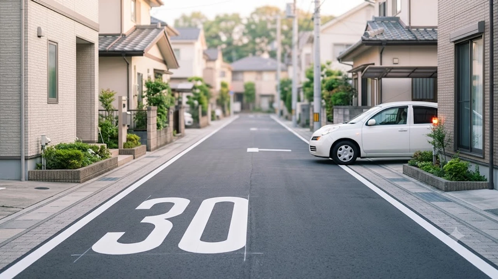

2026年9月1日より、日本の道路交通法施行令改正に伴い**生活道路 30km/h 引き下げ**が全国一斉に施行されました。中央線や分離帯がない狭い住宅街や通学路において、法定最高速度が従来の60km/hから30km/hへ抜本改定された結果、日常的にハンドルを握るドライバーにとって交通ルールの再確認が急務となっています。

## 2026年9月1日スタート！生活道路の最高速度30km/h引き下げとは？

### 60km/hから30km/hへ：道交法施行令改正の背景と目的
日本の道路交通法において、一般道路の法定速度は1960年の制定以来、原則として時速60kmのまま据え置かれていました。しかし、歩行者や自転車が混在する住宅街の生活道路では、速度超過に起因する痛ましい重大事故が絶えませんでした。

警察庁の集計データによると、自動車と歩行者が衝突した際の致死率は時速30km以下なら約1%未満にとどまる一方、時速50kmを超えると約80%以上に跳ね上がります。歩行者優先の安全な道路環境を整えるため、実に66年ぶりとなる歴史的な法定速度引き下げへと舵が切られました。

### 標識がなくても適用？対象となる「生活道路」の具体的条件
今回の改正で強く留意すべき点は、「**時速30kmの規制標識が立っていない場所でも一律に適用される**」という新ルールです。

* **幅員5.5メートル未満の道路:** 普通車同士のすれ違いが困難な狭小路
* **中央線（センターライン）が存在しない道路:** 白の実線・破線や中央分離帯がない路地
* **一方通行路を含む市街地の住宅密集路:** 車線区分が物理的に設けられていない一般道

「制限速度の標識がないから60km/hで走れる」という従来の解釈は、本日2026年9月1日をもって完全に通用しなくなりました。

### 施行初日（9月1日）から始まる警察の一斉取り締まり体制
全国の都道府県警察は、施行日である9月1日朝の通勤・通学時間帯に合わせて、可搬式オービス（移動式小型速度測定装置）を住宅街やスクールゾーンへ集中的に配備しました。

従来の固定式オービスが設置できなかった狭小路地でも、三脚型の可搬式装置を用いることで神出鬼没の測定体制が敷かれています。「見通しの悪い路地裏ほど重点監視エリアに指定されている」という前提でアクセルを踏む必要があります。

## どこからが対象？ドライバーが知るべき判定基準と注意点

### 中央線の有無で変わる！対象道路と対象外道路の見分け方
日常の運転で最も迷いやすいのが、「どこからが法定30km/hエリアなのか」という境界線の見極めです。

> **対象道路の判定基準**
> 1. **中央線（センターライン）がない道** → 標識の有無にかかわらず**一律30km/h**
> 2. **中央線がある2車線以上の道** → 標識がない場合は**従来の60km/h**
> 3. **個別の速度標識（40km/hや50km/hなど）がある道** → **標識の指定速度が優先**

道幅が比較的広く見えても、センターラインが引かれていない住宅街の道路はすべて30km/h規制の対象です。境界線を見落としたまま幹線道路から住宅街へ進入すると、あっという間に20km/h以上の速度超過に該当しかねません。

### カーナビ・マップアプリの対応状況とスピード超過リスク
現在、大手カーナビメーカーや地図アプリ（Googleマップ、NAVITIME等）は、生活道路の法定速度改定に伴うデータ更新を順次進めています。

とはいえ、全国数百万路線に及ぶ生活道路のマップデータ更新には一定のタイムラグが生じます。車載ナビ画面に旧法定速度が表示されていたり、警告音声が鳴らなかったりしても、取り締まりを受ければドライバー本人の責任に帰します。ナビの表示を過信せず、路面の白線状況を自身の目で確かめる運転姿勢が不可欠です。

### 自転車・歩行者優先ゾーンにおける過失割合の変更ポイント
法定速度の改定は、万が一の交通事故発生時における**過失割合の認定**にもダイレクトに跳ね返ります。

生活道路での対人事故では従来から自動車側の過失が重く見積もられてきましたが、今後は「時速30kmを超過していた」という事実そのものが「著しい過失・重過失」と判断される事例が急増します。損害賠償額の高騰や刑事責任の厳罰化を招くため、法的防衛の観点からも厳格な速度遵守を徹底しなければなりません。

日韓の最新トレンドや社会制度の変化については、[日本トレンド全体記事一覧](/posts/japan-trends/)でも多角的に取り上げています。

## 先行する韓国「安全速度5030」との比較で見る効果と課題

### 韓国で定着した「幹線50km/h・生活圏30km/h」政策の実績
日本の今回の施策に先駆け、韓国では2021年4月から全国規模で「**安全速度5030（안전속도 5030）**」政策を導入しています。

韓国の「安全速度5030」は、都市部の幹線道路を50km/h、生活道路や通学路（어린이보호구역）を30km/hに画一制限する制度です。韓国道路交通公団の発表によると、導入後1年間で都市部の歩行者死亡事故件数は**約36%減少**し、歩行中の重傷者数も劇的に抑制される実績を記録しました。

### 事故削減率とドライバーの不満：日韓の交通文化の違い
韓国の制度導入当初は、タクシー業界や配達ドライバーを中心に「目的地への所要時間が延びる」「深夜の閑散とした道路で一律30km/hは非効率極まりない」といった激しい反発が噴出しました。

| 比較項目 | 日本（2026年9月1日施行） | 韓国（安全速度5030） |
| :--- | :--- | :--- |
| **幹線道路の基本速度** | 60km/h（原則維持） | 50km/h（都市部一律） |
| **生活道路の基本速度** | 30km/h（中央線なし） | 30km/h（生活圏・保護区域） |
| **無人取り締まり手法** | 可搬式オービス・警察官手動 | 固定式速度カメラ・区間測定 |
| **社会的受容の経緯** | 通学路事故を契機に段階的導入 | 国家主導で全国一斉義務化 |

韓国ではその後、世論の反発を受けて深夜時間帯の一部スクールゾーンで制限速度を40〜50km/hへ緩和する実証実験を実施するなど、柔軟な見直しが進行中です。日本でも今後の運用次第で、交通の円滑性と安全確保のバランスを巡る議論が再燃する余地を残しています。

### 取り締まりカメラ（無人速度測定機）設置における日韓のアプローチ
韓国では生活道路やスクールゾーンの至る所に固定式無人取り締まりカメラが林立し、AIによる自動ナンバー認識と即時通知がシステム化されています。

一方、日本の生活道路は電柱や狭小な歩道が入り組んでおり、大型固定カメラの設置余地が極めて限られます。そのため、日本警察は**「可搬式小型オービス」の巡回運用**に大きく傾斜しています。どこで監視されているか予測がつかない日本の手法は、ドライバーに常時30km/h以下をキープさせる強い心理的抑止力として作用しています。

## 今すぐできる！生活道路30km/h化への運転対策と罰則回避法

### スピードメーターを見ずに時速30kmを維持する走行テクニック
多くの普通乗用車は、時速40〜50km前後でスムーズに巡航するようギア比やスロットルがセッティングされています。そのため、漫然とペダルを踏んでいるだけで簡単に30km/hをオーバーしてしまいます。

* **ギアを「B」「S」「低速ギア」へ選択:** エンジンブレーキを効かせ、下り坂でも自然に30km/h以下をキープ
* **スピードリミッター（ASL）機能の活用:** ステアリングの速度上限設定スイッチをあらかじめ「30km/h」に指定
* **クリープ現象の徹底利用:** 狭路や住宅密集地ではアクセルを踏み込まず、ブレーキペダルの微調整のみで進行

これらの操作を体に染み込ませれば、メーターばかりを凝視して前方不注意に陥る危険を防げます。

### ドライブレコーダーと安全運転支援アプリの最新活用法
最新型のドライブレコーダーには、GPS位置情報と連動して生活道路進入時に速度警告を発する機能が標準装備されています。自車が30km/hを超過した瞬間にアラームが鳴る設定にしておくことで、うっかり違反を未然に防ぐ手立てとなります。

スマートフォンの無料運転支援アプリでも「ゾーン30」や生活道路の速度超過を検知するアップデートが完了しています。通勤や通学の送迎で日常的に住宅街を通るドライバーは、機器の設定を本日中に見直しておくべきです。

### 速度超過時の反則金・違反点数とゴールド免許への影響まとめ
生活道路（30km/h制限）における速度超過は、免許証のステータスや家計へ重い打撃を与えます。

* **15km/h未満の超過:** 反則点数1点 / 反則金9,000円（普通車）
* **15km/h以上20km/h未満:** 反則点数1点 / 反則金12,000円（普通車）
* **20km/h以上25km/h未満:** 反則点数2点 / 反則金15,000円（普通車）
* **30km/h以上の超過:** **一発免停（6点）** および刑事処分（略式裁判・罰金刑）

わずか時速45kmで通過しただけでも15km/h超過の違反となり、ゴールド免許の喪失や自動車保険料の割引特約解除に直結します。「少し先を急ぎたい」という一瞬の油断が大きな代償につながるため、生活道路進入時のブレーキ意識を徹底して定着させましょう。

[生活道路での安全運転をサポートする最新ドライブレコーダーをチェック](https://www.coupang.com/np/search?q=%EC%9D%BC%EB%B3%B8%20%EC%9D%B8%EA%B8%B0%EC%83%81%ED%92%88&sourceType=affiliate&trackingCode=AF8691300)

#日本トレンド #生活道路 #速度制限 #道路交通法改正 #安全速度5030 #2026年施行 #交通安全 #ゴールド免許 #オービス