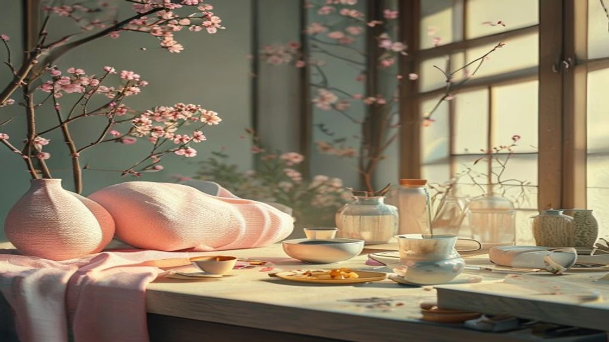
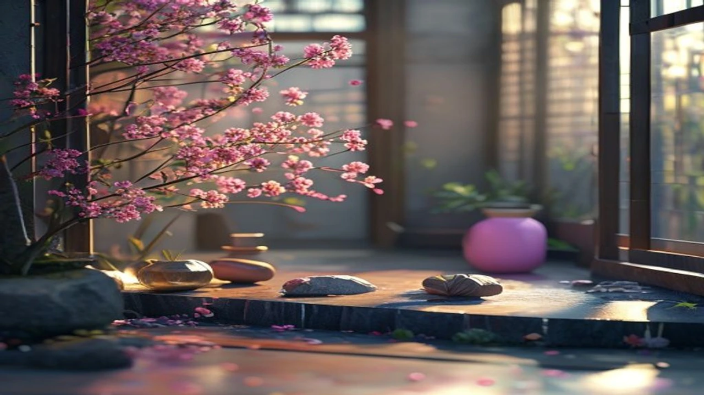

2026年7月25日、藤本タツキ原作の話題作がNHK Eテレにて地上波初放送を迎え、大きな反響を呼びました。多くのアニメファンが**ルックバック 伏線 考察**と検索を重ね、作中に散りばめられた演出やラストシーンの真意を探ろうと熱い議論を展開しています。配信サービスでの再視聴率も急上昇を見せており、本作の持つ圧倒的な表現力とストーリーテリングが改めて評価を高めています。

## 劇場アニメ『ルックバック』地上波初放送の熱狂と日韓の反響

### 地上波初放送でXトレンド1位！なぜ今これほど話題なのか

2026年7月25日20時の放送開始と同時に、X（旧Twitter）上では「#ルックバック」が国内トレンド首位を奪取しました。ファンによる歓喜の声にとどまらず、第一線で活躍するクリエイターや漫画家たちがリアルタイムで絶賛のコメントを寄せた点がきわめて特徴的です。

劇場公開時にも異例のロングランを叩き出した本作ですが、今回の地上波放送によって普段アニメを追わない層へも一気に普及しました。CMを挟まないノーカット構成というNHKの編成判断も、作品の没入感を極限まで引き上げる決定打となりました。

### 日本だけでなく韓国のファンも熱狂した理由とは？

『ルックバック』が起こした熱波は日本にとどまらず、韓国の主要コミュニティやSNSへも即座に伝播しました。

> 「言葉を超えたアニメーションの力に圧倒された」
> 「クリエイターが直面する葛藤と絶望、そして希望を描いた傑作」

韓国のZ世代を中心とするカルチャー層において、藤本タツキ作品の人気は揺るぎない存在感を誇ります。国境や言語の壁を軽々と飛び越え、「創作の苦しみと歓喜」という普遍的なテーマが強い共鳴を生み出しました。こうした価値観の共鳴を重視するトレンドは、[2026年最新！低消費コアが日韓の若者にウケる本当の理由](/posts/japan-trends/2026-low-spend-core-z-generation-trend-japan-korea/)에서도 見られる通り、現代の消費スタイル全体を貫く大きな潮流です。

## 初見では気づかない『ルックバック』作中の隠された伏線3選

### 四ノ宮タツキ（藤本タツキ）が仕掛けたタイトル『Look Back』の意味

タイトルである『Look Back』には、幾重にも重なる多角的な意味合いが組み込まれています。

* **背中を見る:** 主人公・藤野が四コマ漫画を描く際、常に crown背中を見つめ続けていた京本の目線。
* **過去を振り返る:** 過去の選択や記憶を慈しみつつ、前に踏み出すための心理的プロセス。
* **背景を描く:** 作中で京本が何よりも愛し、才能を開花させた「背景（Back）」への敬意。

これらの要素が終盤にかけて鮮やかに交錯し、タイトルに隠された真のメッセージを浮かび上がらせます。

### 季節の移り変わりと部屋の小道具に隠された感情の描写

四コマ漫画を制作するデスク周りの変化や窓外の風景は、登場人物の心情変化をどこまでも饒舌に物語ります。

| 登場アイテム | 象徴する描写・感情 |
| :--- | :--- |
| スケッチブックの山 | 泥臭い努力の蓄積と、秘めたるライバル心 |
| 雨の中のステップ | 創作の承認を得た歓喜と、生きている実感 |
| 4本目のペン入れ | 二人の絆が決定的に結ばれた瞬間の提示 |

余計な台詞を限りなく削ぎ落とし、映像とアイテムの配置のみで感情の機微を表現する手腕は、アニメーション表現のひとつの到達点と言えます。

### ラストシーンの「背中」が物語る藤野と京本の本当の関係性

クライマックスにおいて、藤野が再びデスクへ向き合い漫画を描き始める場面があります。画面に映し出されるのは、彼女の孤高な「背中」です。

すでに京本は隣に居ません。しかし藤野の背中には、京本が描き残した「あの四コマ漫画」と、二人で過ごした濃密な時間が確かに刻まれています。背中を見せながらペンを走らせる姿勢こそが、過去を抱き締めながら未来へと歩み出す絶対的な決意を証明しています。

## 原作者・藤本タツキの世界観と映画『ルックバック』の魅力

### 『チェンソーマン』とは一味違う！繊細な青春と創作のリアル

『チェンソーマン』で世界を席巻した藤本タツキ氏ですが、本作では派手なバトルを一切封印し、「生み出す人間の苦悩」へ真っ向から肉薄しています。

創作現場における焦燥感や、圧倒的な才能を前にしたときの無力感など、人間の生々しい感情が極限までリアルに穿ち出されました。この容赦ないまでの真実味が、鑑賞者の心を激しく揺さぶります。

### アニメーションとしての圧倒的な作画クオリティと表現力

押山清高監督率いるスタジオドリアンが手掛けた映像は、圧倒的な完成度を誇ります。原画の生々しい線をあえて残した作画アプローチが、手描きならではの熱量と情熱をダイレクトに伝えてきます。

キャラクターの些細な仕草や筆圧の強弱、風に揺れる髪の表現に至るまで、画面の隅々にまで生命力が吹き込まれています。

## 『ルックバック』をさらに深く楽しむためのVOD・配信情報まとめ

### 見逃し配信・再放送を今すぐ視聴する方法

地上波放送を見逃した方や、伏線を細部まで再確認したい方に向けて、主要プラットフォームでの配信が展開されています。

* **NHKプラス:** 放送終了後1週間限定で見逃し配信を提供
* **Amazon Prime Video / U-NEXT:** 劇場版のフル尺映像を高品質で配信中

背景の細かい描き込みや隠された小道具まで精査したい場合、解像度の高いVODサービスでの視聴が適しています。

### 原作コミックとアニメ版の違いを比較チェック

原作漫画（ジャンプ＋掲載）とアニメ版を見比べることで、演出の意図がより明確に浮かび上がります。アニメ版では音響設計や間（ま）の使い方が極めて精密に構築されており、無言のシーンにおける情緒が格段に高められました。

原作の持つ鋭いエッジと、アニメーションがもたらす抒情的な映像美を照らし合わせることで、『ルックバック』が持つ真価を余すことなく体験できます。

#日本トレンド #2026年 #ルックバック #藤本タツキ #アニメ考察 #地上波初放送 #映画ルックバック #韓国の反応 #アニメ好きな人と繋がりたい