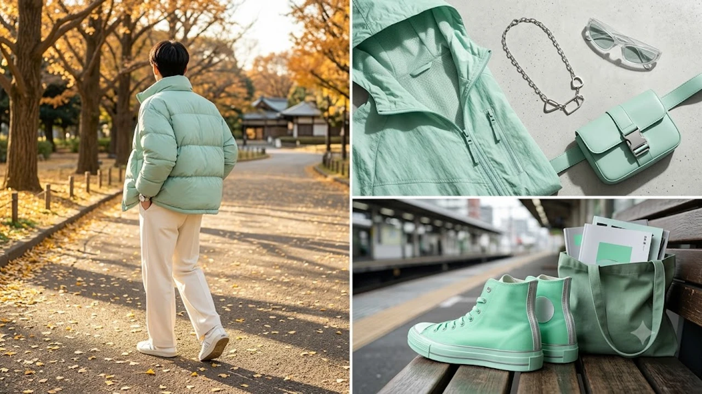

2026年秋のファッショントレンドとして、日韓のZ世代を中心に急速に注目を集めているキーワードが「ミントコア 2026」です。爽やかなパステルグリーンや深みのあるセージを基調としたこのスタイルは、単なるカラーバリエーションにとどまらず、自己表現とリラックス感を両立させる新たな着こなしとしてSNSを席巻しています。従来のストリートウェアやY2Kカルチャーと絶妙に融合し、秋のコーディネートを一新するムーブメントとして定着しつつあります。


## ミントコアが2026年秋のメイストリームに浮上した背景

### K-POPアイドルの着用とSNSでのバイラル
ソウルファッションウィークや主要音楽番組の出勤路において、人気アイドルグループのメンバーが相次いでパステルミントやセージグリーンのアイテムを着用したことがブームの発端となりました。TikTokやInstagramではハッシュタグ「#Mintcore」を冠したOOTD（本日のコーディネート）投稿が急増し、短期間で1億回以上の再生数を記録しています。視覚的な爽やかさと写真映えの良さが、デジタルネイティブ世代の心を掴みました。

### バレエコアから進化したニュートロな色彩感覚
前年に大流行したフェミニンな「バレエコア」やノスタルジックな「Y2Kスタイル」の熱気が落ち着き、次のステップとして**ジェンダーレスで涼しげなトーン**が求められるようになりました。甘さを抑えた寒色系パステルは、ガーリーな装いにもスポーティなストリートスタイルにも無理なく馴染みます。過去のレトロ感を現代的なクリーンさで再解釈する動きが、この独特な色調の支持基盤となっています。

### 若者の心理とミニマリズムへの回帰
派手なロゴや過剰な装飾で着飾るカルチャーから距離を置き、シンプルながら洗練された配色で個性を表現するライフスタイルが浸透しています。過度な買い物を控えて良質なベーシックアイテムを着回す[2026年最新！低消費コアが日韓の若者にウケる本当の理由](/posts/japan-trends/2026-low-spend-core-z-generation-trend-japan-korea/)とも思想的に共鳴しており、単なる一過性のブームにとどまらない広がりを見せています。

## ミントコアを構成する代表的なデザインと素材感


### シアー素材とテクニカルファブリックの融合
ミントコアの大きな特徴は、質感の異なる素材を同系色で重ね合わせるレイヤードスタイルにあります。
- **オーガンジーやチュール**：軽やかで透け感のあるフェミニンなニュアンス
- **リップストップナイロン**：撥水性や耐久性を備えたテックウェア要素
- **メッシュニット**：通気性に優れ、インナーとのコントラストを生み出すアクセント

これらの異素材を組み合わせることで、単色コーデであっても平坦にならず、奥行きのあるモダンなシルエットが完成します。

### メタリックシルバーやサイバー要素のアクセント
ミントグリーン単体では柔らかい印象になりがちですが、そこにシルバーの金具、リフレクター素材、クロム調のアクセサリーを加えるのが韓国流のメソッドです。どこか近未来的なサイバーパンク感をかすかに漂わせることで、ストリートライクでエッジの効いた佇まいに仕上がります。

### ジェンダーニュートラルなオーバーサイズシルエット
身体のラインを強調しすぎない、ゆったりとしたボックスシルエットのシャツやカーゴパンツが主流です。性別を問わずに共有できるユニセックスなサイジングが基本であり、男女カップルでリンクコーデを楽しむスタイルとしても選ばれています。

## 失敗しないミントコアのデイリー実践コーディネート術

### 初心者向け：モノトーンベースの差し色テクニック
全身をミントカラーで固めるのに抵抗がある場合は、ホワイト、ライトグレー、ブラックを基調としたスタイリングに1点だけ投入するのが鉄則です。
> **着こなしの黄金比率**
> 全体のベースカラーを70〜80%（ホワイトやグレー）、ミントグリーンを20〜30%（トップスまたはアウター）に抑えると、清潔感を損なわずに旬のバランスが手に入ります。

例えば、白のワイドスラックスに淡いミントグリーンのショート丈カーディガンを羽織るだけで、こなれた韓国ストリート感が演出できます。

### 上級者向け：トーンオントーンのグラデーション配色
ペールミント、深みのあるピスタチオ、くすんだセージグリーンといった異なる濃淡を1つのコーディネートに落とし込む高度なテクニックです。足元にボリューム感のあるホワイトスニーカーを合わせると、全体のカラーバランスが引き締まり、都会的なストリートモードへ昇華されます。

### 小物から取り入れるアクセサリー・バッグの選び方
洋服で取り入れるハードルが高いと感じるなら、日常使いのグッズから試してみるのが賢い```markdown
作成したい文章や構成の具体的なテーマ、内容をご指定ください。指示に基づいた完成本文を作成します。