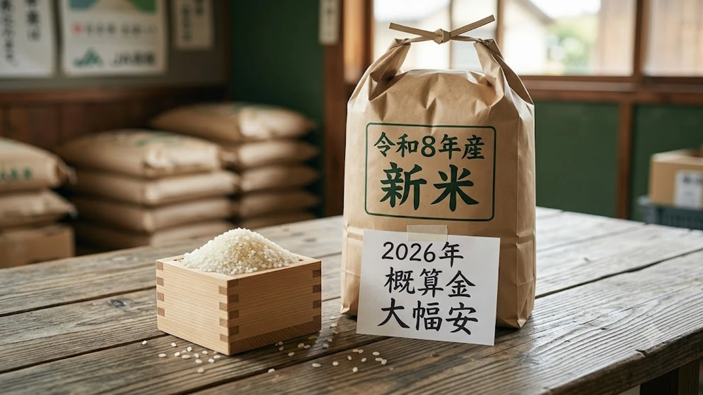

2026年産の**新米 価格 2026**年動向に大きな地殻変動が起きています。全国の産地で公表された概算金が前年比で一気に下落に転じ、食費高騰に頭を抱えていた消費者の間では「いつスーパーの店頭価格が安くなるのか」という期待が急速に高まりました。流通現場の最新データと日韓の食卓防衛策を照らし合わせながら、最適な買い時と家庭での自衛術を深掘りします。

## 2026年産新米の概算金が急落した背景と要因

### 2025年の米騒動から一転した生産・流通動向
2025年夏に列島を襲った深刻なコメ不足と価格高騰は、棚から主食が消える事態を招きました。しかし2026年の作柄は順調に推移し、全国的な作付面積の回復と天候の安定によって、端境期の供給不安は急速に解消へ向かっています。市場が「不足」から「適正供給」へとシフトしたことで、卸売業者や量販店による買い占め行動は沈静化しました。

### 全国主要産地における概算金引き下げの決定打
JAグループや全農が生産者に前払いする「概算金」は、前年の歴史的高値設定から一転し、主要銘柄で前年比30〜40％前後の引き下げが相次ぎました。
* 早場米産地での出回り初期から価格調整が先行
* 外食チェーンの買い控えによる過剰在庫リスクを警戒した価格設定
* 前年の高値で米離れを起こした一般家庭への販売促進を最優先する判断

産地側としても、高値維持によって顧客を完全にパンや麺類に奪われるシナリオを回避するため、現実的な水準へと舵を切らざるを得ない状況が生じています。

### 外食・中食業界と一般家庭への供給バランスの変化
コンビニや外食大手は、前年の高値期に複数年契約や輸入米ブレンド、冷凍米飯への切り替えを進めました。その結果、新米の引き合いは一般小売り向けに集中する形となり、卸価格の上値を抑える力学が働いています。日々の節約志向を高める若年層の間では、無駄な支出を徹底的に削る[2026年最新！低消費コアが日韓の若者にウケる本当の理由](/posts/japan-trends/2026-low-spend-core-z-generation-trend-japan-korea/)のようなライフスタイルが定着しており、主食費の引き下げ圧力は依然として強力です。

## スーパーの店頭価格はいつ下がる？時期と価格差のシミュレーション

### 8月下旬の早場米と9〜10月主力銘柄の価格推移予測
スーパーの店頭に並ぶ価格が実際に目に見えて落ち着くのは、**9月中旬から10月上旬**にかけての全国主力銘柄（コシヒカリ、あきたこまち等）の本格入荷時期です。8月下旬に出回る早場米はまだ流通量が限られるため高値が残りますが、東北・北陸産の大規模流通が始まる9月下旬以降に一気の価格是正が進みます。

### 5kg・10kgあたりの実売価格と昨年のピーク時比較
前年のピーク時には5kgあたり3,000円〜3,500円超まで跳ね上がった標準的な白米銘柄ですが、2026年秋の店頭価格は5kgあたり**2,100円〜2,400円前後**のレンジへ落ち着く見通しです。10kg袋であれば4,200円〜4,600円台での特売が復活し、家計への負担は前年比で約3割軽減されます。

### 安売りのタイミングを見極める売り場チェックのコツ
* 9月第3週以降の各スーパーのチラシ特売枠（新米入荷セール）をチェック
* 精米年月日が1週間以内のロットが大量陳列され始めたタイミングを狙う
* プライベートブランド（PB）米の価格改定スピードに注目する

## 日韓比較で見る「主食の米消費」と物価防衛策の違い

### 韓国の米消費量減少対策・政府介入モデルとの比較
韓国でも1人あたりのコメ年間消費量が急減しており、市場価格が暴落した際には政府による公共備蓄米の買い入れ（市場隔離措置）が即座に発動されます。日本がJAの概算金や民間主導の需給調整に依存する割合が高いのに対し、韓国は法制化された直接介入で農家所得と店頭価格の下限を守る傾向が顕著です。

### レトルトパックご飯・冷凍ご飯の需要変化とコスト対決
日韓両国で共通して伸びているのが、即席パックご飯（韓国の『ヘッパン（햇반）』に代表される無菌包装米飯）の日常利用です。単身世帯の増加に伴い、「自分で炊いて余らせるよりも、まとめ買いしたパックご飯のほうが光熱費や廃棄ロスを含めたトータルコストが安い」という判断が定着し、白米袋買いの需要を一部侵食しています。

### 若年層のパン・麺シフトと「米離れ」がもたらす長期的な影響
朝食のパン化や簡便な麺類へのシフトは不可逆的に進んでおり、米価が多少下がったとしても以前の消費水準には戻らない構造的問題が存在します。主食の多様化は、日本と韓国の農業政策および食料自給率の維持において共通の難題として横たわっています。

## 失敗しない2026年新米の選び方と長持ち保存マニュアル

### 銘柄別の特徴とコスパに優れたおすすめ新米3選
* **あきたこまち**: もっちり感と価格のバランスが良く、日常使いのコスパが最高水準
* **ななつぼし**: 粒立ちが良く冷めても美味しい、弁当や作り置きに最適な万能銘柄
* **ふさこがね**: 早場米としても流通が早く、粒が大きめで食べ応え抜群の節約派向け銘柄

### 猛暑・残暑でも味が落ちない冷蔵・密閉保存テクニック
8月末から9月にかけての厳しい残暑では、常温保存による米の酸化やコクゾウムシの発生リスクが跳ね上がります。購入後は密閉容器やジッパー付き保存袋に移し替え、**冷蔵庫の野菜室**で保管するのが鮮度を保つ鉄則です。空気に触れる面積を最小限に抑えることで、新米特有の瑞々しい風味を1ヶ月以上保てます。

### まとめ買いvs都度買い！家計を守るスマートな購入戦略
価格が下がったからといって10kgや20kgを一度に買い込むのは、秋口の高温多湿環境では劣化を早める原因になります。単価が下がり切る10月までは5kg単位で都度購入し、冷暗所または冷蔵保管を徹底するのが最も無駄のない食費防衛策です。

[関連商品をチェックする](https://www.coupang.com/np/search?q=%EC%9D%BC%EB%B3%B8%20%EC%9D%B8%EA%B8%B0%EC%83%81%ED%92%88&sourceType=affiliate&trackingCode=AF8691300)

#日本トレンド #2026 #韓国 #新米価格 #米騒動 #物価対策 #食費節約 #ライフハック