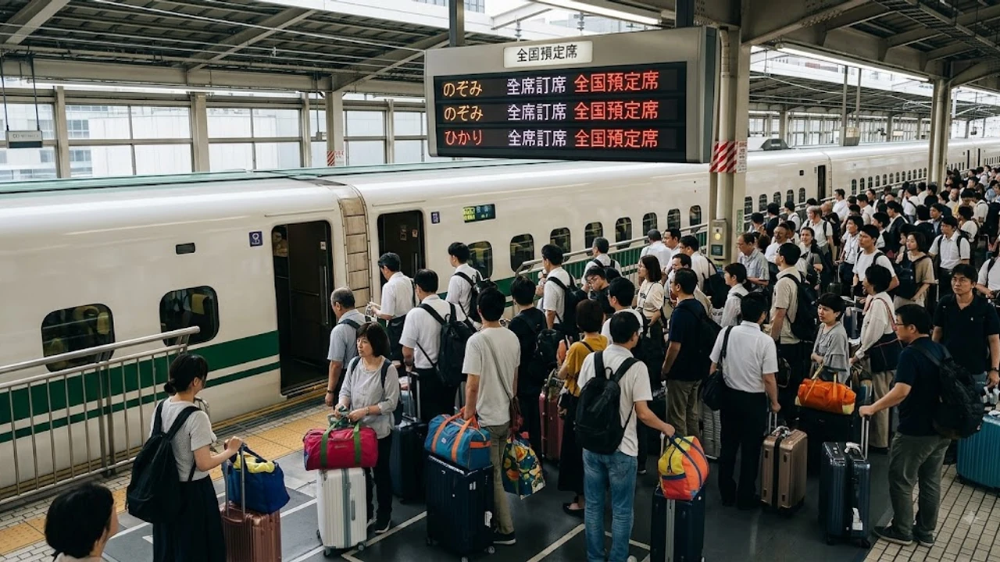

# 2026 오봉 귀경 혼잡 피크! 한일 명절 이동 3가지 차이 분석

2026년 8월 16일, 일본 열도 전역의 고속도로와 주요 철도역에서 **오봉 U턴 러시(귀경길)** 혼잡이 극에 달했습니다. 연휴 종반을 맞은 교통망은 도카이도·산요 신칸센의 '노조미' 전석 지정석화 조치와 주요 고속도로 상행선의 정체가 겹치며 극심한 피로도를 보였습니다. 

일본의 오봉 연휴는 한국의 추석 대이동과 비견되지만, 세부적인 교통 정책과 사회적 풍경에서는 뚜렷한 차이를 드러냅니다. 2026년 오봉의 실시간 혼잡 지표와 더불어 한일 양국의 귀성 문화를 데이터와 현장 상황을 바탕으로 정밀 분석합니다.

---

## 2026년 오봉 U턴 러시 현장과 신칸센 전석 지정석 제도의 명암

### '노조미' 전석 지정석화가 바꾼 승강장 풍경
JR도카이와 JR서일본은 2024년부터 명절 성수기 도카이도·산요 신칸센 '노조미' 호의 자유석을 폐지하고 16량 전 차량을 지정석으로 전환했습니다. 2026년 8월 9일부터 18일까지 열흘간 이어진 이번 집중 운용 기간에도 도쿄역과 신오사카역 플랫폼의 극단적인 대기 줄은 체감상 크게 줄었습니다. 200%를 넘나들던 자유석 승차율과 승강장 바닥에 주저앉아 대기하던 모습은 과거의 일이 되었습니다.

그러나 부작용도 만만치 않습니다. 승차 당일 스마트폰 앱(스마트EX)을 통한 취소표 경쟁이 치열해지면서, 표를 구하지 못한 이들이 개찰구 주변에 머무는 병목 현상이 발생했습니다. 특히 8월 15일 오후부터 16일 전 시간대에 걸쳐 도쿄 방면 상행선 노조미 지정석은 100% 매진을 기록했고, 예약 실패자들은 울며 겨자 먹기로 각역 정차 열차인 '고다마'나 자유석이 남아 있는 '히카리'로 몰려 승차 시간이 1.5배 이상 늘어났습니다.

### 고속도로 상행선 40km 이상 정체와 통과 시간 급증
일본도로교통정보센터(JARTIC) 집계에 따르면, 8월 15일 오후 4시경 도메이 고속도로 상행선 아야세 스마트IC 인근을 선두로 시작된 정체는 야마토 터널을 지나 에비나 서비스에어리어(SA)까지 약 42km에 달했습니다. 간에쓰 자동차도 고사카 IC 부근에서도 38km의 극심한 정체가 발생해 평소 1시간 안팎이던 구간 통과 시간이 3시간 40분까지 늘어났습니다.

특히 주요 휴게 시설의 진입 대기 차량이 본선 주행 차로까지 침범하는 현상이 속출했습니다. 에비나 SA 상행선의 경우 주차 구획 진입에만 45분이 소요되었으며, 충전 시설 부족으로 전기차(EV) 이용자들의 대기 행렬이 2시간을 넘기는 등 충전 병목이 새로운 정체 유발 요인으로 대두되었습니다.

### 기상 이변과 다이어 혼란의 상시화
8월 중순의 고온 다습한 기후와 국지성 호우는 이동 계획을 교란하는 상수가 되었습니다. [2026년 오봉을 직격! 태풍 15호 진로와 3가지 운휴 대책](/posts/japan-trends/2026-japan-typhoon-15-obon-traffic-impact-korea/)에서 지적된 바와 같이, 이번 연휴 역시 도호쿠 및 호쿠리쿠 방면의 게릴라성 폭우로 인해 일부 재래선 특급 열차가 서행 운전을 반복했습니다. 항공편 또한 하네다 공항 출발·도착 편에서 30편 이상의 지연이 발생해 귀경객들의 피로를 가중시켰습니다.

---

## 한일 '민족대이동' 비교: 3가지 핵심 차이점

### 차이 1: 휴가 분산도와 열차 예매 시스템의 구조적 차이
일본의 오봉은 법정 공휴일이 아니며 기업별 취업규칙이나 하계 휴가 제도를 통해 자율 운영됩니다. 제조업 공장은 8월 둘째 주 전체를 쉬는 반면 금융업이나 서비스직은 13일부터 16일까지 4일간 압축해 쉬는 등 출발과 복귀 날짜가 1주일 안팎으로 분산됩니다. 신칸센 예약 역시 승차 1개월 전 오전 10시부터 좌석이 열려 순차적 수급 조절이 이루어집니다.

반면 한국의 추석은 음력 8월 15일을 전후한 3일간의 법정 공휴일과 대체공휴일이 국가 단위로 묶여 전 국민이 동일한 날짜에 동시에 이동합니다. 코레일(KTX)과 SR(SRT)의 명절 예매는 특정일 새벽 7시에 접속자 수십만 명이 몰리는 '피켓팅' 구조입니다. 단 1~2초 차이로 대기 순번이 1만 번대로 밀려나며 완판되는 시스템 특성상 이동 수단 확보 단계부터 국민적 긴장도가 훨씬 높습니다.

### 차이 2: 명절 의례의 축소 양상과 레저화 속도
일본의 오봉은 조상의 영혼을 맞이하고 배웅하는 '하카마이리(성묘)'가 중심이지만, 2020년대 들어 종교적 색채는 급속히 옅어졌습니다. 도쿄 도내 거주 30·40대 가구의 경우 귀성 대신 홋카이도나 오키나와 등 국내 휴양지로 향하거나 서머소닉 등 대형 록 페스티벌에 참여하는 레저 수요가 전체 이동의 30%를 넘어섰습니다.

한국도 차례(제사)를 생략하는 가정이 급증했으나 여전히 양가 부모 방문이라는 사회적 책무가 강하게 작용합니다. 명절 연휴 인천국제공항 이용객이 일평균 20만 명을 돌파하며 해외 도피 행렬이 이어지는 한편에서도, 수도권에서 영호남으로 향하는 지방 귀성 행렬은 견고하게 유지됩니다. 송편을 빚고 차례상을 차리는 노동은 밀키트나 완제품 제수음식으로 대체되는 추세이나, 친족 회동 자체를 건너뛰는 비율은 일본보다 현저히 낮습니다.

### 차이 3: 고속도로 통행료 정책과 수요 관리의 반대 방향
도로 정책에서 양국의 철학은 정반대로 갈립니다. 한국 정부는 2017년부터 명절 연휴 기간 전국 고속도로 통행료를 전액 면제하고 있습니다. 이는 국민 교통비 절감이라는 복지 차원의 접근이지만, 자가용 이용 유인을 극대화해 경부고속도로와 서해안고속도로의 극심한 정체를 만성화시키는 원인이 됩니다. 서울에서 부산까지 평소 4시간 30분 걸리던 거리가 명절에는 8~9시간으로 늘어납니다.

반면 일본은 정반대 정책을 취합니다. 동일본·중일본·서일본 고속도로(NEXCO 3사)는 오봉과 골든위크 기간에 주말·공휴일 통행료 30% 할인 혜택을 전면 제외합니다. 통행료 할인을 없애 자가용의 도로 진입을 억제하고 대중교통 이용을 유도하는 수요 관리 방식을 채택하고 있습니다. 도쿄-나고야 편도 통행료가 약 7,000엔을 웃돎에도 정체가 완전히 해소되지는 않으나, 수요 왜곡을 방지하려는 의도가 명확합니다.

---

## 정체 구간 탈출을 위한 현실적 실천 지침

### 4시간을 아끼는 시간대별 분산 이동
고속도로 상행선의 정체 피크는 낮 12시부터 저녁 9시 사이에 집중됩니다. 8월 16일 데이터를 역산하면, 오전 5시 이전에 관동권 주요 분기점(도메이 에비나, 간에쓰 다카사키 등)을 통과하거나 밤 11시 이후 출발하는 일정을 택했을 때 이동 소요 시간이 주간 대비 평균 42% 단축되었습니다. 

아이를 동반한 장거리 차량의 경우, 전날 밤 9시경 출발해 휴게소에서 쪽잠을 청한 뒤 새벽 4시에 주행을 재개하는 방식이 피로도를 낮추는 주효한 경로로 꼽힙니다.

### 지정석 확보 실패 시 우회 루트 구축
신칸센 전석 매진 시 현장에서 취소 표만 기다리는 것은 시간 낭비입니다. 도쿄-오사카 구간의 경우 다음과 같은 우회 경로가 실질적인 대안이 됩니다.

* 호쿠리쿠 신칸센 우회: 쓰루가역까지 특급 썬더버드를 이용한 뒤 호쿠리쿠 신칸센으로 환승해 도쿄로 진입하는 루트 (이동 시간은 4시간 30분으로 늘어나나 좌석 잔여율이 높음)
* 재래선 특급 조합: 나고야에서 특급 시나노를 이용해 나가노 방면으로 진입 후 신칸센 환승
* 심야 고속버스 캔슬 티켓: 승차 전날 오후 6시부터 당일 정오 사이에 발생하는 비즈니스석 취소분 집중 공략

스마트폰의 환승 안내 앱(조르단, 야후 노선정보) 알림 설정을 15분 간격으로 갱신하며 임시 열차(임시 노조미)의 잔여석을 확인하는 작업이 필수적입니다.

---

## 2026년 이후 가속화되는 귀성 트렌드의 변화

### '귀성 거부'가 아닌 '역귀성'의 표준화
교통 체증과 비용 부담에 지친 20·30대 직장인들을 중심으로 지방에 거주하는 부모가 대도시로 역이동하는 '역귀성'이 정착되고 있습니다. 수도권 호텔의 패밀리 룸 패키지 예약률은 전년 대비 18% 증가했으며, 하행선 좌석 여유와 호텔 프로모션을 결합해 이동 비용을 40% 이상 절감하는 실속형 선택이 확산되는 양상입니다.

### 디지털 기술을 활용한 가상 성묘와 연휴 쪼개기
고령화와 지방 인구 감소가 가속화된 일본에서는 사찰이 관리하는 납골당의 온라인 원격 참배(VR 묘참) 이용자가 전년 대비 25% 늘어났습니다. 기업들의 휴가 사용 장려 정책과 맞물려 8월 오봉 기간에는 정상 근무를 하고 9월이나 10월 비수기에 대체 휴가를 사용하는 '시차형 분산 휴가'를 도입한 IT 기업도 35%를 넘어섰습니다.

명절 대이동은 관습적인 혈연 행사를 넘어 개인의 시간과 비용을 최적화하는 방향으로 급격히 재편되는 중입니다. 정체 데이터와 제도의 차이를 이해하는 것이 곧 연휴의 피로도를 결정짓는 핵심 기준입니다.

---

#오봉 #오봉야스미 #U턴러시 #신칸센 #혼잡정보 #귀성정체 #일본여행 #추석 #일본트렌드