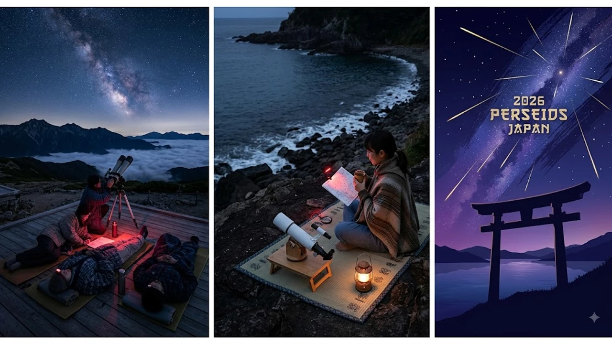

2026年8月12日夜から13日未明にかけて、夏の一大天体ショーである**ペルセウス座流星群 2026**が極大を迎えます。今年は新月のタイミングと完璧に重なるため、月明かりの邪魔が入らない「過去最高クラスの好条件」で夜空を観賞できる見込みです。流星のピーク時間帯や観測に最適な方角を事前に把握し、特別な夜を最大限に楽しみましょう。

## 2026年ペルセウス座流星群が最高の条件で到来する理由

### 新月と重なる奇跡の夜！月明かりゼロの観測環境
2026年のペルセウス座流星群が天体ファンから大きな注目を集めている最大の要因は、月齢にあります。流星観測において最大の障害となる「月明かり」ですが、2026年8月13日はちょうど新月に該当。月がまったく出ない暗闇の夜空が広がるため、普段なら光に埋もれてしまう微かな流れ星まで肉眼でくっきりと捉えられます。

### 1時間に数十個が見える？2026年の流星数の予測
国立天文台の事前予測によると、街灯などの人工的な光が少ない暗い場所で観測した場合、**1時間あたり40個から60個程度**の流星が観測できると見込まれています。条件が今一つだった前年と比較しても、流星の視認しやすさは段違い。数分間夜空を見上げているだけで、次々と流れ星が横切る幻想的な光景に出会える確率が高まっています。

### 8月12日夜〜13日未明のピークタイム詳細
最も流星が出現する「極大時刻」は、8月13日午前3時前後と予測されています。したがって、観測に最適な時間帯は**8月12日の23時頃から13日の明け方（4時頃）まで**。特に放射点が高く上がる深夜2時以降は、空全体に流星が走りやすくなる絶好のタイムスケジュールとなります。

## 失敗しない流星群の観測ポイントと方角の探し方

### 方角はどちら向き？効率よく見つけるためのコツ
ペルセウス座流星群という名称がついていますが、「ペルセウス座のある方角だけを見つめていれば良い」というわけではありません。流星はペルセウス座付近にある放射点を中心に、**空全体へ放射状に飛ぶ**のが特徴です。そのため、特定の方角に拘るよりも、空が開けていて広範囲を見渡せる場所を選ぶことが成功の鍵を握ります。東の空を中心に、なるべく全体をぼんやり眺めるのがコツです。

### 街灯やスマホの光を避ける！目を慣らすための注意点
人間の目が暗闇に順応するには、少なくとも15分から20分ほどの時間が必要です。観測スポットに到着したら、まずはスマートフォンの眩しい画面を見るのをやめ、暗闇に目を慣らしましょう。
> **観測時のワンポイント**：スマートフォンの画面や懐中電灯の強い光を直接見ると、目が暗闇に慣れるまでの時間がリセットされてしまいます。赤色LEDライトを使用するか、画面の明るさを極限まで下げて利用するのが賢明です。

### 都心部からアクセスしやすいおすすめ星空スポット
都心部に住んでいる場合でも、少し郊外へ移動するだけで星空の美しさは劇的に変わります。関東圏であれば長野県の野辺山高原や埼玉県の秩父エリア、関西圏であれば奈良県の吉野山や兵庫県の六甲山などが人気の観測地です。最近では、余計な費用をかけずにレジャーを楽しむスタイルが定着しており、お金をかけずに感動を味わえる星空観測は若者の間でも一大トレンドとなっています。こうした賢いライフスタイルに関心がある方は、[2026年最新！低消費コアが日韓の若者にウケる本当の理由](/posts/japan-trends/2026-low-spend-core-z-generation-trend-japan-korea/)もあわせてチェックしてみてください。

## スマホ・カメラで流れ星を綺麗に撮影する徹底手順

### ナイトモードやタイムラプス機能を使いこなす設定術
最新のスマートフォンには高性能な夜景撮影モードが搭載されています。iPhoneやAndroidの「ナイトモード」を使用し、露出時間を長め（3秒〜10秒）に設定することで、肉眼では捉えきれない流星の光線も写真に収めやすくなります。また、「タイムラプス機能」を活用して1時間ほど連続撮影を行い、後から流星が映っているコマを探す手法も効果的です。

### 一眼レフ・三脚を使った本格撮影の必須テクニック
より本格的な写真を残したい場合は、一眼レフやミラーレスカメラの導入がおすすめです。
* **レンズ**: 広角レンズ（14mm〜24mm程度の明るい単焦点またはズーム）
* **F値**: 開放（F1.4〜F2.8推奨）
* **ISO感度**: 1600〜6400
* **シャッタースピード**: 10秒〜20秒
* **三脚**: 手ブレを防ぐため頑丈な三脚への固定が必須

これらをマニュアルモードで設定し、インターバル撮影（連続自動撮影）を行うのがセオリーとなっています。

### 防虫対策と熱中症予防！夏の夜間観測に必要な準備物
夏の夜間とはいえ、長時間じっと屋外に佇んでいると想像以上に体力を消耗します。特に山間部や海岸沿いでは虫が多く発生するため、長袖の羽織ものや虫除けスプレーは必須アイテムです。また、夜間でも湿度が高い日本の夏は熱中症のリスクが存在するため、水分補給用の飲料やレジャーシートを準備し、リラックスした体勢で観測に臨みましょう。

## 韓国でも大注目！日韓で楽しむ夏の夜空レジャートレンド比較

### 韓国で人気の星空観測スポット（江原道・江陵など）
日本だけでなく、隣国の韓国でも「ペルセウス座流星群」に対する関心は年々高まりを見せています。ソウル近郊からアクセスしやすい江原道（カンウォンド）の江陵（カンヌン）エリアや、星が綺麗な「鞍基峰（アンギボン）」などは、韓国の天体ファンが集う聖地として有名です。

### 日韓のZ世代がハマる「星空キャンプ」とSNS映え文化
日韓の若者の間では、豪華なホテルに泊まる代わりに静かな自然の中で夜空を眺める「星空キャンプ」や「車中泊（韓国でいうチャバク）」が大流行中。撮影した美しい流星の写真をInstagramやTikTok、XなどのSNSに投稿し、ハッシュタグでリアルタイムの出現状況を共有し合う文化は両国で共通したトレンドとなっています。

### 旅先で夜空を見上げる！日韓交流の新しい楽しみ方
国境を越えて同じ夜空を見上げる天体観測は、国籍を問わず感動を共有できる素晴らしいレジャーです。夏休みの旅行シーズンを利用して渡航する旅行客にとっても、現地での夜間アクティビティとして流星群観測は注目を集めています。その他の最新ニュースやトレンド一覧に興味がある方は、[日本トレンド全体 Post 一覧](/posts/japan-trends/)から確認可能です。2026年夏の特別な夜、しっかりとした準備を整えて流星群に願いを託してみてはいかがでしょうか。

#日本トレンド #2026 #ペルセウス座流星群 #流星群 #天体観測 #新月 #夏休み #韓国トレンド