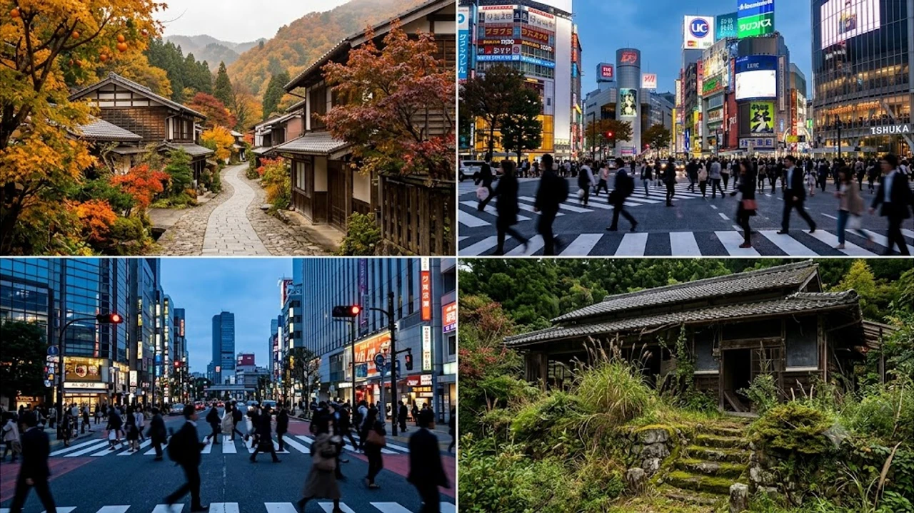

総務省が2026年7月29日に発表した人口動態調査により、**日本人口 1億2000万人割れ**という歴史的転換点が浮き彫りとなりました。日本人住民の減少幅が過去最大の91万人を超える一方、外国人住民は過去最多を更新し、社会構造の再編が猛スピードで進んでいます。本記事では、最新データの分析に加え、同じく超少子化に直面する韓国の最前線と比較しながら、日韓の未来像を読み解きます。

## 42年ぶりの衝撃！日本の人口が1.2億人を割り込んだ真実

### 総務省データが示す年間91万人減少のリアル
総務省の2026年7月29日付公表データによると、日本国内の日本人人口は1億1,973万2,800人まで落ち込み、1984年以来42年ぶりに1億2,000万人の大台を割り込みました。減少幅は前年比で約91万6,000人に達し、15年連続で過去最大を更新する事態に陥っています。47都道府県の全地域で減少傾向が定着しており、もはや地方の過疎化にとどまらず、都市部の基礎体力すら削り取られているのが現状です。

> **総務省人口動態調査（2026年7月発表）の要点**
> - 日本人人口：1億1,973万2,800人（前年比 -91万6,000人）
> - 年間の自然減少（死亡数−出生数）：過去最大の約89万人
> - 全47都道府県で人口減少が進行

### 外国人住民が過去最多を更新した背景と実態
日本人人口が加速度的に減る一方、在留外国人住民数は前年比約33万人増の358万人に達し、過去最多記録を塗り替えました。特定技能制度の枠組み拡大や、製造・介護・流通現場での深刻な人手不足が背景に挙げられます。東京都や愛知県などの大都市圏はもちろん、半導体ギガファクトリーの建設が進む北海道や熊本県など、産業構造の変化に伴う局地的な人材流入も目立ちます。

## 日韓の共通課題！少子高齢化と労働力不足の現状

### 韓国の超少子化（合計特殊誕生率）との構造的比較
東アジアを揺るがす人口急減の波は日本だけに留まりません。韓国の合計特殊誕生率は0.72（2023年実績）からさらに落ち込み、世界で最も急進的な人口縮小モデルをたどっています。日本の出生率（1.20前後）と比較しても韓国の低下スピードは群を抜いており、首都圏への一極集中や天文学的な住宅価格、熾烈な受験競争が生む将来不安が直接のトリガーとなっています。

若者の価値観に目を向けると、無駄な支出を極限まで削り実質的な生活水準を守る生き方が広がりつつあります。こうした日韓の若者意識の共鳴については、[2026年最新！低消費コアが日韓の若者にウケる本当の理由](/posts/japan-trends/2026-low-spend-core-z-generation-trend-japan-korea/)で詳述しています。

### 両国が抱える「資本主義と人口減少」のジレンマ
日韓両国に立ちはだかる最大の壁は、15〜64歳の生産年齢人口が急減する中で社会保障基盤をいかに防衛するかという問題です。社会保障費の膨張が国債や現役世代の負担増へ直結する負のループは、経済全体の成長エンジンを鈍化させています。人口増加を前提に設計された従来の資本主義モデルは根底からの刷新を迫られています。

## 外国人受け入れ拡大に伴うメリットと現場の課題

### 経済・労働市場の維持における大きなメリット
現場の労働力不足を防ぐうえで、外国人労働者の存在は社会インフラの一部となりつつあります。とりわけ物流、建設、農業、医療・介護の現場では、外国人材抜きで日常業務を回すことが不可能な領域に達しました。多様なルーツを持つ人材の定着は、停滞する日本企業に新たな視点やイノベーションをもたらす触媒としても期待が集まります。

### インフラ・言語・制度面における課題と解決の糸口
一方、急激な受け入れにともなう摩擦も目立ち始めています。自治体での行政多言語対応の遅れや、生活ルールの行き違いによる地域摩擦、教育現場での日本語指導体制の不備など、現場の負担は小さくありません。単なる「労働力の穴埋め」ではなく、地域社会の一員として迎え入れる包括的な制度設計と投資が欠かせません。

## 人口急減時代を生き抜くための個人と企業の備え

### 変化する市場環境に対応するためのキャリア戦略
国内市場の絶対数が縮小する以上、あらゆる産業で従来の延長線上のビジネス展開は成り立ちません。企業にはDXや生成AIを前提とした生産性の爆発的な引き上げが求められ、個人には国境や言語の壁を越えて価値を提供できるスキルセットの構築が問われます。より広いトレンドの潮流に関しては[日本トレンド全体を見る](/posts/japan-trends/)を併せてご確認ください。

### 多文化共生社会に向けた日韓両国の今後の展望
日本と韓国は、人口減少という未曾有の構造変化に世界で最も早く直面した「課題先進国」です。人材獲得競争や共生支援策、テクノロジーを活用した社会インフラの再構築において、日韓両国がノウハウを共有し合うメリットは甚大と言えます。縮小社会を恐れるのではなく、持続可能なシステムへと再設計する果断な決断が求められています。

#日本トレンド #2026 #人口減少 #少子高齢化 #外国人住民 #日韓比較 #社会問題