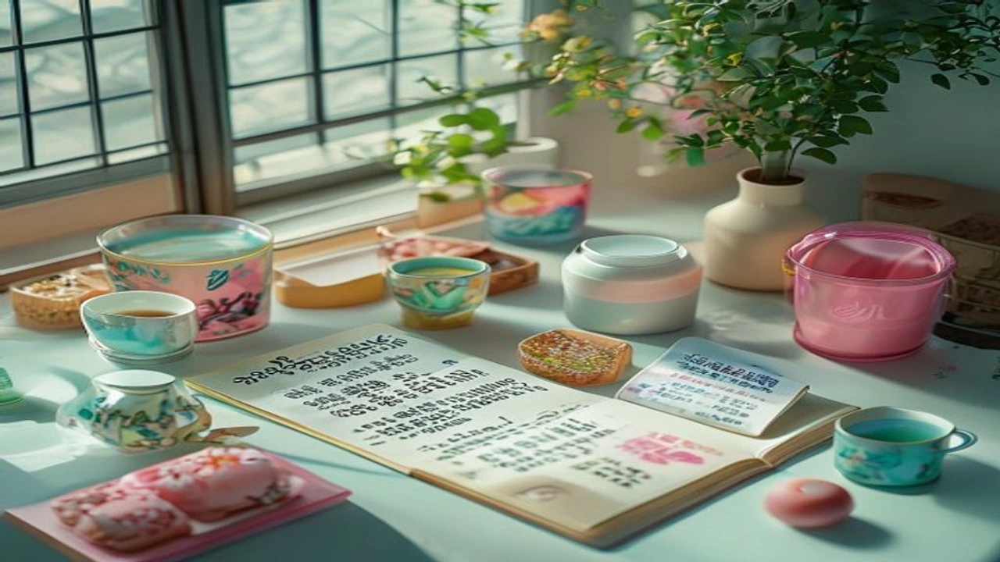
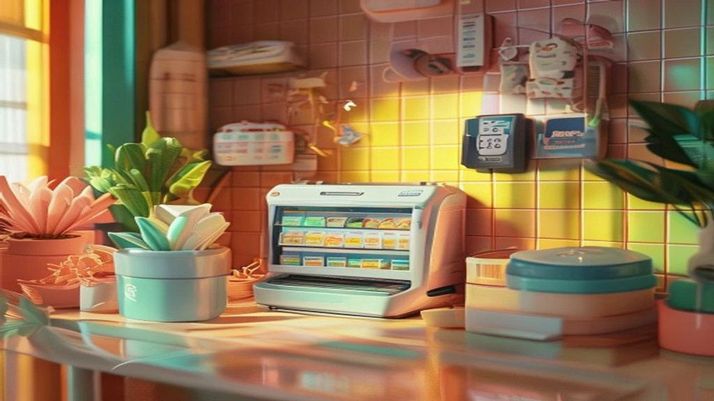

近年、コンビニエンスストアやアニメの限定コラボイベントにおける「**セブンイレブン キャラクター商品 転売**」や「フライング販売」を巡る問題が激化の一途を辿っています。楽しみにしていたファンが発売日当日の早朝に店舗へ駆けつけても、すでに棚は空っぽ。SNS上では店舗スタッフによる在庫の抱え込みやフリマアプリへのダイレクト出品を告発する投稿が相次ぎ、炎上状態が続いていました。2026年7月、ついにセブン-イレブン本部が全国の加盟店に対して異例の厳重注意文書を叩きつける事態へ発展。日韓のZ世代やコレクター層を巻き込んだ大きな議論となっています。

## セブン限定グッズのフライング販売・転売疑惑가SNSで炎上した経緯

### 公式発売前になぜ完売？店舗スタッフの不正疑惑と告発相次ぐ
限定トレーディングカードや人気アニメのアクリルスタンドなど、争奪戦必至の注目アイテムで「発売日前のフライング販売」が常態化しているとの指摘が相次ぎました。公式のアナウンスでは「〇月〇日 午前7時より順次発売」と定められているにもかかわらず、前日深夜の時点で「すでに売り切れていた」という報告がSNS上で噴出。そればかりか、裏から商品を出してもらえなかったり、店員から「取り置き分で完売した」と突っぱねられたりするケースが多発し、ファンの怒りは頂点に達しました。

### メルカリ出品と店舗在庫の連動性で不信感が一気に爆発
疑惑を決定づけたのは、大手フリマアプリ「メルカリ」における異常な出品のタイミングです。公式発売の数時間前、あるいは前日の段階で、段ボール未開封の状態やコンプリートセットがズラリと出品される現象が確認されました。出品画像の中にコンビニのバックヤードやレジ奥が写り込んでいる悪質なケースまで浮き彫りになり、ネット上では「バイトや店長による内部抜き取りだ」と特定作業が過熱。不当な利益を得る泥棒同然の転売行為に批判が殺到しました。

### 本部が加盟店向けに「異例の厳重注意」を出した決定打
事態を重くみたセブン-イレブン・ジャパン本部は2026年7月23日、全国の加盟店に向けて「限定商品の販売ルール厳守および不正転売の禁止」を指示する内部通達を一斉発信。本部の規約において、発売前のフライング販売や従業員による事前確保・転売目的の購入は明確な契約違反です。今回の対応は、落ちに落ちたブランドイメージを食い止め、顧客からの信頼を繋ぎ止めるための極めて異例かつ後手に回れない措置となりました。

## フライング販売問題の真相とコンビニ加盟店構造の課題

### なぜ店員による「抱え込み・抜き取り」が起きてしまうのか？
コンビニの現場において、限定コラボ商品は1店舗あたり数個〜数十個しか納品されない激レア品が目立ちます。アルバイトスタッフや店舗関係者が「自分用の確保」や「高額転売による小づかい稼ぎ」を目論み、納品直後に商品をレジ奥へ隠してしまう構造的な隙が存在します。特に深夜帯などの本部監査や店長の目が届かない時間帯に商品が届くため、チェック機能が完全に形骸化している実情が見え隠れします。

> **現場で常態化する3大悪質行為**
> - **納品直後の隠蔽**: 深夜便で届いた商品を売り場に出さずバックヤードへ隠す行為
> - **関係者優先の横流し**: スタッフの友人や知人へ発売前にコソコソ優先販売する行為
> - **無断キャンセルの偽装**: 一般客からの問い合わせに対し「入荷なし」と嘘をついて追い返す行為

### セブン-イレブン本部のガイドラインと今後の再発防止策
本部から叩き出された最新の通達では、以下の3項目が徹底事項として挙げられています。

- **販売開始時刻のレジロック**: レジシステムと連携し、指定時間前にはバーコード読取を強制不可にする改修の検討
- **店舗在庫の抜き打ち監査**: 本部主導による在庫管理監査の強化および抜き取り発覚時のペナルティ厳罰化
- **従業員への誓約書義務付け**: 契約解除や損害賠償請求を含む厳しい規律の設定

加盟店側の「善意の管理」だけに頼らない強力な牽制体制の構築が急務となっています。

### 通常の予約・販売ルールとの違いと消費者が受ける不利益
一般的な書籍やゲームソフトと異なり、コンビニの限定コラボグッズは個別の予約受付けを行わないケースが大半です。本来であれば「当日店頭に並んだ順」という公平なルールのもとで購入できるはずでした。しかし、フライング販売が横行することで、ルールを守って早朝から並んだファンが一切購入できず、不当に吊り上がった転売価格でしか手に入らないという惨状を生み出しています。こうした不条理な体験は若者の購買意欲を冷めさせ、昨今の[2026年最新！低消費コアが日韓の若者にウケる本当の理由](/posts/japan-trends/2026-low-spend-core-z-generation-trend-japan-korea/)に見られるような、「歪んだ消費体験からの離脱」にも拍車をかけています。

## 韓国でも話題！日韓で過熱する「限定コラボ・ポケカ転売」比較

### 韓国のコンビニやPOP-UPでも起きる「バイト抜き取り」の実態
この問題は日本国内にとどまりません。韓国のGS25やCUといった大手コンビニでも、サンリオやポケモン、人気K-POPグループとの限定コラボ商品が発売される際、アルバイト店員が商品を事前に確保する「アルバイト抜き取り（알바 抜き）」が深刻な社会問題となっています。韓国のオンラインコミュニティでも「発売日に行っても売り切れと言われたのに、アプリの個人間取引市場（ニンジンマーケット等）に大量出品されている」と怒り心頭の投稿が絶えません。

### 日韓Z世代コレクターの怒りとSNS拡散文化の共通点
日韓両国のZ世代コレクターは、不自然な完売に対してSNSを駆使した検証活動を展開します。
- レシートの印字時間と公式発売時刻の照合
- フリマ出品者の過去取引履歴や配送地域の特定
- 店舗の防犯カメラ映像の確認要請

国境を越えて「推し活」や「限定コレクション」を愛する若者にとって、不正行為に対する厳しい目線とSNS拡散スピードの速さは恐ろしいほど共通しています。

### 健全なファンが定価で購入するための日韓ファンダムの対策
日韓のファンダム間では、転売屋や不正店舗から絶対に買わない「不買の連帯」が浸透しつつあります。公式側へ増産やオンライン受注生産への切り替えを要求する署名活動が行われるなど、消費者の権利を守るための自発的な動きが活発化してきました。トレンド情報に関心がある方は、ぜひ[日本トレンド全体を見る](/posts/japan-trends/)で他の最新トピックもあわせてチェックしてみてください。

## 今後のコラボグッズ購入で損しないための現実的な対策

### 発売日当日に確実に手に入れるための事前確認チェックリスト
トラブルを避けつつ目当ての商品を手中に収めるには、スマートな事前準備が欠かせません。

- **入荷便の時間を事前に確認**: 前日までに店舗へ「何時頃の便で納品され、何時から販売開始か」を丁寧に尋ねる
- **複数店舗のルート確保**: 1店舗だけに依存せず、近隣のセブン-イレブンを2〜3箇所ピックアップしておく
- **公式SNSの告知チェック**: 突然の販売方法変更や店舗限定条件が出ていないか直前に確認する

### フライング販売や不正転売を見つけた際の正しい通報・相談先
万が一、発売前の売り切れや明らかな店舗関係者による転売と思われる証拠（レシート画像やフリマ出品画面）を発見した場合は、店舗で直接トラブルを起こすのはNGです。**セブン-イレブンお客様相談室**へ客観的な情報とともに連絡を入れるのが最も効果的。本部へのダイレクトな情報提供こそが、加盟店への指導や改善への最短ルートとなります。

### トラブルに巻き込まれないためのフリマアプリ利用上の注意点
発売日直後に高額で出品されている商品は、数日〜数週間で価格が急落するパターンがほとんどです。転売屋の資金繰りを助ける購入はきっぱり避け、公式からの再販アナウンスを待つ姿勢が求められます。どうしてもフリマアプリを利用する場合は、商品の手元にある証拠画像が掲載されているか確認し、転売行為を助長しないよう冷静な判断を徹底しましょう。

#日本トレンド #セブンイレブン #転売問題 #限定グッズ #2026年 #フライング販売 #推し活 #韓国トレンド #Z世代