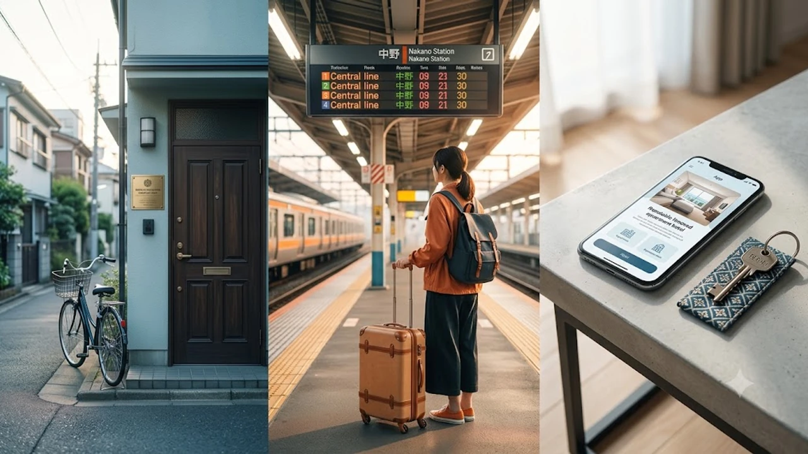

東京都心屈指のターミナルを抱える新宿区で、住居専用地域での営業制限や指導強化による**新宿 民泊 規制**が本格化し、個人旅行者が手頃な宿を確保できない「宿難民」問題が現実味を帯びてきました。住宅宿泊事業法（民泊新法）に基づく自治体独自の上乗せ条例が厳格に機能し始めたことで、従来の格安民泊に頼る滞在スタイルは大きな転換点を迎えています。

## 新宿区における民泊規制強化の全貌と宿泊市場への激震

### 住居専用地域を直撃する実質「週末限定」ルール
新宿区の上乗せ条例では、都市計画法が定める「第1種・第2種低層住居専用地域」および「第1種・第2種中高層住居専用地域」において、月曜正午から金曜正午までの営業が制限されます。国の制度上は年間180日まで営業可能と定められているものの、区内の住宅地においては実質的に**金曜午後から日曜のみ稼働可能**な状態へ追い込まれました。平日の連泊受け入れが成立しなくなった個人ホストが次々と看板を下ろしています。

### 違法ヤミ民泊への監視網と掲載取り下げの加速
近隣住民からの通報急増を受け、現地立ち入り調査の頻度が引き上げられました。とりわけ大久保・百人町周辺の路地裏に密集していたワンルームマンション転用型物件では、管理業者不在を理由とする是正勧告が相次いでいます。大手仲介プラットフォーム側も行政からの通知を受けて無許可リスティングの一斉削除を進めており、予約直前に部屋が消滅するトラブルも現実化しました。

### ビジネスホテル相場の連動高騰がもたらす打撃
民泊の受け皿を失った宿泊需要がそのまま一般ホテルへ逆流した結果、歌舞伎町や西新宿界隈の客室単価が急激に跳ね上がっています。繁忙期には簡素なビジネスホテルですら1泊2万円台後半まで跳ね上がる日が増え、旅行予算の大半を宿泊費が圧迫する構図が定着しました。

## 宿難民を回避する旅行者のための具体的防衛策3選

### 商業地域・近隣商業地域の適法特区民泊を狙い撃つ
営業日数制限の対象外となる「商業地域」「近隣商業地域」に所在する物件を選定するのが確実な自衛策となります。

- 予約サイトの地図機能で**JR新宿駅南口側**や**歌舞伎町一丁目周辺**など商業指定区域の物件に絞り込む
- 旅館業法（簡易宿所）の認可番号、または「M」から始まる住宅宿泊事業届出番号の有無を物件概要で確認する
- 施設側の緊急連絡網や24時間対応フロントが機能しているか事前にメッセージで試す

認可番号の明記がない物件を避けるだけで、不意の強制キャンセルリスクを最小限に防げます。

### JR中央線・丸ノ内線沿線の近隣穴場駅へシフトする
新宿駅徒歩圏にこだわらず、電車で5分〜15分の生活拠点駅へ移動する柔軟性がコスト削減に直結します。

> 例えば中央線で数分の中野駅や高円寺駅、丸ノ内線の方南町駅・新中野駅界隈は、駅前の飲食店街やスーパーが充実している割に、宿泊料金が新宿駅周辺相場の約6割〜7割程度に落ち着きます。

無駄な滞在費を削って現地での体験や食に資金を回す賢い旅のあり方は、[2026年最新！低消費コアが日韓の若者にウケる本当の理由](/posts/japan-trends/2026-low-spend-core-z-generation-trend-japan-korea/)で描かれたミニマル志向の消費動向とも完全に一致します。

### グループ滞在ならアパートメントホテルを先行確保する
友人同士や家族連れの場合、キッチン・ランドリー併設の「アパートメントホテル（MIMARU等）」を数か月前から押さえる戦略が効果を発揮します。1室あたりの定員が4〜6名と広めに設計されているため、ビジネスホテルを複数部屋確保するよりも1人あたりの負担額を大幅に圧縮できます。

## トラブルに巻き込まれない適法宿泊施設の確実な見極め方

### 届出番号の形式確認と外観チェックの徹底
適法物件のリスティングには、法令に基づき認可番号が必ず記載されます。

- Airbnb等の詳細ページ最下部に「第M000000000号」あるいは自治体の旅館業許可番号があるか照合する
- 事前に地図アプリのストリートビューを開き、エントランス周辺に正規標識（緑や青の認可プレート）が掲げられているか確認する
- レビュー欄に「裏口から入るよう指示された」「住民に見つからないよう言われた」といった記述がないか精査する

### 分譲マンションの管理規約違反を見抜くポイント
分譲マンションの空き部屋を無断転用した物件では、管理組合規約違反による退去騒動に巻き込まれる危険が潜みます。「オートロック前で住民の出入りに合わせて共連れ入場してください」といった案内が届いた場合、違法民泊の典型例とみなして警戒しなければなりません。

### プラットフォーム規約改定に伴う自動キャンセルリスクの回避
各予約サイトは行政通達に従い、不審物件を事前予告なしで非公開化します。旅行直前に宿を失う最悪の事態を避けるためにも、予約確定直後にホストへ正式領収書の発行可否を尋ね、返答の対応スピードと透明性から事業者の信頼度を測る自衛策が必須となります。

## 旅行計画の最適化とパッキングで差をつける快適滞在術

### 新宿駅のコインロッカー枯渇に備える荷物預け術
新宿駅構内のコインロッカーは午前中のうちに空きがなくなるケースが日常化しています。大型スーツケースを引きずって移動する消耗を防ぐため、「ecbo cloak（エクボクローク）」などの手荷物預かりシェアサービスを事前予約するか、宿泊施設への直送便を手配しておく段取りが欠かせません。

### 郊外・分散滞在を快適にする荷物の圧縮管理
アパートメントホテルや郊外拠点をフル活用する場合、室内の洗濯設備を使い回す前提で衣類を絞り込むパッキング術が移動の身軽さを左右します。限られた収納スペースを効率よく使い、チェックアウト時の荷造りを素早く済ませるパッキングギアの活用が旅のストレスを激減させます。

[旅行用高圧縮収納ポーチをクーパンで見る](https://www.coupang.com/np/search?q=%EC%97%AC%ED%96%89%EC%9A%A9%20%EC%95%95%EC%B6%95%20%ED%8C%8C%EC%9A%B0%EC%89%90&sourceType=affiliate&trackingCode=AF8691300)

厳格化する新宿の宿泊事情を正確に見据え、商業地域物件の選定や近隣駅への分散滞在を取り入れることで、無駄な出費を抑えたスマートな東京滞在が実現します。

#日本トレンド #新宿民泊規制 #東京旅行 #宿難民対策 #新宿ホテル #民泊新法 #東京宿泊 #アパートメントホテル