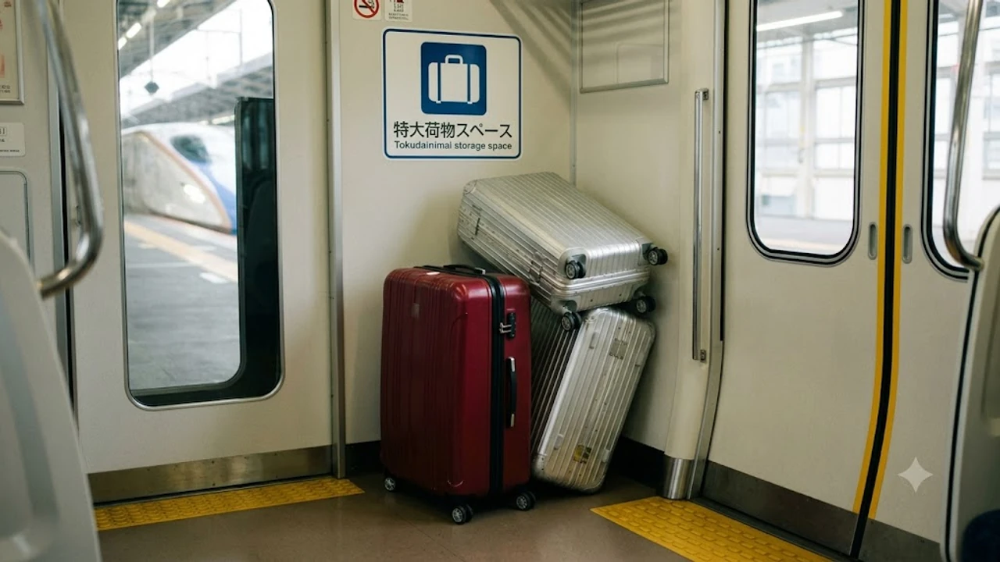

2026年秋の大型連休を目前に控え、日本の大動脈を結ぶ新幹線網で**新幹線 特大荷物 2026**ルールの現場運用が急速な引き締めに入りました。東海道・山陽・九州・西九州新幹線では、事前枠を押さえずに持ち込まれた規格外トランクに対し、車掌の携帯端末照合による巡回検札と手数料徴収が徹底されています。現地の規律を知らないまま飛び乗り、デッキで車掌に呼び止められて手痛い追加出費を余儀なくされる旅行者が相次ぐ中、事前の荷物サイズ把握と予約システムの挙動を掴んでおく防衛策が欠かせません。

## 2026年秋の新幹線「特大荷物ルール」厳格化の真相

### 9月行楽シーズン直前にJR各社が警告を強化した背景
JR各社が2026年9月上旬、特大荷物スペースの予約状況に関して異例の注意喚起を発令した背景には、乗降口の塞ぎ込みや非常時避難経路の物理的寸断に対する強い危機感があります。インバウンド需要の高水準維持に伴い、長期滞在用の大型トランクを普通指定席の足元に無理やり押し込んだり、デッキの非常ドア前に放置する事例が相次ぎました。運行ダイヤの遅延と安全基準の崩壊を食い止めるため、現場スタッフによる黙認措置は完全に打ち切られました。

### 3辺合計160cm超のスーツケースが対象！基本基準の再確認
持ち込み制限の基準線となるのは、縦・横・高さの**3辺合計が160cm超〜250cm以内**（重さ30kg以内）の手荷物です。
* **160cm以下（中・小型スーツケース）：** 通常の座席上部にあるオーバーヘッドシェルフ（荷物棚）へ自力収納
* **160cm超〜250cm以内（特大荷物）：** 事前に「特大荷物スペースつき座席」または「特大荷物コーナーつき座席」の確保が必須
* **250cm超：** 新幹線車内への持ち込み自体が拒絶対象

国際線の無料受託手荷物枠で作られた90Lクラス以上のハードケースは、キャスターや取っ手を含めると高確率で160cmの境界線を突破します。わずか数センチのオーバーでも現場では厳密に区分されます。

### なぜ今トラブルが多発しているのか？現場の混乱状況
現場で摩擦が生じる主因は、自由席特急券や通常の普通車指定席券しか持たない乗客が「空いている隙間に置けば問題ない」と誤認して乗り込む点にあります。連結部の通路に乗客のトランクが密集し、車内販売カートや車掌の巡回が妨げられるトラブルが多発した結果、改札前での目視確認および走行中の車内検札体制が一気に引き上げられる事態へ発展しました。

## 予約なしで乗車するとどうなる？追加手数料とペナルティ

### 車内で徴収される持ち込み特別料金の具体額
事前の指定席予約なしで160cm超のスーツケースを車内へ持ち込んだ場合、JR運送約款に基づき**持込手数料1,000円（税込）**がその場で現金またはキャッシュレスにて徴収されます。
> 「指定席枠をあらかじめ押さえれば追加課金0円で済む一方、無断で持ち込むと1,000円の罰金的ペナルティを払わされた上で、車掌が指定する隔離スペースへ荷物を強制移動させられる」

金銭的な損失だけでなく、自分の座席から遠く離れた車両端へ手荷物を隔離される精神的ストレスも見過ごせません。

### 指定席完売時の絶望！自由席への持ち込みが原則禁止される理由
自由席車両には構造上「特大荷物スペース」が存在しません。そのため、のぞみ号などの自由席号車に特大トランクを持ち込む行為は規約違反となります。連休中の混雑ピーク時に特大荷物つき指定席が完売していた場合、自由席へ逃げ込む選択肢は存在せず、後続列車への変更や駅窓口での旅程変更を余儀なくされます。

### 駅改札・ホーム巡回での声かけ強化と車掌チェックの実態
主要ターミナル駅の改札付近には手荷物計測枠が設置され、目視で巨大と判断されたトランクを引く乗客には駅員が直接予約状況を照会する運用が定着しました。改札をすり抜けて乗車しても、車掌が所持する携帯端末のシートマップには特大荷物枠の予約状況がリアルタイム反映されているため、未指定の荷物は瞬時に特定されます。無駄な出費を徹底して防ぐ賢い移動設計は、近頃シェアを伸ばす[2026年最新！低消費コアが日韓の若者にウケる本当の理由](/posts/japan-trends/2026-low-spend-core-z-generation-trend-japan-korea/)で示されるスマートな防衛消費の姿勢とも完全に合致しています。

## 韓国人旅行者が直面する「日韓の鉄道手荷物文化」のギャップ

### KTXとの違いに驚く韓国人観光客の声（NAVERブログ・SNS分析）
韓国のKTXやSRTでは、車両間のデッキに共用大型荷物ラックが当たり前のように設置されており、予約不要かつ追加料金ゼロで自由にスーツケースを置く文化が定着しています。この常識を抱いたまま訪日した旅行者が、日本の新幹線で「座席予約が必要」「無断積載は手数料徴収」というルールに直面し、戸惑う事例がNAVERブログやコミュニティ上で後を絶ちません。日韓の鉄道インフラにおける「共用スペース」対「個人予約占有スペース」という思想の相違が思わぬトラブルの引き金となっています。作成する文章のテーマや内容をご指定いただければ、指示通りの形式で出力いたします。どのような文章を作成しますか？