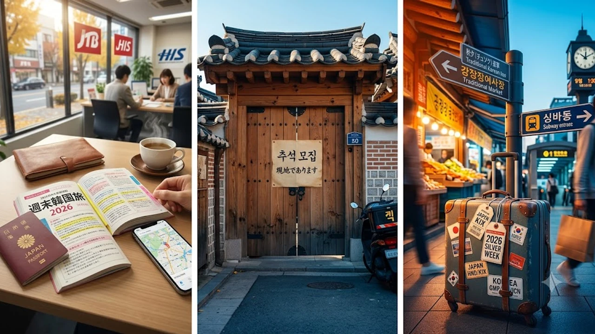

2026年の大型連休を目前に控え、手軽な渡航先として**シルバーウィーク 2026 韓国旅行**のフライト争奪戦が激化しています。成田や関空から片道2時間半前後でアクセスできるソウルは、タイパを重視する旅行者にとって絶好の目的地に映ります。しかし、現地の大型名節である秋夕（チュソク）の連休スケジュールを正確に把握していないと、目的地に着いてから立ち尽くす事態に陥りかねません。

## 2026年秋の大型連休直前！韓国弾丸旅行が選ばれる理由

### 11年ぶりのシルバーウィークと近場フライト需要の爆発
2026年9月19日（土）から23日（水）にかけて巡ってくるシルバーウィークは、カレンダーの並びとして11年ぶりとなる大型の秋連休です。有休を何日も消化することなく5連休を確保できるため、欧米などの遠方ではなく、フライト時間が短く体力を温存できる東アジア路線へ予約が殺到しました。特に午前発・夜着のダイヤを組めるソウル便は、実質滞在時間をフルに活かせる選択肢として圧倒的な支持を集めています。

### 燃油サーチャージ変動とLCC増便によるコスパの再評価
初秋の為替水準や燃油サーチャージの改定に伴い、近距離LCCの運賃競争力が一段と際立ってきました。チェジュ航空やジンエアー、エアプサンといった各社が地方空港発着便も含めて増便枠を維持しており、日程の調整次第では往復4万〜5万円台をキープできるケースも珍しくありません。無駄な移動費を削り、現地での食体験やカルチャー消費にお金を回すスタイルは、若年層の消費感覚とも深く合致しています。近年の価値観については[2026年最新！低消費コアが日韓の若者にウケる本当の理由](/posts/japan-trends/2026-low-spend-core-z-generation-trend-japan-korea/)でも触れられている通り、賢く費用対効果を追求する旅のスタイルが定番化しました。

### 円安基調でも「ソウル2泊3日」が選ばれるタイパの魅力
為替レートの影響を差し引いても、ソウルが誇るアクセスの良さと都市機能の集約度は依然として強力な強みです。空港鉄道（A'REX）を使えば仁川空港からソウル駅まで最短43分で直行可能であり、現地到着後すぐにカフェ巡りやショッピングを開始できます。金曜の夜や土曜の早朝に出発し、連休の最終日には自宅へ戻って翌日の仕事に備えるといった無理のないスケジュール設計が、忙しい世代の心を捉えて離しません。

## 秋夕（チュソク）直撃！現地で直面する3つの営業・交通トラップ

### 個人経営カフェや人気グルメ店の臨時休業スケジュール
日本のシルバーウィークと重なるタイミングで、韓国では年間最大の帰省シーズンである秋夕（チュソク）の連休期間へ突入します。ここで最大の障壁となるのが、個人商店やローカル名店の長期休業です。聖水（ソンス）や延南洞（ヨンナムドン）に立ち並ぶ個人オーナー運営のデザイナーズカフェ、あるいは乙支路（ウルジロ）の老舗タッカンマリ店などは、祝日前後を含めて3〜4日間シャッターを下ろすケースが日常茶飯事となっています。

> 「SNSで事前調査したトレンド店舗が全滅し、営業していたのは駅前の大手ファストフード店だけだった」という失敗談は、名節期間の渡航で最も頻発するトラブルの一つです。

### KTX・高速バスの予約完売とソウル市内・近郊の渋滞リスク
地方への日帰り遠征を検討しているなら、移動手段の確保には細心の注意を払う必要があります。秋夕前後は数千万人規模の民族大移動が発生するため、KTX（韓国高速鉄道）やSRTの全座席は一般予約開始と同時に数分でソールドアウトします。また、高速道路は京釜高速道路を中心に深夜まで激しい渋滞が続くため、市外バスを使った水原（スウォン）や江陵（カンヌン）方面への移動は予定時刻の倍以上の時間を要すると想定しなければなりません。

### 2026年最新の大型モール・免税店・チェーン店の開館状況
個人店が閉まる一方で、ロッテワールドモールやザ・現代ソウル（The Hyundai Seoul）、スターフィールドといった複合ショッピングモール、大手免税店は営業体制を柔軟に整えています。秋夕当日の午前中のみ休業し、午後から通常営業へ戻る施設も多いため、旅程の核となる買い出しや食事はこうした大型施設へ集中させるのが賢明な防衛策です。事前にNAVERマップや各商業施設の公式インスタグラムを通じて、最新の秋夕特別営業時間を必ず確認しておきましょう。

## 混雑を完全回避する2026年流・スマート現地滞在テクニック

### Naverマップと現地デリバリーを活用した「並ばない」食事術
韓国国内ではGoogle Mapsの徒歩ルート案内が正確に機能しないため、Naverマップ（ネイバーマップ）アプリの導入が必須となります。店舗情報ページには店主が直接登録したリアルタイムの休業案内が反映されやすいため、無駄足を防ぐ第一歩となります。また、人気店の長蛇の列を避ける手段として、現地の出前代行サービスやピックアップ事前決済機能を駆使し、ホテル客室へ直接料理を取り寄せて楽しむスタイルも賢い選択肢です。

- Naverマップの「お気に入りリスト」に営業確認済みのバックアップ店を複数登録しておく
- 「CatchTable（キャッチテーブル）」のグローバル版で、事前予約可能な人気レストランを押さえる
- カカオT（Kakao T）をインストールし、路上でのタクシー難民化を回避する

### 空港鉄道（A’REX）と直通事前チェックインの活用術
帰国便の混雑をスマートにかわす鍵は、ソウル駅地下にある「都心空港ターミナル」の活用にあります。大韓航空、アシアナ航空、チェジュ航空などの対象路線を利用する場合、ソウル駅で当日の搭乗手続きと預け入れ荷物の受託、出国審査までをワンストップで完了できます。身軽になった状態で直通列車に乗り込み、仁川空港到着後は一般レーンを横目に「専用出国通路」から保安検査場へ直行できるため、空港での待ち時間を1時間以上短縮可能です。

### 明洞・弘大を避けて楽しむローカル人気スポットの選び方
観光客で身動きが取れなくなる明洞（ミョンドン）や弘大（ホンデ）のメインストリートをあえて外し、住宅街に近いカルチャーゾーンへ足を向けるのも一案です。漢南洞（ハンナムドン）のアートギャラリー巡りや、龍山（ヨンサン）周辺の再開発リノベーションエリア、あるいは静まり返った光化門（クァンファムン）周辺の古宮夜間特別観覧などは、連休特有の落ち着いた街の表情を味わえます。

## シルバーウィーク韓国旅を成功させる直前チェックリスト

### 出国72時間前までに完了すべき必須アプリと決済準備
現地での滞在をスムーズにするため、スマートフォンの設定は出国前に整えておかなければなりません。韓国は世界屈指のキャッシュレス社会であり、WOWPASSやNAMANEカードといった外国人向けプリペイド交通カードの発行、あるいは現地の地下鉄網に対応した電子決済手段の紐付けが出国72時間前までのタスクとなります。また、韓国入国時の税関申告や検疫手続きをオンライン化するポータルの事前入力も抜かりなく済ませておきましょう。

### トラブルを防ぐeSIM・Wi-Fi接続と緊急連絡先
物理SIMの差し替え不要で即時開通できるeSIMは、旅程の自由度を劇的に高めます。SKテレコムやKTの正規回線を利用したデータ無制限プランを選んでおけば、地下鉄移動中や地下街でも電波が途切れる心配がありません。万が一の体調不良やトラブルに備え、韓国観光公社が運営する24時間対応の観光通訳・案内ホットライン「1330」の番号を端末に控えておくと安心です。

### 日本帰国時の混雑ピークとVisit Japan Webの活用手順
連休最終日となる9月23日前後は、日本の主要国際空港の入国審査場でも長蛇の列が予想されます。税関申告アプリ「Visit Japan Web」へパスポート情報と携行品申告を事前登録し、生成された二次元コードをスクリーンショットで保存しておけば、電子申告ゲートをスムーズに通過できます。連休を最後までストレスフリーで駆け抜けるためにも、帰国動線の最適化までをひとつの旅程としてシミュレーションを組み立てておきましょう。

[관련상품 쿠팡에서 보기](https://www.coupang.com/np/search?q=%ED%95%9C%EA%B5%AD+%EC%97%AC%ED%96%89+%ED%95%84%EC%88%98%ED%92%88&sourceType=affiliate&trackingCode=AF8691300)

#日本トレンド #シルバーウィーク #韓国旅行 #ソウル旅 #2026年トレンド #渡航対策 #海外旅行準備