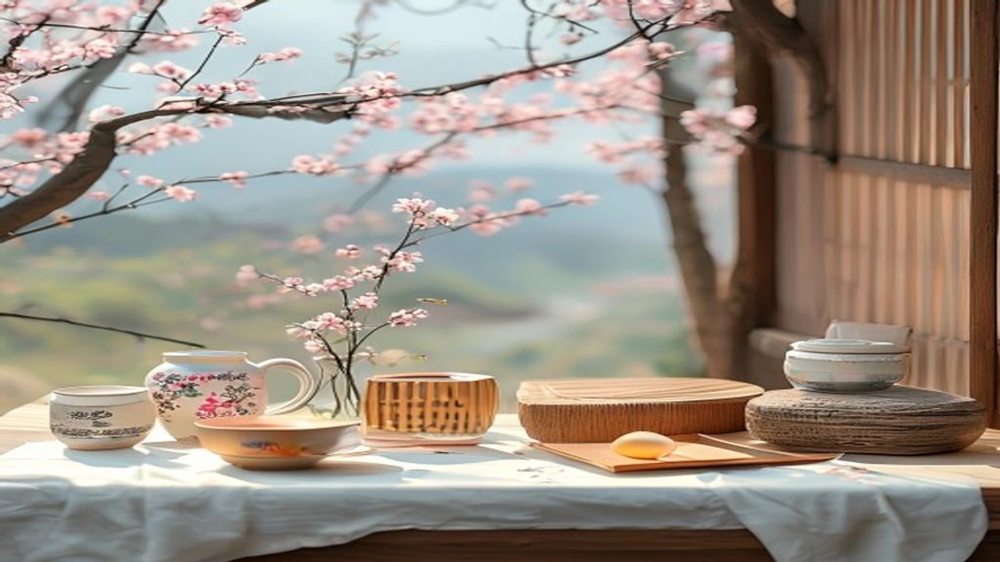
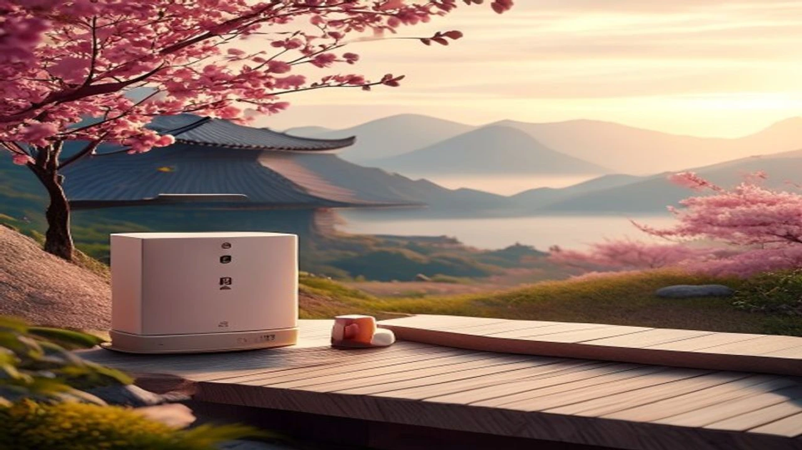

2026年の夏休みは、記録的な猛暑と容赦ない物価高が重なり、人々のレジャー意識に大きな変化が起きています。こうした背景から、今年の旅行市場では「安い・近い・涼しい」を追求する**安近涼のトレンド**が急速に拡大中。驚くべきことに、日本国内の定番避暑地へ行くよりも、コスパに優れた**韓国旅行**を選ぶ若者やファミリー層が爆発的に増えています。

## 2026年夏のレジャートレンド「安・近・涼」の真実

### 猛暑と物価高がもたらした「安・近・涼」シフトとは
2026年の日本の夏は、連日のように最高気温が体温を超える酷暑が続いており、屋外アクティビティを避ける傾向が顕著です。これに加えて実質賃金の伸び悩みや日用品の値上げが直撃し、消費者はレジャーに対して極めてシビアな目を持つようになりました。遠出をせず、費用を抑え、冷房の効いた快適な空間で過ごす「安・近・涼」は、現代の日本人が生き残るための必然的な選択と言えます。

### 国内避暑地のホテル代高騰と混雑の現状
これまで夏の定番だった北海道や軽井沢といった国内の避暑地は、インバウンド（訪日外国人観光客）の増加に伴い、宿泊費が一般の日本人にとって手の届かない水準まで高騰しています。お盆休みのピーク時には、ビジネスホテルクラスですら1泊数万円に跳ね上がるケースが珍しくありません。高額な費用を払ったにもかかわらず、どこへ行っても大混雑という現状に、多くの人が疲弊しています。

### Z世代からシニアまで魅了される新たな夏休みスタイル
この厳しい状況下で注目されているのが、限られた予算を賢く使うライフスタイルです。無駄な浪費を削ぎ落としながらも精神的な満足感を得るという価値観は、現在の若者たちの間でも深く浸透しています。このような風潮については、[2026年最新！低消費コアが日韓の若者にウケる本当の理由](/posts/japan-trends/2026-low-spend-core-z-generation-trend-japan-korea/)でも詳しく分析されていますが、この波が今やレジャー全般にまで波及している形です。

## なぜ国内旅行より「韓国旅行」が圧倒的にコスパが良いのか

### 国内主要リゾート（北海道・沖縄）との費用シミュレーション比較
実際に東京発の2泊3日旅行でシミュレーションを行うと、驚きの事実が浮かび上がります。夏の沖縄や北海道へ飛行機で向かい、レンタカーを借りて家族4人で宿泊する場合、交通費と宿泊費だけで簡単に30万円を超えてしまうことが少なくありません。一方で、ソウル行きのLCC（格安航空会社）を利用すれば、往復の航空券が時期を選べば3万円台から手に入り、現地のホテル代を合わせても国内リゾートの半額近くに抑えることが可能です。

### 円安でも損しない？LCC増便と現地でのタイパ
「円安だから海外旅行は損」という固定観念は、移動距離が短い東アジア圏には当てはまりません。成田や関西国際空港だけでなく、地方空港からも韓国便のLCCが大幅に増便されたことで、航空券の価格競争が激化。フライト時間もわずか2〜3時間のため、移動伴う疲労や時間のロスが少なく、限られた連休をフルに活用できるタイムパフォーマンス（タイパ）の高さが際立っています。

> **現地クチコミによる実際の声**
> 「軽井沢の1泊分で、ソウルなら航空券込みで2泊3日遊べた。食事代も日本と変わらないか、店を選べばむしろ安くて満足度が段違いに高い」

### メリットだけじゃない！夏の韓国旅行で注意すべきリアルなデメリット
もちろん、すべての面で完璧というわけではありません。夏のソウルは日本と同様に高温多湿であり、突然の集中豪雨（ゲリラ豪雨）に見舞われるリスクが存在します。また、渡航に関わる手続きや制度の変化にも注意を払わなければなりません。特に近年変更された制度については、[パスポート値下げ裏の罠？2026年最新の出国税3倍と渡韓への影響](/posts/japan-trends/2026-japan-passport-fee-reduction-departure-tax-korea-travel/)で指摘されている通り、事前の費用計算に組み込んでおくべき隠れたコストも存在します。

## 涼しく快適に楽しむ！夏の韓国おすすめスポット

### 日本の猛暑を忘れる！最新の屋内巨大メガモールの魅力
夏の韓国旅行を「涼しく」過ごすための最大の鍵は、圧倒的なスケールを誇る屋内施設です。例えば、ソウル近郊の「スターフィールド」や永登浦の「タイムズスクエア」といった巨大ショッピングモールは、冷房が完全に完備された巨大なエンターテインメント空間。ショッピングだけでなく、最新のアミューズメント施設、映画館、さらにはお洒落なカフェが1つの建物に集約されているため、一歩も外に出ることなく丸一日快適に過ごせます。

### 本場で味わう本気の冷感！夏の韓国グルメ東大門・明洞めぐり
涼しさを追求するなら、現地の食文化も見逃せません。シャリシャリに凍らせたスープが絶品の本格冷麺や、鶏肉の中に高麗人参ともち米を詰めて煮込んだ熱々のサムゲタン（参鶏湯）を冷房の効いた店内で味わうのは、まさに夏の醍醐味。特に東大門や明洞周辺には、日本語のメニューが完備され、初心者でも安心して入れる名店が集中的に並んでいます。

### 週末1泊2日でも大満足できた弾丸旅行の実際のスケジュール
週末の休みを利用した1泊2日の弾丸旅行でも、十分に「安近涼」を満喫できます。
- **土曜日 08:00**：羽田または成田を出発
- **土曜日 11:00**：金浦・仁川国際空港に到着後、すぐに市内へ移動
- **土曜日 13:00**：涼しい屋内モールで冷麺のランチ＆ショッピング
- **土曜日 19:00**：夜のライトアップされた街を散策し、タッカンマリを堪能
- **日曜日 10:00**：人気のベーカリーカフェで朝食
- **日曜日 14:00**：免税店でお土産をまとめ買い
- **日曜日 18:00**：帰国の途へ

## 2026年夏に韓国旅行を最安で予約するための完全ガイド

### 航空券とホテルを最も安く組み合わせる予約テクニック
少しでも費用を抑えるためには、航空券とホテルを別々に手配するよりも、旅行予約サイト（Trip.comやExpediaなど）の「セット割引」を狙うのが鉄則。特に火曜日や水曜日の深夜に検索すると、突発的なセール価格 of 航空券が出現しやすくなります。また、ソウル市内の移動は地下鉄が中心となるため、駅直結または徒歩3分以内のホテルを選ぶことで、夏の強い日差しを浴びる時間を最小限に抑えられます。

### 現地での移動をスムーズにする必須アプリと最新キャッシュレス事情
韓国は日本以上の超キャッシュレス社会であり、事前のアプリ準備が旅の成否を分けます。地図アプリは日本の「Googleマップ」が正確に機能しないことが多いため、「ネイバーマップ（NAVER Map）」のインストールが必須。移動には配車アプリの「カカオT（Kakao T）」を連携させておけば、ぼったくりの心配なく、冷房の効いたタクシーを格安で呼び出すことが可能です。

### 夏の渡航前にこれだけは準備しておくべき持ち物チェックリスト
日本の夏以上に日差しが強い日もあるため、UVカットの折りたたみ傘（晴雨兼用）は必需品です。また、屋内施設や乗り物の中は冷房が非常に強く効いているため、体温調節用の薄手のカーディガンやリネンシャツを1枚バッグに入れておくと重宝します。万が一のゲリラ豪雨に備え、防水仕様のミニバッグで行動することをおすすめします。

#日本トレンド #2026年 #安近涼 #韓国旅行 #コス파旅 #夏休み #ソウルグルメ #旅行準備