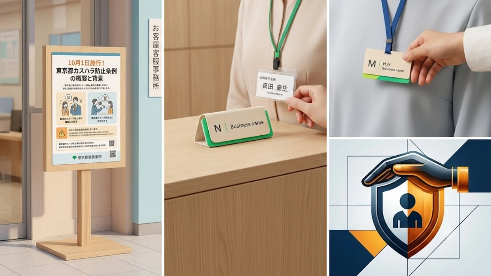

東京都で2026年10月1日より施行された**カスハラ防止条例**（カスタマーハラスメント防止条例）は、全国初となる自治体主導の包括ルールとして接客業界に大きな地殻変動を巻き起こしています。長らく続いてきた過剰なサービス前提の商習慣が見直され、現場スタッフのメンタルヘルス保護と就業環境の防衛へ明確に舵が切られました。飲食・小売りから鉄道などの公共インフラまで、現場の対応オペレーションは施行当日を境に劇的な刷新を迎えています。

## 10月1日施行！東京都カスハラ防止条例の概要と背景

### なぜ今罰則なしの条例が制定されたのか
労働力不足が深刻化する日本国内において、顧客からの度を超えたクレームや暴言による若手スタッフの離職は致命的な経営課題へと発展しました。刑事罰を設けると正当なクレームとの境界設定が難航し、法曹界や議会での調整が長期化する懸念があったため、まずは「社会規範の確立」を最優先に掲げて理念・指針型の条例としてスピード施行に至った経緯があります。

### 事業者に課される「指針策定」と防止措置の実態
条例自体に直接の行政罰や過料は盛り込まれていないものの、都内の事業主には明確な努力義務が課されています。
* 被害相談窓口の設置およびマニュアルの全社共有
* 顧客への対応基準（不当要求の定義）の明確な事前掲示
* 現場担当者を孤立させない複数対応体制の整備

これらの体制整備を怠ったまま深刻な労働災害へ発展した場合、企業側の安全配慮義務違反を問われる民事訴訟リスクが一気に跳ね上がった点が実質的な強制力として機能しています。

### 現場の従業員を守るための基本方針と対象範囲
基本方針が定めるカスハラの定義には、身体的攻撃だけでなく、長時間の拘束、人格を否定する侮辱的発言、SNS上への無断動画投稿や晒し行為といったデジタル空間での加害も明示されました。守るべき対象は正社員のみならず、現場で最も標的になりやすかった非正規雇用、アルバイト、派遣スタッフ、業務委託先の配送員まで等しく含まれます。

## 現場で即日導入された接客ルールの3つの大きな変化

### 名札の「フルネーム廃止」とイニシャル・仮名運用の広がり
コンビニエンスストアや外食チェーンの店頭で即座に普及したのが、従業員名札の氏名非公開化です。本名を特定された店員がSNSで検索されたり、ストーカー被害に発展したりする事例が続発していた背景を受け、名字のみの記載、ローマ字イニシャル、または店舗独自のアルファベット記号やビジネスネーム（仮名）での掲示が主流となりました。

### レジ・カウンター窓口における通話録音および録画の標準化
駅の窓口、ホテルのフロント、コールセンターや自治体窓口では、顧客対応時の「録音・録画中」を示すステッカーや卓上プレートが一斉に設置されました。
> 「客観的な記録を残す仕組みが整備されたことで、理不尽な恫喝に対する現場スタッフの心理的負荷は大幅に軽減された」（都内流通大手労組関係者）

記録データは言った・言わないの水掛け論を未然に防ぐだけでなく、悪質な威力業務妨害が発生した際の警察提出用証拠として直ちに保全される運用が定着しています。鉄道現場や長距離交通の現場における安全管理指針については、観光客の移動が集中する九州エリアの最新動向をまとめた[JR규슈 무제한 패스 총정리](/posts/japan-trends/jr-kyushu-unlimited-pass-2026/)でも同様のセキュリティ強化傾向が確認できます。

### 不当要求に対する「即時対応打ち切り」マニュアルの浸透
「理不尽な土下座強要」や「度を越えた金品・代金の返還要求」に直面した際、店長や現場責任者が即座に応対を打ち切り、退去を勧告する手順が制度化されました。退去要請に従わない場合は即座に警察（110番）へ通報するエスカレーションフローが確立され、従来のような「お客様の気が済むまで頭を下げ続ける」旧弊は完全に現場から排除されつつあります。

## 先行する韓国「感情労働者保護法」との徹底比較

### 2018年施行の韓国法がもたらしたコールセンター・現場の変化
韓国では2018年に産業安全保健法が改正され、いわゆる「感情労働者保護法」としていち早く法制化が進みました。代表的な変化として、コールセンターへの入電時に「今から通話する相手は誰かの尊い家族です」という音声ガイダンスを義務付けた取り組みが挙げられます。この案内導入によって、電話接続直後の衝動的な暴言やセクハラ発言が大幅に抑止された実績は、日本の自治体や企業が条例を設計する際にも決定的なモデルケースとして引用されました。

### 「お客様は神様」文化を見直す日韓両国の意識の違い
日本では「お客様は神様」という三波春夫の言葉が長年誤用され、理不尽な要求でも耐え忍ぶことが美徳と錯覚されてきました。一方の韓国では、過熱した「カプチル（갑질：優越的地位の濫用）」問題が財閥スキャンダルなどを通じて国民的指弾を浴びた経緯があり、労働者の人権を守るというコンセンサスが市民社会に強く共有されています。日本における今回の条例化は、精神論による我慢の限界を社会全体がようやく公に認めた転換点といえます。

### 実効性を担保するための法的拘束力と罰則規定の差
日韓両国の制度設計において最も際立つ相違点は、罰則規定の有無です。
- **韓国**: 企業側が労働者保護措置（通話遮断、担当者交代、治療費支援など）を講じなかった場合、事業主に最大1,000万ウォンの過料が科される罰則付きの強行規定。
- **日本（東京都）**: 罰則を設けず、理念の周知と啓発、実務ガイドラインの提示にとどまる努力義務規定。

日本側が「罰則なきスタート」を選んだことに対し、法曹関係者の間では将来的な法制化や実効性担保に向けた罰則新設を求める声が根強く残っています。

## 条例施行で生じる新たな課題と今後の見通し

### 「どこからがカスハラか」の線引きをめぐる消費者側の戸惑い
現場での防衛体制が強化された半面、一般消費者からは「正当な商品不具合の指摘までカスハラ扱いされて門前払いされるのではないか」という懸念が生じています。現場担当者の主観に頼るのではなく、業務妨害に当たる具体的行為（時間、回数、発言内容）の客観的指標をいかに平易に周知できるかが信頼回復の鍵を握っています。

### インバウンド・外国人観光客への多言語案内と周知の難しさ
急増する外国人旅行者に対して日本の接客ルールや条例趣旨をいかに齟齬なく伝えるかも焦眉の課題です。文化圏によって店員に対するクレームや要求の強弱基準が異なるため、多言語での事前案内ピクトグラムや自動翻訳ツールの整備が観光地の店舗を中心に急ピッチで進められています。

### 健全な接客環境を構築するために企業と顧客双方が意識すべきこと
サービス提供者と顧客は本来対等な契約関係であり、敬意を欠いた一方的な上下関係ではありません。店舗側が毅然とした態度を保ちつつ、利用客側も過剰な奉仕を当然視しない意識改革が求められます。働き手を守れない企業は淘汰され、顧客側も良質なマナーを持たない者はサービスを拒絶される時代が本格的に幕を開けました。

[接客現場向け防犯グッズをクーパンで見る](https://www.coupang.com/np/search?q=%EC%9D%BC%EB%B3%B8%20%EC%9D%B8%EA%B8%B0%EC%83%81%ED%92%88&sourceType=affiliate&trackingCode=AF8691300)

#日本トレンド #2026 #カスハラ防止条例 #感情労働者保護法 #東京都 #接客マナー #労働環境