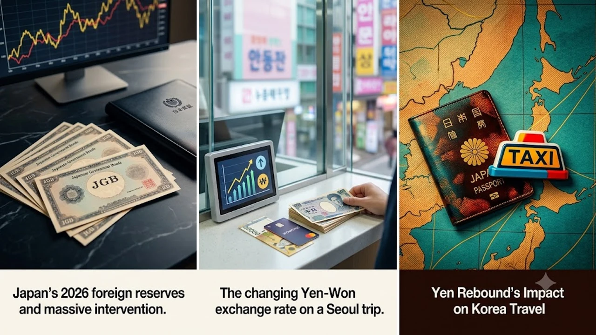

2026年秋、外国為替市場の潮目が一変し、待望の**円高反転**が現実味を帯びてきました。これまで1ドル＝160円前後の歴史的円安に苦しめられてきた日本の旅行者にとって、近場の海外旅行先である韓国は為替の恩恵を真っ先に実感できる舞台となります。為替レートの劇的な揺り戻しが、現地の体感物価や旅費総額にどのようなインパクトをもたらすのかを具体的に整理しました。

## 2026年9月最新！巨額為替介入と外貨準備急減の真相

### 財務省が9月7日に公表した最新統計と米国債売却の背景
財務省が2026年9月7日に発表した8月末時点の外貨準備高統計では、急激な外貨資産の減少が記録されました。市場の過度な円安投機を抑え込むため、政府・日本銀行が断続的に実施してきた大規模な為替介入（ドル売り・円買い）の痕跡が如実に表れた形です。米国債を中心とする証券残高を取り崩して円を買い支える動きは、当局の本気度をマーケットに強く印象づけました。

### 155円台への急速な円高シフトと日銀利上げ観測の連動
米国の利下げ観測と日本の金融政策正常化に伴う追加利上げ姿勢が重なり、ドル円相場はこれまでの円安一辺倒から1ドル＝150円台半ばへと急速に修正されました。日米の金利差縮小を背景にした円の買い戻しは、対ドルにとどまらずアジア通貨全般に対しても円高圧力を波及させています。

## 円高進行で激変！日韓為替レート（100円＝ウォン）の現状

### 記録的円安局面からの反転でウォン換算はどう変わったか
直近まで「100円＝850ウォン台」にまで落ち込み、日本の旅行者に重い割高感を突きつけていたウォン円レートですが、足元の円高反転によって「100円＝930ウォン台」の水準まで急速に回復しました。

- **100円＝850ウォン時代**: 10万ウォンの食事代が約11,760円
- **100円＝930ウォン時代**: 10万ウォンの食事代が約10,750円

わずか数週間の値動きで、決済金額が1割近く割り引かれる計算になります。

### 韓国旅行・現地決済におけるリアルな負担軽減度を検証
ソウル現地のカフェや屋台での飲食代、タクシー初乗り運賃（4,800ウォン）などを換算した際、以前のような「日本国内より割高」というストレスは確実に和らぎつつあります。かつてのような100円＝1,000ウォン超のバーゲン相場には届かないものの、為替の逆風が収まった心理的効果は絶大です。若者の間では、無駄遣いを徹底的に削ぎ落とす[2026年最新！低消費コアが日韓の若者にウケる本当の理由](/posts/japan-trends/2026-low-spend-core-z-generation-trend-japan-korea/)が定着していますが、為替の好転によって賢く楽しむ選択肢が広がっています。

## 秋の韓国旅行＆ショッピングへの具体的影響とおすすめ戦略

### ソウル旅のホテル代・グルメ代の体感コスト比較
明洞や弘大周辺のスタンダードホテル（1泊約15万ウォン）に宿泊する場合、円換算では1泊あたり1,500円以上の差が生じます。2泊3日〜3泊4日の日程であれば、宿泊費全体で5,000円前後の浮いた予算をタッカンマリやサムギョプサルといった本場グルメに回せる水準です。

### クレジットカード決済 vs 現金両替の今選ぶべき最適解
為替が円高方向へ動いている局面では、支払いのタイミングが後ろ倒しになるクレジットカード決済が理論的に有利となります。

> **為替変動局面での決済Tips**
> レートが日ごとに円高へシフトしている最中は、現地到着時の現金両替を最小限にとどめ、数日後の決済レートが適用されるクレジットカード（海外事務手数料が低いカード推奨）やWOWPASSを活用するのが損失を抑える鉄則です。

### 韓国コスメ・K-POPグッズ個人輸入の割安メリット
旅行者だけでなく、韓国内のオンラインモールからコスメや推し活グッズを取り寄せる個人輸入ユーザーにも直撃の追い風が吹いています。免税基準枠内での購入余力が増えるため、秋のメガ割シーズンなどを前にまとめ買いのハードルが一段と下がりました。

## 2026年後半の為替リスクと日韓往来の今後の見通し

### 9月日銀会合と米金融政策がもたらす再変動シナリオ
9月後半に控える日銀の金融政策決定会合と米FOMC（連邦公開市場委員会）の結果次第では、ボラティリティが跳ね上がるリスクが残ります。日米の政策金利動向が交錯するなかで一時的な円安の揺り戻しが起きる可能性も否定できず、一本調子の円高継続を盲信するのは禁物です。

### 韓国旅行のベストな予約タイミングとリスクヘッジ法
航空券やホテルを予約する際は、直前までキャンセル料が無料のプランを優先確保しつつ、為替動向を睨んで決済手段を柔軟に切り替える構えが賢明です。円高トレンドが定着すれば、2026年秋から年末にかけての日韓往来は一段と活況を呈することになります。

[韓国旅行用変換プラグ・便利グッズを쿠팡에서 보기](https://www.coupang.com/np/search?q=%EC%9D%BC%EB%B3%B8%20%EC%9D%B8%EA%B8%B0%EC%83%81%ED%92%88&sourceType=affiliate&trackingCode=AF8691300)

#日本トレンド #2026 #韓国 #為替レート #円高反転 #韓国旅行 #ソウル観光 #日銀利上げ