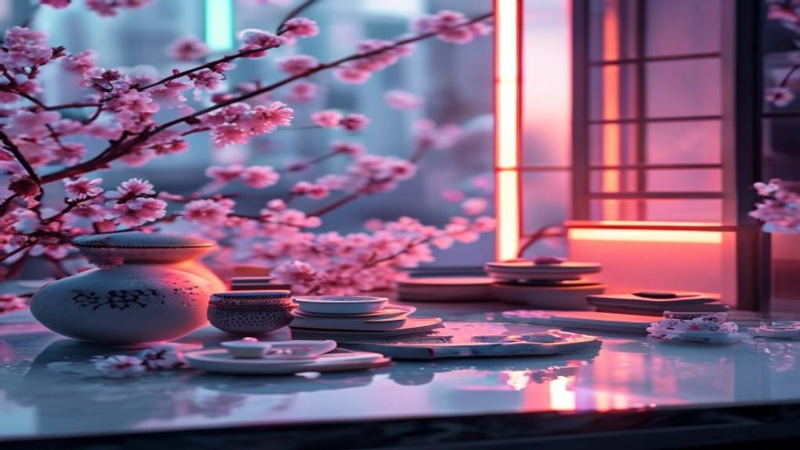
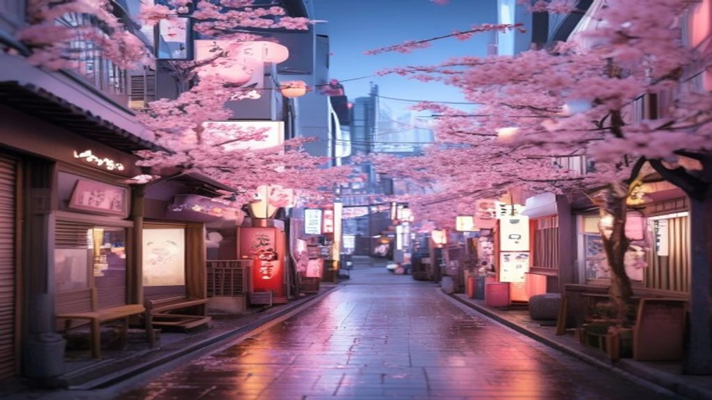

2026年に入り、日韓の若者の間で急速に支持を広げている新しいライフスタイルをご存知でしょうか。SNS上の華やかな演出に背を向けたZ世代を中心に、等身大の日常を肯定する**低消費コア**という価値観が爆発的なブームとなっています。過度な買い物を控え、精神的なゆとりを最優先するこの動きは、今後の市場を大きく揺るがすパワーを秘めています。

## 2026年最新トレンド「低消費コア」とは？若者の価値観激変

### SNS疲れが生んだ「飾らない日常」の美学
これまでのSNS空間は、高級ホテルでのステイやブランド品の購入など、いわゆる「映え」を競い合う場所として機能してきました。しかし、現在の若者層はこうした過剰な演出に対して強い精神的疲労を感じています。

完璧に加工された世界よりも、ありのままの生活に価値を見出す動きが活発化しました。実家で過ごす何気ない時間や、質素だけれど丁寧に作られた自炊の記録を投稿することが、逆に「リアルでかっこいい」と評価される時代が到来したのです。

### 韓国の「凡庸な日常」ブームが日本へ飛び火した背景
この現象の源流は、ソウルを中心とした韓国のZ世代にあります。韓国では、過酷な競争社会や物価高騰への反発として、あえて背伸びをしない「チルな生活」を共有するトレンドが先行していました。

> 「他人の目を気にして消費するのをやめたら、驚くほど心が軽くなった」

SNSで話題となったソウルの大学生の言葉に代表されるように、このマインドがTikTokやInstagramを通じて日本の若者へ瞬く間に波及しました。日本の若者もまた、長引く経済的不透明感の中で、韓国の「飾らない日常」に強い共感を抱いた結果と言えます。

### 従来の「タイパ・コスパ重視」と何が違うのか？
単なる節約や効率性の追求とは明確に一線を画します。従来のコスパ（コストパフォーマンス）は、「いかに安く効率的にモノを手に入れるか」という結果に焦点が当てられていました。

一方で、現在のトレンドは消費活動のプロセスそのものを問い直す動きです。「本当に自分に必要なものか」を厳格に見極め、不要な消費を削ぎ落とす過程に心地よさを感じています。所有することの執着から解放され、内面の平穏を得ることに本質的な価値が置かれている点が特徴的です。

[관련 글 보기](/posts/japan-trends/)

## お酒を飲まない「ソバーライフ」が日韓で定着した本当の理由

### 居酒屋文化の衰退？夜の街から朝活へシフトするZ世代
アルコールから距離を置く「ソバーライフ（Sober Life）」の定着も、この大きな流れの一部です。かつてのように夜遅くまで居酒屋で大酒を飲む文化は、若者の間で急速に魅力を失いつつあります。

夜の時間を睡眠や自己開発に充て、翌朝を快適に迎える「朝活」を選ぶ若者が急増しました。週末の午前中にカフェで読書をしたり、公園でヨガを行ったりするライフスタイルが、現在のステータスシンボルとして機能しています。

### 韓国의 논알코올 시장 급성장으로 보는 건강 지향의 이면
ソウルの若者の間では、ノンアルコール専門のバーや、デザイン性の高いプレミアム炭酸水が爆発的なヒットを記録しています。伝統的に飲酒文化が根強かった韓国でこの変化が起きた影響は計り知れません。

健康維持はもちろんのこと、精神的な自己コントロールを重視する姿勢が背景に存在します。お酒の力を借りずに、素の状態で深い人間関係を築くことこそが誠実であるという、新しい倫理観が定着しつつあるのです。

### 筆者が実践して気づいた「あえて飲まない」快適ライフのメリット
実際にアルコールを断つ生活を3ヶ月間継続してみると、生活の質が劇的に向上することに驚かされます。特に顕著な変化は以下の通りです。

- 毎朝の目覚めが圧倒的に爽快になり、午前中の集中力が持続する
- 飲み会に伴う突発的な出費が減り、趣味や貯蓄に回せる資金が増える
- 体調の波が穏やかになり、肌荒れや慢性的な疲労感が軽減される

付き合いで無理に飲む必要がなくなり、自分の時間を完全に支配しているという感覚は、何物にも代えがたい満足感をもたらします。

## 低消費コアがもたらすメリットと、実践における注意点

### 経済的自由だけじゃない！自己肯定感が上がる精神的メリット
無駄な出費を抑えることで、当然ながら経済的な余裕が生まれます。しかし、真の恩恵はそれ以上に精神面へもたらされる影響の大きさです。

他者の評価軸から離れ、自分の基準で生きているという実感は、自己肯定感を強力に底上げします。ブランド品で身を固める必要がなくなれば、他者と比較して落ち込む機会そのものが激減するからです。

### 単なる「ケチ」とは違う！こだわりにお金を使うメリハリ消費
誤解されがちですが、決して一切の支出を拒むケチな生活ではありません。自分の価値観に合致するものには、惜しみなく投資を行うメリハリが伴います。

* **削減する対象：** 見栄のための衣服、不要な交際費、惰性のコンビニ利用
* **投資する対象：** 長く使える上質な日用品、自己成長のための書籍、豊かな自然体験

このように、メリハリを明確にすることで、限られたリソースを自分の幸福へ最大効率で配分することが可能になります。

### 孤立に注意？ミニマリズムが行き過ぎた時のデメリット
一方で、極端な実践にはリスクも潜んでいます。出費を恐れるあまり、友人からの貴重な誘いをすべて断り続けると、人間関係のコミュニティが過度に縮小しかねません。

消費を減らすことが目的化してしまうと、生活そのものが無味乾燥なものに変貌します。大切なのは、豊かに生きるための手段として取り入れることであり、他者との温かい繋がりまで犠牲にしないバランス感覚が求められます。

## 2026年後半、企業が若者の心を掴むためのマーケティング戦略

### 「完璧なブランディング」はNG？人間味を出すSNS運用のコツ
このような価値観を持つ若者に対して、これまでの豪華できらびやかな広告は効果を失いつつあります。企業が発信するメッセージにも、高い透明性と人間味が求められるようになりました。

開発の裏側にある失敗談や、スタッフの等身大の日常をあえて公開するようなアプローチが有効です。不完全さを受け入れ、消費者と同じ目線で対話を試みる姿勢が、結果として深いブランドロイヤルティを醸成します。

### 日韓の成功事例に学ぶ！親近感を演出する商品開発
現在、日韓でヒットを記録しているアパレルや雑貨ブランドの多くは、過度なロゴの主張を避け、日常生活に溶け込むミニマルなデザインを採用しています。

あえて飾らない素朴さを前面に押し出しつつ、素材の良さや背景にあるストーリーを丁寧に伝えることで、若者の共感を獲得することに成功しました。デザインの引き算を行うことで、ユーザー自身がカスタマイズできる余白を残すことがヒットの鍵を握っています。

### 「低消費コア」世代に響く体験型コンテンツの作り方
モノを売るのではなく、それを通じて得られる「穏やかな時間」や「健全な体験」を提案することが最優先課題です。

例えば、製品の購入者限定で、早朝のクリーンアップ活動やマインドフルネスのワークショップへ招待する施策が挙げられます。派手なイベントではなく、社会や自己に真摯に向き合える場所を提供することが、現代のZ世代を惹きつける強力な誘引剤となるはずです。

#日本トレンド #低消費コア #ソバーライフ #Z世代 #2026年トレンド #日韓カルチャー #ライフスタイル