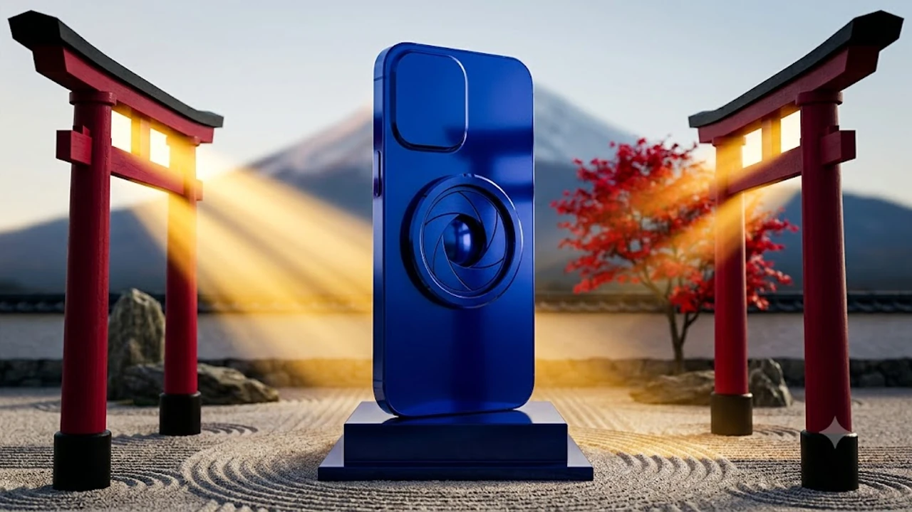

待ちに待った新型フラッグシップが店頭に並び、最新ガジェットを巡る買い替え商戦が一気に熱を帯びてきました。今回の**iPhone18 発売**を契機に機種変更を検討するにあたり、刷新された光学系や処理性能が日々の使い勝手にどれほどの恩恵をもたらすのかを確かめておきたいところです。

## iPhone 18の主な進化点と前モデルとの違い

### 待望の可変絞りカメラ機能と暗所撮影の進化
最大の注目点は、メイン広角レンズに導入された物理制御の可変絞り機構です。

従来の固定F値モデルでは、被写界深度のコントロールをポートレートモードなどのソフトウェア演算に頼っていました。今作ではレンズ内部の絞り羽根が機械的に稼働し、光量とボケ味を直接コントロールします。

- **晴天の屋外**: 絞り込むことで画面周辺部の描写を引き締め、風景全体の解像感を向上
- **夜景・薄暗い室内**: 開放にセットして受光面積を確保し、電子ノイズを抑えつつ自然なボケを獲得
- **近接撮影**: 料理や小物へ寄った際、被写体の一部だけが極端にボケる現象を物理的に抑制

デジタル特有の不自然な輪郭処理が大幅に抑えられ、大型センサー一眼のような素直な質感が得られます。

### A20チップ搭載による処理速度とAI処理能力
心臓部には次世代微細化プロセスで製造されたA20チップが投入されました。

ベンチマーク上の数値更新にとどまらず、オンデバイスで完結するニューラルエンジンのスループットが大幅に引き上げられています。

> 「クラウドを介さず端末内だけでリアルタイム文字起こしや映像のオブジェクト消去を実行可能」

通信環境に左右されず瞬時に機能が立ち上がるため、作業中の待機ストレスがほとんど生じません。

### バッテリー駆動時間の延長と筐体デザインの変更点
内部基板の高密度化と冷却構造の見直しにより、バッテリースペースの拡大に成功しました。

外観面では外周フレームのカーブが見直され、手のひらへの引っ掛かりが格段に安定しています。レンズユニットの突出部分はわずかに厚みを増したものの、重心バランスが中央寄りに再設計されたおかげで、片手操作時の重量感は以前より軽く感じられます。

## iPhone 18と17の実機比較・スペック検証

### ディスプレイ性能と屋外視認性の比較
直射日光下におけるピーク輝度が向上し、真夏の直射光下でも白飛びや反射に潰されることなく画面上の文字をはっきりと判読できます。

日常的なウェブ閲覧やSNSアプリのスクロールにおいても、可変リフレッシュレートの制御が一段と滑らかになり、残像感が極限まで抑えられています。

### 実際の処理ベンチマークスコアと発熱の比較
負荷の大きい3Dゲームタイトルを連続でプレイした場合でも、フレームレートの急激な低下（サーマルスロットリング）が起きにくくなりました。

チタンフレーム内部にグラファイトシートと新設計のベイパーチャンバーが配置されたことで、熱が特定箇所に集中せず、背面全体から効率よく逃げていきます。

### 価格差に見合う性能向上があるかの詳細検証
直前世代のiPhone 17と比較した際、純粋なブラウジングやメッセージの送受信だけであれば劇的な差を感じる場面は多くありません。

しかし、以下の用途に重きを置くユーザーであれば、価格差以上の価値を回収できます。

- 日常的に一眼カメラを持ち歩かず、スマホ1台で高品質なスナップ写真を残したい層
- ローカルAIによる長時間の音声文字起こしやリアルタイム翻訳を頻繁に利用するビジネス層
- 高負荷なグラフィックゲームを外出先で安定して長時間遊びたいゲーマー層

最近の消費トレンドとしては、派手な浪費を控えて実用性を見極める動きが定着しています。詳しくは[2026年最新！低消費コアが日韓の若者にウケる本当の理由](/posts/japan-trends/2026-low-spend-core-z-generation-trend-japan-korea/)でも取り上げられている通り、スペックの数値よりも「自分の生活コストや効率に見合うか」を基準に選ぶ視点が欠かせません。

## 実際に購入して分かったメリットと気になるデメリット

### 日常使いで実感できるレスポンスと新機能の長所
アプリの切り替えやカメラの即時起動において、操作の引っ掛かりが完全に払拭されています。

特にシャッターボタンを押した瞬間のタイムラグがなく、動くペットや子供の表情を逃さず記録できる点は大きな強みです。

### 重量増と価格設定に見る気になった短所
一方で、購入前に把握しておくべき妥協点も存在します。

- 可変絞りユニットの搭載に伴い、カメラユニット側の重量がわずかに増大
- 為替動向や部材コストの上昇を受けた基本価格設定のハードルの高さ
- 既存の保護ケースや一部のMagSafe車載ホルダーとの干渉（レンズ窓の大型化による）

特にケース選びに関しては、カメラ開口部が前モデルと完全に異なるため、以前の資産を流用できない点に注意が求められます。

### どんな使い方をする人に適しているかの評価
iPhone 15以前のモデル、あるいはLightning端子世代を使い続けているユーザーにとっては、文句なしのジャンプアップとなります。

一方で、iPhone 17を所持しており静止画のボケ感や極端な暗所撮影に強いこだわりがない場合は、無理に今すぐ買い替える必要性は薄いといえます。

## 損をしないための予約・購入ステップと初期設定

### 公式ストアと各キャリアでの最もお得な購入ルート
購入費用を最小限に抑えるためには、販売チャネルごとの特性を把握しておくことが不可欠です。

- **Apple Store直販**: 余計な頭金がなく、SIMフリーモデルを一括または金利ゼロの分割で購入可能
- **大手通信キャリア**: 2年後の端末返却プログラムを利用することで、実質負担額を定価の半額程度に抑制

通信プランの見直しを同時に行わない場合は、直販ルートで端末単体を入手するほうが総支払額を低く抑えられます。

### 旧端末の下取りキャンペーンを活用する手順
手持ちの旧型iPhoneは、発売直後のタイミングが最も査定額が高く維持されます。

バックアップを確実に取得したうえで、公式のTrade Inサービスや中古買取専門店の増額キャンペーンを比較検討するのが堅実です。本体の傷やバッテリー最大容量によって減額される幅も異なるため、複数箇所の見積もりを素早く確認することをおすすめします。

### データ移行と新AI機能をスムーズに有効化する設定
端末が手元に届いたら、旧端末を隣に置くだけで完結するクイックスタートで移行を進めます。

移行完了後は、プライバシー設定からオンデバイス処理の学習許可項目を整え、文字起こし辞書の最適化を済ませておくことで、初日から新設計チップの恩恵をフルに引き出せます。

手に入れた新型端末の画面を傷や衝撃から守るためにも、精度の高い保護ガラスや専用アクセサリーを事前に揃えておくと安心です。
[関連商品をチェック](https://www.coupang.com/np/search?q=%EC%9D%BC%EB%B3%B8%20%EC%9D%B8%EA%B8%B0%EC%83%81%ED%92%88&sourceType=affiliate&trackingCode=AF8691300)

#日本トレンド #iPhone18 #ガジェットレビュー #スマートフォントレンド #新型iPhone #2026年最新 #日韓比較