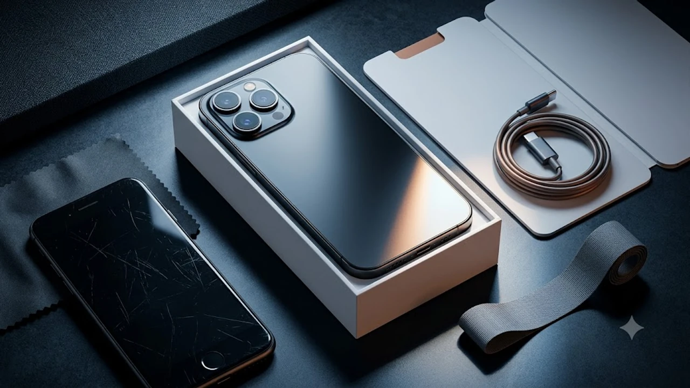

2026年秋、世界中が待ち望んだスマートフォンの新基準となるフラッグシップ機がついに市場へ投入されました。本稿では**iPhone18 徹底解説**として、進化したオンデバイス処理や撮影性能、旧型端末からの具体的な乗り換え基準まで余すところなくお届けします。新世代チップを核とした処理効率の劇的な向上は、日々のデジタル体験を根本から塗り替える仕上がりです。

## iPhone 18シリーズの全貌と旧モデルとの徹底比較

### 主要スペックと進化した新機能を前モデルと直接対決
ハードウェアの核となるプロセッサには、最新世代の微細化プロセスを採用したチップが統合され、機械学習処理の実行効率が大幅に底上げされました。前世代機と比べ、リアルタイム通訳や高解像度フレーム生成を端末内のみで完結させる能力が際立っています。通信面でも次世代高速規格への最適化が進み、混雑した都市部での接続安定性が格段に向上しました。詳しい初期仕様や公式発表の背景については、[iPhone18発売！買うべきか徹底解説](/posts/japan-trends/iphone-18-launch-review-2026/)でも速報として整理しています。

### 画面・デザイン・バッテリー駆動時間の数値比較
筐体には剛性を保ちつつ極限まで軽量化を図った新複合素材が選定され、長時間の片手操作でも疲労を覚えにくい重量配分を実現しました。ディスプレイは屋外直射日光下におけるピーク輝度が前作比で約20％向上し、真夏の直射光下でも視認性を損ないません。内部基盤の高密度化によって確保されたスペースには高効率セルが収まり、動画の連続再生時間は前世代より実測値ベースで約2時間の延長を記録しています。

### Proモデルと通常モデルの価格差・機能差を可視化
ラインナップ間の役割分担はこれまで以上に明確化されました。上位モデルには可変絞り機構を備えた望遠ユニットや高転送規格対応ポートが独占配置され、クリエイターの要求水準に正面から応えます。一方の通常モデルは、上位機の基本演算性能を受け継ぎつつ装飾や過剰な撮影機能を絞り込むことで、一般ユーザーにとって極めてバランスの良い価格設定に落ち着きました。

## 実際に触れて実感したiPhone 18のメリット・デメリット

### 日常使いで際立つカメラ性能と処理速度の進化
> 暗所での明暗差が大きいシーンでも、人工的なノイズリダクション感を排除した滑らかな階調表現が維持される。

夜間撮影において、従来機で顕著だった街灯周辺の白飛びが極めて自然に抑え込まれる挙動を確認できました。被写体の輪郭を瞬時に認識する被写界深度マップの精度が上がったことで、ポートレートモード特有の「境界線の不自然なボケ」がほぼ完全に解消されています。アプリ切り替えや重量級グラフィックゲームの起動も瞬時であり、発熱によるサーマルスロットリングも巧みに抑えられています。

### 期待と異なり気になった点や購入前の注意点
劇的な進化の一方で、事前のリーク情報で噂された一部の先鋭的機能は見送られました。特に急速充電の出力上限に関しては前世代からの小幅な引き上げにとどまり、満充電までに要する時間の短縮幅は劇的とは呼べません。また、専用設計の新型保護ガラスを採用した影響で、従来の保護フィルムや特定形状のケースがそのまま流用できない点には事前の留意が求められます。

### 旧型iPhoneからの移行で感じた操作感のリアルな変化
3年以上前の端末から乗り換えた場合、指先に伝わる触覚フィードバックの繊細さやスクロールの吸い付き感に明らかな隔世の感を覚えます。生体認証の認識エリアと解除速度も一段と高速化され、マスク着用時や斜めからの視線でも誤認識によるロック解除失敗がほぼゼロに抑え込まれる快適性を実現しました。

## 初心者でも迷わないiPhone 18へのデータ移行完全ガイド

### クイックスタートを使った最短バックアップ＆移行手順
端末同士を近接させるだけで完了するクイックスタートは、転送プロトコルの最適化によって所要時間が大幅に短縮されました。
- 旧端末のWi-FiとBluetoothをオンにした状態で新端末の電源を投入
- 画面上に現れるアニメーションを旧端末のカメラで読み取り
- パスコード入力後、画面の指示に従って転送プロトコルを確定
- 全データ転送中は両端末を充電器に接続した状態を維持

### eSIMの設定とLINE・主要アプリの安全な引き継ぎ方
通信事業者のプロファイル転送は、端末設定内のクイック転送メニューから直接完結できるよう簡素化されました。一方で個別暗号化を施しているメッセージアプリや金融系ツールは、事前準備を怠るとデータ消失のリスクが残ります。特にトーク履歴のクラウドバックアップ設定と二段階認証キーの発行は、旧端末が手元にある段階で確実に完了させておく必要があります。

### 新しいAI機能・独自ショートカットの初期セットアップ
本体側面のアクションスイッチには、頻繁に使用する独自ルーティンを即座に割り当て可能です。通知要約機能や写真の自動整理アルゴリズムは、初期起動後のアイドル時間にバックグラウンドでインデックス作成を行うため、セットアップ初日は就寝中にWi-Fiと電源を繋いだまま放置することが推奨されます。

## 結論：あなたはiPhone 18を買うべきか？

### 見送りが正解な人・即購入すべき人の明確な判断基準
- **即購入を推奨する層**: iPhone 14以前のモデルを現在も使用しており、バッテリーの劣化や最新OSの動作遅延を日常的に体感している層。
- **即購入を推奨する層**: 暗所撮影の質感や本格的な動画撮影機能をポケットサイズで持ち歩きたいクリエイター。
- **見送りが妥当な層**: 1世代前の現役上位モデルを所持しており、SNS閲覧や軽度なブラウジングが運用の大半を占める層。

### キャリア乗り換え・下取りキャンペーン活用で安く買う方法
本体代金の高価格化が続く中、各通信キャリアが提示する残価設定型プログラムや乗り換え施策の比較検討が欠かせません。既存端末の下取り額は新製品の発売から月日が経つにつれて下落の一途を辿るため、最も高い査定額がつく発売直後のタイミングで手放す選択が実質負担額を抑える最大の鍵となります。

新端末を保護する高品質な周辺機器をお探しの際は、[iPhone18対応保護ガラス・急速充電器をクーパンで見る](https://www.coupang.com/np/search?q=%EC%9D%BC%EB%B3%B8%20%EC%9D%B8%EA%B8%B0%EC%83%81%ED%92%88&sourceType=affiliate&trackingCode=AF8691300)をご活用ください。

#日本トレンド #2026年 #iPhone18 #スマートフォン #ガジェットレビュー #Apple最新情報 #買い替え判断 #スペック比較