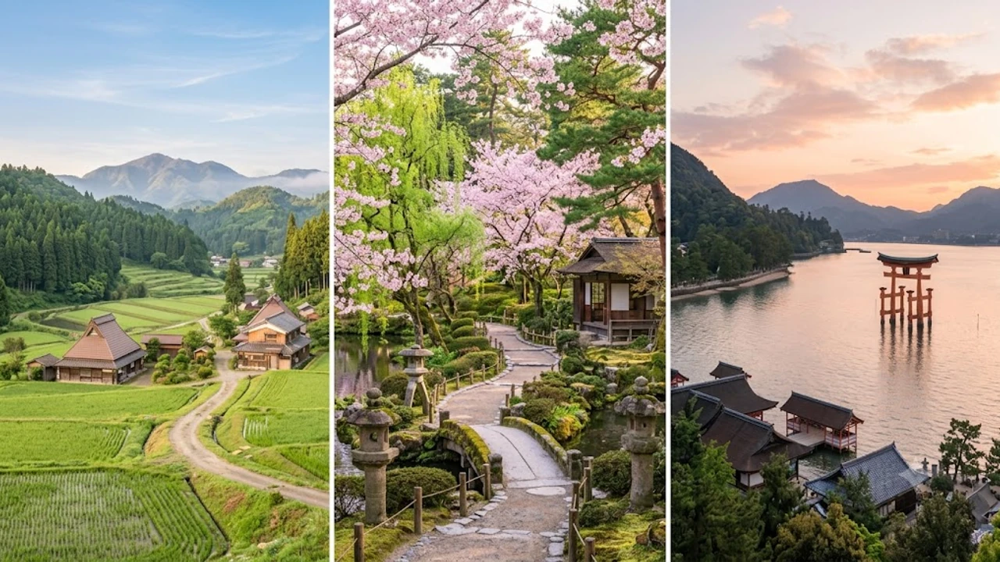

秋の行楽シーズンを目前に控え、旅行コミュニティで爆発的な反響を呼んでいるのが電撃発表された「JR九州全線乗り放題パス」の全貌だ。新幹線や特急列車の自由席まで網羅する圧倒的な機動力を誇り、同時期に解禁された宿泊支援策「九州ふっこう応援割」と併用することで、従来の周遊ルートを大幅に塗り替えるコストパフォーマンスを実現する。

## 九州新幹線も網羅する特別企画乗車券の全貌と利用条件

### 対象路線と新幹線・特急列車の利用範囲
博多から鹿児島中央を結ぶ九州新幹線をはじめ、武雄温泉から長崎を結ぶ西九州新幹線、さらには島内全域に広がる在来線特急列車の普通車自由席が乗り降り自由となる。従来のエリア限定型周遊券と異なり、県境を跨いだ超長距離の移動を一気通貫でカバーできる点が最大の強みだ。

- 九州新幹線（博多〜鹿児島中央）：自由席利用可能
- 西九州新幹線（武雄温泉〜長崎）：自由席利用可能
- JR九州全線の在来線特急・普通・快速列車：自由席乗り放題
- 指定席の利用：所定の追加料金または指定席券の発券ルールに準拠

### 発売期間と利用可能日数・価格設定
連続する3日間有効となる本パスは、週末や祝日を含む秋の行楽期をターゲットに設定された。価格は大人20,000円前後に抑えられ、博多—鹿児島中央間を新幹線で往復（通常約21,000円）するだけでも即座に元が取れる設計となっている。

### 購入方法と利用開始時の注意点
JR九州の公式ネット予約サイト（JR-KYUSHU Train Reservation）および主要駅のみどりの窓口・指定席券売機で購入手続きを行う。利用開始当日は自動改札機に直接投入できる磁気券として発券されるため、混雑する連休初日でもスムーズな入場が可能だ。

## 「九州ふっこう応援割」との併用が生み出す爆発的コスト破壊

### 宿泊最大50%割引との相乗効果
各オンライン旅行代理店（OTA）で順次受付が始まった「九州ふっこう応援割」を組み合わせることで、遠征全体の費用負担が劇的に圧縮される。1泊あたり上限5,000円〜10,000円規模の補助が適用されるため、移動費と宿泊費の双方で記録的な値引きを享受できる。

> 移動と宿泊のダブル割引によって、通常なら5万円超を要する2泊3日の縦断旅行が、実質2万円台前半まで抑えられる計算となる。

### 浮いた予算を活かす現地体験・グルメ戦略
移動コストが極小化されたことで、浮いた予算を現地の高単価アクティビティやご当地グルメに再配分する旅行者が続出している。呼子のイカ、熊本のあか牛、鹿児島の黒豚といった各地の名産品を巡るフードツーリズムが一段と身近になった。

## 韓国インバウンド急増と福岡ゲートウェイの周遊革命

### 福岡空港INで挑む「九州一円縦断」の最適解
韓国からの直行便が過密ダイヤで乗り入れる福岡空港は、入国手続きを終えてから博多駅まで地下鉄でわずか5分という世界有数の利便性を誇る。今回のパスを活用すれば、福岡をハブにして初日に長崎へ向かい、2日目に熊本・鹿児島を駆け抜け、3日目に別府温泉を経由して博多へ戻る黄金ルートが成立する。

### 日韓旅行コミュニティでバズを生む移動の最適化
韓国のNAVERカフェやSNS上では、発表直後から「九州縦断の最短攻略ルート」に関する投稿が相次いだ。手軽な週末弾丸旅行から本格的な秋の温泉巡りまで、手頃な周遊パスの登場が旅行者の行動半径を一気に押し広げている。

国内各地の最新動向や旅行・ライフスタイルの変化については、[日本トレンド全体記事](/posts/japan-trends/)でも継続して追跡している。

## 混雑を回避して快適に走破する実戦テクニック

### 自由席の確保と乗車タイミングの見極め
行楽シーズンの新幹線「みずほ」「さくら」や人気特急「ソニック」「リレーかもめ」は、博多発着の時間帯によって自由席の争奪戦が発生しやすい。始発駅からの乗車を徹底し、ホームには発車15〜20分前に並ぶ立ち回りが移動ストレスを最小化する。

### 荷物預け入れとスマートな駅ナカ活用
長距離移動を軽快にこなすには、各主要駅（博多、熊本、鹿児島中央）のコインロッカー空き状況や手荷物配送サービスの事前把握が欠かせない。荷物をホテルへ先送りし、身軽な状態で途中下車を楽しむのが賢い選択だ。

旅先での歩行負担を軽減し、長時間の移動を快適にサポートするアイテムも事前に揃えておきたい。
[旅行用軽量フットケアグッズをチェック](https://www.coupang.com/np/search?q=%EC%9D%BC%EB%B3%B8%20%EC%9D%B8%EA%B8%B0%EC%83%81%ED%92%88&sourceType=affiliate&trackingCode=AF8691300)

#日本トレンド #JR九州 #乗り放題パス #新幹線 #ふっこう割 #九州旅行 #インバウンド #2026年