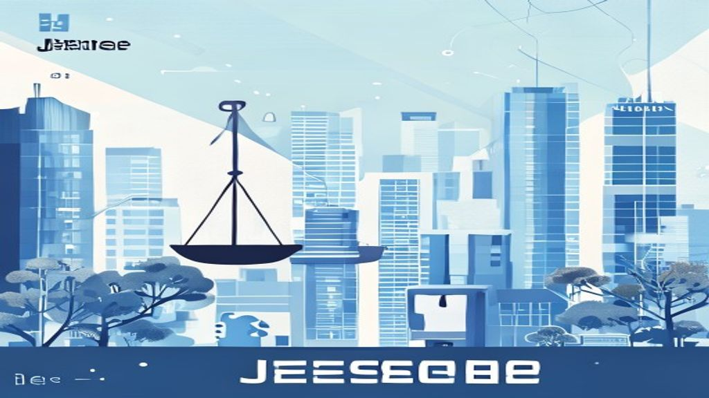
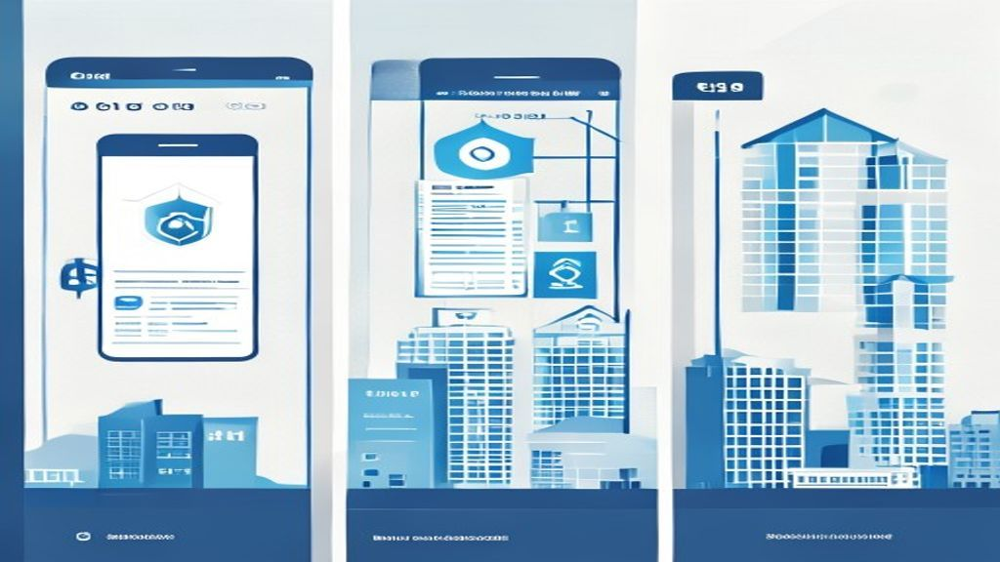

안녕하세요! 2026년 임대차 시장, 과연 우리에게 어떤 변화를 가져올까요? 특히 **2026년 전세 월세 정책**은 실수요자 여러분의 주거 안정에 직접적인 영향을 미칠 텐데요. 최근 급변하는 **임대차 시장 변화** 속에서 정부가 내놓은 **정부 대책**의 숨은 핵심을 함께 파헤쳐 보고, 여러분이 현명한 선택을 할 수 있도록 실질적인 가이드를 제시해 드리겠습니다. 단순히 정보를 나열하는 것을 넘어, 여러분의 입장에서 깊이 있게 분석해 드릴게요.

## 2026년 임대차 시장, 왜 월세화가 가속될까?

최근 몇 년 사이 임대차 시장은 전세에서 월세로 빠르게 전환되는 추세입니다. 이러한 월세화는 단순히 일시적인 현상이 아니라, 여러 구조적인 원인이 복합적으로 작용하여 가속되고 있어요. 여러분도 체감하고 계시겠지만, 전세 매물을 찾기가 점점 어려워지고 있지 않나요?

### 전세 공급 부족 심화의 구조적 원인과 전망, 고금리 기조와 임대인의 월세 선호 현상 심층 분석

전세 공급이 줄어드는 가장 큰 원인 중 하나는 바로 **고금리 기조**입니다. 임대인 입장에서는 전세 보증금을 받아 은행에 넣어두는 것보다, 월세를 받아 매달 안정적인 현금 흐름을 확보하는 것이 더 매력적으로 느껴질 수 있어요. 과거 저금리 시대에는 전세 보증금을 받아 투자 수익을 노릴 수 있었지만, 지금은 그 이점이 크게 줄었죠. 예를 들어, 보증금 3억 원을 받았을 때 연 2% 수익은 600만 원이지만, 월세 100만 원이면 연 1,200만 원의 수익이 발생합니다. 임대인에게는 훨씬 유리한 구조가 된 거죠.

또 다른 구조적 원인은 **전세사기**의 여파입니다. 전세사기로 인해 임대인과 임차인 모두 전세에 대한 불신이 커졌고, 정부의 규제 강화로 임대인들이 전세 운영에 부담을 느끼는 경우가 늘었습니다. 전세 보증금 반환에 대한 책임이 커지면서, 차라리 월세로 전환하여 리스크를 줄이려는 움직임이 강해진 것이죠. 이런 현상은 단기적으로 끝나지 않고, 당분간은 월세화가 더욱 심화될 것으로 전망됩니다. 여러분이 전세를 고집하기보다 월세도 하나의 합리적인 선택지로 고려해야 하는 시점이 온 거예요.

## 정부의 2026년 임대차 정책, 숨은 핵심 3가지

정부는 이러한 임대차 시장 변화에 대응하기 위해 여러 정책을 내놓고 있습니다. 단순히 발표되는 정책의 표면적인 내용만 볼 것이 아니라, 그 안에 숨겨진 진짜 의도와 효과를 파악하는 것이 중요합니다. 특히 실수요자 입장에서 어떤 장단점이 있는지 꼼꼼히 따져봐야 합니다.

### 전세사기 예방을 위한 정보 공개 강화: '안심 전세 앱'의 장단점, 임차인 주거 안정을 위한 금융 지원 확대: 전세보증금 반환보증 보험의 실효성, 임대차 3법 이후 시장 안정화 노력과 그 한계점

첫 번째 핵심은 **전세사기 예방을 위한 정보 공개 강화**입니다. 대표적인 것이 바로 **'안심 전세 앱'**이죠. 이 앱은 임대인의 세금 체납 여부, 선순위 채권 정보, 주택의 시세 등을 제공하여 임차인이 계약 전에 위험을 미리 파악할 수 있도록 돕습니다. 분명 긍정적인 측면이 있어요. 과거에는 알기 어려웠던 정보를 손쉽게 얻을 수 있게 되어 계약의 투명성이 높아졌습니다. 하지만 한계도 있습니다. 앱에 등록되지 않은 정보나 실시간으로 반영되지 않는 부분이 있을 수 있고, 앱 정보만 맹신하다가 놓치는 부분이 생길 수도 있습니다. 결국 앱은 보조 도구일 뿐, 직접 발품을 팔고 서류를 확인하는 노력이 여전히 필요하다는 점을 잊지 마세요.

두 번째는 **임차인 주거 안정을 위한 금융 지원 확대**입니다. **전세보증금 반환보증 보험** 가입을 독려하고, 그 문턱을 낮추려는 노력이 계속되고 있습니다. 이 보험은 전세 계약 만료 시 임대인이 보증금을 돌려주지 못할 경우 주택도시보증공사(HUG) 등 공공기관이 대신 보증금을 지급해 주는 제도죠. 임차인의 보증금을 지켜주는 가장 강력한 안전장치라고 할 수 있습니다. 저도 주변에 이 보험 가입을 적극 권하고 있는데요. 하지만 아쉬운 점도 있습니다. 보증료 부담이 있고, 일부 악성 임대인의 경우 보증 가입 자체를 거부하는 사례도 있어요. 또한, 보증금 반환 절차가 생각보다 오래 걸릴 수 있다는 점도 염두에 두어야 합니다.

세 번째는 **임대차 3법 이후 시장 안정화 노력과 그 한계점**입니다. 계약갱신청구권, 전월세상한제 등을 골자로 한 임대차 3법은 임차인의 주거 안정에 기여하려는 취지였지만, 시장에서는 전세 매물 감소, 월세 전환 가속화 등의 부작용을 낳기도 했습니다. 정부는 이러한 한계점을 인지하고, 등록임대사업자 제도 개편 등을 통해 시장에 임대 매물 공급을 유도하고 있습니다. 하지만 임대인과 임차인 모두의 만족을 이끌어내는 정책은 쉽지 않은 과제입니다. 정책이 시장에 미치는 영향을 꾸준히 모니터링하며 유연하게 대처하는 것이 중요하다고 생각합니다.

## 임차인이 꼭 알아야 할 '보증금 지키기' 실전 가이드

보증금은 우리에게 정말 소중한 재산입니다. 전세사기 같은 불행한 일을 겪지 않으려면, 계약 단계부터 철저하게 준비하고 대비하는 자세가 필요해요. 제가 직접 경험하고 주변에서 들었던 이야기들을 바탕으로 실질적인 팁을 알려드릴게요.

### 계약 전 필수 확인 사항: 등기부등본, 건축물대장 꼼꼼히 보는 법 (경험담), 전세보증금 반환보증 보험, 가입은 필수! (실제 가입 후기), 전입신고와 확정일자, 그리고 '안심 전세 앱' 활용 팁 (튜토리얼)

**등기부등본과 건축물대장**은 집을 계약하기 전에 반드시 확인해야 할 기본 중의 기본입니다. 저도 처음 전세 계약을 할 때 잘 몰라서 중개사님 말만 믿고 대충 봤던 기억이 있어요. 하지만 나중에 알고 보니 대출이나 다른 권리 관계가 복잡하게 얽혀 있는 경우가 많더라고요. 등기부등본은 '을구'를 통해 해당 주택에 설정된 근저당권 등 채권 관계를 확인해야 합니다. 만약 채권 최고액이 주택 가격의 60%를 넘는다면 일단 의심하고 다시 생각해봐야 해요. '갑구'에서는 소유권 변동 이력을 볼 수 있고요. 건축물대장은 실제 건물의 용도와 면적이 등기부등본과 일치하는지, 불법 증축이나 개조는 없는지 확인하는 용도로 활용하세요. 등기부등본은 대법원 인터넷등기소에서, 건축물대장은 정부24에서 쉽게 발급받을 수 있습니다.

**전세보증금 반환보증 보험**은 이제 선택이 아닌 필수가 되어야 한다고 생각합니다. 저도 처음에는 보증료가 아까워서 가입을 망설였지만, 만약의 사태에 대비하는 가장 확실한 방법이라는 것을 깨달았습니다. 실제로 제 지인 중 한 분은 임대인이 갑자기 연락 두절되어 큰 어려움을 겪었는데, 이 보험 덕분에 보증금을 안전하게 돌려받을 수 있었어요. 가입 조건이 까다롭다고 느낄 수도 있지만, HUG나 HF 등 보증기관 홈페이지에서 자세한 안내를 받을 수 있고, 요즘은 은행에서도 쉽게 상담받을 수 있습니다. 미리미리 준비해서 마음 편하게 지내세요.

마지막으로 **전입신고와 확정일자**는 보증금을 지키는 가장 기본적인 법적 장치입니다. 계약 후 잔금을 치르고 입주하는 즉시 동사무소나 인터넷으로 전입신고를 하고, 임대차 계약서에 확정일자를 받아야 합니다. 이는 여러분이 해당 주택에 거주하고 있음을 공적으로 증명하고, 나중에 문제가 생겼을 때 우선적으로 보증금을 돌려받을 수 있는 대항력과 우선변제권을 확보하는 중요한 절차예요. 그리고 앞서 언급한 **'안심 전세 앱'**도 적극 활용해 보세요. 계약하려는 집의 시세나 선순위 채권 정보를 미리 확인하고, 계약 후에도 전입신고 및 확정일자 정보 등을 앱에 연동하여 관리하면 한결 마음이 놓일 겁니다.

## 전세 vs 월세, 2026년 당신의 현명한 선택은?

임대차 시장의 변화 속에서 전세와 월세 중 어떤 것을 선택해야 할지 고민이 많으실 겁니다. 정답은 없지만, 여러분의 상황과 가치관에 따라 현명한 선택을 할 수 있도록 재정적, 심리적 요인을 비교 분석해 드릴게요.

### 월세 전환 시 고려해야 할 재정적, 심리적 요인 비교, 전세 유지 시 리스크 관리 및 안전 장치 활용법의 장단점

**월세로 전환할 경우** 가장 큰 장점은 초기 목돈 부담이 적다는 점입니다. 전세 보증금을 마련하기 위한 대출 이자 부담이나 종잣돈을 모으는 스트레스에서 벗어날 수 있죠. 매달 고정적으로 지출되는 월세는 계획적인 소비를 가능하게 하고, 남은 여유 자금으로 다른 투자를 하거나 저축을 할 수도 있습니다. 하지만 단점도 분명합니다. 매달 나가는 월세는 회수되지 않는 비용이라는 인식이 강하고, 장기적으로 보면 전세 대출 이자보다 총 지출액이 더 커질 수 있습니다. 또한, 보증금이 적다 보니 집주인의 동의 없이 인테리어 등을 변경하기 어려운 심리적 제약도 있을 수 있습니다. 월세는 '내 돈이 사라지는 것 같다'는 심리적 부담을 줄 수는 있지만, 주거의 안정성과 유연성 측면에서는 장점이 있습니다.

반면, **전세를 유지할 경우**의 가장 큰 장점은 주거비용이 상대적으로 안정적이라는 것입니다. 전세 대출 이자를 제외하면 매달 고정적으로 나가는 주거비가 없어 목돈을 모으기 유리하다고 생각할 수 있습니다. 또한, 보증금을 돌려받아 다른 투자처로 활용할 수 있는 기회비용도 무시할 수 없죠. 하지만 전세사기 위험, 보증금 미반환 리스크가 여전히 존재하고, 높은 전세가 때문에 대출 부담이 커질 수 있습니다. 이러한 리스크를 관리하기 위해서는 앞서 말씀드린 **전세보증금 반환보증 보험 가입**이 필수적이며, 계약 전 **등기부등본과 건축물대장 확인**을 철저히 하는 등 안전 장치를 적극적으로 활용해야 합니다. 결국, 월세는 안정적인 현금 흐름과 낮은 초기 부담을, 전세는 목돈 활용의 기회와 이자 부담을 감수하는 주거 방식이라고 비교할 수 있습니다. 여러분의 현재 재정 상황과 미래 계획을 신중하게 고려하여 결정하세요.

## 2026년 임대차 시장, 임대인과 임차인의 상생 방안은?

급변하는 임대차 시장에서 임대인과 임차인 모두가 만족할 수 있는 상생의 길을 모색하는 것은 쉽지 않습니다. 하지만 서로의 입장을 이해하고 합리적인 방안을 찾아나가는 노력이 필요합니다.

### 임대인 입장에서 본 정책 변화의 영향과 대응 전략, 임차인의 권리 강화와 합리적인 주거 선택의 중요성

**임대인 입장**에서는 최근 정책 변화가 다소 부담스럽게 느껴질 수 있습니다. 전세사기 예방을 위한 정보 공개 강화나 보증금 반환 책임 강화 등은 임대인에게 더 많은 의무와 책임을 요구하기 때문이죠. 하지만 이러한 변화는 장기적으로 시장의 투명성과 신뢰도를 높여 건강한 임대차 시장을 조성하는 데 기여할 것입니다. 임대인 여러분은 이러한 변화를 위기가 아닌 기회로 삼아, 임차인의 주거 안정을 위한 노력에 적극적으로 동참하는 것이 중요합니다. 예를 들어, 보증금 반환보증 보험 가입에 협조하고, 주택 관리를 더욱 철저히 하며, 합리적인 임대료를 책정하는 등의 노력을 통해 신뢰받는 임대인이 될 수 있습니다. 이는 결국 공실률을 줄이고 안정적인 임대 수익을 확보하는 데 도움이 될 것입니다.

**임차인의 권리 강화**는 시대적 흐름이며, 이는 더욱 가속화될 것입니다. 임차인 여러분은 이러한 변화 속에서 자신의 권리를 정확히 인지하고, 합리적인 주거 선택을 위해 적극적으로 정보를 탐색해야 합니다. 단순히 '싸고 좋은 집'을 찾는 것을 넘어, 안전하고 안정적인 주거 환경을 확보하는 것을 최우선 가치로 두어야 합니다. 그러기 위해서는 계약 전 충분한 정보 탐색, 보증금 보호를 위한 안전 장치 활용, 그리고 임대인과의 원활한 소통이 필수적입니다. 정부 정책은 임차인의 주거권을 보호하려는 방향으로 나아가고 있으니, 이러한 정책들을 적극적으로 활용하며 자신의 주거 선택지를 넓혀나가세요.

2026년 임대차 시장은 계속해서 진화할 것입니다. 이 글이 여러분의 현명한 주거 선택에 작은 도움이 되기를 바랍니다.

[다른 한국 부동산 정책 분석 글 보기](/posts/kr-realestate/)

**함께 읽으면 좋은 글**
- [공급절벽 2026 아파트 시장, 진짜 전세가 매매가 밀어 올릴까](/posts/kr-realestate/supply-shortage-jeonse-caps-property-2026/)
- [2026 1기 신도시 재건축 선도지구 투자 전략](/posts/kr-realestate/1st-newtown-reconstruction-2026/)

#2026년전세월세정책 #임대차시장변화 #정부대책 #전세사기예방 #안심전세앱 #전세보증금반환보증 #월세화가속 #부동산전망 #실수요자가이드 #주거안정 #임대차3법