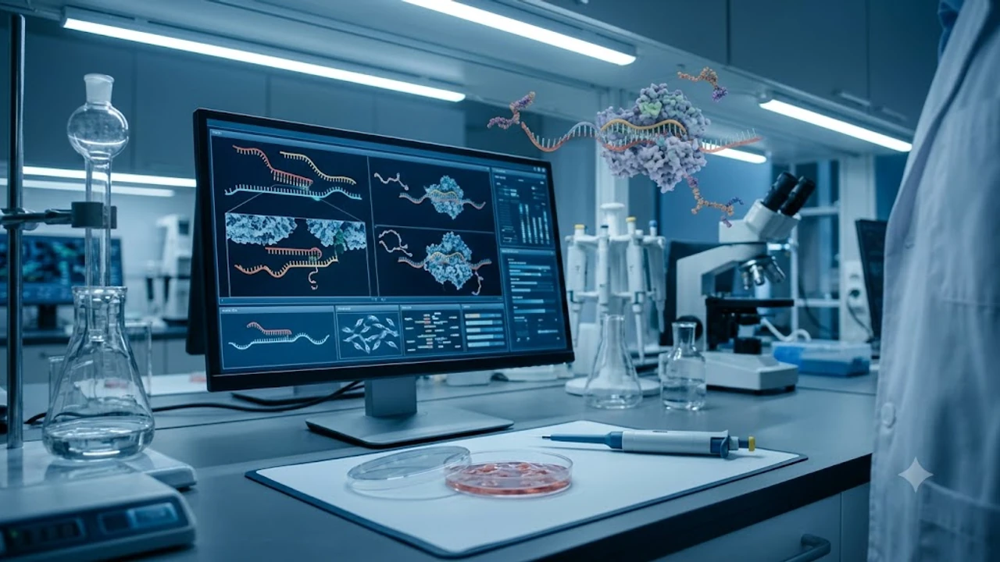

매년 10월 초 전 세계 과학계와 의학계의 시선이 집중되는 **2026 노벨생리의학상 발표**는 난치병 극복의 판도를 뒤흔들 중대한 변곡점입니다. 스웨덴 카롤린스카 연구소 노벨위원회가 낙점한 이번 수상 연구는 단순한 기초과학의 확장을 넘어, 유전자 발현 정밀 제어와 면역 기전 규명의 완성을 증명했습니다. 생명공학의 최전선에서 암과 퇴행성 뇌질환 환자의 치료 패러다임을 바꾼 역사적 성과로 평가받습니다.

## 2026 노벨생리의학상 수상 연구의 핵심 메커니즘

### 비코딩 RNA 정밀 조절을 통한 유전자 제어
수상 연구진은 세포 내 유전 정보를 단백질로 전환하는 과정에서 비코딩 RNA가 수행하는 미세 교정 스위치를 완벽하게 밝혔습니다. 특정 단백질이 과발현되어 종양이나 염증을 유발하기 전 단계에서 생체 신호를 차단하는 경로를 특정했습니다. 기존 화학 합성 의약품이 접근조차 못 했던 80% 이상의 미개척 단백질 영역을 공략할 발판을 마련했습니다.

### 오토파지 조절 인자와 세포 항상성 유지
손상된 세포 내 소기관을 분해해 에너지로 재활용하는 오토파지(자가포식)의 구체적인 제어 단백질군을 규명했습니다. 정상 세포와 병변 세포 간의 대사 스트레스 반응 경로를 분자 수준에서 매핑했습니다. 이는 자가면역 질환에서 면역세포가 폭주하는 기전을 억제하는 핵심 열쇠로 작동합니다.

## 현대 임상의학에 미치는 파급 효과와 치료제 개발

### 암세포 면역 회피 차단과 4세대 표적항암제
암세포가 인체 면역세포의 감시망을 무력화하기 위해 내뿜는 차폐 단백질을 선택적으로 무력화하는 기술이 검증되었습니다. 표준 항암 화학요법 투여 시 불가피하게 따르던 약물 저항성을 대폭 억제했습니다. 연구팀이 제시한 수용체 억제 전략은 글로벌 제약사들의 고형암 타깃 파이프라인에 즉각 이식되었습니다.

> "과거 유전체 연구가 질병 지도를 그리는 작업이었다면, 이번 수상 성과는 생체 내부의 목표 지점까지 부작용 없이 도달하는 정밀 유도 무기를 장착한 것과 같다." — 카롤린스카 연구소 학술평가 보고서 인용

### 혈액-뇌 장벽 극복과 신경퇴행성 질환 치료
알츠하이머와 파킨슨병의 근본적 병인으로 지목되는 비정상 단백질 응집체를 선택적으로 분해하는 전달 기술을 확보했습니다. 영장류 실험 모델을 통해 혈액-뇌 장벽(BBB) 투과 효율을 기존 대비 40% 이상 끌어올린 지질 나노입자(LNP) 전달체를 입증했습니다.

- 대뇌 피질 내 아밀로이드 베타 축적 속도 저감
- 타우 단백질 응집체의 세포 간 확산 억제 메커니즘 확인
- 미세아교세포의 과도한 염증 반응 제어를 통한 신경세포 보호

## 글로벌 바이오 제약 시장과 산업 지형 변화

### 글로벌 빅파마의 신약 파이프라인 재편
노벨상 발표 직후 미국 FDA와 유럽 EMA의 신속 심사(Fast Track) 대상 후보 물질들이 급부상했습니다. 핵심 원천 특허를 선점한 생명공학 랩과 스핀오프 기업들은 천문학적 규모의 라이선스 아웃 계약을 연이어 성사시켰습니다. 벤처 캐피털의 자금 역시 단순 임상 개발사에서 플랫폼 원천 기술을 보유한 연구팀으로 대거 쏠리고 있습니다.

### 거시 경제 사이클과 실물 자산 관점의 시사점
바이오 메가트렌드와 글로벌 기술 패권 경쟁은 주식 시장을 넘어 환율, 금리, 자산 시장 전반의 유동성 구조를 재배치합니다. 메가트렌드의 흐름을 읽고 자산의 체력을 기르는 일은 급변하는 부동산 시장에서 거주 안정을 확보하는 과정과 일맥상통합니다. 경제적 변동성 속에서 안정적인 주거 자산을 설계할 계획이라면 [청년미래보금자리론 4억 빌라 숨은 조건](/posts/kr-realestate/youth-future-bogeumjari-loan-villa-2026/)을 함께 점검해 두는 편이 효과적입니다.

## 노벨위원회 심사 기준과 향후 의학계 전망

### 생존율 개선과 직결된 임상적 기여도
노벨위원회가 밝힌 평가의 잣대는 명확했습니다. 수십 년간 축적된 순수 이론에 머무르지 않고, 실제 임상 현장에서 환자 생존율을 유의미하게 끌어올렸는가를 엄격하게 따졌습니다. 생명 현상의 본질을 규명함과 동시에 실제 약물화(Druggable) 가능성을 증명한 성과에 전원 일치 판정이 내려졌습니다.

### 인공지능 기반 분자 구조 시뮬레이션과의 시너지
차세대 단백질 구조 예측 알고리즘과 결합하면서 후보 물질 발굴 기간이 10년 단위에서 2~3년 단위로 단축되었습니다. 기초 생물학적 기전의 정밀 규명이 컴퓨터 연산 모델과 만나 바이오 테크놀로지의 혁신 속도를 폭발시키고 있습니다. 최신 생명과학 흐름과 면역학 원리를 기초부터 깊이 있게 학습하려면 [면역생리학 전문서적 쿠팡에서 보기](https://www.coupang.com/np/search?q=%EB%A9%B4%EC%97%AD%ED%95%99%20%EC%83%9D%EB%A6%AC%ED%95%99%20%EC%A0%84%EA%B3%B5%EC%84%9C&sourceType=affiliate&trackingCode=AF8691300)를 활용해 체계적인 지식을 다져볼 수 있습니다.

#2026노벨생리의학상 #노벨생리의학상 #카롤린스카연구소 #자가포식 #RNA치료제 #표적항암제 #바이오테크 #신약개발 #유전자교정