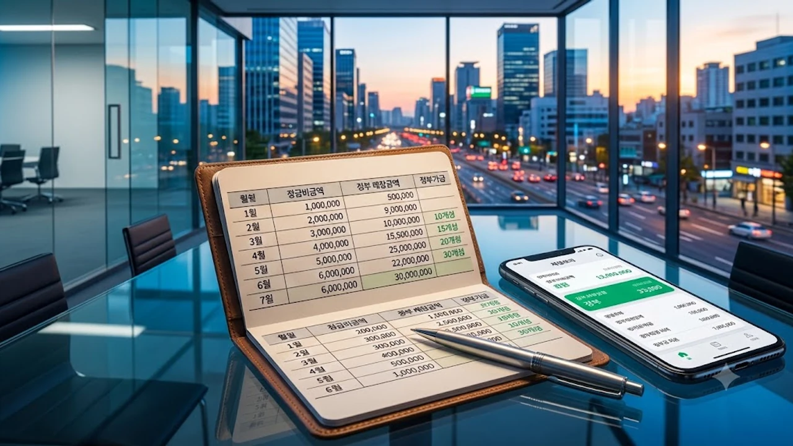

**청년도약계좌**가 최근 개편을 거치며 정부기여금 매칭 구조를 대폭 손질해 청년층의 **목돈 마련**과 자산 형성 전략에 큰 변화가 생겼습니다. 고금리 기조와 전세 불안정이 겹친 자산 시장에서 비과세 혜택과 정부 지원금을 극대화하는 실질적인 납입 전략을 세워야 할 시점입니다.

## 청년도약계좌 최신 개정 사항

### 신설된 정부기여금 매칭 구조
기존에는 소득 구간별로 기여금 지급 한도가 월 40만 원에서 70만 원 수준으로 묶여 있어, 매달 70만 원을 꽉 채워 납입하더라도 초과분에 대한 매칭 지원금을 온전히 챙기지 못하는 한계가 있었습니다. 개정안은 소득 2,400만 원 이하 청년이 월 70만 원을 납입할 경우 매칭 한도를 전액으로 넓혀, 최대 월 3만 3천 원 수준의 매칭 지원금을 지원합니다. 소득 3,600만 원 이하 구간 역시 매칭 잔여 구간을 열어두어 최종 만기 수령액의 실질 수익률을 일반 과세 적금 기준 연 8~9%대 수준으로 끌어올렸습니다.

### 중도해지 방지를 위한 특별 중도인출 요건
5년 만기 구조 탓에 목돈이 묶이는 부담을 덜기 위해 생애최초 주택 구입이나 혼인·출산 등 필수 사유 외에도 3년 이상 유지 시 부분 인출을 허용하는 기준이 구체화되었습니다. 
> 3년 이상 성실 납입을 유지한 가입자는 누적 원금의 최대 50%까지 인출하더라도 비과세 혜택과 정부기여금 적립분을 그대로 유지할 수 있습니다.

### 기존 가입자 적용 기준 및 소급 여부
신규 가입자뿐 아니라 기존 가입자에게도 개편된 정부기여금 매칭 산정 방식이 소급 적용됩니다. 전산 개편 이후 납입분부터 자동으로 계산식이 변경되어 별도 복잡한 재신청 절차 없이 납입액에 비례한 정부기여금이 계좌에 누적 적립됩니다.

## 기존 청년 적금 상품과의 혜택 장단점

### 청년도약계좌 vs 시중 고금리 적금 수익률 비교
일반 시중은행의 최고 연 4.0~4.5% 적금 상품은 이자소득세 15.4%를 원천징수하므로 세후 실수령액이 눈에 띄게 줄어듭니다. 반면 도약계좌는 기본금리 및 우대금리 합산 연 6.0%에 비과세 혜택과 정부기여금이 더해져, 실질 체감 수익률은 일반 과세 적금 기준 연 9.5% 상품에 가입한 효과를 냅니다.

### 정부기여금 최대 수령을 위한 소득 구간별 장단점
- **총급여 2,400만 원 이하**: 매칭 비율 6.0% 적용, 정부기여금 월 최대 한도 수령 가능
- **총급여 3,600만 원 이하**: 매칭 비율 4.6% 적용, 납입 여력에 따른 수익 극대화 유리
- **총급여 4,800만 원 이하**: 매칭 비율 3.7% 적용, 비과세 통장 용도로 활용 가치 유지
- **총급여 6,000만 원 초과**: 정부기여금 미지급, 이자소득 비과세 혜택만 적용

### 장기 유지 부담 완화를 위한 부분 인출 기능 분석
과거 청년희망적금 만기 이후 자금을 전액 예치했다가 급전이 필요해 중도 해지하던 부작용이 크게 줄었습니다. 만기를 채우지 못하고 해지할 때 발생하는 이자 손실과 비과세 추징 위험을 부분 인출 제도가 완충 역할을 합니다.

## 실수령액 극대화를 위한 가입 및 납입 튜토리얼

### 은행별 우대금리 조건 충족 단계별 가이드
취급 은행마다 최대 1.0~1.5%p 수준의 우대금리 조건이 다릅니다. 주거래 은행의 급여 이체 실적(0.3~0.5%p), 신용·체크카드 실적(0.2%p), 마케팅 동의 및 첫 거래 조건(0.1~0.2%p)을 꼼꼼히 채워야 기본 4.5%에 우대금리를 더해 최고 6.0% 금리를 확보할 수 있습니다.

### 최적의 월 납입 금액 설정법
정부기여금 매칭 한도가 꽉 차는 구간을 우선 계산해야 합니다. 본인 소득 구간의 매칭 한도가 50만 원이라면 무리하게 70만 원을 채우기보다, 50만 원을 고정 납입하고 남은 20만 원은 수시 입출금이 가능한 파킹통장이나 단기 채권형 상품으로 분산하는 편이 자금 유동성 확보에 유리합니다.

### 소득 증빙 서류 제출 및 심사 승인 팁
국세청 홈택스의 소득금액증명원이 필수 확인 서류입니다. 직전 연도 소득 기준으로 심사를 진행하며, 이직이나 퇴사 등으로 소득 변동이 큰 경우 서민금융진흥원 가입 적격 확인 알림을 받은 직후 증빙을 마쳐야 승인 지연을 피할 수 있습니다.

## 만기 수령 후 자산 연계 활용 가이드

### 청년 주택드림 청약통장 연계 전환 방법
만기 수령금인 약 5,000만 원 안팎의 목돈은 청년 주택드림 청약통장으로 일시 납입할 수 있습니다. 이를 통해 향후 청약 당첨 시 연 2%대 저리 대출을 지원하는 연계 상품을 공략하는 자금 발판을 마련할 수 있으며, 주거 마련 대안으로 [청년미래보금자리론 4억 빌라 숨은 조건](/posts/kr-realestate/youth-future-bogeumjari-loan-villa-2026/)을 함께 비교 분석하면 선택 폭이 넓어집니다. 수도권 주택 매매나 전세 시장 동향이 궁금하다면 [2030 영끌 재점화, 전세 폭등 속 진짜 살까?](/posts/kr-realestate/young-generation-panic-buying-jeonse-spike-2026/) 포스팅에서 실시간 흐름을 확인할 수 있습니다.

### 비과세 혜택 유지 및 추가 절세 포트폴리오 구성
도약계좌 만기 자금을 수령한 뒤에는 ISA(개인종합자산관리계좌)로 자금을 이전하여 추가 비과세 한도를 늘리는 전략이 필수적입니다. ISA 만기 자금을 다시 연금저축이나 IRP로 이체하면 최대 300만 원(이체금액의 10%)의 추가 세액공제 혜택까지 챙길 수 있습니다.

### 목돈 수령 후 단계별 투자 전략
- **1단계**: 3~6개월 치 비상금 성격의 파킹형 자산 분리 (1,000만 원)
- **2단계**: 주택 청약 일시납 및 절세형 ISA 계좌 편입 (3,000만 원)
- **3단계**: 배당 ETF 및 지수 추종 펀드 분할 매수 (1,000만 원)

사회초년생 시기부터 체계적인 지출 관리와 통장 쪼개기 습관을 들이는 것은 단순한 금융 상품 가입 이상의 결실을 가져옵니다. [자산관리 가계부 정리함 쿠팡에서 보기](https://www.coupang.com/np/search?q=%EC%9E%90%EC%82%B0%EA%B4%80%EB%A6%AC%20%EA%B0%80%EA%B3%84%EB%Bu&sourceType=affiliate&trackingCode=AF8691300)

#청년도약계좌 #청년도약계좌개편 #정부기여금 #청년적금 #비과세혜택 #청년주택드림청약 #청년자산형성 #재테크전략