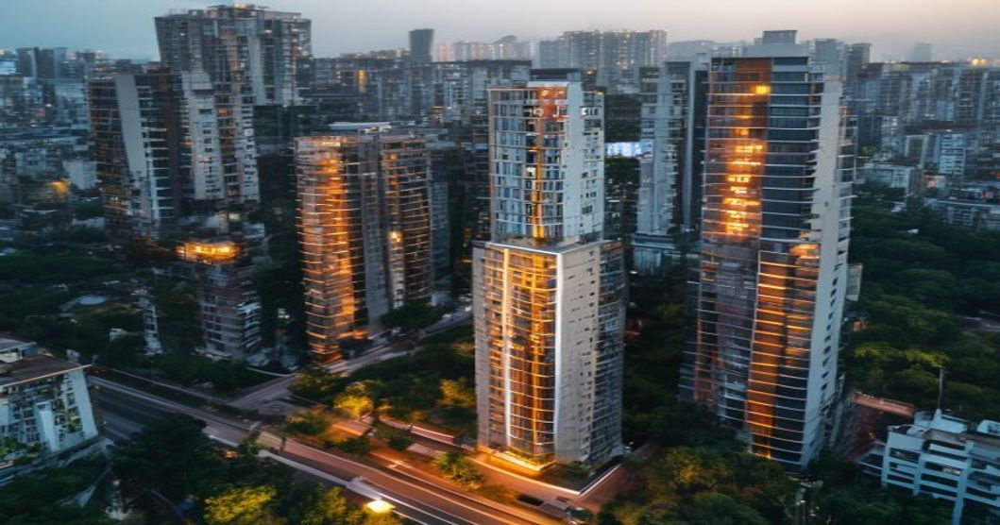

내 집 마련의 꿈을 가진 사람이라면 한 번쯤 청약 통장을 들여다보게 됩니다. 2026년 청약 시장은 여전히 경쟁이 치열하지만, 제도 변화와 지역별 공급 상황을 정확히 파악하면 당첨 확률을 높일 수 있는 기회가 분명히 존재합니다. 무작정 청약을 넣기 전에 이 글을 먼저 읽어보세요.

## 2026년 청약 제도, 이렇게 바뀌었다

### 무주택 기간·부양가족 수가 여전히 왕

청약 당첨의 핵심은 가점제입니다. 84점 만점 중 무주택 기간(최대 32점), 부양가족 수(최대 35점), 청약통장 가입 기간(최대 17점)으로 구성됩니다. 2026년 현재도 이 구조의 큰 틀은 유지되고 있습니다. 가점이 낮은 20\~30대 1인 가구에게 가점제는 불리하지만, 추첨제 비율이 유지되는 단지를 노리는 전략으로 보완할 수 있습니다.

### 특별공급 요건 변화와 신생아 특공

2025년 이후 신생아 특별공급 제도가 안착하면서 출산 가구에게 유리한 공급 물량이 늘었습니다. 결혼 후 2년 이내 출생아를 둔 가구는 소득 기준을 충족하면 일반 경쟁 없이 별도 물량에서 청약할 수 있습니다. 소득 기준과 자산 기준이 까다롭지만, 조건에 맞는 분들은 반드시 챙겨야 할 기회입니다.

## 당첨 확률을 높이는 실전 전략

### 경쟁률이 낮은 곳을 공략하라

수도권 인기 단지는 수십 대 일의 경쟁률이 기본입니다. 가점이 낮다면 경쟁률이 상대적으로 낮은 수도권 외곽이나 지방 광역시 역세권 단지를 노리는 전략이 현실적입니다. 청약홈에서 공개되는 사전청약 일정과 경쟁률 통계를 꾸준히 분석하면 전략적으로 '이길 수 있는 곳'을 찾을 수 있습니다.

### 타입과 층 선택도 당첨에 영향

같은 단지 내에서도 타입(면적)별, 층별로 경쟁률이 다릅니다. 중소형 평형은 경쟁이 몰리고, 대형 평형이나 저층은 상대적으로 경쟁이 약한 경우가 있습니다. 선호 타입을 고집하기보다 경쟁률을 분산해서 보는 것이 당첨 확률을 높이는 현실적인 방법입니다. 지하주차장 연결 여부, 향, 조망도 장기적으로 가치에 영향을 미칩니다.

## 청약 전 반드시 확인하는 자격 조건

### 주택 소유 이력 꼼꼼히 확인

청약 전 가장 먼저 할 일은 자신의 주택 소유 이력 확인입니다. 부모님이나 배우자의 주택이 본인 명의에 등재된 이력이 있으면 유주택자로 처리돼 가점에서 불이익이 생길 수 있습니다. 청약홈(applyhome.co.kr)에서 공인인증서로 로그인하면 본인의 청약 자격과 가점을 미리 조회할 수 있습니다. 정확한 자격 확인 없이 청약을 넣으면 당첨 후 취소되는 불상사가 생길 수 있습니다.

### 청약통장 유지 전략

청약통장은 장기간 납입 횟수와 납입액이 모두 중요합니다. 월 2만원을 납입해도 납입 횟수는 쌓이지만, 지역별 예치금 기준을 충족해야 원하는 타입에 청약할 수 있습니다. 수도권 전용 85㎡ 초과 분양을 원한다면 예치금 1,500만원 이상이 필요합니다. 지금 당장 당첨 계획이 없어도 통장을 유지하고 납입 횟수를 쌓는 것이 미래 가점의 씨앗이 됩니다.

## 청약 실패 후 대안과 전세·매매 전략

### 청약 낙첨 후 선택지

청약에서 계속 떨어진다고 포기할 필요는 없습니다. 미분양 단지에는 청약 통장 없이도 선착순으로 분양 받을 수 있는 기회가 있습니다. 입주자 모집 공고가 마감된 뒤 남은 물량이나 계약 포기 물량이 나오는 경우도 있으니 관심 단지의 분양 사무소를 꾸준히 체크하세요.

### 서울 부동산 전반 흐름과 함께 보기

청약 전략은 전체 서울 부동산 시장의 흐름과 연결해서 봐야 합니다. 시장이 침체 국면일 때 무리하게 가점을 소진하는 것은 득보다 실이 클 수 있습니다. 전체 부동산 시장 흐름을 더 알고 싶다면 [서울 아파트 2026 지금 사야 할 타이밍인가](/posts/kr-realestate/seoul-apartment-timing-2026/)를 함께 읽어보세요.

#청약전략 #아파트청약 #주택청약2026 #청약가점 #분양 #신생아특공 #내집마련 #부동산전략
