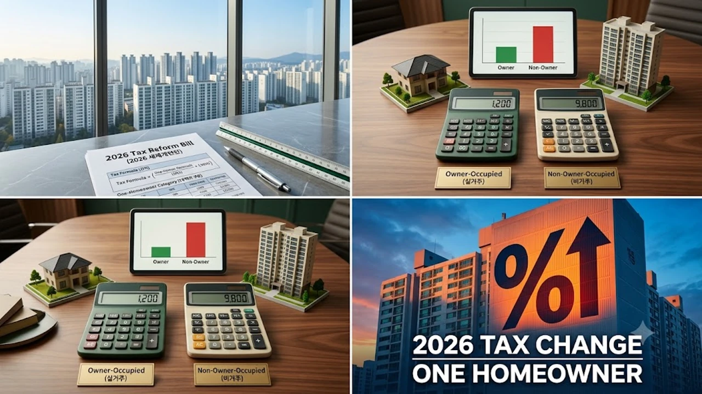

2026년 8월 3일 발표된 정부의 세제개편안으로 시장이 크게 요동치고 있습니다. 특히 이번 개편안의 핵심 표적인 **2026 세제개편안 1주택자** 과세 기준 변화는 실거주 여부에 따라 세 부담 차이를 극명하게 가르는 분수령이 될 전망입니다. 보유세 및 양도소득세 산정 방식에서 '실거주'의 비중이 획기적으로 늘어나면서, 1주택자라도 갭투자 상태거나 실제 살지 않는 보유자의 세액 계산식이 전면 재편됩니다.

## 8·3 세제개편안 전격 발표, 1주택자 산식은 어떻게 바뀌었나

### 실거주 1주택자와 비거주 1주택자의 기본공제 차등화

이번 8·3 세제개편안의 가장 근본적인 변화는 **종합부동산세(종부세) 1세대 1주택자 기본공제 체계의 분리**입니다. 기존에는 실거주 여부와 상관없이 1세대 1주택자라면 동일하게 12억 원의 기본공제 혜택을 누렸습니다. 하지만 개편안에 따라 실거주하는 1주택자는 기존 12억 원 공제를 그대로 유지하는 반면, 실거주하지 않는 1주택자는 기본공제가 9억 원으로 축소됩니다. 

> **개정 세법 기본공제 비교 (공시가격 기준)**
> - **실거주 1주택자**: 12억 원 공제 유지 (장기보유·고령자 세액공제 최대 80% 적용)
> - **비거주 1주택자**: 9억 원 공제 축소 (일반 다주택자 수준 공제액 적용)

### 양도세 장기보유특별공제(장특공) 거주요건 10년 강화

양도소득세의 핵심 혜택인 **장기보유특별공제(장특공)** 역시 거주 요건 중심으로 대폭 재편됩니다. 기존에는 1세대 1주택자의 경우 보유 기간 40%(연 4%), 거주 기간 40%(연 4%)를 합산하여 최대 80%의 공제율을 받았습니다. 개정안에서는 보유 기간에 따른 공제 비율을 연 2%(최대 20%)로 줄이는 대신, 거주 기간에 따른 공제 비율을 연 6%(최대 60%)로 이관하여 **"직접 살지 않으면 세금 감면을 주지 않겠다"**는 기조를 명확히 했습니다.

- **보유만 한 경우**: 10년 이상 보유해도 최대 공제율은 기존 40%에서 20%로 감소
- **보유+거주 충족 시**: 10년 보유 및 10년 거주를 완전히 채워야 최대 80% 공제율 달성 가능

### 초고가 주택 및 고령층 1주택자의 보유세 과세 체계 변화

시가 25억 원을 초과하는 초고가 주택 보유층에 대해서는 공시가격 현실화율 제고와 더불어 세율 구간별 누진율이 일부 상향 조정되었습니다. 다만, 고령층 실수요자의 세 부담 완화를 위해 만 60세 이상 장기 보유 실수요자에 한해서는 종부세 납부유예 제도를 확대 적용합니다. 이와 관련된 세부 내용은 이전 분석인 [초고가주택 종부세 3배? 바뀌는 세법 핵심만](/posts/kr-realestate/ultra-expensive-home-jongbuse-tax-reform-2026/) 글에서 과세 표준별 세액을 세부적으로 체크해 볼 수 있습니다.

---

## 실거주 vs 비거주, 세금 차이 실제 시뮬레이션

### 시가 15억 원 보유 주택의 거주 여부별 종부세 비교

서울 마포구 소재 시가 15억 원(공시가격 약 10억 5천만 원) 아파트를 소유한 A씨의 사례로 세액 차이를 추정해 볼 수 있습니다. 

* **실거주 중인 A씨**: 공시가격(10억 5천만 원)이 기본공제 12억 원 미만이므로 **종부세 과세 대상에서 제외 (0원)**
* **비거주 상태인 A씨**: 기본공제 9억 원을 적용받아 초과분 1억 5천만 원에 대한 과세표준이 발생, 공정시가지표율 60% 적용 시 **약 40만~60만 원 선의 종부세 산출**

동일한 가액의 주택이라도 실거주 여부에 따라 세금 부과 대상 자체가 달라지는 역전 현상이 시작됩니다.

### 갭투자형 비거주 1주택자가 맞닥뜨릴 양도세 부담액

양도차익이 큰 주택일수록 타격은 더 치명적입니다. 취득가액 10억 원, 양도가액 20억 원으로 양도차익이 10억 원 발생한 서울 아파트를 10년간 보유한 B씨의 사례를 보겠습니다.

- **10년 보유 / 10년 거주 시**: 장특공 80% 적용 -> 양도소득세 **약 2,500만 원 내외**
- **10년 보유 / 0년 거주 시**: 장특공 20% 적용 -> 양도소득세 **약 1억 8,000만 원 내외**

거주 요건을 채우지 못한 것만으로 양도소득세 부담이 7배 이상 늘어나는 결과가 초래됩니다.

### 일시적 2주택자 처분 기한 단축(3년→2년)에 따른 절세 시나리오

이번 개편안에는 상급지 이동을 위한 일시적 1세대 2주택 특례 처분 기한을 기존 3년에서 2년으로 단축하는 내용이 포함되었습니다. 신규 주택 취득 후 2년 내에 종전 주택을 매도해야만 양도세 비과세 및 종부세 1주택자 특례 적용이 가능하므로, 갈아타기를 준비하는 세대는 매도 스케줄을 훨씬 타이트하게 잡을 필요가 있습니다.

---

## 8·3 개편안이 부동산 시장 및 임대차에 미칠 파장

### 강남권 및 초고가 재건축 아파트 절세 매물 출회 가능성

비거주 1주택자들의 보유세 및 양도세 부담이 동반 상승함에 따라, 강남 3구나 성동·마포 등 주요 입지에 갭투자를 해둔 외지인 투자자들의 매물이 시장에 늘어날 가능성이 높아졌습니다. 법안이 본격 시행되는 2027년 이전에 세금 부담을 피하려는 '절세형 급매물'이 유입될 경우, 단기적으로 거래량 증가와 가격 조정을 유발할 수 있습니다.

### 실거주 의무 강화가 불러올 전월세 매물 가뭄 및 임대료 전가

반면 임대차 시장에는 악재로 작용할 우려가 큽니다. 집주인들이 장특공 혜택 및 종부세 공제를 받기 위해 세입자를 내보내고 직접 실거주에 들어가는 현상이 본격화되기 때문입니다. 

> **임대차 시장 예상 변화**
> 1. 집주인 직접 전입 증가로 인한 전세 매물 대폭 감소
> 2. 종부세 증가분에 대한 보증금 증액 또는 월세 전가 현상 심화
> 3. 실수요가 많은 선호 단지의 전세가 상승 압력 가중

이러한 수급 불균형 상황은 [공급절벽 2026 아파트 시장, 진짜 전세가 매매가 밀어 올릴까](/posts/kr-realestate/supply-shortage-jeonse-caps-property-2026/) 분석에서 알 수 있듯 임대차 시장 전체의 불안 요인으로 이어집니다.

### 실수요자 ‘상급지 갈아타기’ 전략의 전면 수정 불가피

처분 기한 단축과 자금 조달 규제 강화가 맞물려 상급지 이동 전략 수정이 불가피해졌습니다. 최근 대출 규제 트렌드는 [바뀌는 스트레스 DSR 3단계 대출 한도 완전 정리](/posts/kr-realestate/stress-dsr-stage3-loan-limit-2026/) 내용을 함께 확인하여 자금 계획을 점검해야 합니다.

---

## 바뀌는 세제 개편 속 실수요자가 챙겨야 할 절세 가이드

### 2027년 제도 본격 시행 전 미리 체크해야 할 실거주 기간 산정법

개정 법안은 유예 기간을 거쳐 2027년 1월 1일 이후 양도 및 과세분부터 적용될 예정입니다. 따라서 보유 주택의 주민등록상 전입 기간과 실제 거주 기간이 일치하는지 미리 주민등록표 초본을 통해 확인하고, 부족한 거주 기간을 채울 수 있는지 계산해 보는 작업이 우선입니다.

### 직장·교육 목적 일시적 비거주 시 예외 인정 기준 확인하기

근무상 형편, 질병 치료, 취학, 해외 파견 등의 사유로 인하여 온 세대가 다른 시·군으로 거주지를 이전하는 경우에는 예외적으로 실거주 요건 감면 혜택을 받을 수 있습니다. 

* **증빙 서류 준비**: 재직증명서, 입학등록금 납입 영수증, 병원 진단서 등
* **요건 확인**: 취득 후 일정 기간 내 실제 전입 이력 및 사유 해소 후 전입 계획 수립

### 보유 주택 매도 vs 전입 중 최선의 자산 방어 선택지

현재 비거주 상태로 1주택을 보유 중이라면 두 가지 선택지 중 하나를 전략적으로 결정해야 합니다.

1. **실거주 전입 선택**: 기존 임대차 계약 종료 시점에 맞추어 직접 입주함으로써 종부세 12억 공제와 장특공 80% 혜택을 온전히 유지하는 방향
2. **2026년 내 매도 선택**: 실거주가 불가능한 여건이라면 법 시행 전인 2026년 하반기 내 매도를 통해 양도세 비과세 혜택을 챙기고 자금을 재배치하는 방향

#2026세제개편안 #1주택자세금 #종부세기본공제 #장기보유특별공제 #83부동산대책 #실거주의무 #부동산절세전략