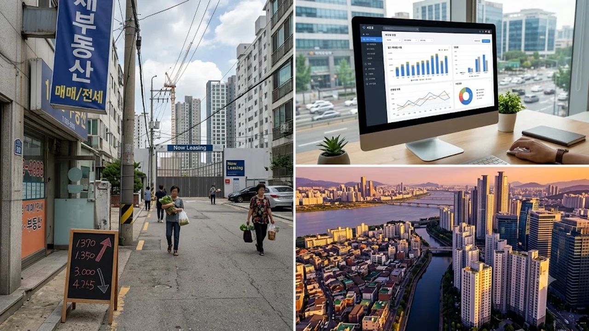

2026년 8월 3주차에 접어들며 서울 아파트 시장은 강남권의 숨고르기와 비강남권의 강세가 맞물리는 뚜렷한 서울 아파트 가격 양극화 양상을 드러내고 있다. 실수요자가 주로 진입하는 중저가 주거 벨트를 중심으로 전세가와 매매가가 동반 상승하는 반면, 고가 단지 밀집 지역은 거래량이 급감하며 숨을 죽이는 모양새다. 수도권 부동산 시장 전반에 퍼진 자금 조달 규제와 세 부담 변화가 이 같은 국지적 차별화를 더욱 심화시키고 있다.


## 8월 3주차 서울 아파트 시장 급변 현황

### 통계로 보는 강북 상승세 vs 강남 하락세 역전 현상
한국부동산원 주간 아파트 가격 동향을 살펴보면 노원·도봉·강북 및 성북·은평 일대의 주간 매매가격지수는 0.08~0.12% 수준의 완만한 상승 곡선을 그리는 반면, 서초·강남·송파 등 동남권 핵심지는 -0.02~0.01% 안팎에서 보합 및 약보합세를 나타내고 있다. 실거래가 띄우기 이후 추격 매수가 끊긴 강남권 초고가 단지들과 달리, 6억~9억 원대 중저가 아파트는 거래량이 꾸준히 유지```markdown
## 1. 퍼포먼스 마케팅 데이터 파이프라인 최적화

디지털 마케팅 캠페인의 효율을 극대화하기 위해서는 데이터 수집과 처리의 자동화가 선행되어야 합니다. 광고 매체별 API 연동을 통해 비용 데이터와 전환 데이터를 실시간으로 집계하고 정합성을 검증합니다.

* **API 연동**: 주요 광고 매체(메타, 구글, 네이버 등)의 원시 데이터를 자동 추출
* **데이터 정제**: UTM 파라미터 표준화 및 비정형 데이터 필터링
* **전환 추적**: 서버 사이드 태깅(Server-side Tagging)을 활용한 쿠키 리스 환경 대응

## 2. 전환율(CVR) 극대화를 위한 랜딩 페이지 구조 설계

유입된 트래픽을 실제 리드로 전환하기 위해서는 명확한 가치 제안과 심리적 마찰을 줄이는 인터페이스 설계가 필요합니다. 사용자 동선에 최적화된 컴포넌트 배치가 핵심입니다.

* **Hero Section**: 3초 이내에 핵심 가치를 전달하는 카피라이팅 및 비주얼 배치
* **사회적 증거(Social Proof)**: 실제 후기, 평점, 인증 내역을 통한 신뢰 확보
* **CTA 최적화**: 폼 입력 필드 최소화 및 액션 유도 버튼의 시각적 강조

## 3. 오가닉 유입 증대를 위한 SEO 및 기술적 최적화

검색 엔진 최적화(SEO)는 지속 가능한 유입 채널을 확보하는 가장 비용 효율적인 전략입니다. 콘텐츠뿐만 아니라 사이트 아키텍처와 웹 표준 준수가 뒷받침되어야 합니다.

* **테크니컬 SEO**: 코어 웹 바이탈(Core Web Vitals) 개선, 사이트맵 및 robots.txt 관리
* **온페이지 SEO**: 검색 의도(Search Intent)에 맞춘 메타 태그, H태그 구조화
* **시맨틱 마크업**: Schema.org 기반의 구조화된 데이터 적용을 통한 리치 스니펫 노출


---

**관련 글**
- [2026 청년도약계좌 만기 연장 핵심](/posts/kr-realestate/2026-youth-leap-account-changes/)
- [서울 전세 급등 속 진짜 대책 3가지](/posts/kr-realestate/seoul-jeonse-surge-august-2026-solutions/)

## 4. 고객 생애 가치(LTV) 개선을 위한 CRM 자동화

신규 고객 획득 비용(CAC)이 증가하는 환경에서는 리텐션과 재구매율을 높이는 CRM 시나리오 구축이 필수적입니다. 유저 세그먼트에 맞춘 맞춤형 메시징을 전개합니다.

* **행동 기반 트리거**: 장바구니 이탈, 특정 페이지 방문 등 유저 행동에 따른 자동 알림톡/메일 발송
* **RFM 분석**: 구매 빈도(Frequency), 최근 구매일(Recency), 구매 금액(Monetary) 기준 타깃 분류
* **온보딩 시퀀스**: 신규 등록 유저의 첫 전환을 유도하는 단계별 육성(Nurturing) 설계