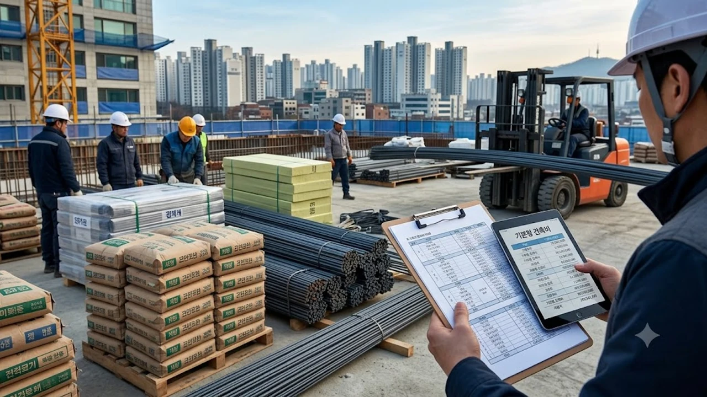

국토교통부가 정기 고시를 통해 기본형 건축비 상한액 조정을 확정하면서 청약 대기자들의 자금 마련 셈법이 복잡해졌다. 자재비 인상분과 현장 간접노무비 변동이 직접 반영된 이번 **기본형 건축비 인상** 고시는 수도권 핵심 분양가 상한제 주택의 평당 분양가를 즉각 밀어 올리는 기폭제 역할을 한다. [공급절벽 2026 아파트 시장, 진짜 전세가 매매가 밀어 올릴까](/posts/kr-realestate/supply-shortage-jeonse-caps-property-2026/)와 맞물려 신축 아파트 진입 장벽은 그 어느 때보다 가파르게 높아지는 흐름이다.

## 9월 기본형 건축비 인상 배경과 공사비 산정 현실

### 자재비·간접노무비 요율 조정이 불러온 단가 변동
레미콘, 철근, 단열재를 비롯한 골조 자재의 원가 상승 압력과 안전 관리 기준 강화에 따른 간접노무비 요율 조정이 직격탄을 날렸다. 시공 현장의 감리 인력 배치 기준과 환경 규제 준수 비용이 상향되면서 지상층 건축비 산정표 자체가 전면 재편된 결과다.

### ㎡당 230만 원 선 돌파의 의미와 적용 시점 기준
이번 고시 개정으로 16~25층 이하, 전용면적 60~85㎡ 기준 기본형 건축비는 ㎡당 230만 원 고지를 가볍게 넘어섰다. 적용 시점은 고시 당일 이후 지자체에 입주자 모집 승인을 신청하는 단지부터 즉시 소급 없이 적용되므로, 승인 접수를 목전에 둔 사업장들의 계산이 엇갈린다.

### 정기 고시 대비 상승 폭을 키운 구조적 지표
물가 변동분을 사후 정산하는 체계상 과거 누적된 인플레이션 압력이 지연 반영된 측면이 강하다. 건설 원자재 수입단가 상승과 수도권 도심지 작업 제한 규제에 따른 공기 지연 비용이 단가 산식에 반영되며 기본 상승폭을 웃돌았다.

## 강남 3구·용산 분양가 상한제 단지에 미치는 타격

### 3.3㎡당 분양가 추정치 상승폭과 실부담액
기본형 건축비는 분양가 상한제 심사의 출발선이다. 평당 순수 공사비 기준 액면가만 3.3㎡당 수십만 원 단위로 뛰며, 가산비와 택지비를 합산한 총분양가는 전용 84㎡ 기준 최소 2,000만~4,000만 원 이상의 실질적인 추가 분담 압력으로 전이된다.

> **분양가 산식의 현실**  
> 분양가 상한액 = 기본형 건축비 + 건축 가산비 + 택지비 + 택지 가산비. 밑바탕인 기본형 건축비가 오르면 가산비 요율도 연동되어 상승 압력을 받는다.

### 분상제 아파트의 시세차익 기대치 축소
주변 시세 대비 70~80% 선에 묶여 이른바 '로또 청약'이라 불리던 강남권 재건축 일반분양 단지들도 실분양가 상향 조정을 피하기 어렵다. 시세차익 폭이 축소되면 대출 규제가 강화된 상황에서 실수요자의 자기자본 조달 요건만 한층 까다로워진다. [2030 영끌 재점화, 전세 폭등 속 진짜 살까?](/posts/kr-realestate/young-generation-panic-buying-jeonse-spike-2026/)를 고민하던 청약 대기자들에게는 가용 현금 확보가 절대적인 선결 과제로 떠올랐다.

### 입주자 모집공고 승인 시점별 단지 간 희비
같은 재건축 구역이라도 지자체 분양가심의위원회 심의 및 입주자 모집공고 승인 신청을 고시일 전에 마쳤느냐에 따라 수억 원대의 총분양 수입 차이가 벌어진다. 막바지 인허가 절차를 밟던 수도권 핵심 사업장들은 모집공고 일정을 늦추더라도 인상된 기준을 적용받기 위해 전략적 숨고르기에 들어갔다.

## 시공사와 재건축 조합 간 공사비 갈등 향방

### 공사비 증액 협상 테이블에서 시공단이 쥔 명분
기존에는 도급계약서상 '물가상승률 반영' 문구를 두고 조합과 시공사 간 유권해석 다툼이 치열했다. 정부가 공인한 기본형 건축비 상한액이 대폭 상향된 이상, 시공단은 이를 근거로 공사비 평당 800만~900만 원 선 유지를 강하게 압박하는 분위기다.

### 조합원 추가분담금 증가와 일반분양가 책정 딜레마
시공비 증액을 수용하면 조합원당 수천만 원에서 억대 규모의 추가분담금이 확정된다. 이를 방어하기 위해 일반분양가를 최대한 끌어올려야 하지만, 고분양가로 인한 청약 미달 위험과 정부의 분양가 상한 통제 사이에서 조합 집행부의 고민이 깊어진다.

### 정비사업 지연에 따른 도심 공급 차질
공사비 검증 절차 진행과 총회 의결 번복으로 사업 기간이 수개월씩 늘어나는 정비구역이 속출하고 있다. 공기 지연은 곧 조합 사업비 대출이자 누적으로 이어져 분양가 상향 압력을 다시 키우는 악순환의 고리를 형성한다.

## 실수요자의 청약 통장 활용법과 자금 조달 전략

### 자금 조달 계획서 작성 시 자기자본 체크리스트
분상제 아파트 당첨 시 중도금 대출 한도와 스트레스 DSR 2·3단계 규제가 동시에 걸린다. 분양가 인상분만큼 계약금(보통 10~20%)과 잔금 납부 시점에 투입할 순수 현금 자산이 확보되었는지 면밀히 재검토해야 한다.

- **계약금 납입 여력**: 분양가 상향분만큼 현금 자산 즉시 인출 가능 여부 확인
- **중도금 대출 실행 한도**: 대출 규제선 초과 시 자납 비율 대비 계산
- **옵션 비용 별도 계산**: 발코니 확장 및 필수 시스템 에어컨 비용 누락 방지

### 기존 구축 매매 vs 신축 분양 가성비 대조
분양가가 지속적으로 상승하면서 청약 가점 60점대 이상을 쥐고도 입지 좋은 준신축 매매로 눈을 돌리는 수요가 늘고 있다. 분양권 전매 제한, 실거주 의무 기간이 묶인 신축보다 규제가 덜한 준신축 실거래가를 철저히 비교 분석해 청약 통장 소진 여부를 판단할 시점이다.

### 청약 경쟁률 추이에 따른 당첨 가점선 변화
절대 분양가가 상승하면 무지성 청약 수요가 걸러지면서 비선호 타입이나 저층을 중심으로 당첨 최저 가점선이 소폭 하락할 가능성이 열린다. 가점이 애매한 3040 세대라면 가격 저항선이 생긴 틈새 평형이나 추첨제 물량을 정밀 조준하는 역발상 접근이 유효하다.

이사 및 입주 자금 계획을 세우며 인테리어 비용을 미리 산정해 두는 것도 실거주 준비의 기본이다.  
[홈스타일링 가구·수납용품 쿠팡에서 보기](https://www.coupang.com/np/search?q=%ED%99%88%EC%8A%A4%ED%83%80%EC%9D%BC%EB%A7%81+%EA%B0%80%EA%B5%AC&sourceType=affiliate&trackingCode=AF8691300)

#기본형건축비 #분양가상한제 #신축아파트분양가 #청약전략 #공사비인상 #강남재건축 #분양가상승 #부동산청약