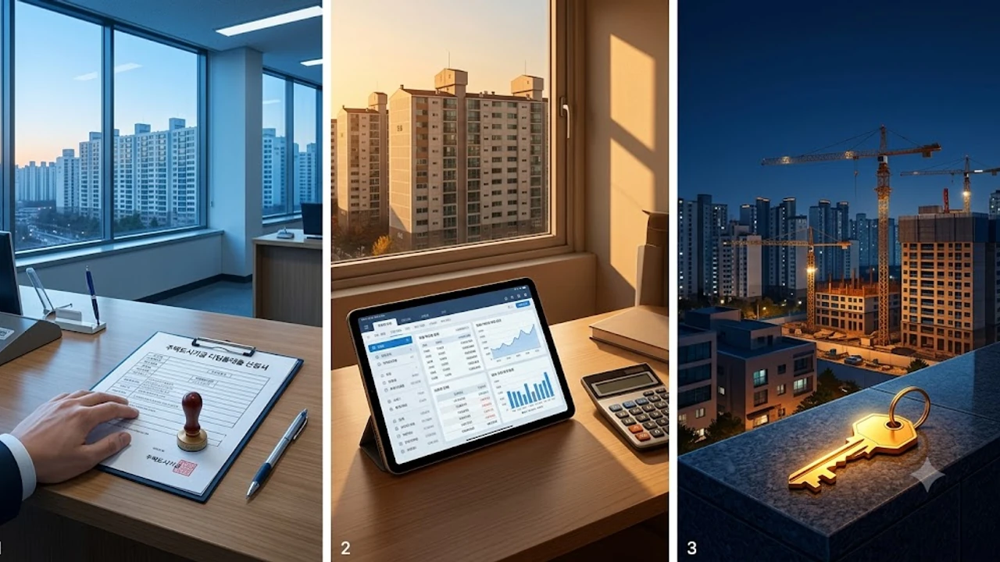

서민층의 대표적인 정책금융 상품인 주택도시기금 디딤돌 대출 한도 축소가 예고 없이 현장에 적용되면서 무주택 실수요자들의 자금 계획이 뿌리째 흔들리고 있다. 주택담보대출비율(LTV) 규제 강화와 최우선변제금(소액임차보증금) 차감, 이른바 방공제 필수 적용으로 인해 수도권 외곽 저가 주택을 노리던 매수 대기자들의 잔금 조달선에 비상이 걸렸다. 시중은행 대출 규제에 이어 정책모기지마저 급격히 조여오자 분양 아파트 잔금 납부를 앞둔 계약자들 사이에서는 계약 파기 공포까지 확산하는 실정이다.

## 디딤돌 대출 한도 축소 기습 시행 배경과 핵심 규제선

### 방공제 필수 적용과 소액임차보증금 차감 기준
그동안 주택도시보증공사(HUG) 모기지신용보증(MCG)에 가입하면 소액임차보증금을 차감하지 않고 LTV 70~80% 한도를 온전히 채워 대출을 실행할 수 있었다. 이번 조치로 보증 가입이 전면 제한되면서 지역별 최우선변제금이 대출 한도에서 고스란히 깎이게 되었다.
- **서울 지역**: 대출 가능액에서 5,500만 원 일괄 차감
- **경기 과밀억제권역 및 세종**: 4,800만 원 감액
- **광역시(과밀억제권역 제외)**: 2,800만 원 감액
- **기타 지방 지역**: 2,500만 원 차감

> "계약금 10%만 간신히 맞추고 정책 대출 풀한도를 계산해 매수 계약서를 썼던 실수요자들은 수천만 원에 달하는 현금을 며칠 안에 추가로 구해야 하는 처지다."

### 신축 분양 아파트 후취담보 대출 전면 제한 영향
미등기 신축 아파트에 적용되던 후취담보 대출 취급 중단은 입주 예정자들에게 직격탄이다. 소유권 이전 등기가 완료되지 않은 신축 단지는 주택도시기금 대출 실행이 사실상 막히면서, 당장 입주 잔금을 치러야 하는 분양자들은 고금리 집단대출이나 시중은행 주담대로 발길을 돌릴 수밖에 없다. 특히 신도시 입주를 앞둔 신혼부부 특공 당첨자들의 자금 계획이 전면 백지화 위기에 놓였다.

## 내 대출 한도는 얼마나 줄어드나: 유형별 시뮬레이션

### 생애최초 주택구입자의 실제 대출 가능액 격차
기존 LTV 80% 적용을 전제로 3억 원 대출을 계획했던 경기권 수분양자의 경우, 한도 축소 폭은 단순 수치 이상이다.
* **매매가 4억 원 주택 기준 (경기 과밀억제권역)**
  * 기존 가능액: 최대 3억 원 (LTV 80% 적용, MCG 가입 시)
  * 변경 후 가능액: 약 2억 7,200만 원 (LTV 80% 한도 3억 2,000만 원에서 방공제 4,800만 원 차감)
  * 실수요자 현금 부족분: **4,800만 원 즉시 발생**

이처럼 완충 장치 없이 차감액이 직격으로 반영되면서 실수요자들은 [2030 영끌 재점화, 전세 폭등 속 진짜 살까?](/posts/kr-realestate/young-generation-panic-buying-jeonse-spike-2026/)와 같은 극단적인 선택지 앞에서 발을 동동 구르고 있다.

### 일반 무주택 가구 기준 매매가별 축소 체감선
연소득 6천만 원 이하 일반 무주택 가구의 경우 타격이 더욱 두드러진다. LTV 70%가 적용되는 수도권 5억 원 주택 매수 시, 종전 2억 5,000만 원(기금 대출 상한)까지 나오던 한도가 방공제 4,800만 원을 제하면서 2억 200만 원으로 내려앉는다. 잔금 5,000만 원 안팎의 공백은 서민 가계 입장에서 단기 융통이 불가능한 수준의 격차다.

## 턱없이 부족해진 잔금, 실수요자 대체 마련 가이드

### 보금자리론 전환 시 금리 및 상환액 계산
디딤돌 대출 축소분을 메우기 위해 HF 보금자리론으로 선회할 경우, 이자 부담 급증을 감수해야 한다.
* **디딤돌 대출 금리**: 연 2.65% ~ 3.95% 수준
* **특례/일반 보금자리론 금리**: 연 4%대 초중반 형성
* **이자 비용 차이**: 2억 5,000만 원 대출 기준, 연간 이자 비용만 최소 200만 원 이상 추가 발생

체념하고 [청년미래보금자리론 4억 빌라 숨은 조건](/posts/kr-realestate/youth-future-bogeumjari-loan-villa-2026/) 등을 타진하려는 발길이 이어지지만, 정책금융 문턱 자체가 전반적으로 높아져 선택 폭은 좁다.

### 신용대출 및 2금융권 병행 시 주의점
부족한 잔금을 단기 신용대출로 채우려는 시도는 총부채원리금상환비율(DSR) 규제 탓에 실행 자체가 거절될 확률이 높다. 
* 신용대출 추가 실행 시 스트레스 DSR 2단계 가산금리 적용으로 한도 추가 잠식
* 카드론이나 2금융권 신용대출 취급 시 신용점수 하락으로 본 주담대 승인 철회 위험
* 사업자 대출 등 비정상적 우회로는 사후 적발 시 대출금 즉시 회수 조치

## 혼선 수습과 현장 대응 수칙

### 입주 지정 기간 내 연체 방지를 위한 긴급 자금 배분
잔금일이 한 달 이내로 다가온 계약자라면 시공사 입주 지연 연체료율과 제2금융권 브릿지론 금리를 정밀 비교해야 한다. 분양 계약서상 연체 이자율이 연 7~9% 수준이라면 단기 사채나 고금리 대부업으로 진입하기보다, 입주 지정 만료일까지 가용 가능한 가족 간 차용증 작성 및 정식 공증 절차를 밟는 편이 자금 리스크를 낮추는 길이다.

### 은행 창구 사전 접수분 보호 여부 점검
현장 적용 기준일 이전에 매매계약 체결 및 대출 신청 완료 여부에 따라 경과 규정 적용 여부가 갈린다. 본인이 이용하는 은행 수탁 지점에 기금 전산망 접수가 완료되었는지 유선 및 서면으로 확약받아야 불의의 한도 삭감을 피할 수 있다.

[안정적인 자금 관리용 금고 쿠팡에서 보기](https://www.coupang.com/np/search?q=%ED%99%88%EA%B8%88%EA%B3%A0&sourceType=affiliate&trackingCode=AF8691300)

#디딤돌대출 #디딤돌대출한도축소 #방공제 #최우선변제금 #보금자리론 #주택도시기금 #부동산대출규제