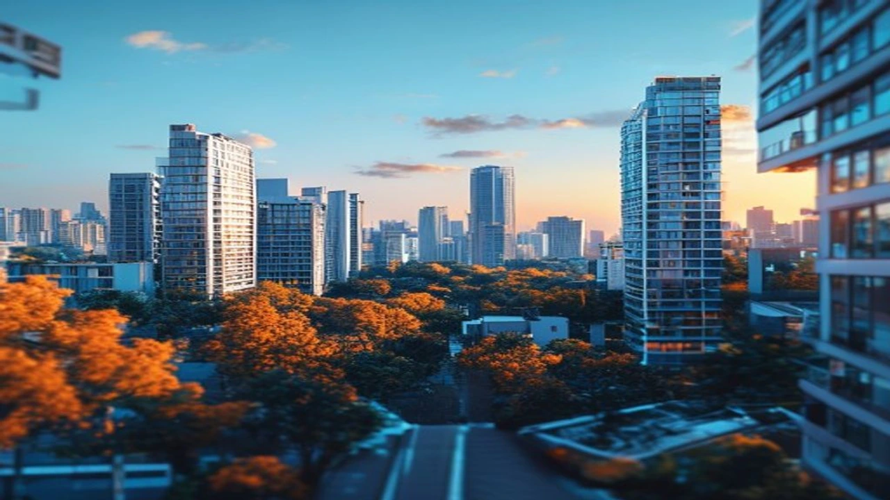

KB부동산이 발표한 7월 월간 주택가격동향에 따르면 수도권 남부 핵심지인 **동탄 아파트값**이 한 달 만에 6.25% 급등하며 역대 최고 상승률을 기록했습니다. 전세사기 여파와 빌라 기피 현상으로 쏠림이 가중된 아파트 매매 시장에서, 동탄 신도시 일대는 전셋값까지 동반 상승하며 실수요자의 불안감을 자극하고 있습니다. 지금이라도 매수 대열에 합류해야 할지, 아니면 일시적 과열을 경계해야 할지 시장 데이터를 바탕으로 핵심을 파악할 필요가 있습니다.

## 동탄 아파트값 한 달 새 6.25% 급등 현황

### KB부동산 7월 월간 동향 및 역대 최고 상승률 분석
KB부동산이 발표한 2026년 7월 전국주택가격동향 조사 결과, 경기도 화성시 동탄구 일대 아파트 매매가격지수는 전월 대비 6.25% 상승했습니다. 이는 전국 평균 상승률인 0.41%를 무려 15배 이상 뛰어넘는 수치입니다. 두 달 연속 월간 기준 역대 최고 상승폭을 경신하며, 수도권 전체 집값 상승세를 사실상 독주하는 형태를 보입니다.

### 서울 및 수도권 다른 지역과의 상승폭 비교
같은 기간 서울 아파트값 평균 상승률이 0.89%, 경기 전체 평균이 0.52% 수준에 머문 것과 비교하면 동탄의 상승세는 가히 독보적입니다. 강남 3구(서초·강남·송파) 및 마용성(마포·용산·성동) 지역의 상승폭이 대출 규제 여파로 다소 주춤해진 사이, 경기 남부권으로 매수세가 가파르게 이동했음을 증명합니다.

### 매매가 격차와 전셋값 3%대 동반 상승 여파
이번 상승장의 특징은 매매가뿐 아니라 전세가격이 한 달 동안 3.04% 뛰며 매매가를 밑에서 강하게 떠받치고 있다는 점입니다. 전세 보증금 상승이 매매가와의 갭을 줄이면서 실수요자의 매수 전환을 압박하는 주요 요인으로 작용하고 있습니다. 수도권 전반의 주거비 부담이 늘어나는 상황은 [2030 영끌 재점화, 전세 폭등 속 진짜 살까?](/posts/kr-realestate/young-generation-panic-buying-jeonse-spike-2026/) 분석에서도 확인할 수 있듯 시장 전반에 폭넓게 나타나는 현상입니다.

---

## 집값 급등을 이끈 핵심 원인과 시장 배경

### 교통 호재 및 직주근접 수요의 집중 현상
GTX-A 노선 개통 효과가 본격화되면서 강남권 접근성이 획기적으로 개선된 점이 가장 큰 원인으로 꼽힙니다. 여기에 삼성전자 화성·기흥 캠퍼스 및 동탄 테크노밸리 배후 수요 등 고소득 직장인 집적지가 형성되면서 실거주 목적의 유입이 꾸준히 이어졌습니다.

### 매물 잠김 현상과 매수 희망자의 심리적 불안
상승 기류를 감지한 집주인들이 호가를 올리거나 매물을 거두어들이는 **매물 잠김** 현상이 가속화되었습니다. 실거래가가 신기록을 갱신할 때마다 매수 대기자들 사이에서는 "지금 안 사면 영영 못 산다"는 패닉 바잉(Panic Buying) 심리가 다시 고조되고 있습니다.

### 대출 규제 속 15억원 이하 실거주 단지 풍선효과
서울 핵심지 고가 아파트에 대한 대출 한도 제한이 강화되면서 9억~15억 원선에 형성된 동탄 랜드마크 단지들이 대안으로 부상했습니다. 대출 실행이 비교적 용이한 가격대의 고품질 신축 단지로 자금이 쏠리는 **풍선효과**가 수치로 입증된 셈입니다. 수도권 전반의 대출 여건 파악을 원한다면 [바뀌는 스트레스 DSR 3단계 대출 한도 완전 정리](/posts/kr-realestate/stress-dsr-stage3-loan-limit-2026/) 글을 참고하기 바랍니다.

---

## 실수요자와 투자자의 현시점 대처 전략

### 지금 매수 진입 시 고려해야 할 리스크 요소
단기간 6% 이상 급등한 시장에 추격 매수로 진입하는 행위는 고점 매수 리스크를 동반합니다. 

> **단기 급등에 따른 리스크 점검**
> - 단기 매물 소진 후 거래량 소강상태 진입 가능성
> - 금리 변동성 및 대출 규제 추가 강화 정책 발표 위험
> - 실거래가 대비 지나치게 높게 형성된 호가 거품 가능성

### 전세 만기 앞둔 실거주자의 최선책
전세가 상승 폭이 커 실거주 무주택자라면 계약갱신청구권 활용을 최우선으로 검토해야 합니다. 만약 인근 신규 분양이나 청약 자격을 유지하고 있다면, 무리한 영끌 매수보다는 입주 물량이 예정된 인접 지역의 우회 거주를 고려하는 편이 자금 방어에 유리합니다.

### 향후 공급 물량 및 수급 불균형 해소 시점
동탄 신도시 내부의 추가적인 대규모 입주 물량은 점차 줄어드는 추세입니다. 다만 화성시 외곽 및 오산, 용인 처인구 등 인접 배후 주거지의 신규 공급 시점에 따라 수급 불균형이 부분적으로 해소될 여지가 존재합니다.

---

## 동탄 부동산 시장 전망 및 매수 타이밍 체크리스트

### 주간 상승률 둔화 시그널과 추세 전환 가능성
월간 6.25%라는 기록적인 수치 뒤에는 주간 단위 상승폭의 변화 가능성이 숨어 있습니다. 매물이 누적되거나 거래량이 급감하면서 상승 탄력이 줄어드는지 주간 KB시세 매매거래동향 지표를 매주 모니터링해야 합니다.

### 내 집 마련 전 반드시 확인해야 할 3가지 지표

- **단지별 실거래가 대 호가 갭(Gap):** 최근 체결된 최고가 대비 현재 나와 있는 매물 호가가 5% 이상 벌어졌다면 관망이 필요합니다.
- **화성시 전체 미분양 및 거래량 변동:** 매매가격은 오르는데 거래량이 줄어든다면 착시 현상일 수 있습니다.
- **전세가율 변화:** 전세가율이 60~70% 선을 유지하며 매매가를 받치고 있는지 확인합니다.

### 현명한 자금 조달 계획 및 적정 매수가 산정법
원리금 상환액이 월 소득의 30~40%를 초과하는 과도한 대출 설정은 금물입니다. 최근 3개월간 체결된 평균 실거래가의 중간값 이하로 매물 가격이 조정을 받을 때를 적정 매수 타겟 시점으로 설정하는 전략이 권장됩니다.

#동탄아파트값 #동탄부동산 #KB부동산 #수도권집값전망 #동탄매수타이밍 #동탄GTX #패닉바잉 #부동산전망