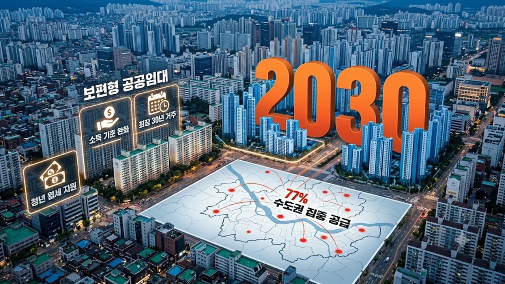

정부가 2030년까지 총 119만 호의 공적주택을 쏟아붓는 **2030 주거안정플랜** 세부 실행안을 확정하면서 무주택 실수요자의 청약 셈법이 완전히 달라졌다. 이번 대책은 연평균 24만 호 규모의 공적주택 물량과 함께 청년층의 고질적인 월세 지출을 직접 깎아주는 데 방점을 찍었다. 전세 사기 여파와 아파트 전셋값 강세가 이어지는 상황에서, 이번 발표가 가져올 공공임대 구조 개편과 현금성 주거비 지원은 내 집 마련 로드맵을 다시 짜야 할 명확한 이유가 된다.


## 2030 주거안정플랜 공급 계획과 수도권 집중 배분의 배경

### 연평균 24만 호 공급 스케줄의 현실성
국토교통부 집계 기준에 따르면 정부는 향후 5개년 동안 매년 공적주택 24만 호를 시장에 내놓는다. 이는 직전 3개년 평균 인허가 실적(연 18만~19만 호 선)과 비교해 약 26% 늘어난 수치다. 착공 지연 문제를 잡기 위해 한국토지주택공사(LH)와 서울주택도시공사(SH)가 쥐고 있는 도심 유휴 부지와 3기 신도시 미매각 업무·유보지를 공공주택 용지로 바로 맞바꾸는 패스트트랙 공정이 가동된다.

### 수도권 77퍼센트 쏠림 배치가 갖는 시장 신호
전체 119만 호 중 91만 호가 서울·경기·인천에 모인다. 직주근접성이 떨어지는 수도권 외곽 그린벨트를 마구잡이로 풀기보다 도심 역세권 복합개발과 경기 남부권 유망 택지에 힘을 실었다. [공급절벽 2026 아파트 시장, 진짜 전세가 매매가 밀어 올릴까](/posts/kr-realestate/supply-shortage-jeonse-caps-property-2026/) 분석에서 짚었듯, 서울 도심의 입주 가뭄이 외곽 전세가까지 밀어 올리는 왜곡 현상을 원천 차단하겠다는 포석이다.

## 새로 도입되는 보편형 공공임대 19만 호 작동 원리


### 기존 저소득층 임대와의 소득 및 자산 기준 차이
기존 영구·국민임대주택은 전년도 도시근로자 가구당 월평균 소득 50~70% 이하 취약계층 위주라 평범한 직장인은 서류조차 넣기 힘들었다. 신설된 **보편형 공공임대** 19만 호는 이 문턱을 월평균 소득 120%(맞벌이 가구 140%)까지 대폭 열었다. 자산 요건도 기존 3억 원 안팎에서 부동산·금융자산 합산 5억 원 선으로 현실화해, 통장 잔고가 애매해 사각지대에 갇혔던 3040 맞벌이 직장인의 갈증을 덜어냈다.

### 84제곱미터 중형 평형 확대와 최장 30년 거주 보장
원룸이나 투룸 위주로 짓던 공급자 중심 틀에서 벗어나 전용 59㎡와 84㎡ 비중을 40% 이상 채웠다. 주변 시세의 70~80% 선에서 임대료를 맞추고 2년 단위 재계약을 통해 최장 30년까지 거주 안정을 보장한다.

> "연봉이 조금 올랐다고 퇴거당하던 낡은 행정 규제를 털어내고, 내 집 마련 종잣돈을 모을 때까지 안심하고 살 수 있는 안전판을 만드는 것이 보편형 임대의 본질이다."

이러한 장기 거주 대안은 불안 심리에 쫓겨 무리하게 빚을 내는 [2030 영끌 재점화, 전세 폭등 속 진짜 살까?](/posts/kr-realestate/young-generation-panic-buying-jeonse-spike-2026/) 흐름을 잠재울 강력한 방파제 역할을 한다.

## 청년 월세 특별지원 소득 기준 274만 원 완화 분석

### 세전 월 274만 원 이하 확대가 의미하는 수혜 폭
기존 청년월세 특별지원은 기준 중위소득 60%(1인 가구 월 140만 원 선) 이하만 신청 가능해 단기 아르바이트생 전용 제도라는 지적이 많았다. 이번 개편안은 기준을 기준 중위소득 100%(1인 가구 세전 월 약 274만 원)로 끌어올렸다.

- **지원 대상:** 만 19세~34세 무주택 청년 (원가구 부모 소득 기준 중위소득 100% 이하 병행 적용)
- **주택 요건:** 보증금 5,000만 원 이하 및 월세 70만 원 이하 주택 거주자
- **지원 혜택:** 매달 최대 20만 원씩 12개월간 총 240만 원 현금 분할 지원

최저임금을 받는 정규직 사회초년생도 수혜권에 진입하면서 실제 혜택을 받는 대상자는 종전보다 3배 이상 폭증할 전망이다.

### 청약 가점 및 청년 전세자금 대출과의 연계성
월세 지원을 받는 기간 청년 주택드림 청약통장에 불입한 이력을 공공분양 청약 시 우대 가점으로 인정해 주는 연계 조항이 신설됐다. 주거비 현금 지원으로 숨통을 틔우고, 불어난 저축 여력을 바탕으로 기금 저리 전세대출이나 분양 청약으로 갈아타는 자산 형성 사다리가 맞춰졌다.

## 실수요자가 지금 당장 준비해야 할 청약 및 자금 포트폴리오

### 무주택 기간 유지와 특별공급 자격 관리
이번 플랜을 통해 풀리는 공공분양 '뉴:홈' 물량은 철저히 무주택 기간과 청약통장 저축총액 순으로 당첨자를 가려낸다. 조급한 마음에 환금성 떨어지는 외곽 신축 빌라나 나홀로 아파트를 매수했다가는 무주택 세대주 자격을 통째로 날린다. 인정 한도(월 25만 원)를 매달 빈틈없이 채워 넣으며 자격 요건을 굳히는 것이 최우선이다.

### 고금리 기조 속 중도금 집단대출 리스크 대비
공공택지 분양이라도 자잿값 인상으로 기본형 건축비가 연이어 올라 분양가 상한선 자체가 과거보다 높아졌다. DSR(총부채원리금상환비율) 2단계·3단계 규제와 스트레스 금리가 촘촘히 얽혀 있어 입주시점 1금융권 잔금대출 한도는 예상보다 줄어든다. 분양대금의 최소 35~40%는 대출 없는 순수 현금으로 메울 수 있도록 자금 계획을 세워둬야 청약 당첨 후 자금 경색을 피할 수 있다.

[새집 인테리어 홈가구 쿠팡에서 보기](https://www.coupang.com/np/search?q=%EC```markdown
## 1. 퍼포먼스 마케팅과 데이터 파이프라인 개요

현대 디지털 마케팅 환경에서 정밀한 데이터 트래킹과 파이프라인 구축은 유료 광고의 성패를 가르는 핵심 기반입니다. 단순한 노출과 클릭 수집을 넘어, 최종 전환 단계까지의 사용자 여정을 정확하게 추적해야 머신러닝 최적화와 예산 배분이 유의미해집니다.

* **서버 사이드 트래킹(CAPI):** 브라우저 쿠키 차단 정책(ITP) 및 광고 차단 프로그램의 영향을 최소화하기 위한 필수 인프라
* **통합 이벤트 설계:** 유입 경로, 페이지 체류, 상담 신청 폼 작성, 최종 제출까지의 단계를 표준화된 이벤트 규격으로 매핑
* **데이터 일관성 유지:** 웹 브라우저 태그와 서버 전송 간 중복 제거(Event Deduplication)를 통한 정확한 모수 확보

## 2. 구글 태그 매니저(GTM)와 메타 픽셀 연동 전략

효율적인 이벤트 수집을 위해서는 클라이언트 사이드 GTM과 메타 전환 API(Conversions API) 간의 유기적인 연계가 필요합니다. 사용자 식별 정보를 안전하게 해싱하여 매칭률을 극대화해야 합니다.

1. **GTM 컨테이너 구조화:** 공통 페이지뷰 태그와 주요 CTA(Call To Action) 클릭, 폼 전송 이벤트를 명확히 분리하여 트리거 설정
2. **이벤트 파라미터 표준화:** `event_id`, `client_user_agent`, `fbc`, `fbp` 값을 전역 변수화하여 브라우저와 서버 이벤트의 고유 식별자 일치 보장
3. **사용자 데이터 해싱 전송:** 이메일, 전화번호 등 민감 정보를 SHA-256 방식으로 클라이언트 혹은 중간 레이어에서 단방향 암호화 처리 후 전달

## 3. SEO 및 검색 엔진 최적화(GEO) 통합 프레임워크

검색 포털의 알고리즘 변화와 생성형 AI 기반 검색 엔진(GEO)의 등장에 맞춰, 온페이지(On-Page) 구조와 시맨틱 마크업을 동시 개선해야 유기적 트래픽을 안정적으로 확보할 수 있습니다.

| 항목 | 기존 검색 엔진 최적화(SEO) | 생성형 엔진 최적화(GEO) |
|---|---|---|
| **핵심 목표** | 키워드 랭킹 및 SERP 상위 노출 | LLM 응답 내 신뢰할 수 있는 출처로 인용 |
| **구조 설계** | H1-H3 위계, 메타 태그, 내부 링크 | 스키마 마크업(Schema.org), FAQ 구조체 |
| **콘텐츠 방식** | 키워드 빈도 및 백링크 기반 최적화 | 문맥적 정의, 비교 표, 명확한 결론 도출 |

* **시맨틱 태그 준수:** 본문 구조를 논리적으로 작성하여 웹 크롤러와 LLM이 페이지 맥락을 왜곡 없이 파싱하도록 설계
* **구조화 데이터(JSON-LD):** LocalBusiness, Course, FAQPage 스키마를 선제 적용하여 리치 스니펫 획득 가능성 제고

## 4. 자동화 워크플로우와 운영 효율화 체계

반복적인 데이터 추출과 리포팅 업무를 자동화하면 분석 및 크리에이티브 기획에 투입할 수 있는 시간을 대폭 확보할 수 있습니다. 노코드/로우코드 툴을 활용한 파이프라인 구성이 유효합니다.

* **Webhook 기반 데이터 수집:** 리드 획득 폼 제출 시 실시간 웹훅을 트리거하여 내부 CRM 및 스프레드시트로 즉각 동기화
* **n8n 워크플로우 연동:** 플랫폼 간 API를 연결하여 일일 광고 지표(CTR, CPC, CPL) 집계 및 이상치 감지 시 알림 발송
* **크리에이티브 A/B 테스트 자동화:** 주간 단위 성과 하위 소재 자동 일시중지 및 고효율 카피 기반 신규 소재 생성 루틴 수립