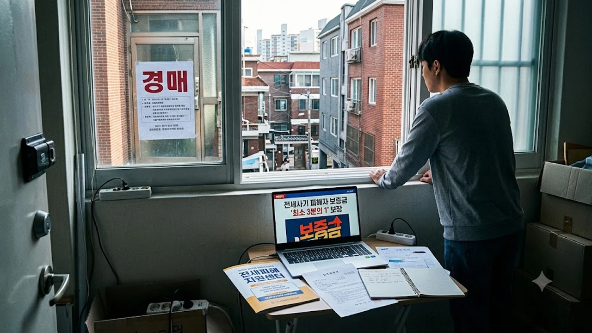

전세사기 피해자가 경·공매 절차를 거치더라도 보증금을 거의 건지지 못한 채 쫓겨나던 악순환을 끊기 위해 국가 차원의 **전세사기 보증금 보장** 장치가 본격 가동됩니다. 정부가 2026년 10월 6일 국무회의에서 의결한 전세사기특별법 시행령 개정안에 따라, 경매 배당금이 턱없이 모자라도 최소 보증금의 3분의 1 수준은 정부 재정과 한국토지주택공사(LH)의 경매 차익을 합쳐 우선 건져낼 수 있게 되었습니다. 11월 13일 전면 시행을 앞둔 시점에서 본인이 실제로 손에 쥘 수 있는 금액과 자격 요건을 빈틈없이 확인해야 합니다.

## 전세사기 피해 보증금 ‘최소 3분의 1’ 국가 보장제 개요

### 국무회의 의결로 확정된 시행령 개정안 핵심 포인트
이번 개정안의 뼈대는 LH가 피해주택을 사들일 때 발생하는 **경매 차익**(감정평가액에서 실제 법원 낙찰가를 뺀 차액)을 피해자에게 직접 정산해 주되, 낙찰가율 왜곡으로 차익이 부족하거나 아예 없더라도 정부 재정을 투입해 무조건 보증금의 3분의 1을 맞춰주는 데 있습니다. 선순위 은행 근저당에 밀려 배당표에서 0원을 받게 된 후순위 세입자라도 당장 길거리에 나앉지 않도록 최소한의 주거 이전 자금을 쥐어주겠다는 구상입니다.

> **국토교통부 시행령 개정안 핵심 조항**  
> 피해자가 공공임대 장기 거주 대신 보증금 보전을 원할 경우 정상 감정가 기반 정산금을 지급하며, 법원 배당액과 LH 차익의 합이 임차보증금의 30%에 미치지 못하면 국비를 보태 전체 보증금의 최소 3분의 1을 실질 지급액으로 확정한다.

### 경·공매 낙찰 차액 지원과 기존 대책과의 주요 차이점
이전 대책이 피해주택을 LH가 사들인 뒤 최장 10년간 살게 해주는 식의 현물 임대 지원에 묶여 있었다면, 이번 조치는 **직접적인 현금 청구권**을 보장한다는 점에서 판이합니다. 다른 지역 직장으로 옮겨야 하거나 목돈이 묶여 신용불량 위기에 몰린 세입자에게 실질적인 탈출구를 열어준 셈입니다. 시세가 폭락해 낙찰가가 바닥을 치는 빌라라도 최소 3분의 1 정산 기준선 덕분에 현금을 챙길 수 있습니다.

### 11월 13일 전면 시행 전 알아둘 기본 타임라인
개정안은 대통령 재가와 관보 공포를 거쳐 **2026년 11월 13일**부터 현장에 적용됩니다. 이미 국토부 피해자 결정을 받았는데 경매가 진행 중인 상황이라면, 관할 법원에 경매 기일 연기나 경매 유예를 신청해 일정을 11월 중순 이후로 미뤄두는 전략이 필수적입니다. 법원 경매가 그전에 끝나 제3자에게 낙찰되면 LH 우선매수권 매입 절차를 밟기 극히 까다로워집니다.

## 내가 받을 수 있는 보장액은 얼마일까? 지급 기준과 계산법

### 보증금 구간별 3분의 1 최소 보장액 산출 공식
최소 보장액은 확정일자부 계약서에 적힌 실제 임차보증금을 기준으로 정산합니다. 실지급액 산출 구조는 아래와 같습니다.

$$\text{정부 보전금} = \max\left(0, \left(\text{보증금} \times \frac{1}{3}\right) - (\text{경매 배당금} + \text{LH 경매차익})\right)$$

- **보증금 1억 5,000만 원 빌라 실사례:**
  - 법원 경매 낙찰 후 선순위 근저당 때문에 본인 배당액이 **0원**, LH 감정평가 차익이 **2,000만 원**인 경우
  - 법정 최소 보장선(3분의 1): **5,000만 원**
  - 정부 추가 국비 지원액: 5,000만 원 - 2,000만 원 = **3,000만 원**
  - **피해자 최종 수령액: 총 5,000만 원 (원금의 33.3% 확보)**

- **보증금 9,000만 원 다세대주택 실사례:**
  - 소액임차인 최우선변제금으로 법원에서 **2,500만 원**을 먼저 배당받은 경우
  - 최소 보장선 3,000만 원(3분의 1)과의 차액인 **500만 원**만 LH 경매차익 및 재정으로 추가 지급

### 선순위 근저당 및 최우선변제금 공제 시 실제 수령액
법원에서 먼저 챙긴 최우선변제금은 3분의 1 기준액에 그대로 합산된다는 점을 놓쳐선 안 됩니다. 최우선변제금으로 이미 보증금의 35% 이상을 챙긴 세입자라면 정부의 추가 현금 지급분은 발생하지 않습니다. 반면 LH 감정평가액 대비 경매 낙찰가가 유독 낮게 형성되어 경매 차익이 두둑하게 쌓인 집이라면, 3분의 1 하한선을 훌쩍 뛰어넘는 차익 전액을 피해자가 돌려받아 원금의 절반 이상을 회수하는 경우도 나옵니다.

### 다가구·신탁사기 등 무권계약자 특별 산정 기준
그간 권리관계가 꼬여 경매 배당 순위조차 못 받던 신탁부동산 무단 계약자와 다가구주택 임차인을 위한 통로도 뚫렸습니다. 집주인이 신탁사 허락 없이 가짜 임대차 계약을 맺어 불법 점유자로 몰렸던 피해자는 신탁사 협의 매입 방식을 가동해 쫓겨날 위험을 차단합니다. 국토부 피해지원위원회가 실제 은행 이체 내역을 대조해 증빙된 실피해액의 3분의 1을 기준으로 잡고 정산에 들어갑니다. 새 보금자리 자금 대책이 급한 청년층이라면 [청년미래보금자리론 4억 빌라 숨은 조건](/posts/kr-realestate/youth-future-bogeumjari-loan-villa-2026/)을 함께 따져 이주 플랜을 짜야 합니다.

## LH 피해주택 매입 및 지원금 신청 단계별 가이드

### 피해자 인정 신청부터 LH 서류 접수까지 3단계 절차
절차가 복잡해 보이지만 순서만 지키면 혼선 없이 처리할 수 있습니다.

- **1단계: 안심전세포털 또는 지자체 전세피해지원센터 접수**
  - 집주인의 기망 의도와 다수 피해 발생 증빙을 내고 국토부 위원회의 피해자 결정문을 확보합니다.
- **2단계: LH 청약플러스 전담창구에 피해주택 우선매수권 양도 신청**
  - 법원이 통지한 본인의 우선매수권을 LH에 넘기고 피해주택 매입을 위탁합니다.
- **3단계: 감정평가 완료 후 경매 차익 및 최소보장금 정산 신청**
  - LH의 낙찰 완료 후 감정가 차액과 국비 보전금을 합산 산정해 피해자 본인 통장으로 수령합니다.

### 필수 구비 서류 체크리스트 및 온라인 제출 경로
LH 매입 접수 시 서류 한 장만 어긋나도 법원 경매 일정을 맞추지 못해 기회를 날립니다. 발급일 기준 1개월 이내 원본을 챙겨야 합니다.

- 전세사기피해자등 결정통지서 정본
- 확정일자 부여현황 및 전입세대확인서(지번·도로명 각 1부)
- 임대차계약서 원본(확정일자 날인 필수)
- 금융거래확인서 및 보증금 송금 영수증(은행 직인 날인)
- 법원 권리신고 및 배당요구신청서 접수증 사본
- 주민등록 등·초본(전체 주소 변동 이력 포함)

### 신청 후 지급 심사 기간과 주의해야 할 결격 사유
접수부터 실제 통장 입금까지는 법원 매각 일정과 감정평가 실사가 맞물려 있어 통상 **4개월에서 길게는 8개월**이 걸립니다. 임대인과 짜고 허위 전세계약을 체결한 정황이 드러나면 지원금 전액 환수와 함께 고발당합니다. 불법 개조된 근린생활시설(근생빌라)은 이행강제금 해소를 위한 지자체 심의가 끼어들어 처리 기한이 더 늘어날 수 있습니다.

## 보증금 회수 전 체크해야 할 주의점과 현실적 한계

### 피해주택 경매 유예 신청과 우선매수권 활용 시 유의사항
세입자가 피해주택을 직접 낙찰받는 셀프 낙찰을 택할 수도 있습니다. 다만 이 경우 국가의 최소 3분의 1 현금 보전은 나오지 않고 취득세 감면과 저리 대출 혜택만 주어집니다. 비아파트 매매가가 꺾인 지역이라면 섣불리 떠안았다가 집값 하락과 재매각 실패 위험에 갇히느니, LH에 권리를 넘기고 3분의 1 보장금과 차익을 현금으로 챙겨 빠져나오는 편이 안전합니다. 시장 향방이 혼탁하다면 [2030 영끌 재점화, 전세 폭등 속 진짜 살까?](/posts/kr-realestate/young-generation-panic-buying-jeonse-spike-2026/) 분석을 짚어보고 리스크를 분산해야 합니다.

### 3분의 1 보장 제외 대상 및 사각지대 판별법
모든 피해자가 지원을 받는 것은 아니며 아래에 걸리면 원천 배제됩니다.

- 주택도시보증공사(HUG)나 SGI서울보증의 반환보증으로 전액 보증금을 회수한 경우
- 보증금이 5억 원을 넘어 특별법 적용 상한을 벗어난 고액 전세
- 실제 주거용이 아니거나 전입신고가 누락되어 거주 사실을 입증하지 못하는 상가·업무 시설

### 금융권 기존 전세대출 상환 유예 및 대환 연계 팁
3분의 1을 돌려받아도 빚으로 남은 3분의 2 전세대출금은 고스란히 본인 채무로 남습니다. 일반 은행 대출을 그대로 방치하면 신용불량자로 전락하므로, 피해자 결정 즉시 주택도시기금 **무이자·저리 대환대출**(최장 20년 분할상환)을 신청해 채무를 갈아타야 합니다. 신용회복위원회의 전세사기 특례 채무조정까지 묶으면 원금 감면과 최장 10년 거치 기간을 확보해 매달 나가는 상환액을 크게 줄일 수 있습니다.

[전세사기 피해 예방 계약서 보관 화재방지 서류함 쿠팡에서 보기](https://www.coupang.com/np/search?q=%ED%99%94%EC%9E%AC%EB%B0%A9%EC%A7%80%20%EB%82%B4%ED%99%94%20%EC%84%9C%EB%A5%98%ED%95%A8&sourceType=affiliate&trackingCode=AF8691300)

#전세사기보증금보장 #전세사기특별법개정안 #LH피해주택매입 #경매차익정산 #최우선변제금 #전세사기피해지원 #깡통전세대책 #11월13일시행