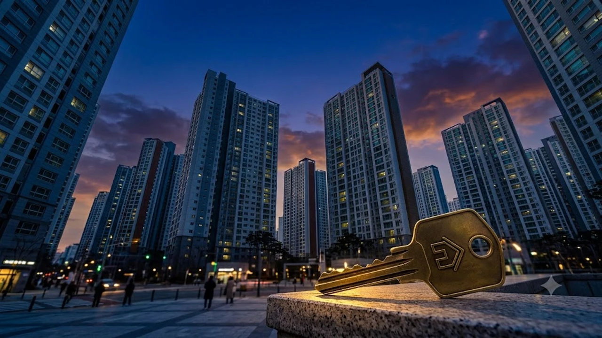

2026년 가을 이사철을 앞두고 시중은행의 전세자금대출 심사 문턱이 급격히 높아지면서, 임대차 시장에서는 보증금 일부를 월세로 돌리는 **전세대출 규제 반전세 전환**이 급물살을 타고 있다. 수도권 아파트 전세 매물 부족과 대출 한도 축소가 맞물리며 임차인의 주거비 계산법도 완전히 달라졌다. 특히 [공급절벽 2026 아파트 시장, 진짜 전세가 매매가 밀어 올릴까](/posts/kr-realestate/supply-shortage-jeonse-caps-property-2026/)와 같은 시장 불안 요인이 겹치면서 세입자들의 실질 체감 비용은 갈수록 커지는 양상이다.


## 은행권 전세대출 규제 강화와 임대차 시장 현주소

### 시중은행 유주택자 대상 전세대출 취급 제한 배경
가계부채 억제 기조에 발맞춰 주요 1금융권 은행들은 1주택자 이상 다주택자의 수도권 주택 추가 전세대출을 사실상 원천 차단했다. 갭투자를 통한 주택 매입을 막겠다는 금융당국의 강력한 지침이 현장 창구에 곧바로 반영된 결과다. 무주택자라 할지라도 소득 대비 원리금 상환 비율 심사가 훨씬 깐깐해지면서 기존에 예상했던 대출 한도가 수천만 원 단위로 깎여나가는 사례가 속출하고 있다.

### 수도권 주요 단지 전세 매물 잠김과 호가 변동
매매 대기 수요가 전세 시장에 머무는 상황에서 신규 입주 물량마저 줄어들자 순수 전세 매물은 자취를 감추는 추세다. 임대인들은 대출 규제로 보증금을 크게 올려 받기 어려워지자 증액분을 월세로 돌려 계약하길 원하고 있다. 마포나 성동, 분당 등 주요 학군·역세권 단지에서는 순수 전세 호가가 치솟거나 반전세 계약으로의 유도가 대세로 굳어졌다.

### 보증기관 보증 한도 강화 체크
주택도시보증공사(HUG)와 SGI서울보증 등 주요 보증기관의 전세대출 보증 및 반환보증 요건이 강화되면서 임차인의 자금 조달 길은 더 좁아졌다. 담보 주택의 공시가격 반영 비율과 부채비율 산정 방식이 보수적으로 적용되면서, 과거 기준으로는 무난히 통과되던 전세대출 상품도 한도 미달 판정을 받기 십상이다.

## 전세 유지 vs 반전세 전환: 실제 금융비용 득실 비교


### 최신 시중 전월세전환율 추이와 월세 부담 계산식
수도권 아파트의 실질 전월세전환율은 연 4.5%에서 5.2% 선을 넘나든다. 보증금 1억 원을 감액하고 이를 월세로 돌릴 때, 연 5% 전환율을 적용하면 매달 약 41만 6천 원의 순수 주거비가 발생한다.

> **전월세 전환 계산 기준**  
> `월세액 = (줄어드는 보증금 × 전월세전환율) ÷ 12개월`  
> 전환율이 대출 이자율보다 높으면 임차인에게는 순수 현금 유출 부담이 그만큼 불어난다.

### 대출 금리 4%대 기준 이자 비용과 월세 지출 비교
은행 전세대출 금리가 4.0%~4.5% 수준일 때, 대출 이자와 월세를 직접 맞비교해야 한다. 1억 원 대출 시 월 이자는 약 33만~37만 원 선이다. 반면 집주인이 요구하는 전월세전환율이 5.0%를 넘는다면 은행 이자보다 매달 집주인에게 송금하는 월세 지출이 최소 5만~8만 원 이상 더 크다. 대출 실행이 가능하고 이자율이 전환율보다 낮다면 순수 전세 유지가 수치상 유리하지만, 대출 자체가 막힌 경우엔 울며 겨자 먹기로 반전세를 택해야 하는 처지다.

### 보증금 반환 안정성 관점에서 본 반전세의 장단점
반전세의 독보적인 강점은 보증금 규모 자체를 낮춤으로써 전세 사기나 역전세 리스크에서 한 발짝 물러설 수 있다는 점이다. 향후 집값이나 전셋값이 급락하더라도 회수해야 할 몫이 적어 심리적 안정감이 크다. 반면 매달 계좌에서 빠져나가는 고정 비용은 자산 형성 속도를 늦추는 치명적인 약점이다.

## 상황별 임차인 선택 가이드: 갈아타기 실전 전략

### 무주택 청년·신혼부부 정책자금 대안 탐색
시중은행의 일반 전세대출이 막혔다면 버팀목 전세자금대출이나 신생아 특례대출 등 저리 정책자금 요건을 면밀히 살펴야 한다. 소득 및 자산 기준에 부합한다면 연 1~2%대 파격적인 금리를 누릴 수 있어 반전세보다 압도적인 금융 우위를 점한다. 주택 매매로 눈을 돌린 청년층이라면 [청년미래보금자리론 4억 빌라 숨은 조건](/posts/kr-realestate/youth-future-bogeumjari-loan-villa-2026/)을 검토해 주거 형태 자체를 전환```markdown
작업할 주제나 초안을 입력해주시면 요청하신 형식에 맞춰 완성된 마크다운 본문을 출력해 드리겠습니다.