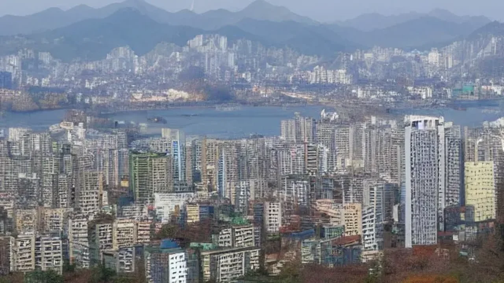
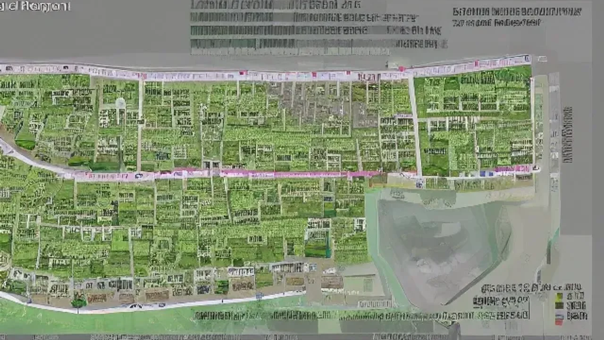

Markdown
최근 부동산 시장의 이목이 집중된 규제 완화 소식 속에서 **토지거래허가** 구역 내 실거주 의무 유예 조건이 대폭 확대되었습니다. 이번 조치로 강남 3구와 용산 등 주요 규제 지역에서 주택 매수를 고민하던 실수요자들의 숨통이 트일 것으로 기대됩니다. 정부가 발표한 세부 지침과 이에 따른 실전 투자 전략을 명확하게 파악하여 내 자산 가치를 극대화할 타이밍을 포착해야 합니다.

## 토지거래허가구역 실거주 완화, 무엇이 왜 바뀌나?

### 정부가 실거주 의무 유예 카드를 꺼낸 진짜 이유
국토교통부가 기습적으로 규제 완화를 발표한 배경에는 서울 주요 상급지의 매물 잠김 현상과 거래량 고사가 자리 잡고 있습니다. 기존 제도 아래에서는 허가 구역 내 주택을 매수할 때 4개월 이내에 무조건 입주해야 했기에 세입자가 있는 주택은 거래 자체가 불가능했습니다. 이로 인해 이사 가고 싶어도 기존 집이 팔리지 않아 갈아타기가 막힌 1주택자의 주거 사다리가 완전히 끊어졌다는 비판이 팽배했습니다. 정부는 거래 활성화를 통한 시장 연착륙을 유도하기 위해 이번 유예 카드를 꺼내 들었습니다.

### 기존 규제 vs 2026년 변경안 핵심 요약 비교
과거에는 매수 후 즉시 실거주가 원칙이었으나, 변경안은 비거주 1주택자에 한해 기존 임대차 계약 기간이 남아있을 경우 최대 2년까지 실거주를 유예할 수 있도록 허용합니다. 

| 구분 | 기존 제도 | 2026년 변경안 |
| :--- | :--- | :--- |
| **실거주 기한** | 허가 후 4개월 이내 입주 | 임대차 만기 시까지 (최대 2년 유예) |
| **매수 가능 대상** | 무주택자 중심 | 비거주 1주택자까지 확대 |
| **처벌 규정** | 이행강제금 부과 (취득가액의 10%) | 유예 조건 위반 시 동일 부과 |

이러한 변화는 강남권 아파트를 갭투자 형태로 선진입하려는 대기 수요자들에게 완전히 새로운 판도를 열어주었습니다.

## 나도 대상일까? '실거주 의무 유예' 적용 조건과 예외 조항

### 비거주 1주택자를 위한 완화 기준과 승인 절차
이번 완화 혜택을 받기 위해서는 관할 구청에 주택취득자금 조달계획서와 함께 '임대차 계약 승계 사유서'를 의무적으로 제출해야 합니다. 본인 소유의 주택에 거주하지 않고 타 가구에 임차로 거주 중인 1주택자이거나, 지방 근무 등의 사유로 상경해야 하는 이들이 주 대상입니다. 구청 서류 심사 과정에서 기존 임대차 계약서상의 잔여 기간이 명확히 입증되어야 허가증이 발급되므로 계약서 특약란을 철저히 점검해야 안전합니다.

### "이러면 과태료 폭탄" 유예 신청 시 반드시 주의할 독소 조항
> **경고:** 임대차 만기 이후 세입자가 계약갱신청구권을 행사하더라도, 매수인의 실거주 의무는 유예되지 않고 즉시 발생합니다.

많은 이들이 간과하는 독소 조항은 바로 세입자의 계약갱신청구권입니다. 주택임대차보호법상 세입자가 2년 연장을 요구할 때, 실거주 목적의 매수인은 이를 거절할 수 있으나 유예 승인을 받은 매수인이 제때 입주하지 않으면 구청은 예외 없이 취득가액의 10%에 달하는 이행강제금을 매년 부과합니다. 15억 원짜리 아파트라면 매년 1억 5천만 원의 과태료가 나오므로 세입자와의 퇴거 합의 과정을 서류로 남겨두어야 리스크를 방지합니다.

### 예외적으로 허용되는 상속·증여 및 불가피한 사유 알아보기
행정안전부와 국토교통부 지침에 따르면 직장 변경, 해외 주재원 발령, 질병 치료 목적의 병원 통원 등 객관적 소명이 가능한 사유가 발생하면 실거주 의무 기간 중이라도 추가 유예를 신청할 수 있습니다. 상속으로 인해 불가피하게 토지거래허가 구역 내 지분을 취득하게 된 경우는 실거주 의무 자체가 면제되지만, 일반 증여는 매매와 동일한 기준이 적용되어 실거주 요건을 채워야 소유권 이전이 완료됩니다.

## 상급지 갈아타기 vs 갭투자, 지금 진입해도 괜찮을까?

### 강남·송파 매물 잠김 해소? 현장 중개업소가 말하는 체감 분위기
송파구 잠실동과 강남구 대치동 일대 공인중개사사무소에 따르면 정책 발표 직후 갭투자가 가능한 급매물을 찾는 문의 전화가 평소보다 3배 이상 늘었습니다. 기존에는 보증금을 낀 매물은 아예 거래가 안 되어 시세보다 5천만 원 이상 낮춰도 팔리지 않았으나, 지금은 집주인들이 매물을 거두어들이거나 호가를 다시 올리는 현상이 관측됩니다. 매수 우위 시장에서 매도자 우위 시장으로 급격히 재편되는 흐름입니다.

### 실거주 유예를 활용한 '수도권 상급지 갈아타기' 실전 시나리오
수원 영통에 거주하던 A씨(40대)는 본인 아파트를 5억 원에 매도한 자금과 보유 현금을 합쳐 송파구의 15억 원 상당 아파트를 매수했습니다. 해당 아파트에는 기존 세입자의 전세보증금 7억 원이 들어있어, A씨는 실거주 유예 제도를 활용해 현금 8억 원만으로 강남권 상급지 진입에 성공했습니다. 2년의 유예 기간 동안 자금을 추가로 마련해 입주할 계획을 세운 전형적인 성공 사례입니다.

[관련 글 보기](/posts/kr-realestate/)

### 단기 차익 노린 갭투자가 자칫 자금 압박으로 이어지는 이유
단순히 소액의 갭으로 시세 차익만 노리고 진입하는 행위는 2026년 하반기 금융 환경을 고려할 때 극도로 위험합니다. 역전세난이 발생하여 전세 보증금을 일부 돌려줘야 하거나, 2년 뒤 만기 시점에 대출 규제로 인해 전세퇴거자금대출이 막힐 경우 유예 기간이 끝나는 순간 야반도주하듯 급매로 던져야 하는 최악의 상황에 직면합니다. 철저하게 실수요 입주 능력을 갖춘 상태에서 접근하는 전략이 요구됩니다.

## 토지거래허가구역 매수 프로세스 및 자금 조달 꿀팁

### 구청 허가부터 잔금 치르기까지 5단계 행정 절차 완전 정복
...토지거래허가 구역 내 거래는 계약서 작성 전후의 행정 절차가 일반 매매와 완전히 다릅니다.
- **1단계:** 매도인과 매수인의 가계약 작성 (허가 미발급 시 계약을 무효로 한다는 특약 필수 기재)
- **2단계:** 관할 구청 토지정보과에 토지거래계약허가 신청서 및 자금조달계획서 제출
- **3단계:** 구청의 현장 실사 및 서류 심사 진행 (영업일 기준 15일 이내 처리)
- **4단계:** 허가증 발급 확인 후 정식 계약 체결 및 계약금 송금
- **5단계:** 잔금 지급 및 소유권 이전 등기 완료 (허가증 없이 체결한 계약은 법적 무효 처리)

### 스트레스 DSR 3단계 압박을 피하는 합법적인 자금조달계획서 작성법
올해부터 전격 도입된 스트레스 DSR 3단계 제도로 인해 은행권 대출 한도가 수천만 원 이상 축소되었습니다. 이를 극복하려면 자금조달계획서 작성 시 주택담보대출에만 의존하지 말고, 기존 보유 주택의 매도 대금 증빙서류나 중도도해 금융자산(적금, 주식 매도 대금)을 명확하게 첨부해야 합니다. 직계존속으로부터의 증여가 포함된다면 1억 5천만 원까지 가능한 혼인·출산 증여재산 공제 등을 적극 활용해 합법적인 자금 출처를 소명해야 세무조사 대상에서 제외됩니다.

### 매수 전 필 체크! 토지거래허가구역 내 준공업·상업지역 빌라 투자 매력도
아파트 가격이 부담스럽다면 토지거래허가구역 내에 위치한 역세권 빌라나 준공업지역 빌라를 대안으로 삼을 수 있습니다. 대지실분할 면적이 규제 기준(주거지역 6㎡ 초과) 이하인 소형 빌라는 허가 자체를 받지 않고 자유롭게 갭투자가 가능하므로 초기 투자 자금이 부족한 소액 투자자들에게 틈새시장으로 기능합니다. 향후 모아타운이나 신속통합기획 등 재개발 가능성이 높은 지역을 선점한다면 아파트 못지않은 자산 증식 효과를 누리게 됩니다.

#토지거래허가 #실거주유예 #부동산규제완화 #강남갭투자 #상급지갈아타기 #자금조달계획서 #스트레스DSR3단계 #2026부동산트렌드