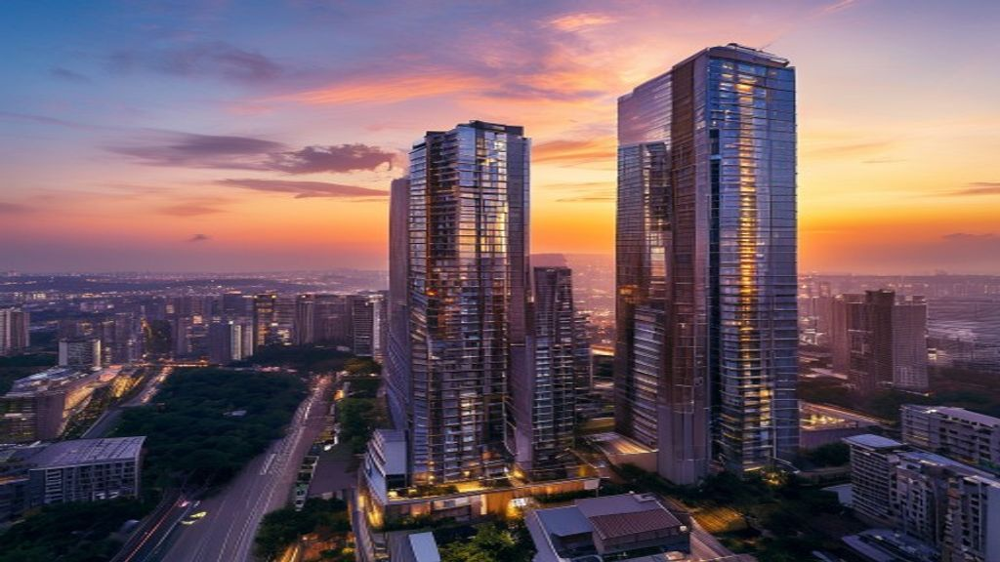

수도권 부동산 시장이 2026년 5월을 기점으로 완전히 새로운 국면을 맞이하고 있습니다. 양도세 중과 유예 종료와 금리 불확실성이 맞물리면서 매수세가 특정 지역과 특정 평형으로만 쏠리는 현상이 거세지는 흐름입니다. 내 집 마련을 꿈꾸는 실수요자라면 지금처럼 혼란스러운 시기에 어떤 징후를 포착하고 움직여야 할지 명확한 기준이 필요합니다.

## 반도체 벨트 배후지의 거침없는 신고가 랠리

### 동탄과 광교의 20억 돌파 현상

현장에서 느껴지는 열기는 실거래가로 고스란히 증명됩니다. 동탄역 인근의 전용 84㎡ 아파트가 최근 20억 8,000만 원에 거래되며 신고가를 갈아치웠고, 광교신도시 역시 15억 원을 가뿐히 넘기는 단지들이 속출하고 있습니다. 고소득 직장인들이 탄탄한 현금 동원력을 바탕으로 매물을 받아내다 보니 대출 규제 압박 속에서도 흔들림 없는 시세를 유지하는 모양새입니다.

### 성남과 용인으로 번지는 온기

이러한 흐름은 화성을 넘어 성남 분당구, 백현마을 일대와 용인 기흥구까지 빠르게 도달했습니다. 신분당선과 GTX 라인을 따라 정주 여건이 우수한 단지들은 매물이 나오기가 무섭게 보합세를 깨고 우상향하고 있습니다. 인근 신축 분양 단지들의 계약률이 단기간에 90%를 상회하는 현상도 이와 무관하지 않습니다.

## 양도세 중과 종료가 불러온 매물 잠김과 월세 가속화

정부의 규제 카드와 시장의 역동성은 종종 엇박자를 냅니다. 다주택자들의 매도를 유도하기 위한 유예 기간이 끝난 직후 시장은 예상과 전혀 다른 방향으로 튀기 시작했습니다.

### 매물 회수와 매매 공급의 급감

매도 타이밍을 놓치거나 보유세 부담을 감내하기로 돌아선 다주택자들이 기존 매매 매물을 대거 거둬들이고 있습니다. 향후 시장의 불확실성이 짙어지자 매매로 자산을 처분하기보다 일단 버티기에 들어간 셈입니다. 이로 인해 서울 상급지와 주요 선호 지역의 매매 공급은 눈에 띄게 줄어들었습니다.

### 임차인을 짓누르는 고액 월세 시장

매매 시장에서 후퇴한 물량은 고스란히 월세나 준월세로 전환되는 분위기입니다. 서울 마포, 성동, 동작 등 직장인 선호도가 높은 대단지에서는 보증금 수억 원에 월세 수백만 원을 호가하는 매물이 뉴노멀로 자리 잡았습니다. 전세보증금 반환 리스크에 피로감을 느낀 임차 수요까지 월세로 가세하면서 임차인들의 주거비 부담이 한 달 월급을 위협하는 수준에 이르렀습니다.

## 평형별 온도 차가 만드는 기형적 구조

자금 조달의 한계는 수요자들의 선택지를 좁혀 놓았고, 이는 평형별 거래량과 호가의 극단적인 비대칭을 낳았습니다.

### 24평 소형 평형의 활발한 거래 이유

정책 대출이나 생애 최초 주택구입자 대출, 특례보금자리론을 적극적으로 활용할 수 있는 7억~8억 원대 소형 평형은 매수세가 꾸준합니다. 사회초년생과 신혼부부들이 감당할 수 있는 마지노선 가격대이기 때문입니다. 대출 한도 내에서 진입이 가능한 소형 평형은 호가가 빠르게 오르고 매물 소진 속도도 체감될 만큼 매끄럽습니다.

### 34평 중형 평형의 거래 절벽과 관망세

반면 실수요층의 대출 규제선인 15억 원을 상회하거나 절대 가격 자체가 높은 34평형은 거래가 뚝 끊겼습니다. 현금 동원력이 부족한 중산층 실수요자가 접근하기에 문턱이 지나치게 높다 보니, 매도자와 매수자 간의 팽팽한 줄다리기만 이어질 뿐 호가 상승의 동력을 잃고 멈춰 서 있습니다.

## 서울 핵심지와 외곽 지역의 디커플링 심화

지역별 양극화는 이제 단순한 격차를 넘어 동조화가 완전히 깨진 디커플링 단계로 접어들었습니다. 서울 내에서도 입지에 따라 훈풍과 냉풍이 동시에 불고 있습니다.

### 강남3구와 마·용·성의 대기 수요

KB 매매가격 전망지수가 기준선인 100을 훌쩍 넘긴 120.6을 기록한 중심에는 서울 상급지가 자리합니다. 매수 우위 시장 속에서 자산가들은 똘똘한 한 채에 집중하고 있으며, 급매물이 소진된 이후 잠시 숨 고르기를 하는 와중에도 대기 수요는 굳건하게 자리를 지키고 있습니다.

### 경기 외곽 및 지방의 침체 장기화

반면 광역 교통망 호재가 없거나 일자리가 빈약한 서울 외곽과 수도권 경계 지역은 철저히 소외되고 있습니다. 거래량이 바닥을 헤매는 곳에서는 호가를 낮추는 급매물이 속속 등장하고 있지만 이마저도 매수 희망자를 찾기 어렵습니다.

## 2026년 하반기 무주택자의 생존 매수 가이드

[관련 글 보기](/posts/kr-realestate/)

### 정책 대출 활용한 소형 평형 선취 전략

무리한 영끌보다는 정책 금융 상품을 최대한 활용해 진입 장벽을 낮추는 접근이 현실적입니다. 금융 활용이 가능한 소형 평형이나 경기 남부 핵심 교통망 배후지의 알짜 단지를 선점한 뒤, 자산을 키워 상급지로 이동하는 단계적 전략이 훨씬 안정적입니다.

### 전·월세 폭등기 속 매매 타이밍 포착

월세 가격이 치솟고 전세 매물이 말라가는 임대차 시장의 불안정성은 역설적으로 매매 수요를 자극하는 신호가 됩니다. 주거비로 소모되는 비용과 대출 이자 비용을 냉정하게 비교 분석해 보고, 실거주 만족도가 높으면서 역세권 중심의 직주근접성을 갖춘 단지라면 하반기 금리 추이를 살피며 과감하게 매수 타이밍을 잡는 태도가 필요합니다.

#수도권부동산 #부동산양극화 #동탄아파트 #반도체벨트 #월세전환 #내집마련전략 #2026부동산전망