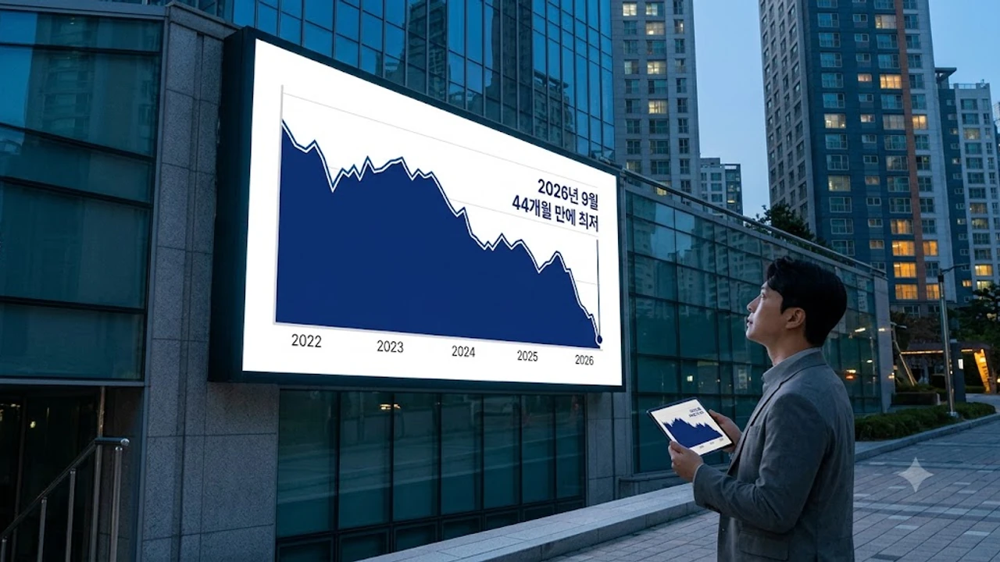

부동산 시장에서 2주택자 보유 비중이 급격히 줄어들며 자산 시장의 지각변동이 가시화되고 있습니다. 세제 압박과 고강도 대출 규제가 겹치면서 다주택자 매물 출회가 서울 핵심지와 수도권 외곽을 가리지 않고 본격화되는 흐름입니다. 똘똘한 한 채로 갈아타려는 움직임이 맞물려 자산 배분을 재조정하는 집주인들의 셈법이 한층 치열해졌습니다.


## 2주택자 보유 비율 44개월 만에 최저를 기록한 구조적 배경

### 등기 데이터로 확인된 실질 매도세
대법원 등기정보광장 통계에 따르면 집합건물을 2채 이상 보유한 다주택자의 소유 비율은 44개월 만에 최```markdown
## 1. 퍼포먼스 마케팅과 데이터 파이프라인의 연계

디지털 마케팅 환경에서 정밀한 추적 환경 구축은 전환 효율 최적화의 기본 전제입니다. 웹사이트 내 유저 행동 데이터를 정확하게 수집하기 위해 Google Tag Manager(GTM)와 Meta Pixel, GA4 간의 이벤트 매핑을 표준화해야 합니다. 특히 클릭, 스크롤, 서식 제출 등 마이크로 컨버전을 세분화하여 측정함으로써 잠재 고객의 이탈 구간을 식별하고 퍼널별 맞춤 소재를 매칭하는 전략이 요구됩니다.

## 2. 검색 엔진 최적화(SEO) 및 생성형 검색(GEO) 전략

전통적인 검색 엔진 최적화뿐만 아니라 대화형 AI 검색 엔진에 대비한 생성형 엔진 최적화(GEO)의 중요성이 커지고 있습니다. 콘텐츠 구조는 명확한 질의응답 구조와 신뢰성 있는 출처 인용, 스키마 마크업(Schema Markup) 적용을 통해 크롤러와 거대언어모델(LLM)이 핵심 요지를 빠르게 파악할 수 있도록 설계해야 합니다. 키워드 중심의 나열을 벗어나 검색 의도(Search Intent)에 부합하는 해결책 중심의 긴 호흡 콘텐츠를 체계적으로 구성하는 것이 핵심입니다.

## 3. 워크플로우 자동화를 통한 마케팅 운영 효율화

콘텐츠 발행, 리드 수집, 알림 발송과 같은 반복 업무는 n8n 또는 Make와 같은 노코드·로우코드 도구를 통해 자동화할 수 있습니다. 예를 들어 랜딩 페이지에 유입된 문의 데이터가 웹훅(Webhook)을 통해 수집되면, 이를 CRM 및 메신저 채널로 즉시 전송하고 스프레드시트에 아카이빙하는 체계를 구축할 수 있습니다. 리드 인입 즉시 알림이 발송되는 환경을 조성하면 응대 지연 시간을 최소화하여 최종 전환율을 극대화할 수 있습니다.

## 4. 멀티 채널 콘텐츠 배포 및 성과 측정 지표

다양한 채널을 운영할 때는 각 플랫폼의 알고리즘과 소비 특성에 맞춘 콘텐츠 변환이 필수적입니다. 블로그의 전문적인 텍스트 콘텐츠는 숏폼 영상 스크립트나 카드뉴스 형태로 재가공하여 분산 배포해야 도달 범위를 넓힐 수 있습니다. 성과 분석 시에는 단순 노출수나 클릭률에 매몰되지 않고 유입 경로별 실제 상담 전환율, 최종 등록률, 고객 획득 비용(CAC)을 종합적으로 대조하여 예산 분배의 우선순위를 결정해야 합니다.