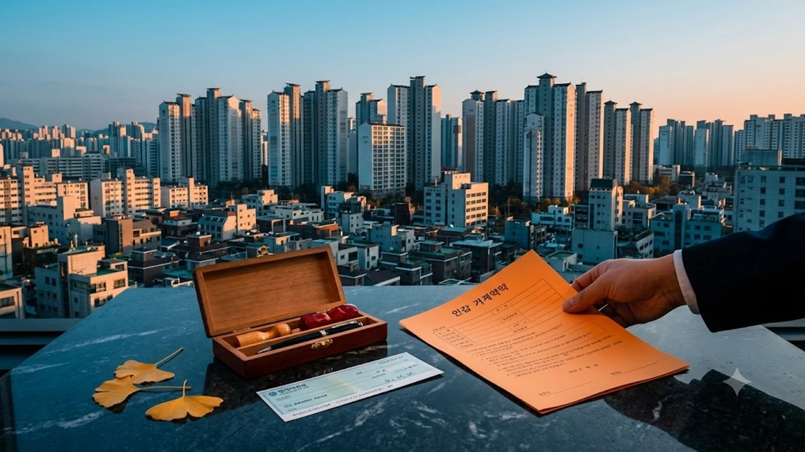

2026년 10월 가을 이사철을 앞두고 **서울 전세 재계약**을 준비하는 세입자들의 한숨이 깊어지고 있습니다. 서울 아파트 평균 전세가격이 2년 전보다 8천만 원 넘게 치솟으면서, 당장 목돈을 구하지 못해 보증부 월세(반전세) 전환이나 외곽 이주를 심각하게 고민하는 가구가 급증했습니다. 최근 시장에서는 [2030 영끌 재점화, 전세 폭등 속 진짜 살까?](/posts/kr-realestate/young-generation-panic-buying-jeonse-spike-2026/)와 같은 고민이 다시 터져 나오는 가운데, 만기를 맞은 임차인을 위한 실질적인 자금 조달 해법과 보증금 사수 전략을 정리합니다.

## 2년 전보다 8천만 원 뛴 서울 전세 실태

### 2년 전 대비 14.9% 급등한 서울 아파트 현주소
2026년 9월 말 기준 한국부동산원 통계에 따르면 서울 아파트 평균 전셋값은 6억 3,662만 원을 기록했습니다. 2년 전 동기(5억 5,394만 원)와 비교하면 무려 8,268만 원(14.9%)이 수직 상승한 셈입니다. 

마포, 성동 등 핵심 주거 지역의 전용 84㎡ 단지는 2년 전 6억 원대 중반에 체결됐던 전세 계약이 현재 7억 5,000만 원 안팎에 형성되면서, 재계약 시 1억 원 가까운 보증금 증액을 요구받는 사례가 속출하고 있습니다.

### 토지거래허가구역 매물 품귀와 전세가율 반등
실거주 의무 규제가 적용되는 강남 3구와 주요 정비사업 인근 토지거래허가구역에서는 전세 매물 잠김 현상이 한층 심각합니다. 입주 가능한 전세 물건 자체가 씨가 마르면서 전셋값 상승률이 일반 자치구 대비 가파르게 치솟았습니다. 

매매 거래가 관망세에 접어들며 보합세를 보이는 반면 전셋값은 계속 올라, 서울 아파트 평균 전세가율(매매가 대비 전세가 비율) 역시 54% 선을 넘어서며 깡통전세 위험과는 별개로 세입자의 진입 장벽을 밀어 올리고 있습니다.

### 매매가 정체 속 전셋값 독주 배경
스트레스 DSR 2단계 안착과 시중은행의 주택담보대출 문턱 강화로 주택 매수 대기 수요가 대거 임대차 시장에 머무르고 있습니다. 공급 측면에서도 2026년 서울 신규 입주 물량이 예년 평균을 밑돌면서 수급 불균형이 단기간에 해소되기 어려운 구조를 형성했습니다.

> "매수하기엔 대출 규제와 금리가 부담스럽고, 빌라 전세는 신뢰하기 어려워 아파트 전세로 수요가 쏠리는 전형적인 압축 현상이 나타나고 있다." — 부동산 수급 분석 보고서

---

## 전세 만기 세입자의 3대 선택지 분석

### 계약갱신청구권 활용 실익과 법적 제한
주택임대차보호법상 계약갱신청구권을 아직 행사하지 않은 세입자라면 **임대료 증액 상한선(5%)** 카드를 꺼내는 것이 최우선입니다. 

- **보증금 방어:** 기존 6억 원 전세의 경우 최대 3,000만 원 한도 내에서만 증액 가능
- **집주인의 실거주 통보:** 임대인이 직계존비속 실거주를 이유로 거절할 경우를 대비해 실거주 확인 서약이나 이사비 합의 사전 조율 필수
- **만기 2~6개월 전 통보:** 법정 통보기한을 놓치면 묵시적 갱신으로 넘어가며 분쟁 소지 발생

### 증액분 반전세 전환 vs 추가 대출 이자 계산
집주인이 8,000만 원 증액을 요구했으나 현금이 없을 때, 법정 전월세전환율(한국은행 기준금리 3.5% + 2.0% = 5.5%)을 감안해 월세로 전환할 수 있습니다.

- **증액분 8,000만 원을 월세 전환 시:** 8,000만 원 × 5.5% ÷ 12개월 = **약 36만 6,000원/월**
- **시중은행 전세대출 금리(연 4.2%) 적용 시:** 8,000만 원 × 4.2% ÷ 12개월 = **약 28만 원/월**

현재 금리 체계에서는 신용점수가 양호하고 대출 한도가 나온다면 은행 대출을 증액해 전세를 유지하는 편이 월 현금 흐름 측면에서 매달 약 8만 원 이상 유리합니다.

### 수도권 외곽 이동 시 발생하는 숨은 기회비용
비용 절감을 위해 경기·인천 등 수도권 외곽으로 터전을 옮길 경우, 주거비 절감액과 교통·시간 비용을 엄밀히 저울질해야 합니다. 

대중교통 환승 비용과 자차 유류비는 물론, 왕복 1시간 이상의 통근 시간 추가는 장기적으로 삶의 질과 직결됩니다. 직장 접근성이 뛰어난 역세권 소형 평형으로 다운사이징하는 대안도 비교 대상에 올려둘 만합니다.

---

## 2026년 10월 부족한 보증금 마련 금융 가이드

### 버팀목·신생아 특례 전세대출 증액 요건
정부 지원 저금리 정책 대출을 이용 중이거나 신규 진입할 수 있는 자격이 되는지 먼저 점검해야 합니다.

* **신생아 특례 전세자금대출:** 대출 신청일 기준 2년 내 출산(무주택 세대주), 보증금 5억 원 이하(수도권), 소득 1억 3,000만 원 이하 가구 대상 연 1%대 초저금리 제공
* **청년 전용 버팀목 전세자금대출:** 만 34세 이하, 보증금 3억 원 이하 주택에 한해 연 2%대 금리로 추가 한도 이용 가능
* 기금e든든 홈페이지를 통해 기존 승인 건의 목적물 변경 및 증액 심사 가능 여부를 선제적으로 확인하는 작업이 선행되어야 합니다.

### 1금융권 대출 규제와 심사 대응
2026년 9월 이후 금융당국의 가계부채 관리 기조로 인해 무주택자가 아닌 1주택자의 수도권 전세대출 취급이 은행별로 엄격히 제한되고 있습니다. 

무주택 실수요자라 하더라도 신용대출 잔액이 과다하면 차주별 DSR 계산 과정에서 한도가 깎일 수 있습니다. 재계약 잔금일 최소 45일 전에는 주거래 은행 창구 2~3곳을 방문해 사전 심사를 의뢰해야 잔금 사고를 막을 수 있습니다.

### 보증기관 담보 인정 비율 체크
주택도시보증공사(HUG)와 SGI서울보증의 전세보증금 반환보증 가입 기준선은 공시가격의 126%(공시가 적용률 140% × 전세가율 90%) 룰이 적용됩니다. 

보증금을 8,000만 원 올려준 결과가 해당 단지의 주택가격 인정 범위를 초과할 경우 반환보증 가입이 거절될 수 있으므로, 증액 전 HUG 안심전세 앱에서 안전성을 즉시 검증해야 합니다.

---

## 재계약서 작성 시 보증금 지키는 3단계 필수 수칙

### 1단계: 등기부등본 을구 권리변동 재확인
최초 입주 당시 깨끗했던 등기부등본이라도 2년 사이 임대인의 사업 실패나 추가 대출로 인해 근저당, 가압류가 설정되었을 가능성을 배제할 수 없습니다.

- 계약서 도장을 찍는 당일 아침 인터넷등기소에서 '말소사항 포함' 등기부등본 열람
- 집주인의 국세·지방세 완납증명서를 현장에서 요구하여 체납 사실 유무 확인
- 기존 1순위 대출이 생겼다면 증액 계약을 즉시 중단하고 이주 계획으로 전환

### 2단계: 증액분 계약서 별도 작성 및 확정일자 부여
기존 계약서를 파기하고 전체 금액으로 새 계약서를 쓰면 **기존 보증금의 우선변제권 순위가 소멸**되는 치명적인 실수가 발생합니다.

> **올바른 증액 계약서 작성법:**  
> 기존 계약서는 그대로 보관하고, "본 계약은 기존 임대차 계약(보증금 O억 원)에서 O천만 원을 증액하는 계약임"을 명시한 '증액 계약서'를 별도로 작성합니다. 이후 주민센터나 온라인 대법원 등기소를 통해 **증액 계약서에만 새로운 확정일자**를 부여받아야 기존 보증금의 1순위 대항력을 안전하게 유지할 수 있습니다.

### 3단계: 임대보증금 보증 갱신 및 안전장치
재계약 체결 후 기존 가입되어 있던 HUG 또는 SGI 전세보증금 반환보증의 보증 기한과 보증 금액 변경 신청을 30일 이내에 완료해야 합니다. 아울러 보증금 반환 지연 시 연체 이자를 규정하는 특약을 계약서에 명기하는 것이 분쟁을 예방하는 현실적인 방패가 됩니다.

가을철 이사 및 계약 갱신 준비로 서류 정리와 수납공간 재배치가 필요하다면 생활 동선을 정돈해 주는 수납 가구를 미리 살펴보는 것도 공간 확보에 도움이 됩니다.  
[서류 보관함 및 수납 가구 쿠팡에서 보기](https://www.coupang.com/np/search?q=%EC%84%9C%EB%A5%98%EB%B3%B4%EA%B4%80%ED%95%A8%20%EC%88%98%EB%82%A9%EA%B0%80%EA%B5%AC&sourceType=affiliate&trackingCode=AF8691300)

#서울전세재계약 #전세보증금인상 #계약갱신청구권 #전세자금대출 #HUG반환보증 #확정일자받는법 #반전세전환율 #2026부동산트렌드