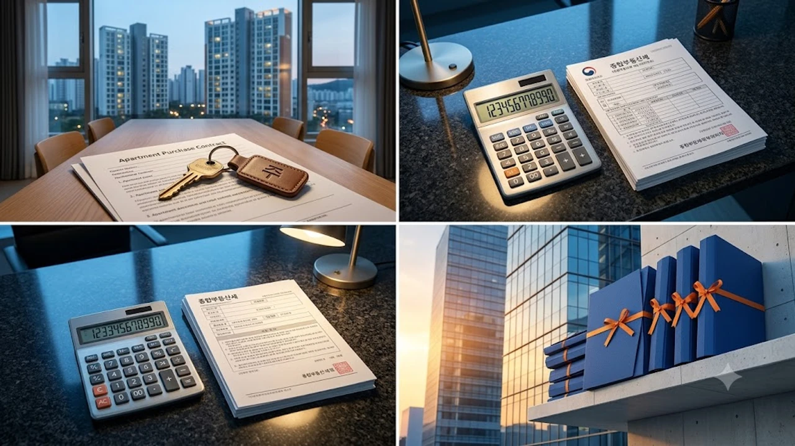

[날짜: 2026-09-03] [섹션: 한국부동산] [제목: 종부세 20억 비과세 실거주 반전]

2026년 세제개편 후속 발표로 1세대 1주택자의 **종부세 20억 실거주** 비과세 기준이 확정되면서 부동산 시장의 희비가 엇갈리고 있습니다. 실제로 들어가 사는 1주택자는 종합부동산세 고지서 자체를 받지 않게 되지만, 전세를 끼고 집을 사둔 갭투자 보유자는 기존 과세 체계에 그대로 묶입니다. 같은 시가 20억 원짜리 아파트라도 전입 도장을 찍었느냐에 따라 1년에 수백만 원의 세금 차이가 벌어집니다.

## 1주택 종부세 20억 완화의 핵심 변경점과 적용 기준

### 시가 20억 상향 조치의 세부 내용과 시행 시기
정부가 확정한 종부세 기본공제 상향선은 실거래 시가 환산액 기준 약 20억 원(공시가격 약 14억 원 선)입니다. 이번 개편안은 2026년도 정기분 종합부동산세 고지서부터 즉시 적용됩니다. 마포, 용산, 성동 등 서울 주요 입지의 국평(전용 84㎡) 1채를 실거주 목적으로 보유한 가구 대다수가 과세 명단에서 빠지게 됩니다.

공시가격 현실화율 로드맵 수정과 맞물리면서 2026년 공동주택 공시가격 현실화율은 69% 선에 머물렀습니다. 이에 따라 시세 20억 2,000만 원 안팎인 마포 래미안 푸르지오나 성동구 옥수 파크힐스 전용 84㎡의 공시가격은 13억 9,000만 원대에 형성되었습니다. 실거주 등록을 마친 세대는 공제 한도 14억 원 이내로 안착하면서 종부세 과세 대상에서 완전히 제외됩니다. 반면 기준선인 14억 원을 단 1,000만 원이라도 넘긴 14억 1,000만 원짜리 단지는 초과분 1,000만 원에 대해 공정시장가액비율 60%를 곱한 600만 원이 과세표준으로 잡힙니다.

국세청은 이번 조치로 서울 1주택 보유자 중 약 11만 4,000세대가 과세 대상에서 면제될 것으로 집계했습니다. 과세 기준일인 2026년 6월 1일 자 기준 등기 현황과 주민등록 전입 내역을 전산망으로 교차 대조한 뒤, 11월 둘째 주부터 고지서 발송 제외 통지서를 카카오페이 및 네이버 전자문서로 순차 통보합니다.

### 비과세 혜택을 받기 위한 필수 실거주 요건
등기부등본에 이름이 혼자 올라가 있다고 해서 무조건 비과세를 받는 것은 아닙니다. 특례를 인정받으려면 **세대원 전원이 주민등록표에 등재된 상태로 과세기준일(6월 1일) 기준 통산 2년 이상 실제 거주**해야 합니다. 세를 주고 다른 곳에 전월세로 살고 있는 이른바 '몸테크' 보유자는 거주 요건을 채우지 못해 기존 공시가격 기본공제(12억 원)만 적용받습니다.

요건 산정에서 연속 거주가 아닌 '통산 거주'를 인정한다는 점에 주목해야 합니다. 과거 1년 6개월간 거주하다 타지역 전출 후 다시 들어와 6개월을 채워 730일을 넘기면 인정 대상입니다. 단, 질병 치료나 취학 등 세법상 인정되는 예외 사유가 없는 한, 배우자나 미성년 자녀가 타 주소지에 단독 분리되어 있다면 전원 거주 요건 불충족으로 즉시 배제 판정이 내려집니다.

> **실무 핵심 포인트**: 취득 당시 조정대상지역 지정 여부와 무관하게, 20억 비과세 특례 판정의 유일한 열쇠는 '과세기준일 현재 2년 이상 실거주 기록'입니다.

## 실거주 vs 비거주 1주택자 세부담 시뮬레이션 비교

### 실거주 1주택자의 실제 세액 감면 규모
공시가격 13억 5,000만 원(시가 약 19억 원)인 마포구 대장 아파트에 3년째 살고 있는 A씨의 세액표를 뜯어보면 차이가 확연합니다. 종전 기준대로라면 12억 원 초과분(1억 5,000만 원)에 대해 종부세와 농어촌특별세 명목으로 매년 60만~80만 원가량을 냈으나, 개편된 실거주 특례 덕에 **납부 세액이 0원**으로 지워집니다.

A씨의 세부 계산서를 열어보면, 2025년 납부했던 재산세 본세 248만 원 외에 종부세 62만 원, 농어촌특별세 12만 4,000원까지 총 322만 원대였던 보유세 부담이 2026년에는 재산세 240만 원 선으로 줄어듭니다. 매달 관리비와 함께 체감되던 주거 보유 비용 중 세무 지출이 25% 이상 삭감되는 셈입니다.

지방세인 재산세는 종부세 비과세 특례와 별개로 기본 과세표준에 따라 청구되지만, 12월 납부해야 할 국세 고지서가 영구 삭제된다는 점에서 가계 현금 흐름의 예측 가능성이 대폭 개선됩니다.

### 거주 요건 미충족 1주택자가 맞닥뜨릴 추가 세부담
똑같은 공시가격 13억 5,000만 원 아파트를 소유하고도 보증금을 낀 채 임대를 준 B씨는 20억 특례에서 배제됩니다. 기존 기본공제 12억 원만 적용받아 매년 세금을 고스란히 내야 하며, [초고가주택 종부세 3배? 바뀌는 세법 핵심만](/posts/kr-realestate/ultra-expensive-home-jongbuse-tax-reform-2026/) 사례처럼 고가 1주택 비거주자에 대한 보유세 체감 압박은 체감상 훨씬 더 커집니다.

B씨는 보증금 9억 원에 전세를 주고 자신은 직장 근처 빌라에 월세 120만 원을 내며 거주 중입니다. 임대보증금으로 대출금을 상환해 금융 이자는 줄였으나, 12월마다 날아오는 종부세분 약 78만 원(농특세 포함)을 현금으로 납부해야 합니다. 임대소득세 신고 시즌의 부대비용까지 겹치면 실질 세부담 격차는 실거주자와 비교해 매년 100만 원 이상 벌어집니다.

만약 B씨의 보유 아파트 공시가격이 2027년에 14억 5,000만 원으로 뛸 경우, 공제 한도 12억 원을 뺀 2억 5,000만 원 전체가 과세표준 산정 대상이 되어 종부세 부담은 130만 원 선으로 급증하게 됩니다.

### 고가 1주택 보유자의 장기보유특별공제 연계 차이
시가 20억 원을 훌쩍 넘는 고가 아파트 역시 실거주 여부에 따라 세액 격차가 걷잡을 수 없이 벌어집니다.
- **실거주 충족자**: 연령별·보유기간별 세액공제를 최대 80%까지 채워 넣어 과세표준을 방어
- **비거주 보유자**: 보유기간 공제(최대 40%)만 인정되고 거주기간 공제(최대 40%)가 통째로 날아가 세액 폭탄 직면

서초구 반포동 아파트(공시가격 26억 원, 시가 38억 원)를 10년간 보유하고 있는 C씨(63세)의 사례를 보면 명확합니다. C씨가 해당 주택에 10년간 실거주했다면 보유기간 공제 40%와 연령공제 20%를 더해 60% 세액공제를 적용받습니다. 반면 단 한 번도 전입하지 않고 전세만 놓았다면 보유공제 40%만 챙기게 되어 납부세액이 연 410만 원에서 연 720만 원으로 300만 원 넘게 치솟습니다.

이 격차는 향후 매도 시 양도소득세 장기보유특별공제에서도 그대로 재현됩니다. 거주기간 요건 10년을 채워야만 연 4%씩 최대 40%를 추가로 공제받아 합산 80% 공제율을 확보할 수 있으므로, 비거주 보유자가 감당해야 할 세후 실수령액 손실은 수억 원 단위에 달합니다.

| 구분 | 실거주 1주택자 (시가 19억) | 비거주 1주택자 (시가 19억) |
| :--- | :--- | :--- |
| **적용 공제액** | 시가 20억 상당 비과세 특례 | 기본공제(공시가 12억)만 적용 |
| **2026년 종부세액** | **0원 (전액 면제)** | **약 70만~90만 원 부과** |
| **장기보유 세액공제** | 보유+거주 합산 최대 80% | 거주공제 제외 (최대 40%) |

## 2026 세제개편으로 바뀌는 1주택 갈아타기 전략

### 상급지 이동 시 실거주 등록 전략과 타이밍
갈아타기를 노리는 1주택자는 계약서에 도장을 찍기 전 본인 입주 스케줄부터 잡아야 합니다. 전세를 끼고 상급지 아파트를 미리 사두는 이른바 '선매수 후입주' 전략은 비거주 기간 동안 보유세 감면을 받지 못할뿐더러, 훗날 양도소득세 비과세를 위한 장기보유특별공제 계산에서도 치명적인 손실을 부릅니다.

송파구 잠실동 엘스 84㎡를 매수하면서 2년 뒤 입주할 계획으로 전세 10억 원을 낀 채 23억 5,000만 원에 매매 계약을 체결한 사례가 대표적입니다. 매수자는 입주 전 2년간 공시가격 15억 8,000만 원에 대해 기본공제 12억 원만 적용받아 매년 180만~210만 원의 종부세를 물어야 합니다. 2년 치 보유세 약 4이전 대화 맥락이나 참조할 '초안' 내용이 현재 입력에 포함되어 있지 않습니다. 

작성하려는 글의 **주제(또는 초안 내용)**와 **타깃 키워드**를 남겨주시면 즉시 2,500자 이상의 마크다운 본문으로 작성해 드리겠습니다.