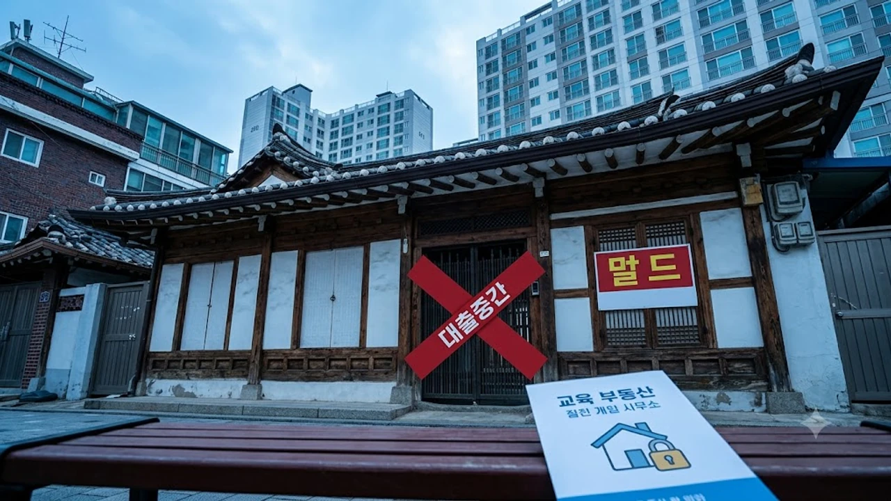

2026년 9월 금융권의 가계대출 총량 관리 압박이 정점에 달하면서 주요 시중은행 창구에서 **1주택자 대출 중단** 조치가 전격 가동되기 시작했습니다. 상급지로 집을 옮기려던 1주택 갈아타기 실수요자들은 주택담보대출뿐 아니라 전세자금대출 통로까지 동시에 막히며 전례 없는 자금 조달 절벽에 직면했습니다. 이처럼 대출 문턱이 기습적으로 높아진 시점일수록 금융당국과 시중은행이 명시한 실수요자 구제 예외 요건을 정확히 파악해야 불필요한 계약 파기 사태를 막을 수 있습니다.

## 1주택자 대출 전면 중단 조치와 금융권 현장 상황

### 주요 5대 시중은행의 유주택자 주담대·전세대출 제한 현황
KB국민·신한·우리·하나·NH농협 등 주요 은행들은 수도권 주택 매수 시 1주택 이상의 다주택자 대상 주택담보대출 신규 취급을 일제히 보류하거나 취급 조건을 극도로 좁혔습니다. 우리은행과 신한은행이 가장 먼저 주택 소유자의 수도권 주택 추가 구입 목적 주담대를 차단했고, 타 은행들도 유주택자의 임차보증금 반환 목적 외 신규 주담대를 사실상 거절하고 있습니다. 특히 갭투자 차단을 명분으로 **소유권 이전 조건부 전세자금대출** 취급을 전면 중단하면서 매매와 임대차 계약이 동시에 진행되는 거래선이 완전히 얼어붙었습니다.

### 대출 절벽에 직면한 갈아타기 실수요자의 피해 사례
마포구 25평 아파트를 매도하고 성동구 34평 아파트로 이동하려던 직장인 차주는 기존 집의 잔금 수령일과 새 집 매수 잔금일 간격이 며칠 어긋나자 일시적 2주택 상태로 간주되어 주담대 승인이 보류되는 낭패를 겪었습니다. 기존 아파트 계약이 이미 체결되어 계약금까지 들어간 상태임에도 은행 창구에서 신규 대출을 튕겨내자 사채나 고금리 브릿지론을 수소문하는 사례가 속출하는 중입니다. 서울 외곽에서 중심으로 진입하려던 무주택·1주택 갈아타기 계층은 전세 품귀와 대출 중단이 겹친 이중고에 갇혔으며, [공급절벽 2026 아파트 시장, 진짜 전세가 매매가 밀어 올릴까](/posts/kr-realestate/supply-shortage-jeonse-caps-property-2026/)와 같은 시장 불안이 현장 혼란을 한층 부채질하고 있습니다.

### 2단계 스트레스 DSR과 맞물린 은행별 대출 총량 규제 배경
9월 1일부터 수도권 주담대에 가산금리 1.2%p를 부과하는 2단계 스트레스 DSR(총부채원리금상환비율)이 도입되었음에도 가계대출 잔액 증가세가 꺾이지 않자 금융당국이 개별 은행에 강력한 구두 경고를 보냈습니다. 연간 경영계획 상 가계부채 목표치를 이미 8월에 초과 달성한 시중은행들은 한도 소진을 막기 위해 금리 인상 대신 **물량 컷오프(총량 통제)** 카드를 꺼내 들었습니다. 시스템적 부실을 방지하려는 거시건전성 조치가 현장에서는 실수요자 대출 파이프라인을 일시에 틀어막는 병목현상으로 나타났습니다.

## 은행권이 공식 인정한 1주택자 대출 예외 기준 3가지

### 기존 주택 처분 조건부 승계 요건과 처분 기한 규정
은행 창구에서 가장 확실하게 통과되는 첫 번째 예외는 **기존 주택 처분 서약**입니다. 새 집 잔금 실행일로부터 통상 6개월 이내(은행별 최장 1년)에 보유 주택을 매도한다는 공증 계약서를 제출하면 무주택자와 동일한 자격으로 주담대를 취급합니다.
> **핵심 유의사항**: 기존 주택 매매계약서 사본과 계약금 입금 증빙 영수증이 필수이며, 기한 내 처분을 이행하지 못할 경우 대출금 즉시 회수 및 향후 3년간 전 금융권 주택 관련 대출 제한이라는 강력한 페널티가 부과됩니다.

### 결혼·상속·직장 이전 등 부득이한 실수요 사유 인정 기준
두 번째 예외는 법률적·신분상 변동으로 주택을 추가 보유하거나 이전해야 하는 비자발적 사유입니다.
- **신혼부부 합가**: 결혼 예정자가 각각 1주택을 보유하다 결혼으로 2주택이 되는 경우, 청첩장 및 예식장 계약서를 첨부하면 처분 유예 기간 동안 1주택자 전세대출 또는 잔금대출 특례를 인정받습니다.
- **직장 및 학업 전근**: 특별시·광역시를 벗어나 타 시·도로 직장이 이전되거나 질병 치료 목적의 요양이 입증되는 경우 관할 은행 본점 여신심사부의 별도 심사를 거쳐 추가 담보대출을 예외 허용합니다.
- **소유권 지분 상속**: 주택 지분의 일부(통상 20% 이하)를 단순 상속받은 무주택 차주는 주택 수 산정에서 제외되어 단독 담보대출 심사를 통과할 수 있습니다.

### 무주택 자녀 독립 및 부모 부양 목적의 전세대출 허용 범위
세 번째 예외는 1주택 보유 차주가 세대 분리를 앞둔 만 30세 이상 무주택 자녀의 독립을 돕거나, 만 65세 이상 직계존속 부양을 위해 추가 임대차 보증금을 조달하는 상황입니다. 자녀의 건강보험 자격득실확인서 및 소득 증빙을 통해 경제적 실질 독립이 확인되면 세대분리 조건부 전세대출 예외가 적용됩니다. 부모 봉양의 경우 세대 합가로 기존 보유 주택이 일시적 2주택 상태가 되더라도 부양 목적임을 주민등록등본상 증명하면 대출 거절 대상에서 제외됩니다.

## 막힌 주담대 대안: 2금융권 이동 vs 자금조달 계획 수정

### 지방은행 및 상호금융권 금리·한도 비교
시중은행 셔터가 내려가자 BNK부산은행, DGB대구은행, 광주은행 등 지방은행과 새마을금고, 신협, 수협, 단위농협 등 제2금융권으로 대출 수요가 쏠리는 풍선효과가 발생했습니다. 지방은행은 여전히 수도권 원격 대출 승인에 비교적 여유가 있는 편이지만, 5대 은행 대비 금리가 약 0.3%~0.8%p 높게 형성되어 있습니다. 상호금융권은 거치기간 설정이나 세밀한 감정평가에서 유연성을 보이지만 대출 한도가 담보 가치의 60% 안팎으로 보수적이라는 한계가 있습니다.

### 제2금융권 풍선효과 차단을 위한 금융당국 규제 리스크
2금융권 역시 안전지대는 아닙니다. 금융감독원이 9월 첫째 주부터 상호금융권과 보험사의 주담대 증가 추이를 일일 단위로 모니터링하기 시작했습니다. 1금융권 대출 반려 고객이 몰려 특정 2금융 지점의 대출 총량이 급증할 경우, 금융당국이 행정지도를 통해 2금융권 집단대출과 잔금대출 한도를 즉시 축소할 가능성이 매우 높습니다. 따라서 2금융권을 염두에 둔 차주라면 대출 실행일을 계약 잔금일 직전이 아닌 최소 한 달 전에 확정 지어야 합니다.

### 무리한 신용대출 동원 시 DSR 초과 위험과 실익 분석
부족한 잔금을 마이너스통장이나 신용대출로 메우려는 시도는 2단계 스트레스 DSR 체제에서 치명적인 결과를 초래합니다. 신용대출은 주담대에 비해 만기가 짧아 연간 원리금 상환 부담액이 급격히 증가하므로, DSR 40% 한도를 단번에 잠식해 버립니다. 5천만 원의 신용대출을 추가 개설하는 순간 본 주담대 한도가 1억 원 이상 깎여나가는 역효과가 발생할 수 있으니 자금조달계획서 작성 전 금융사 DSR 시뮬레이션을 선행해야 합니다.

## 계약 파기를 피하는 단계별 실수요자 잔금 대응 가이드

### 매매·임대차 계약서 작성 시 특약 문구 삽입 방법
대출 불가로 인한 계약금 몰수를 방어하려면 부동산 매매·임대차 계약 체결 시 안전장치를 반드시 마련해야 합니다.
- "매수인의 금융기관 주택담보대출(또는 전세자금대출) 한도가 예상액 미달 또는 정책 규제로 거절될 경우 본 계약은 위약금 없이 해제하며, 매도인은 수령한 계약금을 즉시 반환한다."
- "기존 주택 처분 조건부 승계 대출의 은행 심사 반려 시 상호 협의하에 잔금일을 최장 30일까지 연장한다."
위와 같은 문구를 특약사항에 명시하지 않고 단순 구두 합의에 그칠 경우, 대출 중단에 따른 계약 파기 책임은 전적으로 매수인이 지게 됩니다.

### 주택도시보증공사 등 정책금융 활용 가능 여부 조회
시중은행 자체 재원 대출이 닫혔더라도 디딤돌대출, 신생아 특례대출, 버팀목 전세자금대출 등 국토교통부 기금 대출 상품은 소득과 자산 요건만 충족하면 총량 규제와 무관하게 정상 집행됩니다. 특히 [2030 영끌 재점화, 전세 폭등 속 진짜 살까?](/posts/kr-realestate/young-generation-panic-buying-jeonse-spike-2026/)와 같은 고민 속에서 주거 불안을 겪는 30대 차주라면 시중은행 일반 상품을 두드리기보다 주택도시보증공사(HUG)나 한국주택금융공사(HF)의 정책금융 적격 여부를 우선 확인해야 합니다.

### 입주 잔금일 직전 은행별 창구 심사 승인률 높이는 팁
대출 심사의 열쇠는 '실수요 입증 서류의 객관성'입니다.
- 기존 주택 매도계약서 체결본과 계약금 영수증을 지참하여 투기 목적이 아님을 증명합니다.
- 직장 이전 발령장, 신규 고용계약서, 분가 세대원의 독립 생계 증빙(급여통장 사본)을 묶어 포트폴리오 형태로 제출합니다.
- 동일 금융지주 계열사라도 영업점별 월별 잔여 한도가 다르므로 주거래 지점에 얽매이지 말고 여러 영업점을 교차 방문해야 합니다.

자금 조달 계획을 명확히 세워 잔금 위기를 넘긴 뒤에는 이사 일정과 가구 배치를 미리 확정하여 이중 지출을 줄여야 합니다. [인테리어 홈가구 쿠팡에서 보기](https://www.coupang.com/np/search?q=%EC%9D%B8%ED%85%8C%EB%A6%AC%EC%96%B4%20%ED%99%88%EA%B0%80%EA%B5%AC&sourceType=affiliate&trackingCode=AF8691300)

#1주택자대출중단 #주담대예외기준 #처분조건부주담대 #스트레스DSR2단계 #전세대출규제 #갈아타기대출 #가계대출총량규제 #부동산자금조달